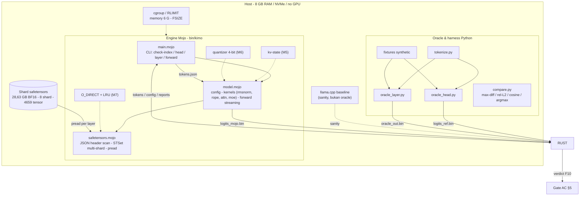

# 01 — Arsitektur Sistem

> Bagian dari `disk-streaming-moe-engine`. Index: `README.md`.

## 2.1 Diagram Lapisan

## 2.2 Komponen & Kontrak

| ID  | Komponen                 | Tanggung jawab                                                                                                           | Kontrak internal                                            |
| --- | ------------------------ | ------------------------------------------------------------------------------------------------------------------------ | ----------------------------------------------------------- |
| C1  | `main.mojo` (CLI)        | subperintah `check-index / head / layer / forward`, exit code, output biner                                              | exit 0 = sukses; error → stderr terstruktur, bukan panic    |
| C2  | `model.mojo`             | config loader, kernels (rmsnorm, rope rotate_half, attn, moe + router + sigmoid gate), forward streaming                 | setiap kernel punya oracle pasangan (M2/M3)                 |
| C3  | `safetensors.mojo`       | parser header JSON, merge index multi-shard (8 pada checkpoint trial), pread | F15 = 100% tensor (kebenaran independen cache); benchmark parse fixture < 1 s (terkendali) |
| C4  | kv-state (M5)            | cache K/V incremental per layer                                                                                          | ukur memori = prediksi F2 ± 5%                              |
| C5  | quantizer (M6)           | kuantisasi 4-bit per-grup + dequant di kernel                                                                            | ε_rel per tensor ≤ 1e-2 (F11)                               |
| C6  | io_direct + LRU (M7)     | reader O_DIRECT + LRU cache expert                                                                                       | BW cold ≥ 2,5 GB/s; model F13 terkalibrasi                  |
| C7 | `tools/` (Rust + Python) | **Rust:** CLI/orchestration, index/metadata, compare, benchmark, report. **Python/PyTorch:** oracle + fixture generation | report JSON deterministik |
| C8  | fixtures                 | synthetic mini-checkpoint + golden set 50 prompt                                                                         | deterministik (seed 42), commit ke repo                     |
| C9  | llama.cpp baseline       | pembanding sanity ("harusnya kira-kira seperti ini")                                                                     | **tidak boleh** dipakai ground truth (`03-testing.md` §4.1) |

Pemakaian per milestone:

- M0 → C3, C7, C8
- M1 → C1, C2 (rmsnorm, embed, lm_head), C3, C7
- M2 → C2 (rope, attn), C7
- M3 → C2 (router, MoE), C7
- M4 → C1, C2, C3 full, C7
- M5 → C4
- M6 → C5
- M7 → C6
- M8–M9 → ekstensi C2 + C4

## 2.2.1 Batas Bahasa & Runtime

| Lapisan                 | Teknologi            | Tanggung jawab                                                                                                                 | Tahap jalan |
| ----------------------- | -------------------- | ------------------------------------------------------------------------------------------------------------------------------ | --------------------------------- |
| Orchestration / tooling | **Rust**             | CLI, subcommand, config/index validation, shard discovery, SHA-256, process launch, benchmark, binary compare, JSON/CSV report | runtime + offline tooling                            |
| Inference engine        | **Mojo**             | tensor loading path, streaming, KV cache, quant/dequant, attention, MoE, GDN, forward/decode                                   | runtime inference                            |
| Independent oracle      | **Python + PyTorch** | oracle head/layer/full, fixture/golden generation, tokenizer parity saat dibutuhkan                                            | offline (oracle/fixture)                         |

**Kontrak boundary:** Python/PyTorch menghasilkan artefak referensi (`*.bin`, metadata, fixture) yang dibaca/dibandingkan oleh Rust tooling. Engine Mojo dan tooling Rust berkomunikasi via artefak file tersebut, sehingga validasi tetap independen dan setiap bahasa berjalan di tahap yang paling pas.

**Tokenizer:** tokenizer Python dipakai pada fase awal untuk menghasilkan token IDs yang dikonsumsi engine. Boundary-nya eksplisit: tokenizer menghasilkan token IDs, sedangkan engine menerima IDs. Port tokenizer native ke Rust adalah pekerjaan tooling/UX terpisah, bukan prasyarat correctness engine.

**Inspirasi arsitektur:** pola ini juga sejalan dengan `kimi-k3-in-c`, yang memisahkan engine native dari Python tooling/reference; repository tersebut secara eksplisit menggunakan Python untuk fixture/reference/conformance tooling dan engine C sebagai runtime. [R6][R13]

## 2.3 Ground Truth Config & Dua Jebakan

Sumber kebenaran dimensi = `model_config.json` **plus** verifikasi ke `model.safetensors.index.json` (hasil verifikasi README §1):

| Param           | Nilai                                                                           |
| --------------- | ------------------------------------------------------------------------------- |
| hidden / layers | 2048 / 24                                                                       |
| attention       | MHA 16 head × head_dim 128, **QKV bias ada** (72 tensor)                        |
| experts         | 60 routed (inter 1408, top-4) + shared besar (inter **5632**, **sigmoid gate**) |
| router          | softmax fp32 → top-4 **tanpa renormalisasi** (`norm_topk_prob=false`)           |
| aktif / total   | **2,7 B activated / ~14,32 B total** (model card resmi)                         |
| vocab / lm_head | 151.936 / untied (tensor terpisah)                                              |
| disk            | 28,63 GB BF16, 8 shard, 4.659 tensor                                            |

Artefak pin (terverifikasi langsung dari `model.safetensors.index.json` pada revision
`ec052fda178e241c7c443468d2fa1db6618996be` — bukan dari URL model saja, per SEC-1):
`Qwen/Qwen1.5-MoE-A2.7B-Chat` = 8 file `model-00001-of-00008` s/d `00008`,
`weight_map` = **4.659 tensor**, `total_size` = 28.631.568.384 B, bias QKV = **72 tensor**
(24× `q/k/v_proj.bias` — jebakan #1 terkonfirmasi nyata). Angka 4.659/28.631.568.384/72 berlaku
**untuk revision ini saja, bukan fakta intrinsik model** — validator mengambil ekspektasi dari
index.json (`len(weight_map)`); gate menegaskan kesamaan pada artefak pin. Tidak ada repack internal:
angka "3 shard" di dokumen ini hanya untuk fixture synthetic (desain CI, §4.5),
bukan checkpoint asli. Layer MENYEBRANG batas shard (mis. layer 2, 6, 9, 13, 16, 20, 23
terbagi ke 2 file); shard 8 hanya berisi sisa layer 23 + `lm_head` + `embed_tokens`.

Dua jebakan yang sudah ditemukan dan menjadi **invariant test permanen**:

1. `config.json` tidak menuliskan `attention_bias`, tetapi checkpoint punya 72 tensor bias. Mengikuti config mentah-mentah → hasil salah. Pelajaran: _selalu verifikasi ke index safetensors, bukan cuma config_ — diuji sebagai property test P-2 (`03-testing.md` §4.2).
2. Shared expert gate memakai `sigmoid` independen ($\sigma(W_{sh\_gate} x) \in (0, 1)$), bukan softmax bersama routed experts dan bukan penambahan un-gated linear:
   - **Jebakan & Akar Masalah**: Pada arsitektur MoE lain (misalnya DeepSeek atau Mixtral), shared expert sering kali dijumlahkan langsung (un-gated) atau router memasukkan shared expert dalam kompetisi probabilitas softmax bersama routed experts. Pada Qwen1.5-MoE, shared expert memiliki skalar gate independen dari proyeksi tensor `shared_expert_gate.weight` (shape `[1, 2048]`) yang diaktivasi oleh fungsi $\sigma(z) = \frac{1}{1 + e^{-z}}$.
   - **Dampak Numerik**: Jika shared expert dihitung tanpa scaling sigmoid ($\sigma=1.0$) atau digabungkan ke dalam softmax router, magnitudo aktivasi membengkak hingga puluhan order of magnitude, merusak aktivasi residual secara fatal, dan menyebabkan pelanggaran mutlak pada Gate G-M3-1 ($\Delta_{\max} \gg 10^3$).
   - **Invariant Test Permanen**: Diuji ketat via property tests di `tests/unit/test_moe_block.mojo` (`test_shared_gate_sigmoid_property` dan `test_property_sigmoid_gate_monotonicity`), invariant gate G-M3-1, serta G-M3-2.

## 2.4 Alur Forward Streaming (fase M0–M4)

1. CLI membaca path shard (8 pada checkpoint trial); parser (C3) memvalidasi header per shard dengan predikat F15 (`02-math-models.md` §3.6), lalu menggabungkan dua sumber menjadi satu pandangan: `weight_map` index.json (nama → file harapan) + header tiap shard (nama → dtype, shape, offsets aktual).
2. Embedding + lm_head dimuat resident dalam F32 (**≈2,318 GiB**) — satu-satunya bobot non-streaming; perhitungan berasal dari `2 × V × d × 4 B`.
3. Tokens dari `tokens.json` → lookup embedding → activation buffer fp32.
4. Untuk layer `l = 0..23`: pread seluruh bobot layer (attn + MoE) ke buffer, pakai, **buang** — RAM tidak menumpuk antar-layer.
5. Per layer: rmsnorm → qkv (+bias) → RoPE rotate_half (F7) → MHA causal → o_proj (+bias) → residual → rmsnorm → router softmax fp32 (F8) → top-4 tanpa renorm → routed experts (SwiGLU) + shared expert × σ(g) → residual.
6. Setelah 24 layer: final norm → lm_head → logits → tulis `logits_mojo.bin` (atomic write, `05-security.md` §6.3-K5).
7. `compare.py` menghitung metrik F10 dan memberi verdict + kategori FAIL bila tidak MATCH.
8. Semua langkah dilog (waktu per fase, bytes dibaca, VmHWM) untuk kalibrasi `03-testing.md` §4.4.

Detail per milestone: `milestones/M0-reader.md` … `milestones/M4-full-forward.md`.

## 2.5 Anggaran Memori

$$M_{peak} = W_{res} + M_{KV} + M_{ws} + M_{io} \le M_{gate} \tag{F1}$$

| Suku                             | Trial M0–M4     | Trial M5 (@4K ctx) | Port M9 (TBM)           |
| -------------------------------- | --------------- | ------------------ | ----------------------- |
| $W_{res}$ (emb+lm_head F32)      | **2,318 GiB**   | **2,318 GiB**      | ≤ 1 GiB (quant, target) |
| $M_{KV}$ (F2)                    | 0               | ≈ 0,75 GB          | TBM (GQA, hanya L_att)  |
| $M_{ws}$ (aktivasi + workspace)  | ≤ 0,3 GB        | ≤ 0,4 GB           | TBM                     |
| $M_{io}$ (buffer pread/O_DIRECT) | ≤ 0,1 GB        | ≤ 0,1 GB           | TBM                     |
| **Gate $M_{gate}$**              | **≤ 3,5–5 GiB** | **≤ 5 GiB**        | **≤ 7,5 GiB**           |

Implikasi di mesin 8 GB: $H_{mem} = (8 - M_{peak})/8 \ge 37{,}5\%$ (trial) — sisanya diserahkan ke OS/page cache dan cgroup (`05-security.md` §6.3-K4).

## 2.6 Keputusan Arsitektur (ADR)

| ADR | Keputusan                                                                    | Alternatif yang ditolak            | Alasan                                                                                                                                                                 |
| --- | ---------------------------------------------------------------------------- | ---------------------------------- | ---------------------------------------------------------------------------------------------------------------------------------------------------------------------- |
| D1  | **Mojo inference + Rust tooling**                                            | seluruh glue di Python / C         | Mojo dipertahankan untuk engine/kernels; Rust memberi CLI, I/O orchestration, verification, benchmark, dan security boundary; Python/PyTorch fokus di oracle/fixture generation |
| D2  | pread dulu, mmap belakangan                                                  | mmap + page cache sejak awal       | kontrol penuh atas buffer & bounds (SEC-3); O_DIRECT/LRU (M7) adalah evolusi alami pread                                                                               |
| D3  | Komputasi fp32 (bobot BF16 di-dequant ke fp32 saat dipakai)                  | komputasi BF16 langsung            | kesederhanaan numerik; oracle fp32 jadi pembanding natural; konversi termasuk bagian yang divalidasi                                                                   |
| D4  | **Oracle PyTorch fp32 = satu-satunya ground truth; Rust compare = verifier** | llama.cpp sebagai pembanding utama | quant ≠ fp32 → tidak byte-comparable (README §7)                                                                                                                       |
| D5  | Router tanpa renorm, gate shared sigmoid                                     | mengikuti intuisi umum MoE         | kepatuhan checkpoint (§2.3) — bukan preferensi                                                                                                                         |
| D6  | Quantizer 4-bit ditulis sendiri (M6)                                         | pakai GGUF/llama.cpp quant         | di sinilah "menemukan kembali GGUF" — inti kurikulum; kendali penuh atas format                                                                                        |
| D7  | O_DIRECT + LRU setelah pread bekerja (M7)                                    | langsung O_DIRECT                  | buktikan kebenaran dulu, optimasi I/O kemudian (Prinsip P1)                                                                                                            |
| D8  | MTP/NextN tidak ada di roadmap inti                                          | mengejar speedup 2×                | out of scope trial; kandidat eksperimen pasca-M9                                                                                                                       |
| D9  | **Pembagian peran Rust / Mojo / Python**                      | Python orchestration runtime       | menjaga independent reference; boundary sederhana: `Rust → Mojo`, `Python → golden artifacts`                  |

## 2.7 Delta Port ke Qwen3.6-35B-A3B (M9)

Perubahan terhadap trial — **checkpoint resmi Qwen3.6-35B-A3B sudah tersedia**, sehingga fakta arsitektur berikut bukan lagi TBM. Nilai yang tetap bergantung pada implementasi/benchmark lokal tetap ditandai TBM. [R4][R5]:

| Aspek                      | Trial (Qwen1.5-MoE)          | Port (Qwen3.6-35B-A3B)                                                                                                       |
| -------------------------- | ---------------------------- | ---------------------------------------------------------------------------------------------------------------------------- |
| Routed expert              | 60, top-4, inter 1408        | **256, top-8, inter 512** [R4]                                                                                               |
| Shared expert              | inter 5632, sigmoid gate     | **1 shared + 8 routed aktif; inter 512** [R4]                                                                                |
| Attention                  | MHA semua layer              | **10 Gated Attention + 30 Gated DeltaNet** (`10 × (3×GDN + 1×Gated Attention)`), GQA 16Q/2KV; jadi $L_{att}=L/4$ tepat. [R4] |
| Linear attention           | tidak ada                    | **Gated DeltaNet** di layer sisanya (M8 prasyarat)                                                                           |
| Vocab                      | 151.936                      | **248.320 (padded)** [R4]                                                                                                    |
| Total / aktif              | 14,3 B / 2,7 B official [R1] | **35 B / 3 B official** [R4]                                                                                                 |
| Disk                       | 28,63 GB BF16                | GGUF quant ~13–17 GB (Q3/IQ3) atau BF16 ~70 GB untuk oracle shard                                                            |
| Konteks praktis (RAM 8 GB) | ≤ 8K                         | KV kecil (F2, GQA) — batas nyata = prefill CPU (F4)                                                                          |

Detail port: `milestones/M9-port.md`. Prasyarat GDN: `milestones/M8-gdn.md`.
