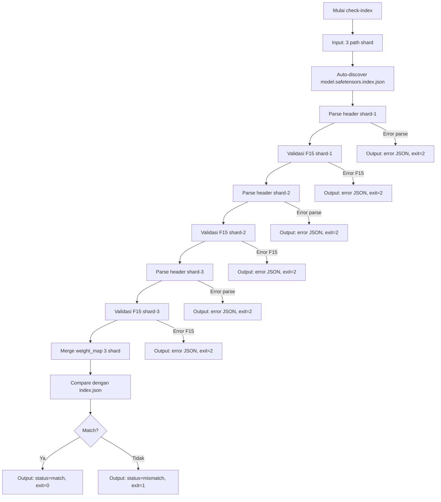

# M0 — Reader Safetensors Multi-Shard

> Proyek: `disk-streaming-moe-engine`. Fase: **Trial**. Index: `../README.md`.
> Common: `../00-overview.md` · `../01-architecture.md` · `../02-math-models.md` · `../03-testing.md` · `../04-quality.md` · `../05-security.md`.
> Implementasi dipecah menjadi waves: `../../scratch/wave/m0/README.md` (W0 preparation → W4 gates, catatan kerja gitignored).

| Field       | Nilai                                                           |
| ----------- | --------------------------------------------------------------- |
| Deliverable | Reader safetensors multi-shard (index → 4.659 tensor)           |
| Komponen    | C3 `safetensors.mojo`, C7 `tools/` (Rust + Python), C8 fixtures |
| Prasyarat   | Tidak ada (milestone pertama)                                   |
| Next        | `M1-head-path.md`                                               |
| Gate        | G-M0-1, G-M0-2, G-M0-3                                          |

## Tujuan

Membuktikan engine bisa mem-parsing dan meng-index 3 shard BF16 (28,63 GB, 4.659 tensor) secara benar dan aman, tanpa memuat bobot ke RAM. Ini fondasi "model = index, bukan blob".

## Scope

- Parser header JSON per shard: `[len: u64][header JSON][data]`.
- Merge `weight_map` dari `model.safetensors.index.json` → satu index (nama → shard, dtype, shape, offset).
- `check-index` CLI: validasi metadata vs index.
- Tidak ada komputasi model di M0.

Ground truth: `model_config.json` + `model.safetensors.index.json` (`../01-architecture.md` §2.3).

## Implementasi check-index CLI

**Input:**

- 3 path shard safetensors (command line args)
- `model.safetensors.index.json` (auto-discovered di directory yang sama)

**Output:**

- stdout: JSON report dengan struktur:
  ```json
  {
    "status": "match" | "mismatch",
    "total_tensors": 4659,
    "matched_tensors": 4659,
    "mismatches": [],
    "parse_time_ms": 123.45
  }
  ```
- stderr: error message (bila ada)

**Exit code:**

- 0: success (metadata match index)
- 1: mismatch (metadata beda dengan index)
- 2: error (file tidak ditemukan, format invalid, dll)

**Contoh penggunaan:**

```bash
kimo check-index shard-00001-of-00003.safetensors shard-00002-of-00003.safetensors shard-00003-of-00003.safetensors
```

**Contoh output (success):**

```json
{
  "status": "match",
  "total_tensors": 4659,
  "matched_tensors": 4659,
  "mismatches": [],
  "parse_time_ms": 892.34
}
```

**Contoh output (mismatch):**

```json
{
  "status": "mismatch",
  "total_tensors": 4659,
  "matched_tensors": 4658,
  "mismatches": [
    {
      "tensor_name": "model.layers.0.self_attn.q_proj.bias",
      "expected": { "shard": "shard-00001-of-00003.safetensors", "dtype": "F32", "shape": [2048] },
      "found": { "shard": "shard-00002-of-00003.safetensors", "dtype": "BF16", "shape": [2048] }
    }
  ],
  "parse_time_ms": 892.34
}
```

**Contoh output (error):**

```json
{
  "error_type": "OFFSET_OVERFLOW",
  "detail": "Tensor offset 10737418240 exceeds file size 10737418239",
  "shard": "shard-00001-of-00003.safetensors",
  "tensor_name": "model.layers.23.mlp.gate_proj.weight"
}
```

## Error Handling

**Format error:** JSON dengan struktur terstandar:

```json
{
  "error_type": "INVALID_HEADER" | "OFFSET_OVERFLOW" | "UNKNOWN_DTYPE" | "DUPLICATE_NAME" | "FILE_NOT_FOUND" | "JSON_PARSE_ERROR",
  "detail": "deskripsi spesifik error",
  "shard": "shard-00001-of-00003.safetensors",
  "tensor_name": "model.layers.0.self_attn.q_proj.weight"  // optional
}
```

**Error types:**

- `INVALID_HEADER`: header JSON tidak valid atau header_len > 100 MB
- `OFFSET_OVERFLOW`: offset tensor melampaui ukuran file
- `UNKNOWN_DTYPE`: dtype tidak ada di whitelist (BF16, F32, F16, dll)
- `DUPLICATE_NAME`: nama tensor tidak unik dalam satu shard
- `FILE_NOT_FOUND`: file shard tidak ditemukan
- `JSON_PARSE_ERROR`: header JSON tidak bisa di-parse

Semua error harus mengembalikan exit code ≠ 0 dan message terstruktur, bukan panic.

## Workflow M0



**Alur utama:**

1. CLI menerima 3 path shard sebagai input
2. Auto-discover `model.safetensors.index.json` di directory yang sama
3. Parse header JSON masing-masing shard secara sequential
4. Validasi F15 untuk setiap shard sebelum membaca data
5. Merge weight_map dari 3 shard menjadi satu index
6. Compare metadata (nama → shard, dtype, shape) dengan index.json
7. Output JSON report dengan status dan exit code yang sesuai

**Error path:**

- Error parse JSON → return error JSON, exit=2
- Error validasi F15 → return error JSON, exit=2
- Mismatch metadata → return mismatch JSON, exit=1
- Success → return match JSON, exit=0

## Rumus (F15)

Predikat validitas (`../02-math-models.md` §3.6):

$$\forall t:\quad \text{hdr\_end} \le \text{off}_t \;\wedge\; \text{off}_t + \text{len}_t \le \text{filesize} \;\wedge\; \text{dtype}_t \in \mathcal{D} \;\wedge\; \text{name}_t \text{ unik}$$

- `header_len` ≤ 100 MB, jumlah tensor ≤ 100.000, whitelist dtype, nama unik, tanpa rekursi JSON.
- Alokasi hanya setelah ukuran tervalidasi terhadap `filesize`.
- Integritas: `SHA-256(file) == models.lock.json`.

## Gate

| Gate   | Kriteria                       | Threshold                               | Metode                        |
| ------ | ------------------------------ | --------------------------------------- | ----------------------------- |
| G-M0-1 | metadata 4.659 tensor == index | 100% match (nama → shard, dtype, shape) | `check-index` vs `weight_map` |
| G-M0-2 | predikat validitas F15         | 100% tensor lolos                       | unit U + property P           |
| G-M0-3 | file korup → clean error       | 20/20 mutasi lolos, 0 crash/hang/OOM    | fuzz F (SEC-2)                |

## Testing

- U: merge index 3 shard, config loader — `cargo test`, 100% pass.
- P: predikat F15 pada shape acak, config-vs-index (jebakan attention_bias) — hypothesis, nightly.
- F: 20+ mutasi (header liar, offset negatif/overflow, dtype asing, truncation, duplikat nama, JSON rusak).
- R: shape-fidelity test index asli 4.659 tensor tanpa download; golden hash stabil.
- Perf: parse < 1 s (kontrak C3).

Fixture: synthetic mini-checkpoint (seed 42) agar CI jalan tanpa 28,6 GB.

## Fixture M0-Specific

**Konfigurasi mini-checkpoint:**

- L=2 (2 transformer layers)
- H=2 (2 attention heads)
- 8 routed experts + 1 shared expert
- d_e=64 (hidden dimension 64)
- vocab=512 (vocabulary size 512)
- Seed: 42 (deterministik)

**Output fixture:**

- 3 shard safetensors (header valid, data dummy/random)
- `model.safetensors.index.json` (weight_map lengkap)
- `model_config.json` (config lengkap sesuai spesifikasi mini)

**Tujuan:**

- Testing parser F15 tanpa download 28,6 GB
- Testing merge index 3 shard
- Testing `check-index` CLI
- Support CI di mesin 8 GB

**Generasi:**

- Script: `tools/fixtures/generate_m0_fixture.py`
- Input: config mini di atas
- Output: 3 shard + index file di directory `fixtures/m0/`
- Verifikasi: SHA-256 fixture ter-commit ke repo

## Performance Baseline C3

**Target:**

- Parse header 3 shard < 1 s (kontrak C3)

**Metric:**

- Wall clock time (tidak termasuk I/O data body)
- Diukur menggunakan `time` command atau internal timing

**Method:**

- Run `check-index` pada fixture synthetic M0
- Cold read: `sync && echo 3 | sudo tee /proc/sys/vm/drop_caches` sebelum run
- N=5 run, ambil median
- Environment: CPU governor `performance`, aplikasi lain ditutup

**Baseline:**

- Mesin target: 8 GB RAM, NVMe SSD
- Hasil terukur dicatat di laporan benchmark
- Tidak ada optimasi pre-emptive sebelum baseline terukur

## Security

- SEC-1: SHA-256 + pin revision HF di `models.lock.json`; tamper 1 byte → tolak start.
- SEC-2/SEC-3: F15 ditegakkan sebelum 1 byte data dibaca.
- SEC-4: cek disk ≥ 1,5× sebelum unduh; cgroup `memory.max=6G`.
- SEC-5: model dir read-only setelah verifikasi.

## DoD

- [ ] G-M0-1..G-M0-3 hijau
- [ ] Laporan run-id ter-commit
- [ ] `models.lock.json` terisi SHA-256 + revision
- [ ] README/spec diperbarui bila perilaku parser berubah
- [ ] `check-index` CLI implementasi lengkap (input/output/exit code sesuai spec)
- [ ] Fixture synthetic M0 ter-commit (3 shard + index + config)
- [ ] Error handling spec terimplementasi (format JSON, error types)
- [ ] Performance baseline C3 terukur dan terdokumentasi (< 1 s)
- [ ] Parser header JSON safetensors implementasi lengkap (C3)
- [ ] Merge weight_map 3 shard implementasi lengkap
- [ ] Validasi F15 implementasi lengkap (unit + property tests)
- [ ] Auto-discovery model.safetensors.index.json implementasi
- [ ] SHA-256 verification implementasi (SEC-1)
- [ ] Cgroup memory.max=6G integration testing (SEC-4)
- [ ] 20+ fuzz corpus mutasi terimplementasi dan ter-commit
- [ ] Shape-fidelity test 4.659 tensor implementasi (level R)
- [ ] Unit tests coverage ≥ 85% untuk utility parser
- [ ] Property tests F15 dengan hypothesis implementasi
- [ ] Integration test end-to-end check-index implementasi
