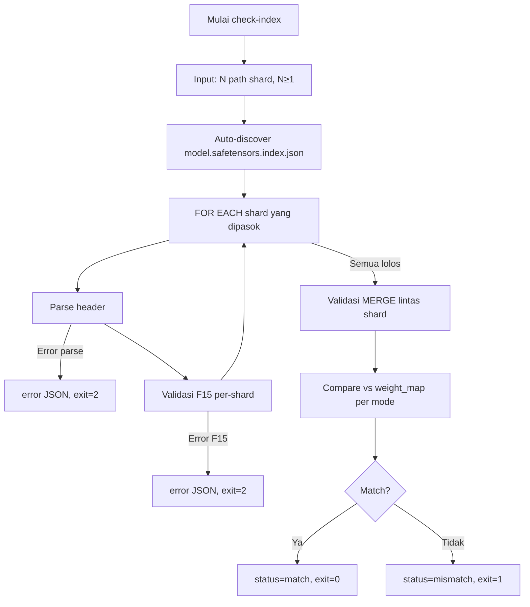

# M0 — Reader Safetensors Multi-Shard

> Proyek: `disk-streaming-moe-engine`. Fase: **Production Engine (Unified Qwen3.6-35B-A3B)**. Index: `../README.md`.
> Common: `../00-overview.md` · `../01-architecture.md` · `../02-math-models.md` · `../03-testing.md` · `../04-quality.md` · `../05-security.md`.

| Field       | Nilai                                                                  |
| ----------- | ---------------------------------------------------------------------- |
| Deliverable | Reader safetensors multi-shard (index → 1.045 tensor across 26 shards) |
| Komponen    | C3 `safetensors.mojo`, C7 `tools/` (Rust + Python), C8 fixtures        |
| Prasyarat   | Tidak ada (milestone pertama)                                          |
| Next        | `M1-head-path.md`                                                      |
| Gate        | G-M0-1, G-M0-2, G-M0-3                                                 |

## Tujuan

Membuktikan engine bisa mem-parsing dan meng-index 26 shard BF16 (71,90 GB, 1.045 tensor) secara benar dan aman, tanpa pernah membaca byte payload tensor. Ini fondasi "model = index, bukan blob".

Catatan arsitektur Qwen3.6-35B-A3B: berbeda dari model trial lama (4.659 tensor akibat 60 expert disimpan sebagai matriks 2D terpisah), checkpoint resmi Qwen3.6-35B-A3B mengemas 256 routed expert ke dalam tensor 3D (`gate_up_proj` shape `[256, 1024, 2048]` dan `down_proj` shape `[256, 2048, 512]`). Oleh karena itu, total tensor terdaftar pada `model.safetensors.index.json` adalah tepat **1.045 tensor**.

**Kontrak I/O (normatif, testable):** `check-index` hanya boleh membaca rentang `[0, data_base)` per shard (8 byte panjang + N byte JSON header). Offset ≥ `data_base` (payload) DILARANG dibaca — bukan sekadar "tidak dimuat ke RAM" (page cache kernel tetap menghitung sebagai I/O). **Gate keras:** semua `pread` tercatat dalam `[0, data_base)` (pelanggaran = FAIL). **`read_bytes` (`/proc/<pid>/io`) hanya observasional** (benchmark, bukan kriteria): perilaku kernel/cache membuat anggaran byte eksak tidak reliabel, dan kontrak safetensors hanya menuntut payload tidak dibaca — tanpa tunjangan readahead universal.

## Scope

- Parser header JSON per shard: `[len: u64][header JSON][data]`.
- Merge dua sumber menjadi satu pandangan: `weight_map` index.json (nama → file harapan) + header tiap shard (nama → dtype, shape, offsets aktual).
- `check-index` CLI: validasi silang dua-sumber — shard aktual vs shard harapan (index), dengan dtype/shape/range dari header.
- Tidak ada komputasi model di M0.

Ground truth: `config.json` + `model.safetensors.index.json` (`../01-architecture.md` §2.3) dipin via `models.lock.json`.

## Implementasi check-index CLI

**Input:**

- N path shard safetensors, N ≥ 1 (26 pada checkpoint Qwen3.6-35B-A3B, 3 pada fixture synthetic); keanggotaan harapan dari `weight_map` (command line args)
- `model.safetensors.index.json` (auto-discovered di directory yang sama)

**Output:**

- stdout: JSON report dengan struktur (`total_tensors` = `len(weight_map)` dari index.json —
  1045 pada revision pin, bukan konstanta kode; `scope`/`supplied_shards` mencatat mode penilaian):
  ```json
  {
    "status": "match" | "mismatch",
    "scope": "full" | "subset",
    "supplied_shards": ["model-00001-of-00026.safetensors"],
    "total_tensors": 1045,
    "assessed_tensors": 1045,
    "matched_tensors": 1045,
    "mismatches": [],
    "parse_time_ms": 39.20
  }
  ```
  `total_tensors` = `len(weight_map)` SELALU; `assessed_tensors` = yang dinilai
  (sama dengan total di mode full, lebih kecil di subset); `matched_tensors` ⊆ assessed.
- stderr: error message (bila ada)

**Exit code:**

- 0: success (semua nama di shard harapan + header valid F15)
- 1: mismatch (nama hilang/salah-shard vs index)
- 2: error (file tidak ditemukan, format invalid, dll)

**Contoh penggunaan:**

```bash
# Contoh fixture synthetic (3 shard)
dismoen check-index shard-00001-of-00003.safetensors shard-00002-of-00003.safetensors shard-00003-of-00003.safetensors
```

Contoh checkpoint asli Qwen3.6-35B-A3B (26 shard, N penuh):

```bash
dismoen check-index /home/will/models/qwen3.6-35b-a3b/model-*.safetensors
```

atau eksplisit 26 shard:

```bash
dismoen check-index \
  model-00001-of-00026.safetensors \
  model-00002-of-00026.safetensors \
  ... \
  model-00026-of-00026.safetensors
```

**Contoh output (success):**

```json
{
  "status": "match",
  "scope": "full",
  "supplied_shards": [
    "model-00001-of-00026.safetensors",
    "model-00002-of-00026.safetensors",
    "...",
    "model-00026-of-00026.safetensors"
  ],
  "total_tensors": 1045,
  "assessed_tensors": 1045,
  "matched_tensors": 1045,
  "mismatches": [],
  "parse_time_ms": 39.2
}
```

**Contoh output (mismatch):**

```json
{
  "status": "mismatch",
  "total_tensors": 1045,
  "matched_tensors": 1044,
  "mismatches": [
    {
      "tensor_name": "model.language_model.layers.0.input_layernorm.weight",
      "kind": "WRONG_SHARD",
      "expected_shard": "model-00002-of-00026.safetensors",
      "found": { "shard": "model-00003-of-00026.safetensors", "dtype": "BF16", "shape": [2048] }
    }
  ],
  "parse_time_ms": 39.2
}
```

**Contoh output (error):**

```json
{
  "error_type": "OFFSET_OVERFLOW",
  "detail": "Tensor end exceeds file: buffer END 10737418240 + data_base 4104 = file END 10737422344 > filesize 10737418239",
  "shard": "shard-00001-of-00003.safetensors",
  "tensor_name": "model.layers.23.mlp.gate_proj.weight",
  "data_offsets": [10653532160, 10737418240],
  "data_base": 4104,
  "file_end": 10737422344,
  "filesize": 10737418239
}
```

Aturan: error rentang offset WAJIB melapor dua sistem koordinat (buffer-relatif + file-absolut + `data_base`) — satu angka saja ambigu.

## Error Handling

**Format error:** JSON dengan struktur terstandar:

```json
{
  "error_type": "INVALID_HEADER" | "OFFSET_OVERFLOW" | "UNKNOWN_DTYPE" | "LAYOUT_MISMATCH" | "DUPLICATE_JSON_KEY" | "DUPLICATE_TENSOR_NAME" | "FILE_NOT_FOUND" | "JSON_PARSE_ERROR",
  "detail": "deskripsi spesifik error",
  "shard": "shard-00001-of-00003.safetensors",
  "tensor_name": "model.layers.0.self_attn.q_proj.weight"  // optional
}
```

**Error types:**

- `INVALID_HEADER`: header JSON tidak valid atau header_len > 100 MB
- `OFFSET_OVERFLOW`: akhir buffer (`data_base + END`) melampaui ukuran file; pesan wajib dua koordinat (aturan di atas)
- `UNKNOWN_DTYPE`: dtype di luar himpunan eksak {BF16, F32, F16, F64} (termasuk varian R7 masa depan yang tak dikenal)
- `DUPLICATE_JSON_KEY`: kunci ganda pada level sintaks JSON mentah dalam satu header (kasus A). Parser JSON umum diam-diam mengambil yang terakhir — validator wajib mendeteksi di level teks, bukan ikut menimpa.
- `DUPLICATE_TENSOR_NAME`: nama tensor semantik ganda setelah parsing — dalam satu header hasil parse (kasus B) maupun lintas shard saat merge (kasus C, tabrakan index gabungan). A/B boleh collapse tergantung representasi parser; C selalu diperlakukan terpisah.
- `LAYOUT_MISMATCH`: `END−BEGIN ≠ numel(shape)×size(dtype)` (F15c; BF16/F16=2, F32=4, F64=8 B/elemen)
- `FILE_NOT_FOUND`: file shard tidak ditemukan
- `JSON_PARSE_ERROR`: header JSON tidak bisa di-parse

Semua error harus mengembalikan exit code ≠ 0 dan message terstruktur, bukan panic.

## Workflow M0



**Alur utama:**

1. CLI menerima N≥1 path shard sebagai input (`check-index <shard>...<shard>`); subset shard sah — yang dinilai hanya nama yang terjangkau. **Aturan scope deterministik (tanpa flag):** `scope` = `"full"` jika dan hanya jika setiap nama file unik yang dirujuk `weight_map` ada di argumen; selain itu `"subset"`.
2. Auto-discover `model.safetensors.index.json` di directory yang sama
3. Parse header JSON masing-masing shard secara sequential
4. Validasi F15 untuk setiap shard sebelum membaca data
5. Merge dua sumber menjadi satu pandangan (26 shard pada checkpoint Qwen3.6-35B-A3B): harapan dari `weight_map`, aktual dari header tiap shard
6. Compare per mode (definisi eksplisit):
   - `WRONG_SHARD`: tensor ada di file X yang dipasok, padahal `weight_map[name]` = Y, X≠Y.
   - `MISSING_IN_SHARD`: `weight_map[name]` = Y, Y dipasok, header Y tak memuat nama.
   - `MISSING_IN_INDEX`: header file pasokan memuat nama ∉ `weight_map`.
   - Mode full-check (semua file rujukan `weight_map` dipasok): ketiga jenis di atas = mismatch. Gate G-M0-1 memakai mode ini.
   - Mode subset-check: hanya nama yang file harapannya termasuk subset yang dinilai (`total_tensors` = yang dinilai); ketidakhadiran di luar subset bukan error. Pengecualian: tensor yang FISIK ditemukan di shard pasokan wajib cocok dengan `weight_map` — `WRONG_SHARD`/`MISSING_IN_INDEX` tetap mismatch meski mode subset (subset tidak boleh menyembunyikan penempatan salah). `scope` dilaporkan jujur di JSON.
7. Output JSON report dengan status dan exit code yang sesuai

**Error path:**

- Error parse JSON → return error JSON, exit=2
- Error validasi F15 → return error JSON, exit=2
- Mismatch metadata → return mismatch JSON, exit=1
- Success → return match JSON, exit=0

## Rumus (F15)

Predikat validitas (`../02-math-models.md` §3.6) — `data_offsets` relatif terhadap `data_base = 8 + header_len`, bukan absolut file:

$$\forall t:\quad 0 \le \mathrm{BEGIN}_t \le \mathrm{END}_t \;\wedge\; \mathrm{data\_base} + \mathrm{END}_t \le \mathrm{filesize} \;\wedge\; \mathrm{dtype}_t \in \mathcal{D} \;\wedge\; \mathrm{name}_t \text{ unik dalam header}$$

$$+ \text{ buffer penuh tanpa lubang: BEGIN}_0 = 0,\ \mathrm{BEGIN}_{i+1}=\mathrm{END}_i,\ \mathrm{END}_{last}=\mathrm{filesize}-\mathrm{data\_base}$$

$$+ \text{ validasi MERGE lintas shard (bukan F15): nama unik global + compare vs weight_map per mode (lihat § Alur utama langkah 6)}$$

- `header_len` ≤ 100 MB, jumlah tensor ≤ 100.000, dtype himpunan eksak {BF16, F32, F16, F64} + konsistensi F15c, nama unik dalam header; nama unik lintas shard divalidasi pada MERGE (bukan validator per-shard), tanpa rekursi JSON.
- Alokasi hanya setelah ukuran tervalidasi terhadap `filesize`.
- Batas lapisan: SHA-256/revision pin = SEC-1 (§ Security), bukan bagian F15 — hash salah ≠ malformed.

## Gate

| Gate   | Kriteria                                                      | Threshold                                                                                  | Metode                   |
| ------ | ------------------------------------------------------------- | ------------------------------------------------------------------------------------------ | ------------------------ |
| G-M0-1 | len(weight_map) nama == 1045 pada revision pin + header valid | 100% (tiap nama: file aktual == file index ∧ header lolos F15; ekspektasi dari index.json) | `check-index` dua-sumber |
| G-M0-2 | predikat validitas F15                                        | 100% tensor lolos                                                                          | unit U + property P      |
| G-M0-3 | file korup → clean error                                      | 20/20 mutasi lolos, 0 crash/hang/OOM                                                       | fuzz F (SEC-2)           |

## Testing

- U: merge index semua shard (generik N-shard), config loader — `cargo test`, 100% pass.
- U: kontrak I/O — seluruh `pread` dalam `[0, data_base)` (gate keras); `read_bytes` dilaporkan observasional.
- P: predikat F15 pada shape acak, config-vs-index — hypothesis, nightly.
- F: 20+ mutasi (header liar, offset negatif/overflow, BEGIN>END, lubang/overlap buffer, dtype asing, layout mismatch, truncation, duplikat kunci JSON / nama lintas shard, JSON rusak).
- U/P: tensor kosong valid (BEGIN==END, 0-size) WAJIB diterima — validator yang memakai `<` ketat adalah bug; uji terima + uji baca 0 byte tanpa OOB.
- U: tiap error type (8) minimal 1 kasus; LAYOUT_MISMATCH dari shape/scale yang disengaja salah.
- R: shape-fidelity test index asli 1.045 tensor tanpa download (via `fixtures/qwen3.6_35b_index.json`); golden hash stabil.
- Perf: parse fixture < 1 s + 26 header asli < 1 s (kontrak C3, benchmark terkendali; diukur: ~39,2 ms).

Fixture: synthetic mini-checkpoint (seed 42) agar CI jalan tanpa 71,9 GB.

## Fixture M0-Specific

**Konfigurasi mini-checkpoint:**

- L=2 (2 transformer layers)
- H=2 (2 attention heads)
- 8 routed experts + 1 shared expert
- d_e=64 (hidden dimension 64)
- vocab=512 (vocabulary size 512)
- Seed: 42 (deterministik)

**Output fixture:**

- 3 shard safetensors (header valid, data dummy/random)
- `model.safetensors.index.json` (weight_map lengkap)
- `model_config.json` (config lengkap sesuai spesifikasi mini)

**Tujuan:**

- Testing parser F15 tanpa download 71,9 GB
- Testing merge index 3 shard
- Testing `check-index` CLI
- Support CI di mesin 8 GB

**Generasi:**

- Script: `tools/fixtures/generate_m0_fixture.py`
- Input: config mini di atas
- Output: 3 shard + index file di directory `fixtures/m0/`
- Verifikasi: SHA-256 fixture ter-commit ke repo

## Performance Baseline C3

**Prinsip lapisan:** gate kebenaran (G-M0-1/2/3) independen dari cache — lolos di cold
maupun warm. Angka di bawah murni benchmark, bukan gate.

**Target:**

- Parse header fixture synthetic < 1 s (kontrak C3, CI)
- Parse 26 header asli (hanya header, tanpa download penuh bila belum ada) < 1 s (diukur: ~39,2 ms)

**Metric:**

- Wall clock time (tidak termasuk I/O data body)
- Diukur menggunakan `time` command atau internal timing

**Method (lingkungan terkendali, bukan gate):**

- Run `check-index` pada fixture synthetic M0 (CI) + 26 header asli (bila shard ada)
- Cold opsional khusus Linux ber-privilege: `sync && echo 3 | sudo tee /proc/sys/vm/drop_caches` — tidak pernah syarat kebenaran
- N=5 run, ambil median
- Environment: CPU governor `performance`, aplikasi lain ditutup

**Baseline:**

- Mesin target: 8 GB RAM, NVMe SSD
- Hasil terukur dicatat di laporan benchmark
- Tidak ada optimasi pre-emptive sebelum baseline terukur

## Security

- SEC-1: SHA-256 + pin revision HF di `models.lock.json`; tamper 1 byte → tolak start. Berlaku untuk file yang lolos F15 sekalipun (hash salah = FAIL provenance, bukan FAIL format).
- SEC-2/SEC-3: F15 ditegakkan sebelum 1 byte data dibaca.
- SEC-4: cek disk ≥ 1,5× sebelum unduh; cgroup `memory.max=6G`.
- SEC-5: model dir read-only setelah verifikasi.

## DoD

- [ ] G-M0-1..G-M0-3 hijau
- [ ] Laporan run-id ter-commit
- [ ] `models.lock.json` terisi SHA-256 + revision
- [ ] README/spec diperbarui bila perilaku parser berubah
- [ ] `check-index` CLI implementasi lengkap (input/output/exit code sesuai spec)
- [ ] Fixture synthetic M0 ter-commit (3 shard + index + config)
- [ ] Error handling spec terimplementasi (format JSON, error types)
- [ ] Performance baseline C3 terukur dan terdokumentasi (fixture < 1 s; 26 header asli < 1 s bila shard ada)
- [ ] Parser header JSON safetensors implementasi lengkap (C3)
- [ ] Merge weight_map semua shard implementasi lengkap (generik N-shard)
- [ ] Validasi F15 implementasi lengkap (unit + property tests)
- [ ] Auto-discovery model.safetensors.index.json implementasi
- [ ] SHA-256 verification implementasi (SEC-1)
- [ ] Cgroup memory.max=6G integration testing (SEC-4)
- [ ] 20+ fuzz corpus mutasi terimplementasi dan ter-commit
- [ ] Shape-fidelity test 1.045 tensor implementasi (level R)
- [ ] Unit tests coverage ≥ 85% untuk utility parser
- [ ] Property tests F15 dengan hypothesis implementasi
- [ ] Integration test end-to-end check-index implementasi
