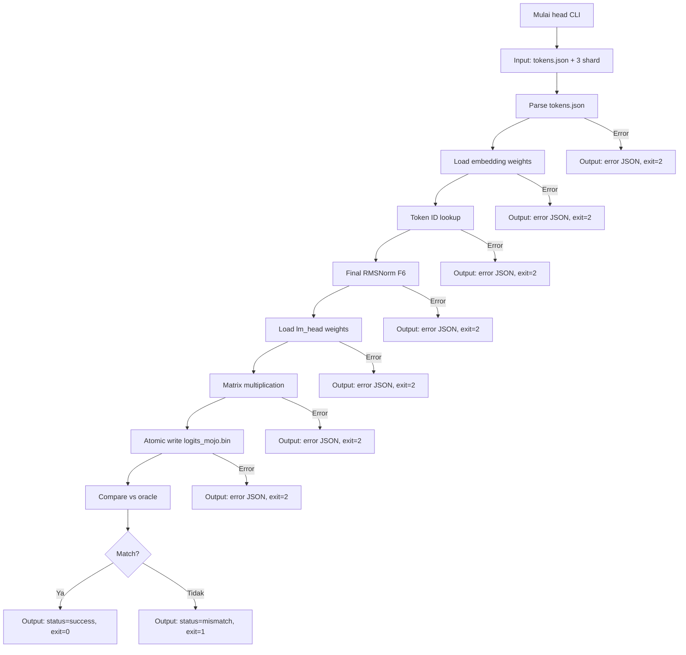

# M1 — Head Path (Embed → Final Norm → LM Head)

> Proyek: `disk-streaming-moe-engine`. Fase: **Trial**. Index: `../README.md`.
> Implementasi dipecah menjadi waves: `../../scratch/wave/m1/README.md` (W1 rmsnorm → W5 gates, catatan kerja gitignored).

| Field       | Nilai                                                             |
| ----------- | ----------------------------------------------------------------- |
| Deliverable | Head path: embedding lookup → final RMSNorm → lm_head             |
| Komponen    | C1 CLI (`head`), C2 `model.mojo` (rmsnorm), C3 reader, C7 compare |
| Prasyarat   | M0 hijau                                                          |
| Next        | `M2-attention.md`                                                 |
| Gate        | G-M1-1, G-M1-2                                                    |
| Rumus       | F1 (memori), F6 (RMSNorm), F10 (verdict)                          |

## Tujuan

Membuktikan jalur paling luar model benar end-to-end (tanpa transformer layer): token IDs → logits. Mengisolasi bug embedding/norm/head sebelum masuk attention/MoE.

## Scope

- Embedding + lm_head dimuat resident F32: $2 \times 151.936 \times 2048 \times 4\,\text{B} = 2.489.319.424$ B = **2,318 GiB** (satu-satunya bobot non-streaming).
- Final RMSNorm (F6): $y = x / \mathrm{RMS}(x) \odot \gamma$, $\varepsilon$ dan dtype fp32 identik oracle.
- `lm_head` **untied** (tensor terpisah dari embedding).
- Output: `logits_mojo.bin` via atomic write (tmp + rename).
- Oracle: `oracle_head.py` (PyTorch fp32) → `logits_ref.bin` → Rust `compare` verdict.

## Implementasi head CLI

**Input:**

- `tokens.json` (token IDs, format: array of integers)
- 3 path shard safetensors (command line args)
- `model.safetensors.index.json` (auto-discovered di directory yang sama)

**Output:**

- stdout: JSON report dengan struktur:
  ```json
  {
    "status": "success" | "mismatch" | "error",
    "num_tokens": 16,
    "output_file": "logits_mojo.bin",
    "parse_time_ms": 45.67,
    "compute_time_ms": 12.34
  }
  ```
- File: `logits_mojo.bin` (binary fp32 logits, shape: [num_tokens, vocab_size])
- stderr: error message (bila ada)

**Exit code:**

- 0: success (logits generated)
- 1: oracle mismatch (G-M1-1 fail)
- 2: error (file tidak ditemukan, format invalid, dll)

**Contoh penggunaan:**

```bash
kimo head tokens.json shard-00001-of-00003.safetensors shard-00002-of-00003.safetensors shard-00003-of-00003.safetensors
```

**Contoh output (success):**

```json
{
  "status": "success",
  "num_tokens": 16,
  "output_file": "logits_mojo.bin",
  "parse_time_ms": 45.67,
  "compute_time_ms": 12.34
}
```

**Contoh output (mismatch):**

```json
{
  "status": "mismatch",
  "num_tokens": 16,
  "output_file": "logits_mojo.bin",
  "parse_time_ms": 45.67,
  "compute_time_ms": 12.34,
  "verdict": {
    "delta_max": 0.001234,
    "epsilon_rel": 0.000123,
    "accuracy": 0.9375,
    "fail_reason": "epsilon_rel exceeds threshold 1e-4"
  }
}
```

**Contoh output (error):**

```json
{
  "error_type": "TOKEN_INVALID",
  "detail": "Token ID 200000 exceeds vocab size 151936",
  "stage": "embedding",
  "token_id": 200000
}
```

## Oracle Head Specification

**Script:** `tools/oracle/oracle_head.py`

**Input:**

- `tokens.json` (token IDs, sama dengan input CLI)
- Model weights (PyTorch fp32, dari shard asli atau fixture)

**Process:**

1. Load embedding weights (151.936 × 2048, F32)
2. Token ID lookup → embedding vectors
3. Final RMSNorm (F6): $y = x / \mathrm{RMS}(x) \odot \gamma$
4. Load lm_head weights (untied, 151.936 × 2048, F32)
5. Matrix multiplication: activation → logits
6. Output: `logits_ref.bin` (binary fp32, shape: [num_tokens, vocab_size])

**Output:**

- `logits_ref.bin` (binary fp32 logits)
- SHA-256 hash untuk verification (level R)

**Verifikasi:**

- SHA-256 logits_ref.bin ter-commit ke repo
- Oracle dan engine harus pakai config yang sama (ε, dtype fp32)
- Process harus deterministic (seed tetap, jika ada randomness)

## Fixture M1-Specific

**Source fixture:**

- Gunakan fixture M0 (3 shard synthetic + index + config)
- Atau gunakan model asli (untuk testing akhir)

**Token data:**

- 3 prompt dari golden set (commit ke repo)
- 16 token per prompt (total 48 token)
- Token IDs precomputed di `tokens.json`
- Format: `[ [token_id_1, ..., token_id_16], [...], [...] ]`

**Expected output:**

- `logits_ref.bin` dari oracle (precomputed, commit ke repo)
- SHA-256 hash untuk regression testing (level R)

**Tujuan:**

- Testing embedding lookup correctness
- Testing RMSNorm implementation (F6)
- Testing lm_head untied implementation
- Testing end-to-end head path (token IDs → logits)
- Support CI tanpa download 28.6 GB (bila pakai fixture M0)

**Generasi:**

- Script: `tools/fixtures/generate_m1_tokens.py`
- Input: 3 prompt dari golden set
- Output: tokens.json + logits_ref.bin
- Verifikasi: SHA-256 ter-commit ke repo

## Error Handling M1

**Format error:** JSON dengan struktur terstandar (sama dengan M0):

```json
{
  "error_type": "TOKEN_INVALID" | "WEIGHT_LOAD_FAILED" | "NORM_ERROR" | "OUTPUT_WRITE_FAILED" | "FILE_NOT_FOUND" | "JSON_PARSE_ERROR",
  "detail": "deskripsi spesifik error",
  "stage": "embedding" | "rmsnorm" | "lm_head" | "output",
  "token_id": 123  // optional
}
```

**Error types:**

- `TOKEN_INVALID`: token ID di luar range vocab (0..151935)
- `WEIGHT_LOAD_FAILED`: gagal load embedding/lm_head weights
- `NORM_ERROR`: RMSNorm computation error (division by zero, NaN, Inf)
- `OUTPUT_WRITE_FAILED`: gagal write logits_mojo.bin (disk full, permission)
- `FILE_NOT_FOUND`: tokens.json atau shard tidak ditemukan
- `JSON_PARSE_ERROR`: tokens.json tidak valid

**Atomic write failure:**

- Bila write logits_mojo.bin gagal → rollback (hapus partial file)
- Return error JSON, exit code 2
- Tidak biarkan file setengah jadi → false-MATCH di compare

**Semua error harus mengembalikan exit code ≠ 0 dan message terstruktur, bukan panic.**

## Workflow M1



**Alur utama:**

1. CLI menerima tokens.json + 3 path shard sebagai input
2. Parse tokens.json → validasi token IDs
3. Load embedding weights (151.936 × 2048, F32) ke RAM resident
4. Token ID lookup → embedding vectors untuk setiap token
5. Final RMSNorm (F6): $y = x / \mathrm{RMS}(x) \odot \gamma$
6. Load lm_head weights (untied, 151.936 × 2048, F32) ke RAM resident
7. Matrix multiplication: activation → logits
8. Atomic write logits_mojo.bin (tmp + rename)
9. Compare vs oracle (logits_ref.bin) menggunakan Rust compare
10. Output JSON report dengan status dan exit code yang sesuai

**Error path:**

- Error parse tokens → return error JSON, exit=2
- Error load weights → return error JSON, exit=2
- Error computation (RMSNorm, matmul) → return error JSON, exit=2
- Error write output → rollback + return error JSON, exit=2
- Mismatch oracle → return mismatch JSON, exit=1
- Success → return success JSON, exit=0

## Performance Baseline M1

**Target:**

- Head path (16 token) < 100 ms total (parse + compute)
- Komponen: parse time < 50 ms, compute time < 50 ms

**Metric:**

- Wall clock time (parse_time_ms + compute_time_ms)
- VmHWM (peak memory usage)
- Bytes I/O (weight loading, dari `/proc/<pid>/io`)

**Method:**

- Run `head` pada fixture M1 (3 prompt × 16 token)
- Cold read: `sync && echo 3 | sudo tee /proc/sys/vm/drop_caches` sebelum run
- N=5 run, ambil median
- Environment: CPU governor `performance`, aplikasi lain ditutup

**Baseline:**

- Mesin target: 8 GB RAM, NVMe SSD
- Hasil terukur dicatat di laporan benchmark
- Kalibrasi F1: $M_{peak}^{meas}$ vs $M_{peak}^{pred}$ (toleransi ±5%)

**Expectations:**

- Parse time: dominasi oleh I/O load embedding + lm_head (2,318 GiB)
- Compute time: RMSNorm + matmul seharusnya < 20 ms untuk 16 token
- Total: seharusnya < 100 ms di mesin target

## Integration Test Specification

**Test framework:**

- Rust integration test di `tests/integration_m1.rs`
- Python oracle test di `tests/oracle_m1.py`
- Fixture: M1 synthetic (tokens.json + logits_ref.bin)

**Test cases:**

1. **Happy path:**
   - Input: tokens.json valid + 3 shard valid
   - Expected: status=success, logits match oracle
   - Verification: SHA-256 logits_mojo.bin == logits_ref.bin

2. **Token validation:**
   - Input: tokens.json dengan token ID invalid (> 151935)
   - Expected: error TOKEN_INVALID, exit=2
   - Verification: error JSON terstruktur

3. **Weight load failure:**
   - Input: shard file korup atau tidak ditemukan
   - Expected: error WEIGHT_LOAD_FAILED, exit=2
   - Verification: error JSON terstruktur, no crash

4. **Oracle mismatch:**
   - Input: implementasi RMSNorm salah (bukan F6)
   - Expected: status=mismatch, exit=1
   - Verification: verdict JSON dengan delta_max/epsilon_rel

5. **Atomic write failure:**
   - Simulasi: disk full atau permission error
   - Expected: error OUTPUT_WRITE_FAILED, exit=2
   - Verification: no partial file, rollback berhasil

6. **Memory boundary:**
   - Input: 16 token (normal case)
   - Expected: $M_{peak} \le 3{,}5$ GiB (G-M1-2)
   - Verification: VmHWM + poller 100 ms

**Test execution:**

- Run: `cargo test --test integration_m1`
- Environment: cgroup memory.max=6G (SEC-4)
- Orchestration: `make validate` (termasuk M0 + M1 integration)

**Success criteria:**

- Semua test cases pass
- 0 crash, 0 hang, 0 panic
- Exit codes sesuai spec
- Error messages terstruktur

## Logits File Format

**Format:** Binary fp32 (little-endian)

**Layout:**

- Shape: [num_tokens, vocab_size] = [16, 151936]
- Total bytes: 16 × 151936 × 4 = 9.723.904 bytes (~9.27 MiB)
- Row-major: token dimensi pertama, vocab dimensi kedua

**Access pattern:**

```python
# Python (oracle)
import numpy as np
logits = np.fromfile('logits_mojo.bin', dtype=np.float32)
logits = logits.reshape(16, 151936)  # [num_tokens, vocab_size]
```

```rust
// Rust (compare)
let logits: Vec<f32> = read_bin_file("logits_mojo.bin")?;
let logits = Array2::from_shape_vec((16, 151936), logits)?;
```

**Verification:**

- SHA-256 hash untuk regression testing
- Shape validation: total bytes % (4 × vocab_size) == 0
- NaN/Inf check: semua nilai harus finite (tidak ada NaN/Inf)

## Gate

| Gate   | Kriteria            | Threshold                                                                               | Metode                |
| ------ | ------------------- | --------------------------------------------------------------------------------------- | --------------------- |
| G-M1-1 | MATCH strict logits | $\Delta_{max} \le 10^{-3} \wedge \varepsilon_{rel} \le 10^{-4} \wedge \mathbb{A}=100\%$ | 3 prompt × 16 token   |
| G-M1-2 | anggaran memori     | $M_{peak} \le 3{,}5$ GiB (F1)                                                           | VmHWM + poller 100 ms |

F1: $M_{peak} = W_{res} + M_{KV}(=0) + M_{ws} + M_{io}$.

## Testing

- O: oracle equivalence head, tiap build, threads=1.
- I: exit code CLI, schema report JSON.
- B: waktu prefill head + VmHWM + bytes I/O (`/proc/<pid>/io`).
- R: golden bins + SHA-256.
- Kategori FAIL yang relevan: `dtype-layout` (transpos embedding/head), `numeric-order` (beda kecil merata masih wajar bila di bawah threshold; bila lewat → root-cause).

## Security

- SEC-4: lolos di bawah `memory.max=6G`.
- SEC-5: tulis hanya ke workdir, atomic rename (hindari bins setengah jadi → false-MATCH).
- SEC-6: golden hash 0 perubahan tak terjelaskan.

## DoD

- [ ] G-M1-1, G-M1-2 hijau
- [ ] Laporan benchmark + run-id ter-commit
- [ ] Kalibrasi F1 awal tercatat
- [ ] Risiko R5 (Wres 2,318 GiB) dievaluasi: opsi BF16 resident + dequant on-the-fly bila workspace sempit
- [ ] head CLI implementasi lengkap (input/output/exit code sesuai spec)
- [ ] Oracle head.py implementasi dan ter-commit
- [ ] RMSNorm kernel implementasi (F6)
- [ ] Embedding lookup implementasi
- [ ] LM head untied implementasi
- [ ] Atomic write logits_mojo.bin implementasi
- [ ] Error handling M1 implementasi (format JSON, error types)
- [ ] Fixture M1 tokens.json + logits_ref.bin ter-commit
- [ ] Unit tests coverage ≥ 85% untuk head path components
- [ ] Integration test end-to-end head implementasi (6 test cases)
- [ ] Performance baseline M1 terukur dan terdokumentasi (< 100 ms)
- [ ] Logits file format implementasi (binary fp32, shape validation)
- [ ] Cgroup memory.max=6G integration testing (SEC-4)
- [ ] Property tests RMSNorm implementasi (invariant F6)
- [ ] SHA-256 verification implementasi (golden hash)
