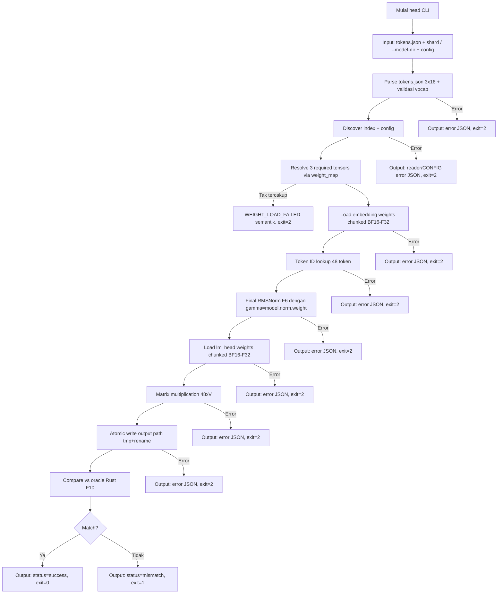

# M1 — Head Path (Embed → Final Norm → LM Head)

> Proyek: `disk-streaming-moe-engine`. Fase: **Trial**. Index: `../README.md`.
> Implementasi dipecah menjadi waves: `../../scratch/wave/m1/README.md` (W1 rmsnorm → W5 gates, catatan kerja gitignored).

| Field       | Nilai                                                             |
| ----------- | ----------------------------------------------------------------- |
| Deliverable | Head path: embedding lookup → final RMSNorm → lm_head             |
| Komponen    | C1 CLI (`head`), C2 `model.mojo` (rmsnorm), C3 reader, C7 compare |
| Prasyarat   | M0 hijau                                                          |
| Next        | `M2-attention.md`                                                 |
| Gate        | G-M1-1 (M1-A correctness), G-M1-2 (M1-B resource); M1-C benchmark report-only |
| Rumus       | F1 (memori), F6 (RMSNorm), F10 (verdict)                          |

## Tujuan

Membuktikan jalur paling luar model benar end-to-end (tanpa transformer layer): token IDs → logits. Mengisolasi bug embedding/norm/head sebelum masuk attention/MoE.

Struktur milestone ini tiga kontrak yang dinilai terpisah:

- **M1-A Correctness** — `tokens → required tensors → embed → final RMSNorm → lm_head → logits → Rust compare`. Gate: G-M1-1.
- **M1-B Resource** — `W_res` terukur, `M_peak` terukur, tanpa pelanggaran transient double-residency. Gate: G-M1-2.
- **M1-C Real-checkpoint benchmark** — loading shard asli + I/O nyata + VmHWM + cold/warm timing. **Report-only, tanpa latency gate** (lihat § Performance Baseline M1).

## Scope

- Embedding + lm_head dimuat resident F32: $2 \times 151.936 \times 2048 \times 4\,\text{B} = 2.489.319.424$ B = **2,318 GiB** (satu-satunya bobot non-streaming).
- Final RMSNorm (F6): $y = x / \mathrm{RMS}(x) \odot \gamma$, $\varepsilon$ dan dtype fp32 identik oracle. Sumber $\varepsilon$ dikontrak di § Oracle Head Specification (field `rms_norm_eps`, tanpa default diam-diam).
- `lm_head` **untied** (tensor terpisah dari embedding).
- Output: `logits_mojo.bin` (default, dapat dioverride via `--output`) via atomic write (tmp + rename).
- Oracle: `oracle_head.py` (PyTorch fp32) → `logits_ref.bin` → Rust `compare` verdict.

### Required tensors (normatif)

M1 membutuhkan tepat tiga **model weight tensor** berikut. Frasa "tepat tiga" hanya menghitung weight tensor — dependency closure M1 = ketiga weight tensor ini **plus** artefak `model.safetensors.index.json` + `model_config.json` (keduanya dependency normatif, dikontrak di bawah; tidak ada implementasi yang boleh mengklaim "hanya butuh tiga tensor" untuk mengabaikan config/index). CLI wajib me-resolve ketiganya dari index sebelum komputasi — `N ≥ 1` pada command line hanya syarat sintaks, bukan syarat kelengkapan semantik:

| Simbol    | Nama tensor               | Shape file (trial) | Dtype file | Dipakai sebagai |
| --------- | ------------------------- | ------------------ | ---------- | --------------- |
| embedding | `model.embed_tokens.weight` | 151936 × 2048      | BF16       | lookup → F32    |
| gamma     | `model.norm.weight`         | 2048               | BF16       | RMSNorm F6 → F32 |
| head      | `lm_head.weight`            | 151936 × 2048      | BF16       | matmul → F32    |

Aturan resolusi (normatif, satu resolver — tidak ada dua algoritma):

1. Ada tepat satu `model_root`: mode `--model-dir <dir>` → `<dir>`; mode positional → directory bersama shard yang dipasok (semua path shard wajib berada di satu directory yang sama; tersebar di beberapa directory → error `FILE_NOT_FOUND`/`JSON_PARSE_ERROR` dengan detail, bukan resolve diam-diam per file).
2. Resolver memuat dari `model_root`: `model.safetensors.index.json` → `weight_map`, dan `model_config.json` kanonis M1 (lihat § Fixture M1-Specific) → `rms_norm_eps`, `hidden_size`, `vocab_size`.
3. Untuk tiap required tensor, baca `weight_map[name]` → file harapan.
4. Shard positional (bila dipakai) hanya berfungsi sebagai **allowlist file yang boleh dibaca** — bukan sumber index/config alternatif. Himpunan allowlist **wajib mencakup** ketiga file harapan; file harapan yang tidak ada di allowlist → `WEIGHT_LOAD_FAILED` semantik dengan `missing_tensors` + `expected_shards`. Path pasokan yang tidak ada di disk → `FILE_NOT_FOUND` (bedakan dari tensor yang tak tercakup: yang satu soal filesystem, yang satu soal cakupan semantik).
5. Mode `--model-dir` = allowlist implisit = semua file yang dirujuk `weight_map` dan ada di `model_root` (tidak perlu menyebut shard satu per satu).
6. Shape/dtype aktual dari header tiap required tensor wajib diassert terhadap config (`hidden_size`, `vocab_size`); pelanggaran → `WEIGHT_LOAD_FAILED` dengan `tensor_name` + expected/actual.
7. Error struktural reader (header korup, offset overflow, dtype tak dikenal, layout mismatch) **dipropagasikan apa adanya** dengan taxonomy M0 — tidak boleh diflatten menjadi `WEIGHT_LOAD_FAILED` (lihat § Error Handling M1).

Catatan fixture: pada fixture M0, embedding + `lm_head` berada di shard 1 sedangkan `model.norm.weight` di shard 2 — satu shard saja tidak pernah cukup untuk M1 trial/fixture. Contoh `kimo head tokens.json shard-00001...` tunggal adalah INVALID secara semantik dan wajib gagal dengan `WEIGHT_LOAD_FAILED`, bukan dengan hasil parsial.

### Anggaran memori M1 (F1, normatif)

$W_{res} \approx 2{,}318$ GiB adalah suku terbesar, **bukan** satu-satunya. Dekomposisi M1 (trial, $V=151936$, $d=2048$, 3 prompt × 16 token = 48 token):

| Suku | Isi | Ukuran trial |
| ---- | --- | ------------ |
| $W_{res}$ | embedding F32 + lm_head F32 resident | 2 × 151936 × 2048 × 4 B = **2.318 GiB** |
| $M_{\gamma}$ | `model.norm.weight` F32 | 2048 × 4 B = 8 KiB |
| $M_{act}$ | activation 48 × 2048 F32 | 393.216 B |
| $M_{logits}$ | logits 48 × 151936 F32 | 29.171.712 B (≈ 27,8 MiB) |
| $M_{conv}$ | chunk konversi BF16→F32 sementara | **≤ 64 MiB** (implementasi memilih ≤ 16–64 MiB) |
| $M_{io}$ | buffer pread / I/O | ≤ 0,1 GB (arsitektur §2.5) |
| overhead | input buffer, allocator, fragmentasi | tercakup dalam VmHWM |

$$M_{peak}(M1) = W_{res} + M_{\gamma} + M_{act} + M_{logits} + M_{conv} + M_{io} + \text{overhead} \le 3{,}5\ \text{GiB (G-M1-2, F1 dengan } M_{KV}=0\text{)}$$

**Load strategy (normatif):** konversi BF16→F32 wajib **chunked** (streaming per potongan ≤ 64 MiB, konversi in-place per chunk ke buffer F32 resident). Duplikasi seluruh tensor (buffer BF16 penuh + salinan F32 penuh, transient ≈ +1,159 GiB per matriks) **DILARANG** — pelanggaran strategi ini gagal M1-B meski final resident state terlihat benar, karena VmHWM akan menangkap transient-nya.

**Telemetri load-phase (normatif, enforcement kausal untuk larangan di atas):** VmHWM saja tidak cukup — spike kecil yang kebetulan lolos 3,5 GiB tidak membuktikan tidak adanya double-residency. Engine wajib menginstrumentasi fase load dan melaporkan tiga angka berikut di report (`memory.*`):

```text
resident_target_bytes   = byte F32 resident yang dialokasikan untuk embed+head (+ γ)
conversion_buffer_bytes = peak buffer sementara konversi BF16→F32 selama load
source_buffer_bytes     = peak buffer sumber BF16 yang dipegang bersamaan dengan target F32
```

Aturan acceptance M1-B (ketiganya wajib lolos, bukan hanya VmHWM):

```text
conversion_buffer_bytes ≤ 64 MiB
source_buffer_bytes     ≤ 64 MiB        # chunk yang sama; bukan salinan tensor penuh
VmHWM (vmhwm_bytes)     ≤ 3,5 GiB       # authoritative peak kernel
```

`conversion_buffer_bytes` / `source_buffer_bytes` yang dilaporkan adalah peak selama fase load (bukan nilai akhir — nilai akhir keduanya boleh 0 setelah chunk dibebaskan; yang di-gate adalah peak-nya). VmHWM tetap otoritas tunggal untuk peak proses; telemetri menjelaskan *komposisi* peak sehingga klaim "tanpa double-residency" dapat diverifikasi secara kausal, bukan disimpulkan dari final state.

## Implementasi head CLI

**Input:**

- `tokens.json` (token IDs, schema normatif: **array berisi 3 prompt, masing-masing array 16 integer** — `[[id×16]×3]`; lihat § Fixture M1-Specific)
- N path shard safetensors, N ≥ 1 (command line args) — dengan syarat kelengkapan semantik § Required tensors, **atau**
- `--model-dir <dir>` (alternatif yang disarankan): CLI discover `model.safetensors.index.json` di `<dir>` dan me-resolve shard yang harus disentuh dari `weight_map` tanpa seleksi shard manual. Kedua mode memakai resolver yang sama; mode positional tetap didukung untuk pengujian subset/error-path.
- `--output <path>` (opsional, default `logits_mojo.bin` — resolve terhadap workdir, lihat definisi workdir di bawah)
- `--workdir <dir>` (opsional, default = cwd proses). **Definisi workdir (normatif, tunggal):** workdir = canonical absolute path dari `--workdir` bila diberikan, versus cwd pada saat CLI start bila tidak. Tidak ada interpretasi ketiga (bukan parent dari `--output`, bukan lokasi binary, bukan lokasi shard). Workdir di-resolve sekali saat startup, sebelum output apa pun ditulis, dan dilog di report (`"workdir": "<abs path>"`).
- `model.safetensors.index.json` (di `model_root`: `--model-dir` atau directory bersama shard positional)
- `model_config.json` kanonis M1 di `model_root` (wajib memuat `rms_norm_eps`, `hidden_size`, `vocab_size`; artefak tunggal — lihat § Fixture M1-Specific)

**Output:**

- stdout: JSON report dengan struktur:
  ```json
  {
    "status": "success" | "mismatch" | "error",
    "num_prompts": 3,
    "tokens_per_prompt": 16,
    "num_tokens_total": 48,
    "vocab_size": 151936,
    "output_file": "logits_mojo.bin",
    "workdir": "/abs/path/workdir",
    "parse_time_ms": 45.67,
    "compute_time_ms": 12.34,
    "memory": {
      "resident_target_bytes": 2489319424,
      "conversion_buffer_bytes": 16777216,
      "source_buffer_bytes": 16777216,
      "vmhwm_bytes": 2700000000
    }
  }
  ```
  Objek `memory` wajib ada pada `status=success` (telemetri fase load — lihat § Anggaran memori M1). `vmhwm_bytes` = VmHWM proses pada akhir run; tiga field pertama = accounting allocator/engine, bukan angka kernel.
- File: output path (default `logits_mojo.bin`; binary fp32 logits, shape: **[num_prompts, tokens_per_prompt, vocab_size] = [3, 16, 151936]**, row-major; view flatten `[48, 151936]` adalah buffer yang sama — lihat § Logits File Format)
- stderr: error message (bila ada)

**Aturan output path (normatif):** `--output` di-resolve terhadap workdir (definisi tunggal di atas); path relatif = relatif terhadap workdir, bukan terhadap lokasi shard atau binary. Path hasil resolve wajib berada di dalam workdir (cek setelah normalisasi + resolusi symlink pada komponen parent yang sudah ada; symlink escape = error `OUTPUT_WRITE_FAILED`); file tmp atomic dibuat di filesystem/directory yang sama dengan target; rename hanya setelah write selesai (lihat § Security). Run paralel/CI wajib memakai `--output` (dan bila perlu `--workdir`) berbeda per invocation — default `logits_mojo.bin` hanya untuk single-run.

**Exit code:**

- 0: success (logits generated)
- 1: oracle mismatch (G-M1-1 fail)
- 2: error (file tidak ditemukan, format invalid, dll)

**Contoh penggunaan:**

```bash
# mode utama: resolusi otomatis dari model dir (tanpa seleksi shard manual)
kimo head tokens.json --model-dir ./models/qwen1.5-moe

# mode positional: shard eksplisit, resolver tetap memeriksa kelengkapan 3 tensor
kimo head tokens.json shard-00001-of-00003.safetensors shard-00002-of-00003.safetensors shard-00003-of-00003.safetensors

# output eksplisit (wajib untuk run paralel/CI agar tidak tabrakan)
kimo head tokens.json --model-dir ./models/qwen1.5-moe --output out/prompt-set-a.bin
```

**Contoh output (success):**

```json
{
  "status": "success",
  "num_prompts": 3,
  "tokens_per_prompt": 16,
  "num_tokens_total": 48,
  "vocab_size": 151936,
  "output_file": "logits_mojo.bin",
  "workdir": "/abs/path/workdir",
  "parse_time_ms": 45.67,
  "compute_time_ms": 12.34,
  "memory": {
    "resident_target_bytes": 2489319424,
    "conversion_buffer_bytes": 16777216,
    "source_buffer_bytes": 16777216,
    "vmhwm_bytes": 2700000000
  }
}
```

**Contoh output (mismatch):**

```json
{
  "status": "mismatch",
  "num_prompts": 3,
  "tokens_per_prompt": 16,
  "num_tokens_total": 48,
  "vocab_size": 151936,
  "output_file": "logits_mojo.bin",
  "workdir": "/abs/path/workdir",
  "parse_time_ms": 45.67,
  "compute_time_ms": 12.34,
  "memory": {
    "resident_target_bytes": 2489319424,
    "conversion_buffer_bytes": 16777216,
    "source_buffer_bytes": 16777216,
    "vmhwm_bytes": 2700000000
  },
  "verdict": {
    "delta_max": 0.001234,
    "epsilon_rel": 0.000123,
    "accuracy": 0.9375,
    "fail_reason": "epsilon_rel exceeds threshold 1e-4"
  }
}
```

**Contoh output (error):**

```json
{
  "error_type": "TOKEN_INVALID",
  "detail": "Token ID 200000 exceeds vocab size 151936",
  "stage": "embedding",
  "prompt_idx": 1,
  "token_pos": 7,
  "token_id": 200000
}
```

**Contoh output (missing tensor semantik):**

```json
{
  "error_type": "WEIGHT_LOAD_FAILED",
  "detail": "Required tensors not covered by supplied shards",
  "stage": "embedding",
  "missing_tensors": ["model.norm.weight"],
  "expected_shards": ["shard-00002-of-00003.safetensors"]
}
```

## Oracle Head Specification

**Script:** `tools/oracle/oracle_head.py`

**Input:**

- `tokens.json` (token IDs, sama dengan input CLI: `[[id×16]×3]`)
- Artefak config kanonis yang **sama** dengan yang dibaca engine: `fixtures/m1/model_config.json` untuk fixture (sumber `rms_norm_eps`, `hidden_size`, `vocab_size`); `model_config.json` di `model_root` untuk checkpoint asli. Tanpa salinan kedua, tanpa inject runtime.
- Model weights (PyTorch fp32, dari shard asli atau fixture)

**Binding tensor (normatif, eksplisit):**

```text
embedding = model.embed_tokens.weight   # shape [V, d], assert vs config
gamma     = model.norm.weight           # shape [d], assert vs config
head      = lm_head.weight              # shape [V, d], untied, assert vs config
```

Masing-masing diassert shape dan dtype sebelum komputasi; pelanggaran → error yang setara `WEIGHT_LOAD_FAILED` di sisi oracle/fixture (fixture salah, bukan engine salah).

**Kontrak epsilon (normatif):**

- Sumber tunggal: field `rms_norm_eps` di `model_config.json` (ground truth implementasi/config mengikuti `Qwen2MoeConfig` [R2]).
- Engine dan oracle **wajib membaca artefak config yang sama**; nilai $\varepsilon$ yang dipakai wajib dilog di report/laporan benchmark.
- Field hilang / non-numerik / ≤ 0 → `CONFIG_ERROR`, exit 2. **Tanpa default diam-diam** (`1e-6` vs `1e-5` yang tertukar adalah mismatch RMSNorm klasik dan harus gagal keras, bukan ditebak).

**Process:**

1. Load embedding weights (`model.embed_tokens.weight`, → F32)
2. Token ID lookup → embedding vectors (48 × d untuk 3 prompt × 16 token)
3. Final RMSNorm (F6): $y = x / \mathrm{RMS}(x) \odot \gamma$ dengan $\gamma$ = `model.norm.weight`
4. Load lm_head weights (untied, `lm_head.weight`, → F32)
5. Matrix multiplication: activation → logits, shape [3, 16, V]
6. Output: `logits_ref.bin` (binary fp32, shape: [3, 16, vocab_size])

**Output:**

- `logits_ref.bin` (binary fp32 logits)
- SHA-256 hash untuk identity regresi artefak referensi (level R) — lihat § Gate: hash mem-pin `logits_ref.bin`, **bukan** kesetaraan engine-vs-oracle.

**Verifikasi:**

- SHA-256 logits_ref.bin ter-commit ke repo (regression identity artefak referensi).
- Oracle dan engine harus pakai config yang sama (ε dari `rms_norm_eps`, dtype fp32) — artefak config yang sama, bukan "nilai yang konon sama".
- Process harus deterministic (seed tetap, jika ada randomness).

## Fixture M1-Specific

**Source fixture:**

- Gunakan fixture M0 (3 shard synthetic + index + config)
- Atau gunakan model asli (untuk M1-C benchmark akhir)
- **Satu authority config (normatif):** fixture M1 memiliki artefak config kanonis sendiri — `fixtures/m1/model_config.json`, committed dan hash-pinned via `SHA256SUMS` — yang wajib memuat `rms_norm_eps` (numerik, > 0) di samping `hidden_size` / `vocab_size`. Generator M1 menurunkannya secara deterministik dari config M0 (field dipertahankan byte-identik, ditambah `rms_norm_eps` dengan nilai + provenance yang dicatat di laporan generasi); config tanpa `rms_norm_eps` = fixture invalid (`CONFIG_ERROR`), bukan "pakai default". Dilarang ada dua authority: tidak ada inject field saat runtime, tidak ada patch in-memory di engine/oracle — keduanya membaca file `fixtures/m1/model_config.json` yang sama (atau `model_config.json` di `model_root` untuk checkpoint asli).

**Token data (schema normatif):**

- 3 prompt dari golden set (commit ke repo)
- 16 token per prompt (total 48 token)
- Token IDs precomputed di `tokens.json`
- Format: `[ [token_id_1, ..., token_id_16], [...], [...] ]` — array 3 × 16. Validasi: outer len == 3, tiap inner len == 16, tiap id dalam `0..vocab_size` (vocab dari config: 151936 trial, 512 fixture synthetic). Pelanggaran → `TOKEN_INVALID` dengan `prompt_idx` + `token_pos`.
- Satu invocation memproses **ketiga prompt sekaligus**; tidak ada mode "satu prompt per invocation" — gate selalu menilai 48 token penuh.

**Expected output:**

- `logits_ref.bin` dari oracle (precomputed, commit ke repo), shape [3, 16, V]
- SHA-256 hash untuk regression testing (level R) — identity artefak referensi, bukan kriteria kebenaran engine.

**Tujuan:**

- Testing embedding lookup correctness
- Testing RMSNorm implementation (F6)
- Testing lm_head untied implementation
- Testing end-to-end head path (token IDs → logits)
- Support CI tanpa download 28.6 GB (bila pakai fixture M0)

**Generasi:**

- Script: `tools/fixtures/generate_m1_tokens.py`
- Input: 3 prompt dari golden set + config M0 (sumber field dasar)
- Output: `fixtures/m1/` = `model_config.json` (kanonis, +`rms_norm_eps` + provenance) + tokens.json + logits_ref.bin
- Verifikasi: SHA-256 ter-commit ke repo (`SHA256SUMS` mencakup config kanonis — perubahan field tanpa regenerasi tercatat = FAIL regresi)

## Error Handling M1

**Format error:** JSON dengan struktur terstandar (sama dengan M0, ditambah field opsional):

```json
{
  "error_type": "TOKEN_INVALID" | "WEIGHT_LOAD_FAILED" | "CONFIG_ERROR" | "NORM_ERROR" | "OUTPUT_WRITE_FAILED" | "FILE_NOT_FOUND" | "JSON_PARSE_ERROR" | "INVALID_HEADER" | "OFFSET_OVERFLOW" | "UNKNOWN_DTYPE" | "LAYOUT_MISMATCH" | "DUPLICATE_JSON_KEY" | "DUPLICATE_TENSOR_NAME",
  "detail": "deskripsi spesifik error",
  "stage": "embedding" | "rmsnorm" | "lm_head" | "output" | "config",
  "token_id": 123,
  "prompt_idx": 1,
  "token_pos": 7,
  "tensor_name": "model.norm.weight",
  "missing_tensors": ["model.norm.weight"],
  "expected_shards": ["shard-00002-of-00003.safetensors"]
}
```

**Error types (dua lapisan, jangan dicampur):**

Lapisan reader (propagasi verbatim dari M0, header/struktur rusak):

- `INVALID_HEADER`, `OFFSET_OVERFLOW`, `UNKNOWN_DTYPE`, `LAYOUT_MISMATCH`, `DUPLICATE_JSON_KEY`, `DUPLICATE_TENSOR_NAME`, `FILE_NOT_FOUND`, `JSON_PARSE_ERROR` — makna dan format identik M0, termasuk aturan dua-koordinat untuk `OFFSET_OVERFLOW`.

Lapisan semantik M1 (shard valid tetapi kebutuhan M1 tak terpenuhi):

- `TOKEN_INVALID`: token ID di luar range vocab (`0..vocab_size-1`, vocab dari config)
- `WEIGHT_LOAD_FAILED`: **hanya** untuk (a) required tensor tak tercakup shard yang dipasok, atau (b) assert shape/dtype required tensor vs config gagal. Wajib menyertakan `tensor_name` / `missing_tensors` + `expected_shards` bila relevan.
- `CONFIG_ERROR`: `model_config.json` hilang / tak terparse / `rms_norm_eps` hilang / non-numerik / ≤ 0 / `hidden_size`–`vocab_size` tak konsisten dengan tensor. Tanpa default diam-diam.
- `NORM_ERROR`: RMSNorm computation error (division by zero, NaN, Inf)
- `OUTPUT_WRITE_FAILED`: gagal write output path (disk full, permission, symlink escape, path di luar workdir)

Preseden: corrupt header → `INVALID_HEADER` (bukan `WEIGHT_LOAD_FAILED`); shard valid tapi `model.norm.weight` absen → `WEIGHT_LOAD_FAILED`. Urutan pemeriksaan: parse args/config → discover index → parse+validasi header (reader errors) → resolusi required tensors (semantic) → komputasi.

**Atomic write failure:**

- Bila write output gagal → rollback (hapus partial file + tmp)
- Return error JSON, exit code 2
- Tidak biarkan file setengah jadi → false-MATCH di compare

**Semua error harus mengembalikan exit code ≠ 0 dan message terstruktur, bukan panic.**

## Workflow M1



**Alur utama:**

1. CLI menerima tokens.json (3 × 16) + shard eksplisit **atau** `--model-dir` + `model_config.json`
2. Parse tokens.json → validasi schema 3×16 + range vocab dari config
3. Discover index + config; parse dan validasi header tiap shard (error reader dipropagasi verbatim)
4. Resolve `model.embed_tokens.weight` + `model.norm.weight` + `lm_head.weight` via `weight_map`; cakupan tak lengkap → `WEIGHT_LOAD_FAILED`
5. Load embedding weights ke RAM resident F32 **secara chunked** (tanpa double-residency penuh)
6. Token ID lookup → embedding vectors (48 × d)
7. Final RMSNorm (F6): $y = x / \mathrm{RMS}(x) \odot \gamma$, $\gamma$ = `model.norm.weight`, $\varepsilon$ = `rms_norm_eps`
8. Load lm_head weights (untied) ke RAM resident F32 **secara chunked**
9. Matrix multiplication: activation → logits [3, 16, V]
10. Atomic write output path (tmp + rename, di dalam workdir)
11. Compare vs oracle (logits_ref.bin) menggunakan Rust compare (5 metrik F10)
12. Output JSON report dengan status dan exit code yang sesuai

**Error path:**

- Error parse tokens → return error JSON, exit=2
- Error config/index/reader → return reader atau `CONFIG_ERROR` JSON, exit=2
- Required tensor tak tercakup / assert gagal → `WEIGHT_LOAD_FAILED`, exit=2
- Error load weights → return error JSON, exit=2
- Error computation (RMSNorm, matmul) → return error JSON, exit=2
- Error write output → rollback + return error JSON, exit=2
- Mismatch oracle → return mismatch JSON, exit=1
- Success → return success JSON, exit=0

## Performance Baseline M1

**Prinsip lapisan (mengikuti M0):** gate kebenaran (G-M1-1/G-M1-2) independen dari cache — lolos di cold maupun warm. Angka di bawah murni benchmark, bukan gate. Tidak ada latency gate absolut pada M1: memuat ~2,318 GiB resident dalam 100 ms membutuhkan ≈ 23,2 GB/s efektif, yang bukan target cold-read disk/NVMe yang masuk akal — angka `< 100 ms` sebagai gate universal **dihapus** dari spec ini.

**M1-A Correctness (fixture synthetic):**

- Target: verdict MATCH (G-M1-1), bukan milidetik. Waktu parse/compute dilaporkan (report JSON + laporan benchmark) tetapi tidak di-gate.
- Method: fixture M1 (3 prompt × 16 token), threads=1 untuk verdict numerik (determinisme `03-testing.md` §4.6); N=5 run, median; governor `performance`, aplikasi lain ditutup.

**M1-B Resource (G-M1-2):** lihat § Anggaran memori M1 + § Integration Test Specification (Memory boundary).

**M1-C Real-checkpoint benchmark (report-only, bukan gate):**

- Beban: checkpoint asli (8 shard, 28,63 GB; resident head ≈ 2,318 GiB).
- Yang dilaporkan per run: load time (parse) + compute time terpisah, throughput, VmHWM, bytes I/O (`/proc/<pid>/io`), nilai $\varepsilon$ + revision/config yang dipakai.
- Cold read: `sync && echo 3 | sudo tee /proc/sys/vm/drop_caches` — opsional khusus Linux ber-privilege, tidak pernah syarat kebenaran (pola M0).
- N=5 run, ambil median; environment: CPU governor `performance`, aplikasi lain ditutup.
- Hasil terukur dicatat di laporan benchmark dengan run-id; kalibrasi F1: $M_{peak}^{meas}$ vs $M_{peak}^{pred}$ (toleransi ±5%). Kegagalan kalibrasi tidak memblokir tetapi wajib memperbarui konstanta + catatan (aturan `03-testing.md` §4.4).
- Target latensi absolut (mis. angka ms untuk checkpoint asli) **dilarang** sampai baseline M1-C terukur — target kuantitatif baru boleh ditetapkan setelah ada tanah pengukuran.

**Metric:**

- Wall clock time terpisah (parse_time_ms vs compute_time_ms — jangan digabung saat mendiagnosis I/O vs komputasi)
- VmHWM (peak memory usage, authoritative — lihat § Integration Test Specification)
- Bytes I/O (weight loading, dari `/proc/<pid>/io`)

**Baseline:**

- Mesin target: 8 GB RAM, NVMe SSD
- Hasil terukur dicatat di laporan benchmark
- Kalibrasi F1: $M_{peak}^{meas}$ vs $M_{peak}^{pred}$ (toleransi ±5%)

**Expectations (informatif, bukan gate):**

- Parse time: dominasi oleh I/O load embedding + lm_head (2,318 GiB) pada checkpoint asli; pada fixture synthetic I/O jauh lebih kecil — keduanya tidak boleh dibandingkan langsung.
- Compute time: RMSNorm + matmul orde puluhan ms untuk 48 token di mesin target (dilaporkan, tidak di-gate).

## Integration Test Specification

**Test framework:**

- Rust integration test di `tests/integration_m1.rs`
- Python oracle test di `tests/oracle_m1.py`
- Fixture: M1 synthetic (`fixtures/m1/`: tokens.json 3×16 + `model_config.json` kanonis dengan `rms_norm_eps` + logits_ref.bin [3,16,V])

**Test cases:**

1. **Happy path:**
   - Input: tokens.json valid 3×16 + shard yang mencakup ketiga required tensor (+ `--model-dir` sebagai varian)
   - Expected: status=success, logits MATCH oracle via Rust compare (G-M1-1)
   - Verification: verdict MATCH ($\Delta_{max}$, $\varepsilon_{rel}$, $\mathbb{A}$ dalam threshold); **kesetaraan byte/hash antara output engine dan `logits_ref.bin` DILARANG dijadikan kriteria** (fp32 boleh beda bit-level — lihat § Gate).

2. **Token validation:**
   - Input: tokens.json dengan token ID invalid (> vocab_size-1) / schema bukan 3×16
   - Expected: error TOKEN_INVALID, exit=2
   - Verification: error JSON terstruktur dengan `prompt_idx` + `token_pos`

3. **Weight load failure (dua sub-kasus, jangan digabung):**
   - (a) Input: shard file korup (header invalid) → Expected: reader error M0 yang dipropagasi (`INVALID_HEADER` / `OFFSET_OVERFLOW` / …), exit=2
   - (b) Input: shard valid tetapi required tensor tak tercakup (mis. hanya shard-00001) → Expected: error WEIGHT_LOAD_FAILED dengan `missing_tensors` + `expected_shards`, exit=2
   - Verification: error JSON terstruktur, no crash; (a) tidak boleh diflatten menjadi `WEIGHT_LOAD_FAILED`

4. **Oracle mismatch:**
   - Input: implementasi RMSNorm salah (bukan F6) atau $\varepsilon$ salah
   - Expected: status=mismatch, exit=1
   - Verification: verdict JSON dengan delta_max/epsilon_rel + kategori FAIL

5. **Atomic write failure:**
   - Simulasi: disk full atau permission error
   - Expected: error OUTPUT_WRITE_FAILED, exit=2
   - Verification: no partial file, rollback berhasil

6. **Memory boundary:**
   - Input: 3 prompt × 16 token (48 token, normal case)
   - Expected: $M_{peak} \le 3{,}5$ GiB (G-M1-2) **dan** caps telemetri load-phase lolos (`conversion_buffer_bytes ≤ 64 MiB`, `source_buffer_bytes ≤ 64 MiB` — strategi chunked § Anggaran memori M1 terbukti kausal, bukan disimpulkan)
   - Verification: **VmHWM authoritative** untuk peak; `memory.*` di report wajib ada dan konsisten ($resident\_target\_bytes$ ≈ 2,318 GiB trial; inkonsistensi > 1% vs prediksi = FAIL instrumentasi); poller 100 ms hanya telemetri fase (load vs compute), bukan detektor peak — spike konversi singkat tidak boleh diklaim tertangkap poller.

7. **Config contract:**
   - Input: config tanpa `rms_norm_eps` (atau ≤ 0), atau fixture tanpa `fixtures/m1/model_config.json` kanonis
   - Expected: error CONFIG_ERROR, exit=2 (tanpa fallback default)
   - Verification: engine dan oracle membaca artefak config yang sama (byte-identik, hash-pinned); tidak ada inject runtime di kedua sisi

**Test execution:**

- Run: `cargo test --test integration_m1`
- Environment: cgroup memory.max=6G (SEC-4)
- Orchestration: `make validate` (termasuk M0 + M1 integration)

**Success criteria:**

- Semua test cases pass
- 0 crash, 0 hang, 0 panic
- Exit codes sesuai spec
- Error messages terstruktur

## Logits File Format

**Format:** Binary fp32 (little-endian)

**Layout (normatif):**

- Shape: [num_prompts, tokens_per_prompt, vocab_size] = [3, 16, 151936] (trial)
- Total bytes trial: 3 × 16 × 151936 × 4 = 29.171.712 bytes (~27,82 MiB)
- Row-major: prompt dimensi pertama, token kedua, vocab ketiga. View flatten [48, 151936] (token-major) adalah buffer byte yang sama dan boleh dipakai compare/analisis — kedua bentuk harus didokumentasikan di laporan bila dipakai.
- Fixture synthetic memakai `vocab_size` dari config-nya (512) dengan rumus byte yang sama: $3 \times 16 \times V \times 4$.

**Access pattern:**

```python
# Python (oracle)
import numpy as np
logits = np.fromfile('logits_mojo.bin', dtype=np.float32)
logits = logits.reshape(3, 16, 151936)  # [num_prompts, tokens_per_prompt, vocab_size]
flat = logits.reshape(48, 151936)       # view yang sama, token-major
```

```rust
// Rust (compare)
let logits: Vec<f32> = read_bin_file("logits_mojo.bin")?;
let logits = Array3::from_shape_vec((3, 16, 151936), logits)?;
```

**Verification:**

- Shape validation: total bytes % (4 × vocab_size) == 0 dan total tokens == 48 (3 × 16)
- NaN/Inf check: semua nilai harus finite (tidak ada NaN/Inf)
- SHA-256 hanya untuk identity regresi `logits_ref.bin` (level R); kebenaran engine dinilai via compare F10, bukan hash.

## Gate

| Gate   | Kontrak | Kriteria            | Threshold                                                                               | Metode                |
| ------ | ------- | ------------------- | --------------------------------------------------------------------------------------- | --------------------- |
| G-M1-1 | M1-A    | MATCH strict logits | $\Delta_{max} \le 10^{-3} \wedge \varepsilon_{rel} \le 10^{-4} \wedge \mathbb{A}=100\%$ | 3 prompt × 16 token (48 token), threads=1 |
| G-M1-2 | M1-B    | anggaran memori     | $M_{peak} \le 3{,}5$ GiB (F1, dekomposisi § Anggaran memori M1) + caps telemetri (`conversion_buffer_bytes` ≤ 64 MiB, `source_buffer_bytes` ≤ 64 MiB) | VmHWM authoritative + `memory.*` report + poller 100 ms sebagai telemetri fase |
| M1-C   | M1-C    | benchmark real-checkpoint | **report-only, tanpa threshold** (load/compute/VmHWM/bytes)                   | 8 shard asli, N=5 median, cold/warm |

F1: $M_{peak} = W_{res} + M_{KV}(=0) + M_{ws} + M_{io}$ — pemetaan M1: $W_{res}$ = embed+head F32 (+ $\gamma$ 8 KiB), $M_{ws}$ = activation + logits + chunk konversi, $M_{io}$ = buffer pread.

**Aturan verdict (F10, normatif):** Rust compare wajib menghitung dan melaporkan **kelima** metrik F10 ($\Delta_{max}$, $\varepsilon_{rel}$, $\cos\theta$, $\mathbb{A}$, $\Delta_{CE}$) + kategori FAIL (`03-testing.md` §4.3). Gate G-M1-1 hanya mengevaluasi subset ($\Delta_{max}$, $\varepsilon_{rel}$, $\mathbb{A}$) — metrik lain wajib ada di laporan meski tidak di-gate. Menaikkan threshold untuk "meloloskan" FAIL adalah pelanggaran spec (`03-testing.md` §4.1).

**Aturan hash (normatif):** `SHA-256(logits_ref.bin)` yang ter-commit adalah regression identity artefak referensi. `SHA-256(output engine) == SHA-256(logits_ref.bin)` **bukan** acceptance criterion — engine dan oracle diharapkan sangat dekat secara numerik tetapi boleh berbeda bit-level (urutan reduksi, codegen, dsb).

## Testing

- O: oracle equivalence head, tiap build, threads=1.
- I: exit code CLI, schema report JSON (termasuk mode `--model-dir` dan `--output`).
- B: waktu prefill head (parse vs compute terpisah) + VmHWM + bytes I/O (`/proc/<pid>/io`); M1-C report-only.
- R: golden bins + SHA-256 **untuk `logits_ref.bin` saja** (bukan kesetaraan hash engine).
- Kategori FAIL yang relevan: `dtype-layout` (transpos embedding/head), `numeric-order` (beda kecil merata masih wajar bila di bawah threshold; bila lewat → root-cause).

## Security

- SEC-4: lolos di bawah `memory.max=6G`.
- SEC-5: tulis hanya ke workdir (definisi tunggal § Implementasi head CLI: `--workdir` atau cwd), atomic rename (hindari bins setengah jadi → false-MATCH). Output path hasil resolve wajib di dalam workdir (symlink escape = error `OUTPUT_WRITE_FAILED`); tmp atomic di filesystem/directory yang sama dengan target, rename setelah write selesai; model dir read-only saat engine jalan (K5).
- SEC-6: golden hash 0 perubahan tak terjelaskan (cakupan: `logits_ref.bin` + fixture; bukan hash output engine).

## DoD

- [x] G-M1-1, G-M1-2 hijau; laporan M1-C (real-checkpoint, report-only) ter-commit
- [x] Laporan benchmark + run-id ter-commit
- [x] Kalibrasi F1 awal tercatat
- [x] Risiko R5 (Wres 2,318 GiB) dievaluasi: opsi BF16 resident + dequant on-the-fly bila workspace sempit
- [x] head CLI implementasi lengkap (input/output/exit code sesuai spec, termasuk `--model-dir`, `--output`, `--workdir`, satu resolver + allowlist shard, resolusi 3 required weight tensor)
- [x] Oracle head.py implementasi dan ter-commit (binding tensor eksplisit + kontrak `rms_norm_eps`, baca config kanonis yang sama)
- [x] RMSNorm kernel implementasi (F6, $\varepsilon$ dari config tanpa default diam-diam)
- [x] Embedding lookup implementasi
- [x] LM head untied implementasi
- [x] Atomic write output path implementasi (tmp + rename, workdir tunggal + path confinement)
- [x] Load strategy chunked BF16→F32 implementasi (tanpa double-residency penuh) + telemetri `memory.*` di report
- [x] Error handling M1 implementasi (format JSON, dua lapisan error: propagasi reader M0 + semantik M1)
- [x] Fixture M1 ter-commit (`fixtures/m1/`: tokens.json 3×16 + `model_config.json` kanonis dengan `rms_norm_eps` + logits_ref.bin [3,16,V], hash-pinned)
- [x] Unit tests coverage ≥ 85% untuk head path components
- [x] Integration test end-to-end head implementasi (7 test cases)
- [x] Performance baseline M1 terukur dan terdokumentasi (M1-A waktu report-only; M1-C real-checkpoint report-only, tanpa latency gate)
- [x] Logits file format implementasi (binary fp32, shape [3,16,V], shape validation)
- [x] Cgroup memory.max=6G integration testing (SEC-4)
- [x] Property tests RMSNorm implementasi (invariant F6)
- [x] SHA-256 verification implementasi (golden hash `logits_ref.bin`)
