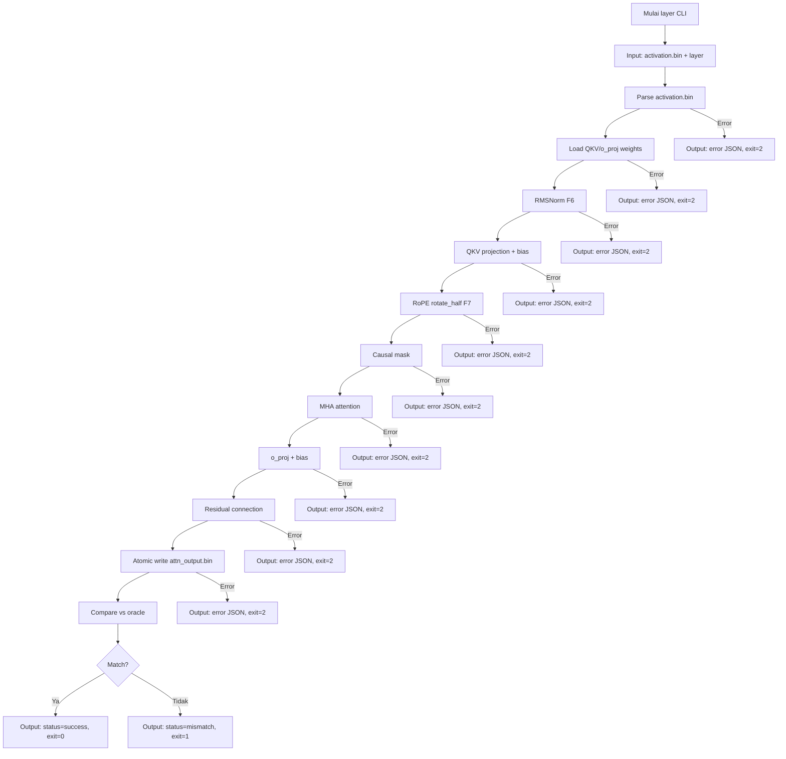

# M2 — Satu Layer: Attention (RoPE, QKV Bias, MHA)

> Proyek: `disk-streaming-moe-engine`. Fase: **Trial**. Index: `../README.md`.
> Implementasi dipecah menjadi waves: `../../scratch/wave/m2/README.md` (W1 qkv-bias → W6 gates, catatan kerja gitignored).

| Field       | Nilai                                                                   |
| ----------- | ----------------------------------------------------------------------- |
| Deliverable | Satu layer attention yang MATCH oracle                                  |
| Komponen    | C2 kernels (rmsnorm, rope rotate_half, attn, o_proj), C7 oracle/compare |
| Prasyarat   | M0, M1 hijau                                                            |
| Next        | `M3-moe.md`                                                             |
| Gate        | G-M2-1                                                                  |
| Rumus       | F6, F7, F10                                                             |

## Tujuan

Membuktikan kernel attention trial benar: MHA 16 head × 128, **QKV bias ada**, RoPE `rotate_half`, causal mask, o_proj + bias, residual.

## Scope

- Input: activation dari embedding (atau fixture synthetic) untuk layer 0, 12, 23; L=16 token.
- Per layer: rmsnorm → qkv (+bias) → RoPE rotate_half (F7) → MHA causal → o_proj (+bias) → residual.
- Jebakan permanen: checkpoint punya 72 tensor bias padahal `config.json` tidak menulis `attention_bias`. Verifikasi ke index, bukan cuma config (property P-2).
- Oracle: `oracle_layer.py` part `attn` (PyTorch fp32).

## Implementasi layer CLI

**Input:**

- `activation.bin` (activation input, binary fp32, shape: [L, hidden_dim] = [16, 2048])
- Layer number: `--layer 0|12|23` (command line arg)
- N path shard safetensors, N ≥ 1 (command line args)
- `model.safetensors.index.json` (auto-discovered di directory yang sama)

**Output:**

- stdout: JSON report dengan struktur:
  ```json
  {
    "status": "success" | "mismatch" | "error",
    "layer": 0,
    "num_tokens": 16,
    "output_file": "attn_output.bin",
    "parse_time_ms": 23.45,
    "compute_time_ms": 67.89
  }
  ```
- File: `attn_output.bin` (binary fp32, shape: [L, hidden_dim] = [16, 2048])
- stderr: error message (bila ada)

**Exit code:**

- 0: success (layer attention computed)
- 1: oracle mismatch (G-M2-1 fail)
- 2: error (file tidak ditemukan, format invalid, dll)

**Contoh penggunaan:**

```bash
# contoh fixture synthetic; checkpoint asli 8 shard
dismoen layer --layer 0 activation.bin shard-00001-of-00003.safetensors shard-00002-of-00003.safetensors shard-00003-of-00003.safetensors
```

**Contoh output (success):**

```json
{
  "status": "success",
  "layer": 0,
  "num_tokens": 16,
  "output_file": "attn_output.bin",
  "parse_time_ms": 23.45,
  "compute_time_ms": 67.89
}
```

**Contoh output (mismatch):**

```json
{
  "status": "mismatch",
  "layer": 0,
  "num_tokens": 16,
  "output_file": "attn_output.bin",
  "parse_time_ms": 23.45,
  "compute_time_ms": 67.89,
  "verdict": {
    "delta_max": 0.001234,
    "epsilon_rel": 0.000156,
    "fail_reason": "epsilon_rel exceeds threshold 1e-4"
  }
}
```

**Contoh output (error):**

```json
{
  "error_type": "ROPE_ERROR",
  "detail": "RoPE invariant violation: ||q'|| != ||q||",
  "stage": "rope",
  "layer": 0
}
```

## Oracle Layer Specification (Part Attn)

**Script:** `tools/oracle/oracle_layer.py`

**Input:**

- `activation.bin` (activation input, sama dengan input CLI)
- Layer number: `--part attn --layer 0|12|23`
- Model weights (PyTorch fp32, dari shard asli atau fixture)

**Process:**

1. Load activation input [16, 2048]
2. RMSNorm (F6): $y = x / \mathrm{RMS}(x) \odot \gamma$
3. Load QKV weights (16 head × 128, dengan bias 72 tensor)
4. QKV projection: $[Q, K, V] = [W_q, W_k, W_v] \cdot x + [b_q, b_k, b_v]$
5. RoPE rotate_half (F7): rotasi posisional pada Q dan K
6. Causal mask: triangular mask untuk autoregressive
7. MHA attention: softmax(QK^T / √d) · V
8. o_proj + bias: $y = W_o \cdot \text{attn\_output} + b_o$
9. Residual: $y = y + x$ (add input kembali)
10. Output: `attn_ref.bin` (binary fp32, shape: [16, 2048])

**Output:**

- `attn_ref.bin` (binary fp32, shape: [16, 2048])
- SHA-256 hash untuk verification (level R)

**Verifikasi:**

- SHA-256 attn_ref.bin ter-commit ke repo
- Oracle dan engine harus pakai config yang sama (ε, base RoPE, dtype fp32)
- Softmax stabil wajib: $\mathrm{softmax}(z) = \dfrac{\exp(z - \max z)}{\sum \exp(z - \max z)}$

## Fixture M2-Specific

**Layer coverage:**

- Layer 0 (early layer)
- Layer 12 (middle layer)
- Layer 23 (late layer)

**Activation input:**

- Synthetic activation: [16, 2048] fp32 dengan seed 42
- Atau ambil dari embedding output M1 (untuk end-to-end testing)
- Format: binary fp32, row-major

**Expected output:**

- `attn_ref.bin` dari oracle untuk tiap layer (precomputed, commit ke repo)
- SHA-256 hash untuk regression testing (level R)

**Tujuan:**

- Testing RMSNorm implementation (F6)
- Testing QKV projection dengan bias (72 tensor)
- Testing RoPE rotate_half (F7) dengan invariant isometri
- Testing MHA attention dengan causal mask
- Testing o_proj + bias dan residual
- Testing end-to-end layer attention (activation → activation)

**Generasi:**

- Script: `tools/fixtures/generate_m2_activation.py`
- Input: seed 42, layer numbers [0, 12, 23]
- Output: activation.bin + attn_ref.bin untuk tiap layer
- Verifikasi: SHA-256 ter-commit ke repo

## Causal Mask Specification

**Purpose:** Autoregressive decoding (token tidak bisa melihat masa depan)

**Implementation:**

- Triangular mask: $M_{ij} = 0$ jika $i \ge j$, $-\infty$ jika $i < j$
- $i$ = query position, $j$ = key position
- Diaplikasikan sebelum softmax: $attention\_scores = QK^T / \sqrt{d} + M$
- Hasil: softmax hanya mengattend ke posisi ≤ current position

**Example (L=4):**

```
Mask:
[[0, -inf, -inf, -inf],
 [0, 0, -inf, -inf],
 [0, 0, 0, -inf],
 [0, 0, 0, 0]]
```

**Verification:**

- Property test: output token $t$ hanya bergantung pada input token $\le t$
- Cross-attention check: token pada posisi $i$ tidak mempengaruhi token pada posisi $j < i$
- Test dengan gradient: gradient backprop hanya ke posisi yang di-attend

**Oracle vs engine:**

- Oracle PyTorch: `torch.nn.Transformer.causal_mask` atau manual triangular mask
- Engine Mojo: implementasi manual triangular mask
- Wajib identik behavior untuk semua layer (0, 12, 23)

## Error Handling M2

**Format error:** JSON dengan struktur terstandar (sama dengan M0/M1):

```json
{
  "error_type": "LAYER_INVALID" | "ACT_LOAD_FAILED" | "WEIGHT_LOAD_FAILED" | "ROPE_ERROR" | "ATTENTION_ERROR" | "MASK_ERROR" | "OUTPUT_WRITE_FAILED" | "FILE_NOT_FOUND",
  "detail": "deskripsi spesifik error",
  "stage": "rmsnorm" | "qkv" | "rope" | "attention" | "oproj" | "residual" | "output",
  "layer": 0
}
```

**Error types:**

- `LAYER_INVALID`: layer number tidak valid (bukan 0, 12, atau 23)
- `ACT_LOAD_FAILED`: gagal load activation.bin
- `WEIGHT_LOAD_FAILED`: gagal load QKV/o_proj weights (termasuk bias)
- `ROPE_ERROR`: RoPE computation error (NaN, Inf, invariant violation)
- `ATTENTION_ERROR`: MHA computation error (softmax overflow, NaN)
- `MASK_ERROR`: causal mask implementation error
- `OUTPUT_WRITE_FAILED`: gagal write attn_output.bin
- `FILE_NOT_FOUND`: activation.bin atau shard tidak ditemukan

**Specific M2 errors:**

- **RoPE invariant violation**: $\lVert q' \rVert \neq \lVert q \rVert$ → error `ROPE_ERROR`
- **Softmax overflow**: logits terlalu besar → error `ATTENTION_ERROR`
- **Bias mismatch**: jumlah bias tensor ≠ 72 → error `WEIGHT_LOAD_FAILED`

**Atomic write failure:**

- Bila write attn_output.bin gagal → rollback (hapus partial file)
- Return error JSON, exit code 2
- Tidak biarkan file setengah jadi → false-MATCH di compare

**Semua error harus mengembalikan exit code ≠ 0 dan message terstruktur, bukan panic.**

## Workflow M2



**Alur utama:**

1. CLI menerima activation.bin + layer number sebagai input
2. Parse activation.bin → validasi shape [16, 2048]
3. Load QKV/o_proj weights untuk layer spesifik (dengan bias 72 tensor)
4. RMSNorm (F6): $y = x / \mathrm{RMS}(x) \odot \gamma$
5. QKV projection dengan bias: $[Q, K, V] = [W_q, W_k, W_v] \cdot x + [b_q, b_k, b_v]$
6. RoPE rotate_half (F7): rotasi posisional pada Q dan K
7. Causal mask: triangular mask untuk autoregressive
8. MHA attention: softmax(QK^T / √d) · V
9. o_proj + bias: $y = W_o \cdot \text{attn\_output} + b_o$
10. Residual: $y = y + x$ (add input kembali)
11. Atomic write attn_output.bin (tmp + rename)
12. Compare vs oracle (attn_ref.bin) menggunakan Rust compare
13. Output JSON report dengan status dan exit code yang sesuai

**Error path:**

- Error parse activation → return error JSON, exit=2
- Error load weights → return error JSON, exit=2
- Error computation (RMSNorm, QKV, RoPE, attention, oproj, residual) → return error JSON, exit=2
- Error write output → rollback + return error JSON, exit=2
- Mismatch oracle → return mismatch JSON, exit=1
- Success → return success JSON, exit=0

## Performance Baseline M2

**Target:**

- Single layer attention (16 token) < 100 ms total (parse + compute)
- Komponen: parse time < 30 ms, compute time < 70 ms

**Metric:**

- Wall clock time (parse_time_ms + compute_time_ms)
- VmHWM (peak memory usage)
- Bytes I/O (weight loading per layer, dari `/proc/<pid>/io`)

**Method:**

- Run `layer` pada fixture M2 (layer 0, 12, 23; L=16)
- Cold read: `sync && echo 3 | sudo tee /proc/sys/vm/drop_caches` sebelum run
- N=5 run per layer, ambil median
- Environment: CPU governor `performance`, aplikasi lain ditutup

**Baseline:**

- Mesin target: 8 GB RAM, NVMe SSD
- Hasil terukur dicatat di laporan benchmark
- Layer breakdown: bandingkan layer 0 vs 12 vs 23

**Expectations:**

- Parse time: dominasi oleh I/O load weights per layer (QKV + o_proj)
- Compute time: RMSNorm + QKV + RoPE + attention + oproj + residual
- Total: seharusnya < 100 ms di mesin target untuk single layer

## Integration Test Specification

**Test framework:**

- Rust integration test di `tests/integration_m2.rs`
- Python oracle test di `tests/oracle_m2.py`
- Fixture: M2 synthetic (activation.bin + attn_ref.bin untuk 3 layer)

**Test cases:**

1. **Happy path:**
   - Input: activation.bin valid + layer 0/12/23
   - Expected: status=success, attn output match oracle
   - Verification: SHA-256 attn_output.bin == attn_ref.bin

2. **Layer validation:**
   - Input: layer number invalid (bukan 0, 12, atau 23)
   - Expected: error LAYER_INVALID, exit=2
   - Verification: error JSON terstruktur

3. **Activation load failure:**
   - Input: activation.bin korup atau tidak ditemukan
   - Expected: error ACT_LOAD_FAILED, exit=2
   - Verification: error JSON terstruktur, no crash

4. **RoPE invariant violation:**
   - Input: implementasi RoPE salah (bukan rotate_half)
   - Expected: error ROPE_ERROR, exit=2
   - Verification: invariant check $\lVert q' \rVert = \lVert q \rVert$

5. **Softmax overflow:**
   - Input: activation dengan nilai besar
   - Expected: error ATTENTION_ERROR atau handle stabil
   - Verification: softmax stabil (max shift) diimplementasi

6. **Bias mismatch:**
   - Input: checkpoint tanpa 72 bias tensor
   - Expected: error WEIGHT_LOAD_FAILED, exit=2
   - Verification: error JSON terstruktur

7. **Causal mask verification:**
   - Input: test causal behavior
   - Expected: output token $t$ hanya bergantung pada input $\le t$
   - Verification: property test causal mask

8. **Oracle mismatch:**
   - Input: implementasi attention salah (bukan MHA)
   - Expected: status=mismatch, exit=1
   - Verification: verdict JSON dengan delta_max/epsilon_rel

**Test execution:**

- Run: `cargo test --test integration_m2`
- Environment: cgroup memory.max=6G (SEC-4)
- Orchestration: `make validate` (termasuk M0 + M1 + M2 integration)

**Success criteria:**

- Semua test cases pass untuk 3 layer (0, 12, 23)
- 0 crash, 0 hang, 0 panic
- Exit codes sesuai spec
- Error messages terstruktur
- RoPE invariant lolos untuk semua layer

## Activation File Format

**Format:** Binary fp32 (little-endian)

**Layout:**

- Shape: [L, hidden_dim] = [16, 2048]
- Total bytes: 16 × 2048 × 4 = 131.072 bytes (~128 KiB)
- Row-major: token dimensi pertama, hidden dimensi kedua

**Access pattern:**

```python
# Python (oracle)
import numpy as np
activation = np.fromfile('activation.bin', dtype=np.float32)
activation = activation.reshape(16, 2048)  # [num_tokens, hidden_dim]
```

```rust
// Rust (engine)
let activation: Vec<f32> = read_bin_file("activation.bin")?;
let activation = Array2::from_shape_vec((16, 2048), activation)?;
```

**Verification:**

- SHA-256 hash untuk regression testing
- Shape validation: total bytes % (4 × hidden_dim) == 0
- NaN/Inf check: semua nilai harus finite
- Range check: nilai dalam reasonable range (tidak ada outlier ekstrem)

## Part Output File Format

**Format:** Binary fp32 (little-endian)

**Layout:**

- Shape: [L, hidden_dim] = [16, 2048] (sama dengan input)
- Total bytes: 16 × 2048 × 4 = 131.072 bytes (~128 KiB)
- Row-major: token dimensi pertama, hidden dimensi kedua

**Access pattern:**

```python
# Python (oracle)
import numpy as np
attn_output = np.fromfile('attn_output.bin', dtype=np.float32)
attn_output = attn_output.reshape(16, 2048)  # [num_tokens, hidden_dim]
```

```rust
// Rust (compare)
let attn_output: Vec<f32> = read_bin_file("attn_output.bin")?;
let attn_output = Array2::from_shape_vec((16, 2048), attn_output)?;
```

**Verification:**

- SHA-256 hash untuk regression testing
- Shape validation: total bytes % (4 × hidden_dim) == 0
- NaN/Inf check: semua nilai harus finite
- Residual check: output ≈ input + attention_effect

Rumus:

- F6 RMSNorm: $y = x/\mathrm{RMS}(x) \odot \gamma$.
- F7 RoPE: $\theta_i = m\cdot\omega_i$, $\omega_i=\mathrm{base}^{-2i/d_h}$, rotasi 2×2 per pasangan $(q_i, q_{i+d_h/2})$.
- Invariant: $\lVert q' \rVert = \lVert q \rVert$ (isometri). Pelanggaran → terpeleset ke interleaved.
- Softmax stabil wajib (kurangi max) di oracle dan engine.

## Gate

| Gate   | Kriteria               | Threshold                                                       | Metode                |
| ------ | ---------------------- | --------------------------------------------------------------- | --------------------- |
| G-M2-1 | MATCH strict part attn | $\Delta_{max} \le 10^{-3} \wedge \varepsilon_{rel} \le 10^{-4}$ | layer 0, 12, 23; L=16 |

## Testing

- O: per-part attn, tiap build.
- P: RoPE isometri, softmax stabil (max shift).
- Kategori FAIL: `rope-style` (Δ ~1e-1 stabil → cek rotate_half vs interleaved), `bias-placement` (Δ ~1e-1..1 acak → cek 72 bias), `dtype-layout` (stride/transpos).

## Security

- SEC-4: alloc workspace dari batas turunan config, bukan angka file.
- SEC-6: golden bins part attn stabil.

## DoD

- [ ] G-M2-1 hijau di 3 layer uji
- [ ] Invariant isometri F7 lolos (property)
- [ ] Laporan run-id ter-commit
- [ ] layer CLI implementasi lengkap (input/output/exit code sesuai spec)
- [ ] Oracle layer.py implementasi part attn dan ter-commit
- [ ] RMSNorm kernel implementasi (F6)
- [ ] QKV projection implementasi dengan bias (72 tensor)
- [ ] RoPE rotate_half implementasi (F7)
- [ ] Causal mask implementasi
- [ ] MHA attention implementasi
- [ ] o_proj + bias implementasi
- [ ] Residual connection implementasi
- [ ] Error handling M2 implementasi (format JSON, error types)
- [ ] Fixture M2 activation.bin + attn_ref.bin ter-commit (3 layer)
- [ ] Unit tests coverage ≥ 85% untuk attention components
- [ ] Property tests RoPE isometri implementasi
- [ ] Property tests softmax stabil implementasi
- [ ] Integration test end-to-end layer implementasi (8 test cases)
- [ ] Performance baseline M2 terukur dan terdokumentasi (< 100 ms)
- [ ] Activation file format implementasi (binary fp32, shape validation)
- [ ] Part output file format implementasi (binary fp32, shape validation)
- [ ] Cgroup memory.max=6G integration testing (SEC-4)
- [ ] SHA-256 verification implementasi (golden hash)
- [ ] Causal mask property test implementasi
