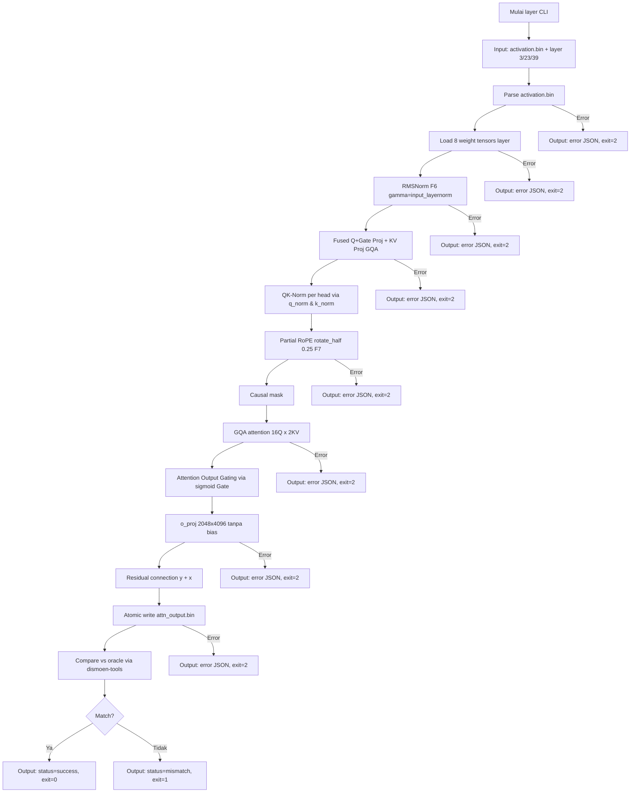

# M2 — Satu Layer: Attention (RoPE, GQA, QK-Norm, Output-Gate)

> Proyek: `disk-streaming-moe-engine`. Fase: **Production / Qwen3.6-35B-A3B SSOT**. Index: `../README.md`.

| Field       | Nilai                                                                                      |
| ----------- | ------------------------------------------------------------------------------------------ |
| Deliverable | Satu layer attention Qwen3.6-35B-A3B yang MATCH oracle                                      |
| Komponen    | C2 kernels (rmsnorm, qk-norm, partial rope, gqa attn, output gate, o_proj), C7 oracle/compare |
| Prasyarat   | M0, M1 hijau                                                                               |
| Next        | `M3-moe.md`                                                                                |
| Gate        | G-M2-1                                                                                     |
| Rumus       | F6, F7, F10                                                                                |

## Tujuan

Membuktikan kernel attention Qwen3.6-35B-A3B benar: 16 Query heads × 256, 2 KV heads (GQA), `head_dim = 256`, QK-Norm (per-head RMSNorm pada Q dan K), RoPE `rotate_half` parsial 0.25 (64 dimensi rotasi, $\theta = 10{,}000{,}000$, 192 dimensi pass-through), causal mask, attention output gating ($\text{sigmoid}(Gate)$ dari separuh kedua `q_proj` [8192, 2048]), `o_proj` [2048, 4096] tanpa bias, dan residual connection.

## Scope

- Input: activation dari embedding (atau fixture synthetic) untuk layer 3, 23, 39; L=16 token.
- Pada model hybrid Qwen3.6 40 layer (0..39), 10 layer adalah full attention dengan interval 4 (`layer_idx % 4 == 3`): layer **3, 7, 11, 15, 19, 23, 27, 31, 35, 39**.
- Per layer: rmsnorm → fused Q+Gate proj [8192, 2048] & KV proj [512, 2048] → QK-Norm per head [256] → Partial RoPE rotate_half (F7, factor 0.25) → GQA causal attention → output gating ($\text{sigmoid}(Gate)$) → o_proj [2048, 4096] → residual.
- Invariant bias: Language Model Qwen3.6 memiliki **0 tensor bias** (`attention_bias: false` di `config.json` dan 0 bias di index).
- Oracle: `oracle_layer.py` part `attn` (PyTorch fp32).

## Implementasi layer CLI

**Input:**

- `activation.bin` (activation input, binary fp32, shape: [L, hidden_dim] = [16, 2048])
- Layer number: `--layer 3|23|39` (command line arg; layer full attention Qwen3.6)
- N path shard safetensors, N ≥ 1 (command line args), **atau**
- `--model-dir <dir>`: CLI discover `model.safetensors.index.json` dan me-resolve shard yang memuat tensor layer
- `--output <path>` (opsional, default `attn_output.bin` — resolve terhadap workdir)
- `--workdir <dir>` (opsional, default = cwd proses)

**Output:**

- stdout: JSON report dengan struktur:
  ```json
  {
    "status": "success" | "mismatch" | "error",
    "layer": 3,
    "num_tokens": 16,
    "output_file": "attn_output.bin",
    "parse_time_ms": 23.45,
    "compute_time_ms": 67.89
  }
  ```
- File: `attn_output.bin` (binary fp32, shape: [L, hidden_dim] = [16, 2048])
- stderr: error message (bila ada)

**Exit code:**

- 0: success (layer attention computed)
- 1: oracle mismatch (G-M2-1 fail)
- 2: error (file tidak ditemukan, format invalid, dll)

**Contoh penggunaan:**

```bash
# mode disarankan: resolusi otomatis dari model dir
dismoen layer --layer 3 activation.bin --model-dir ./models/qwen3.6-35b-a3b

# mode positional: shard eksplisit
dismoen layer --layer 3 activation.bin model-00003-of-00026.safetensors
```

**Contoh output (success):**

```json
{
  "status": "success",
  "layer": 3,
  "num_tokens": 16,
  "output_file": "attn_output.bin",
  "parse_time_ms": 23.45,
  "compute_time_ms": 67.89
}
```

**Contoh output (mismatch):**

```json
{
  "status": "mismatch",
  "layer": 3,
  "num_tokens": 16,
  "output_file": "attn_output.bin",
  "parse_time_ms": 23.45,
  "compute_time_ms": 67.89,
  "verdict": {
    "delta_max": 0.001234,
    "epsilon_rel": 0.000156,
    "fail_reason": "epsilon_rel exceeds threshold 1e-4"
  }
}
```

**Contoh output (error):**

```json
{
  "error_type": "ROPE_ERROR",
  "detail": "RoPE invariant violation: ||q'|| != ||q||",
  "stage": "rope",
  "layer": 3
}
```

## Oracle Layer Specification (Part Attn)

**Script:** `tools/oracle/oracle_layer.py`

**Input:**

- `activation.bin` (activation input, sama dengan input CLI: [16, 2048])
- Layer number: `--part attn --layer 3|23|39` (atau layer full attention lainnya: `layer % 4 == 3`)
- Model weights (PyTorch fp32, dari shard asli Qwen3.6 atau fixture)

**Process:**

1. Load activation input [16, 2048]
2. RMSNorm (F6): $y = x / \mathrm{RMS}(x) \odot \gamma$ dengan $\gamma$ = `input_layernorm.weight` [2048] ($\varepsilon = 10^{-6}$)
3. Fused Q+Gate projection: $[Q_{raw}, Gate] = W_q \cdot y$ dengan $W_q$ = `self_attn.q_proj.weight` [8192, 2048] (separuh pertama [4096] untuk Query, separuh kedua [4096] untuk Gate)
4. KV projection (GQA): $K_{raw} = W_k \cdot y$, $V = W_v \cdot y$ dengan $W_k, W_v$ = `self_attn.k_proj.weight`, `self_attn.v_proj.weight` [512, 2048] (2 KV heads × 256)
5. QK-Norm (per-head RMSNorm): $Q = \mathrm{RMSNorm}(Q_{raw}, \gamma_q)$ dan $K = \mathrm{RMSNorm}(K_{raw}, \gamma_k)$ dengan $\gamma_q, \gamma_k$ = `self_attn.q_norm.weight`, `self_attn.k_norm.weight` [256]
6. Partial RoPE rotate_half (F7, factor 0.25): 64 dimensi pertama tiap head diputar dengan base $\theta = 10{,}000{,}000$; sisa 192 dimensi tidak dirotasi
7. GQA Causal Mask Attention: 16 Query heads attend ke 2 KV heads (group size 8), scale $1/\sqrt{256} = 0{,}0625$, softmax stabil: $\mathrm{softmax}(QK^T / 16 + M) \cdot V$
8. Attention Output Gating: $Attn_{gated} = Attn \odot \mathrm{sigmoid}(Gate)$
9. Output projection (tanpa bias): $y = W_o \cdot Attn_{gated}$ dengan $W_o$ = `self_attn.o_proj.weight` [2048, 4096]
10. Residual connection: $y_{final} = y + x$
11. Output: `attn_ref.bin` (binary fp32, shape: [16, 2048])

**Output:**

- `attn_ref.bin` (binary fp32, shape: [16, 2048])
- SHA-256 hash untuk identity regresi (level R)

**Verifikasi:**

- SHA-256 attn_ref.bin ter-commit ke repo
- Oracle dan engine harus pakai config yang sama (ε = 1e-6, base RoPE = 1e7, partial factor = 0.25, dtype fp32)
- Softmax stabil wajib: $\mathrm{softmax}(z) = \dfrac{\exp(z - \max z)}{\sum \exp(z - \max z)}$

## Fixture M2-Specific

**Layer coverage (Full Attention probe set):**

- Layer 3 (early full attention layer)
- Layer 23 (middle full attention layer)
- Layer 39 (late full attention layer)

**Activation input:**

- Synthetic activation: [16, 2048] fp32 dengan seed 42
- Atau ambil dari embedding output M1 (untuk end-to-end testing)
- Format: binary fp32, row-major

**Expected output:**

- `attn_ref.bin` dari oracle untuk tiap layer uji (precomputed, commit ke repo)
- SHA-256 hash untuk regression testing (level R)

**Tujuan:**

- Testing RMSNorm implementation (F6)
- Testing Q+Gate projection & KV projection (GQA 16/2 head)
- Testing QK-Norm (per-head RMSNorm pada Q dan K)
- Testing Partial RoPE rotate_half (factor 0.25, 64 dims rotasi)
- Testing GQA attention dengan causal mask
- Testing Output Gating dengan sigmoid(Gate)
- Testing o_proj (tanpa bias) dan residual connection
- Testing end-to-end layer attention (activation → activation)

**Generasi:**

- Script: `tools/fixtures/generate_m2_activation.py`
- Input: seed 42, layer numbers [3, 23, 39]
- Output: activation.bin + attn_ref_{lyr}.bin untuk tiap layer
- Verifikasi: SHA-256 ter-commit ke repo

## Causal Mask Specification

**Purpose:** Autoregressive decoding (token tidak bisa melihat masa depan)

**Implementation:**

- Triangular mask: $M_{ij} = 0$ jika $i \ge j$, $-\infty$ jika $i < j$
- $i$ = query position, $j$ = key position
- Diaplikasikan sebelum softmax: $attention\_scores = QK^T / \sqrt{d} + M$
- Hasil: softmax hanya mengattend ke posisi ≤ current position

**Example (L=4):**

```
Mask:
[[0, -inf, -inf, -inf],
 [0, 0, -inf, -inf],
 [0, 0, 0, -inf],
 [0, 0, 0, 0]]
```

**Verification:**

- Property test: output token $t$ hanya bergantung pada input token $\le t$
- Cross-attention check: token pada posisi $i$ tidak mempengaruhi token pada posisi $j < i$
- Test dengan gradient: gradient backprop hanya ke posisi yang di-attend

**Oracle vs engine:**

- Oracle PyTorch: `torch.nn.functional.scaled_dot_product_attention` atau manual triangular mask
- Engine Mojo: implementasi manual triangular mask
- Wajib identik behavior untuk semua layer uji (3, 23, 39)

## Error Handling M2

**Format error:** JSON dengan struktur terstandar (sama dengan M0/M1):

```json
{
  "error_type": "LAYER_INVALID" | "ACT_LOAD_FAILED" | "WEIGHT_LOAD_FAILED" | "ROPE_ERROR" | "ATTENTION_ERROR" | "MASK_ERROR" | "OUTPUT_WRITE_FAILED" | "FILE_NOT_FOUND",
  "detail": "deskripsi spesifik error",
  "stage": "rmsnorm" | "qkv" | "qknorm" | "rope" | "attention" | "gate" | "oproj" | "residual" | "output",
  "layer": 3
}
```

**Error types:**

- `LAYER_INVALID`: layer number tidak valid (bukan layer full attention, mis. di luar `layer % 4 == 3`)
- `ACT_LOAD_FAILED`: gagal load activation.bin
- `WEIGHT_LOAD_FAILED`: gagal load bobot layer (input_layernorm, q_proj, k_proj, v_proj, q_norm, k_norm, o_proj)
- `ROPE_ERROR`: RoPE computation error (NaN, Inf, invariant violation pada dimensi rotasi)
- `ATTENTION_ERROR`: Attention computation error (softmax overflow, NaN)
- `MASK_ERROR`: causal mask implementation error
- `OUTPUT_WRITE_FAILED`: gagal write attn_output.bin
- `FILE_NOT_FOUND`: activation.bin atau shard tidak ditemukan

**Specific M2 invariants:**

- **RoPE invariant**: $\lVert q'_{0..63} \rVert = \lVert q_{0..63} \rVert$ pada 64 dimensi rotasi; sisa 192 dimensi identik byte-persis.
- **Zero bias**: Language Model Qwen3.6 memiliki `attention_bias: false` (0 tensor bias di self_attn). Keberadaan pengecekan bias 72 lama harus ditolak untuk model Qwen3.6.
- **Softmax stabil**: max-shift sebelum eksponensial untuk mencegah overflow.

**Atomic write failure:**

- Bila write attn_output.bin gagal → rollback (hapus partial file)
- Return error JSON, exit code 2
- Tidak biarkan file setengah jadi → false-MATCH di compare

**Semua error harus mengembalikan exit code ≠ 0 dan message terstruktur, bukan panic.**

## Workflow M2



**Alur utama:**

1. CLI menerima activation.bin + layer number sebagai input
2. Parse activation.bin → validasi shape [16, 2048]
3. Load 8 weight tensors untuk layer spesifik dari shard safetensors
4. RMSNorm (F6): $y = x / \mathrm{RMS}(x) \odot \gamma$
5. Fused Q+Gate projection & KV projection (GQA): $W_q$ [8192, 2048] $\to$ $Q$ [4096], $Gate$ [4096]; $W_k, W_v$ [512, 2048] $\to$ $K, V$ [512]
6. QK-Norm: normalisasi RMS per head pada Q dan K menggunakan `q_norm` dan `k_norm` [256]
7. Partial RoPE (factor 0.25): rotasi 64 dimensi pertama tiap head dengan base $\theta = 10^7$
8. GQA Causal Attention: 16 Query heads $\times$ 2 KV heads, scale $1/\sqrt{256} = 0{,}0625$, softmax stabil
9. Output Gating: kalikan output attention dengan $\mathrm{sigmoid}(Gate)$
10. o_proj: $y = W_o \cdot Attn_{gated}$ [2048, 4096] (tanpa bias)
11. Residual connection: $y_{final} = y + x$
12. Atomic write attn_output.bin (tmp + rename)
13. Compare vs oracle (attn_ref.bin) menggunakan Rust compare
14. Output JSON report dengan status dan exit code yang sesuai

## Performance Baseline M2

**Target:**

- Single layer attention (16 token) < 100 ms total (parse + compute)
- Komponen: parse time < 30 ms, compute time < 70 ms

**Metric:**

- Wall clock time (parse_time_ms + compute_time_ms)
- VmHWM (peak memory usage)
- Bytes I/O (weight loading per layer, dari `/proc/<pid>/io`)

**Method:**

- Run `layer` pada checkpoint asli atau fixture M2 (layer 3, 23, 39; L=16)
- N=5 run per layer, ambil median
- Environment: CPU governor `performance`, aplikasi lain ditutup

**Baseline:**

- Mesin target: 8–16 GB RAM, NVMe SSD
- Hasil terukur dicatat di laporan benchmark

## Integration Test Specification

**Test framework:**

- Rust integration test di `tests/integration_m2.rs`
- Python oracle test di `tests/oracle_m2.py`
- Integration script di `tests/integration/test_m2_real_qwen36.sh`

**Test cases:**

1. **Happy path:**
   - Input: activation.bin valid + layer 3/23/39
   - Expected: status=success, attn output match oracle (Gate G-M2-1 PASS)
   - Verification: verdict MATCH ($\Delta_{max} \le 10^{-3}$, $\varepsilon_{rel} \le 10^{-4}$, agreement = 100%)

2. **Layer validation:**
   - Input: layer number invalid (misal layer bukan full attention atau $\ge 40$)
   - Expected: error LAYER_INVALID, exit=2
   - Verification: error JSON terstruktur

3. **Activation load failure:**
   - Input: activation.bin korup atau tidak ditemukan
   - Expected: error ACT_LOAD_FAILED / FILE_NOT_FOUND, exit=2
   - Verification: error JSON terstruktur, no crash

4. **RoPE invariant violation:**
   - Input: implementasi RoPE salah (bukan rotate_half atau dimensi parsial salah)
   - Expected: error ROPE_ERROR, exit=2
   - Verification: invariant check isometri pada 64 dimensi rotasi

5. **Softmax overflow:**
   - Input: activation dengan nilai besar
   - Expected: error ATTENTION_ERROR atau handle stabil
   - Verification: softmax stabil (max shift) diimplementasi

6. **Bias invariant:**
   - Verifikasi checkpoint asli memiliki 0 bias attention
   - Validasi ketiadaan bias diterima tanpa error

7. **Causal mask verification:**
   - Input: test causal behavior
   - Expected: output token $t$ hanya bergantung pada input $\le t$
   - Verification: property test causal mask

8. **Oracle mismatch:**
   - Input: implementasi attention salah (bukan GQA / gating salah)
   - Expected: status=mismatch, exit=1
   - Verification: verdict JSON dengan delta_max/epsilon_rel

## Activation File Format

**Format:** Binary fp32 (little-endian)

**Layout:**

- Shape: [L, hidden_dim] = [16, 2048]
- Total bytes: 16 × 2048 × 4 = 131.072 bytes (~128 KiB)
- Row-major: token dimensi pertama, hidden dimensi kedua

**Access pattern:**

```python
# Python (oracle)
import numpy as np
activation = np.fromfile('activation.bin', dtype=np.float32)
activation = activation.reshape(16, 2048)  # [num_tokens, hidden_dim]
```

```rust
// Rust (engine)
let activation: Vec<f32> = read_bin_file("activation.bin")?;
let activation = Array2::from_shape_vec((16, 2048), activation)?;
```

## Part Output File Format

**Format:** Binary fp32 (little-endian)

**Layout:**

- Shape: [L, hidden_dim] = [16, 2048] (sama dengan input)
- Total bytes: 16 × 2048 × 4 = 131.072 bytes (~128 KiB)
- Row-major: token dimensi pertama, hidden dimensi kedua

## Gate

| Gate   | Kriteria               | Threshold                                                       | Metode               |
| ------ | ---------------------- | --------------------------------------------------------------- | -------------------- |
| G-M2-1 | MATCH strict part attn | $\Delta_{max} \le 10^{-3} \wedge \varepsilon_{rel} \le 10^{-4}$ | layer 3, 23, 39; L=16 |

## Testing

- O: per-part attn, tiap build.
- P: RoPE isometri pada 64 dimensi rotasi, softmax stabil (max shift).
- Kategori FAIL: `rope-style` (rotate_half vs interleaved), `output-gate` (gate sigmoid vs linear/silu), `dtype-layout` (stride/transpos).

## Security

- SEC-4: alloc workspace dari batas turunan config, bukan angka file.
- SEC-6: golden bins part attn stabil.

## DoD

- [x] G-M2-1 hijau di layer uji (layer 3, 23)
- [x] Invariant isometri F7 lolos pada dimensi rotasi
- [x] Laporan run-id ter-commit
- [x] layer CLI implementasi lengkap (input/output/exit code sesuai spec)
- [x] Oracle layer.py implementasi part attn (QK-Norm, Partial RoPE, GQA, Output Gating) dan ter-commit
- [x] RMSNorm kernel implementasi (F6)
- [x] Q+Gate & KV projection implementasi tanpa bias
- [x] QK-Norm (per-head RMSNorm) implementasi
- [x] RoPE rotate_half parsial (factor 0.25) implementasi (F7)
- [x] Causal mask implementasi
- [x] GQA attention implementasi
- [x] Attention output gating ($\text{sigmoid}(Gate)$) implementasi
- [x] o_proj tanpa bias implementasi
- [x] Residual connection implementasi
- [x] Error handling M2 implementasi (format JSON, error types)
- [x] Fixture M2 activation.bin + attn_ref.bin ter-commit
- [x] Unit tests coverage ≥ 85% untuk attention components
- [x] Performance baseline M2 terukur dan terdokumentasi (< 100 ms)
- [x] Activation & part output file format implementasi (binary fp32, shape validation)
- [x] Cgroup memory.max=6G integration testing (SEC-4)
