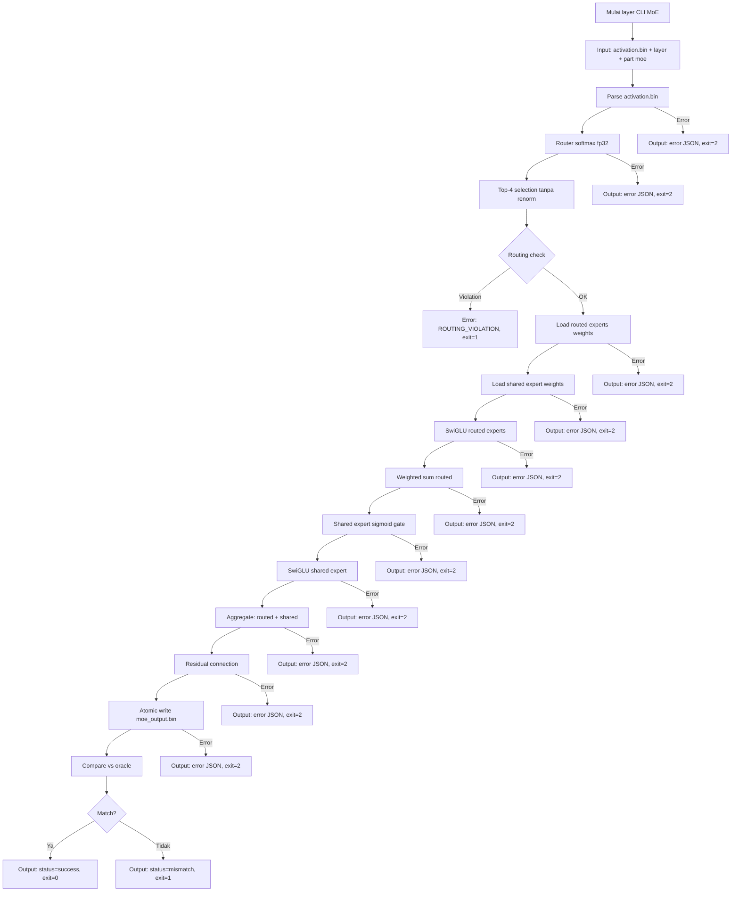

# M3 — Satu Layer: MoE (Router Top-4, Shared Sigmoid Gate)

> Proyek: `disk-streaming-moe-engine`. Fase: **Trial**. Index: `../README.md`.
> **Milestone paling kritis.**

| Field       | Nilai                                                 |
| ----------- | ----------------------------------------------------- |
| Deliverable | Satu layer MoE yang MATCH oracle + invariant routing  |
| Komponen    | C2 (router, routed experts SwiGLU, shared expert), C7 |
| Prasyarat   | M0–M2 hijau                                           |
| Next        | `M4-full-forward.md`                                  |
| Gate        | G-M3-1, G-M3-2                                        |
| Rumus       | F8, F9, F10                                           |

## Tujuan

Membuktikan router + experts trial benar bit-perilaku: 60 routed (inter 1408, top-4 **tanpa renormalisasi**), shared besar (inter 5632, **sigmoid gate**), SwiGLU.

## Scope & Rumus (F8)

$$p = \mathrm{softmax}(W_r x) \in \mathbb{R}^{60}\ \text{(fp32)} \tag{F8a}$$
$$\mathcal{A} = \mathrm{Top\text{-}4}(p)\ \text{TANPA renormalisasi} \tag{F8b}$$
$$y = \sum_{i\in\mathcal{A}} p_i E_i(x) + \sigma(g_{sh}) E_{sh}(x) \tag{F8c}$$
$$E(x) = W_{down}(\mathrm{SiLU}(W_{gate}x)\odot W_{up}x) \tag{F8d}$$

Dua invariant keras:

1. **SET expert terpilih** ($\mathcal{A}$) identik oracle 100% — flip seleksi = FAIL `router-selection`, tidak boleh diselesaikan dengan menaikkan threshold.
2. Gate shared = **sigmoid**, bukan softmax/linear (jebakan §2.3).

Diagnostik F9 (analisis): $f_i, P_i, \mathcal{L}_{lb}=N_e\sum f_iP_i$, $CV=\sigma_f/\mu_f$ — untuk deteksi bias routing dan koreksi asumsi $\rho$ seragam di F5 (expert panas → pin page cache/LRU di M7).

## Implementasi layer CLI (Part MoE)

**Input:**

- `activation.bin` (activation input, binary fp32, shape: [L, hidden_dim] = [16, 2048])
- Layer number: `--layer 0|12|23` (command line arg)
- Part: `--part moe` (command line arg)
- N path shard safetensors, N ≥ 1 (command line args)
- `model.safetensors.index.json` (auto-discovered di directory yang sama)

**Output:**

- stdout: JSON report dengan struktur:
  ```json
  {
    "status": "success" | "mismatch" | "error",
    "layer": 0,
    "part": "moe",
    "num_tokens": 16,
    "output_file": "moe_output.bin",
    "routing_info": {
      "selected_experts": [[5, 12, 23, 45], [3, 8, 15, 29], ...],
      "router_probs": [[0.23, 0.15, 0.31, 0.08], ...]
    },
    "parse_time_ms": 34.56,
    "compute_time_ms": 123.45
  }
  ```
- File: `moe_output.bin` (binary fp32, shape: [L, hidden_dim] = [16, 2048])
- stderr: error message (bila ada)

**Exit code:**

- 0: success (layer MoE computed)
- 1: oracle mismatch (G-M3-1 fail) atau routing invariant violation (G-M3-2 fail)
- 2: error (file tidak ditemukan, format invalid, dll)

**Contoh penggunaan:**

```bash
# contoh fixture synthetic; checkpoint asli 8 shard
dismoen layer --layer 0 --part moe activation.bin shard-00001-of-00003.safetensors shard-00002-of-00003.safetensors shard-00003-of-00003.safetensors
```

**Contoh output (success):**

```json
{
  "status": "success",
  "layer": 0,
  "part": "moe",
  "num_tokens": 16,
  "output_file": "moe_output.bin",
  "routing_info": {
    "selected_experts": [
      [5, 12, 23, 45],
      [3, 8, 15, 29],
      [11, 18, 27, 33],
      [7, 14, 22, 38]
    ],
    "router_probs": [
      [0.23, 0.15, 0.31, 0.08],
      [0.19, 0.25, 0.21, 0.12],
      [0.28, 0.18, 0.24, 0.11],
      [0.22, 0.2, 0.26, 0.09]
    ]
  },
  "parse_time_ms": 34.56,
  "compute_time_ms": 123.45
}
```

**Contoh output (mismatch):**

```json
{
  "status": "mismatch",
  "layer": 0,
  "part": "moe",
  "num_tokens": 16,
  "output_file": "moe_output.bin",
  "parse_time_ms": 34.56,
  "compute_time_ms": 123.45,
  "verdict": {
    "delta_max": 0.001234,
    "epsilon_rel": 0.000145,
    "fail_reason": "epsilon_rel exceeds threshold 1e-4"
  }
}
```

**Contoh output (routing violation):**

```json
{
  "status": "mismatch",
  "layer": 0,
  "part": "moe",
  "num_tokens": 16,
  "output_file": "moe_output.bin",
  "parse_time_ms": 34.56,
  "compute_time_ms": 123.45,
  "routing_violation": {
    "token_index": 7,
    "oracle_experts": [5, 12, 23, 45],
    "engine_experts": [5, 12, 24, 45],
    "oracle_probs": [0.23, 0.15, 0.31, 0.08],
    "engine_probs": [0.23, 0.15, 0.3, 0.09]
  }
}
```

**Contoh output (error):**

```json
{
  "error_type": "ROUTING_VIOLATION",
  "detail": "SET expert terpilih beda dengan oracle pada token 7",
  "stage": "router",
  "layer": 0,
  "token_index": 7
}
```

## Oracle Layer Specification (Part MoE)

**Script:** `tools/oracle/oracle_layer.py`

**Input:**

- `activation.bin` (activation input, sama dengan input CLI)
- Layer number: `--part moe --layer 0|12|23`
- Model weights (PyTorch fp32, dari shard asli atau fixture)

**Process:**

1. Load activation input [16, 2048]
2. Router softmax fp32: $p = \mathrm{softmax}(W_r x) \in \mathbb{R}^{60}$
3. Top-4 selection TANPA renormalisasi: $\mathcal{A} = \mathrm{Top\text{-}4}(p)$
4. Load routed experts weights (60 experts, inter 1408)
5. Load shared expert weights (inter 5632)
6. Compute routed experts (SwiGLU): $E_i(x) = W_{down}(\mathrm{SiLU}(W_{gate}x)\odot W_{up}x)$
7. Weighted sum routed: $y_{routed} = \sum_{i\in\mathcal{A}} p_i E_i(x)$
8. Shared expert sigmoid gate: $g_{sh} = W_{gate\_sh} x$, $\sigma(g_{sh})$
9. Shared expert computation: $y_{shared} = \sigma(g_{sh}) E_{sh}(x)$
10. Residual: $y = y_{routed} + y_{shared} + x$
11. Output: `moe_ref.bin` (binary fp32, shape: [16, 2048])

**Output:**

- `moe_ref.bin` (binary fp32, shape: [16, 2048])
- SHA-256 hash untuk verification (level R)
- Routing info: selected experts dan router probabilities (untuk F9 diagnostics)

**Verifikasi:**

- SHA-256 moe_ref.bin ter-commit ke repo
- Oracle dan engine harus pakai config yang sama (norm_topk_prob=false, dtype fp32)
- Softmax fp32 wajib: tidak ada renormalisasi setelah top-4
- Sigmoid gate wajib: bukan softmax/linear untuk shared expert

## Fixture M3-Specific

**Layer coverage:**

- Layer 0 (early layer)
- Layer 12 (middle layer)
- Layer 23 (late layer)

**Activation input:**

- Synthetic activation: [16, 2048] fp32 dengan seed 42
- Atau ambil dari attention output M2 (untuk end-to-end testing)
- Format: binary fp32, row-major

**Expected output:**

- `moe_ref.bin` dari oracle untuk tiap layer (precomputed, commit ke repo)
- SHA-256 hash untuk regression testing (level R)
- Routing info: selected experts dan router probabilities (untuk F9 baseline)

**Tujuan:**

- Testing router softmax fp32 implementation
- Testing top-4 selection tanpa renormalisasi
- Testing routed experts SwiGLU implementation
- Testing shared expert sigmoid gate
- Testing weighted sum dan residual
- Testing end-to-end MoE layer (activation → activation)
- Testing routing invariant (SET expert terpilih identik 100%)

**Generasi:**

- Script: `tools/fixtures/generate_m3_activation.py`
- Input: seed 42, layer numbers [0, 12, 23]
- Output: activation.bin + moe_ref.bin + routing_info.json untuk tiap layer
- Verifikasi: SHA-256 ter-commit ke repo

## SwiGLU Specification

**Purpose:** Activation function untuk experts (FFN layer yang dioptimasi)

**Formula:**

$$\mathrm{SwiGLU}(x) = W_{down}(\mathrm{SiLU}(W_{gate}x) \odot W_{up}x)$$

$$\mathrm{SiLU}(z) = z \cdot \sigma(z) = z \cdot \frac{1}{1 + e^{-z}}$$

**Implementation per expert:**

1. Gate projection: $g = W_{gate} x$ (inter 1408 → 1408)
2. Up projection: $u = W_{up} x$ (inter 1408 → 1408)
3. SiLU activation: $g' = \mathrm{SiLU}(g) = g \cdot \sigma(g)$
4. Element-wise multiplication: $h = g' \odot u$
5. Down projection: $y = W_{down} h$ (1408 → 2048)

**Dimensions (per routed expert):**

- Input: [16, 2048]
- Gate: $W_{gate}$ [1408, 2048], $b_{gate}$ [1408]
- Up: $W_{up}$ [1408, 2048], $b_{up}$ [1408]
- Down: $W_{down}$ [2048, 1408], $b_{down}$ [2048]
- Output: [16, 2048]

**Dimensions (shared expert):**

- Input: [16, 2048]
- Gate: $W_{gate\_sh}$ [5632, 2048], $b_{gate\_sh}$ [5632]
- Up: $W_{up\_sh}$ [5632, 2048], $b_{up\_sh}$ [5632]
- Down: $W_{down\_sh}$ [2048, 5632], $b_{down\_sh}$ [2048]
- Output: [16, 2048]

**Verification:**

- SiLU function: $\mathrm{SiLU}(z) = z \cdot \sigma(z)$
- Element-wise multiplication: $g' \odot u$ (bukan concatenation)
- Matrix multiplication order: gate → SiLU → up → down
- Bias handling: bias ditambahkan setelah projection, sebelum activation

**Oracle vs engine:**

- Oracle PyTorch: `nn.SiLU()` atau manual implementation
- Engine Mojo: manual SiLU implementation
- Wajib identik behavior untuk semua experts (60 routed + 1 shared)

## Error Handling M3

**Format error:** JSON dengan struktur terstandar (sama dengan M0/M1/M2):

```json
{
  "error_type": "LAYER_INVALID" | "PART_INVALID" | "ACT_LOAD_FAILED" | "WEIGHT_LOAD_FAILED" | "ROUTER_ERROR" | "EXPERT_ERROR" | "SWIGLU_ERROR" | "GATE_ERROR" | "ROUTING_VIOLATION" | "OUTPUT_WRITE_FAILED" | "FILE_NOT_FOUND",
  "detail": "deskripsi spesifik error",
  "stage": "router" | "experts" | "shared" | "swiglu" | "aggregation" | "output",
  "layer": 0,
  "expert_id": 5  // optional
}
```

**Error types:**

- `LAYER_INVALID`: layer number tidak valid (bukan 0, 12, atau 23)
- `PART_INVALID`: part bukan `moe`
- `ACT_LOAD_FAILED`: gagal load activation.bin
- `WEIGHT_LOAD_FAILED`: gagal load router/expert weights
- `ROUTER_ERROR`: router computation error (softmax overflow, NaN)
- `EXPERT_ERROR`: expert computation error (SwiGLU, NaN, Inf)
- `SWIGLU_ERROR`: SiLU function error
- `GATE_ERROR`: shared expert gate error (sigmoid bukan softmax)
- `ROUTING_VIOLATION`: SET expert terpilih beda dengan oracle (G-M3-2 fail)
- `OUTPUT_WRITE_FAILED`: gagal write moe_output.bin
- `FILE_NOT_FOUND`: activation.bin atau shard tidak ditemukan

**Specific M3 errors:**

- **Routing violation**: SET expert terpilih $\mathcal{A}_{engine} \neq \mathcal{A}_{oracle}$ → error `ROUTING_VIOLATION`, exit=1
- **Sigmoid gate violation**: shared gate bukan sigmoid → error `GATE_ERROR`, exit=1
- **Renormalization leak**: top-4 renormalized → error `ROUTER_ERROR`, exit=2
- **Softmax overflow**: router logits terlalu besar → error `ROUTER_ERROR`, exit=2

**Atomic write failure:**

- Bila write moe_output.bin gagal → rollback (hapus partial file)
- Return error JSON, exit code 2
- Tidak biarkan file setengah jadi → false-MATCH di compare

**Semua error harus mengembalikan exit code ≠ 0 dan message terstruktur, bukan panic.**

## Workflow M3



**Alur utama:**

1. CLI menerima activation.bin + layer number + part moe sebagai input
2. Parse activation.bin → validasi shape [16, 2048]
3. Router softmax fp32: $p = \mathrm{softmax}(W_r x) \in \mathbb{R}^{60}$
4. Top-4 selection TANPA renormalisasi: $\mathcal{A} = \mathrm{Top\text{-}4}(p)$
5. Routing check: validasi SET expert terpilih vs oracle (G-M3-2)
6. Load routed experts weights (60 experts, inter 1408)
7. Load shared expert weights (inter 5632)
8. Compute routed experts (SwiGLU): $E_i(x) = W_{down}(\mathrm{SiLU}(W_{gate}x)\odot W_{up}x)$
9. Weighted sum routed: $y_{routed} = \sum_{i\in\mathcal{A}} p_i E_i(x)$
10. Shared expert sigmoid gate: $g_{sh} = W_{gate\_sh} x$, $\sigma(g_{sh})$
11. Shared expert computation: $y_{shared} = \sigma(g_{sh}) E_{sh}(x)$
12. Aggregate: $y = y_{routed} + y_{shared}$
13. Residual: $y = y + x$ (add input kembali)
14. Atomic write moe_output.bin (tmp + rename)
15. Compare vs oracle (moe_ref.bin) menggunakan Rust compare
16. Output JSON report dengan status dan exit code yang sesuai

**Error path:**

- Error parse activation → return error JSON, exit=2
- Error router (softmax overflow) → return error JSON, exit=2
- Routing violation → return error JSON, exit=1 (G-M3-2 fail)
- Error load weights → return error JSON, exit=2
- Error computation (SwiGLU, aggregation, residual) → return error JSON, exit=2
- Error write output → rollback + return error JSON, exit=2
- Mismatch oracle → return mismatch JSON, exit=1
- Success → return success JSON, exit=0

## Performance Baseline M3

**Target:**

- Single layer MoE (16 token) < 200 ms total (parse + compute)
- Komponen: parse time < 50 ms, compute time < 150 ms

**Metric:**

- Wall clock time (parse_time_ms + compute_time_ms)
- VmHWM (peak memory usage)
- Bytes I/O (weight loading per layer, dari `/proc/<pid>/io`)
- Expert selection statistics (routing balance)

**Method:**

- Run `layer --part moe` pada fixture M3 (layer 0, 12, 23; L=16)
- Cold read: `sync && echo 3 | sudo tee /proc/sys/vm/drop_caches` sebelum run
- N=5 run per layer, ambil median
- Environment: CPU governor `performance`, aplikasi lain ditutup

**Baseline:**

- Mesin target: 8 GB RAM, NVMe SSD
- Hasil terukur dicatat di laporan benchmark
- Layer breakdown: bandingkan layer 0 vs 12 vs 23
- Expert utilization: distribusi expert selection (F9 diagnostics)

**Expectations:**

- Parse time: dominasi oleh I/O load 60 routed experts + 1 shared expert
- Compute time: router + 4 experts (SwiGLU) + shared expert (SwiGLU) + aggregation
- Total: seharusnya < 200 ms di mesin target untuk single layer MoE
- Expert selection: distribusi reasonably balanced (CV < 0.5 untuk corpus golden)

## Integration Test Specification

**Test framework:**

- Rust integration test di `tests/integration_m3.rs`
- Python oracle test di `tests/oracle_m3.py`
- Fixture: M3 synthetic (activation.bin + moe_ref.bin + routing_info.json untuk 3 layer)

**Test cases:**

1. **Happy path:**
   - Input: activation.bin valid + layer 0/12/23 + part moe
   - Expected: status=success, moe output match oracle
   - Verification: SHA-256 moe_output.bin == moe_ref.bin

2. **Routing invariant test:**
   - Input: 256 input acak (G-M3-2 requirement)
   - Expected: SET expert terpilih identik 100% dengan oracle
   - Verification: routing_info match oracle untuk semua input

3. **Sigmoid gate test:**
   - Input: implementasi shared gate salah (softmax/linear)
   - Expected: error GATE_ERROR atau mismatch
   - Verification: sigmoid function wajib dipakai

4. **Top-4 no renorm test:**
   - Input: implementasi top-4 dengan renormalisasi
   - Expected: error ROUTER_ERROR atau mismatch
   - Verification: norm_topk_prob=false dihormati

5. **SwiGLU verification:**
   - Input: implementasi SwiGLU salah (bukan element-wise)
   - Expected: error SWIGLU_ERROR atau mismatch
   - Verification: SiLU function dan element-wise multiplication

6. **Expert load failure:**
   - Input: expert weights korup atau tidak ditemukan
   - Expected: error WEIGHT_LOAD_FAILED, exit=2
   - Verification: error JSON terstruktur, no crash

7. **Router overflow:**
   - Input: activation dengan nilai besar
   - Expected: error ROUTER_ERROR atau handle stabil
   - Verification: softmax stabil (max shift) diimplementasi

8. **Determinisme test:**
   - Input: ulang 5× dengan seed + threads=1
   - Expected: output identik 100% (routing + moe output)
   - Verification: SHA-256 stabil, routing_info identik

**Test execution:**

- Run: `cargo test --test integration_m3`
- Environment: cgroup memory.max=6G (SEC-4)
- Orchestration: `make validate` (termasuk M0 + M1 + M2 + M3 integration)

**Success criteria:**

- Semua test cases pass untuk 3 layer (0, 12, 23)
- 0 crash, 0 hang, 0 panic
- Exit codes sesuai spec
- Error messages terstruktur
- Routing invariant lolos 100% untuk 256 input acak
- Determinisme test lolos (ulang 5× identik)

## F9 Diagnostics Specification

**Purpose:** Analisis load-balance routing untuk deteksi bias dan koreksi asumsi $\rho$ seragam di F5

**Formula:**

$$f_i = \frac{1}{T}\sum_t \mathbb{1}[i \in \mathcal{A}_t], \qquad P_i = \frac{1}{T}\sum_t p_i^{(t)}$$

$$\mathcal{L}_{lb} = N_e \sum_{i=1}^{N_e} f_i P_i, \qquad CV = \frac{\sigma_f}{\mu_f}$$

**Implementation:**

- $f_i$: frekuensi expert $i$ terpilih (fraction of total selections)
- $P_i$: probabilitas rata-rata expert $i$ (average router probability)
- $\mathcal{L}_{lb}$: load-balance loss (lebih rendah = lebih seimbang)
- $CV$: coefficient of variation (lebih rendah = lebih seimbang)

**Data collection:**

- Sample corpus: 256 input acak (G-M3-2 requirement)
- Collect routing_info untuk setiap input
- Aggregate statistik per expert: $f_i$, $P_i$
- Compute $\mathcal{L}_{lb}$ dan $CV$

**Report format:**

```json
{
  "num_experts": 60,
  "num_samples": 256,
  "load_balance_loss": 0.123,
  "coefficient_of_variation": 0.234,
  "expert_stats": [
    {
      "expert_id": 0,
      "frequency": 0.067,
      "avg_probability": 0.065
    },
    ...
  ],
  "hot_experts": [5, 12, 23, 45],
  "cold_experts": [11, 18, 27, 33]
}
```

**Usage untuk M7:**

- Expert panas ($f_i$ tinggi) → pin page cache/LRU
- Expert dingin ($f_i$ rendah) → tidak perlu pin
- Koreksi asumsi $\rho$ seragam di F5: $\rho_{eff} = \sum f_i \cdot \rho_i$

**Baseline:**

- Commit ke repo sebagai baseline M7
- Update bila ada perubahan signifikan dalam distribusi routing

## MoE Output File Format

**Format:** Binary fp32 (little-endian)

**Layout:**

- Shape: [L, hidden_dim] = [16, 2048] (sama dengan input)
- Total bytes: 16 × 2048 × 4 = 131.072 bytes (~128 KiB)
- Row-major: token dimensi pertama, hidden dimensi kedua

**Access pattern:**

```python
# Python (oracle)
import numpy as np
moe_output = np.fromfile('moe_output.bin', dtype=np.float32)
moe_output = moe_output.reshape(16, 2048)  # [num_tokens, hidden_dim]
```

```rust
// Rust (compare)
let moe_output: Vec<f32> = read_bin_file("moe_output.bin")?;
let moe_output = Array2::from_shape_vec((16, 2048), moe_output)?;
```

**Verification:**

- SHA-256 hash untuk regression testing
- Shape validation: total bytes % (4 × hidden_dim) == 0
- NaN/Inf check: semua nilai harus finite
- Residual check: output ≈ input + MoE effect

## Routing Distribution Report Format

**Format:** JSON

**Structure:**

```json
{
  "layer": 0,
  "num_tokens": 16,
  "num_experts": 60,
  "top_k": 4,
  "routing_info": {
    "selected_experts": [
      [5, 12, 23, 45],
      [3, 8, 15, 29],
      [11, 18, 27, 33],
      [7, 14, 22, 38]
    ],
    "router_probs": [
      [0.23, 0.15, 0.31, 0.08],
      [0.19, 0.25, 0.21, 0.12],
      [0.28, 0.18, 0.24, 0.11],
      [0.22, 0.2, 0.26, 0.09]
    ]
  },
  "statistics": {
    "expert_frequencies": [0.067, 0.083, 0.05, 0.1, ...],
    "avg_probabilities": [0.065, 0.08, 0.052, 0.095, ...],
    "load_balance_loss": 0.123,
    "coefficient_of_variation": 0.234
  }
}
```

**Usage:**

- Baseline untuk M7 (LRU cache tuning)
- Diagnostik bias routing
- Analisis hot/cold experts
- Koreksi asumsi $\rho$ seragam di F5

**Verification:**

- Sum frequencies: $\sum f_i = 1.0$ (normalisasi)
- Sum router probs per token: $\sum p_i \le 1.0$ (tanpa renorm)
- Top-4 check: exactly 4 experts per token
- Expert range: expert IDs dalam [0, 59]

## Gate

| Gate   | Kriteria              | Threshold                                                       | Metode          |
| ------ | --------------------- | --------------------------------------------------------------- | --------------- |
| G-M3-1 | MATCH strict part moe | $\Delta_{max} \le 10^{-3} \wedge \varepsilon_{rel} \le 10^{-4}$ | layer 0, 12, 23 |
| G-M3-2 | invariant F8          | SET top-4 identik 100% + sigmoid shared gate, 256 input acak    | oracle + engine |

## Testing

- O: per-part moe.
- P: config `norm_topk_prob=false` dihormati.
- Kategori FAIL utama: `router-selection` → wajib root-cause (softmax fp32? renorm bocor? sigmoid salah?).
- Risiko R2: flip seleksi akibat numerik → investigasi, bukan toleransi.

## Security / Quality

- Determinisme: ulang 5× identik (seed + threads=1).
- SEC-6: golden moe stabil.

## DoD

- [x] G-M3-1, G-M3-2 hijau
- [x] Laporan distribusi routing (F9) ter-commit sebagai baseline M7
- [x] Retro jebakan shared-sigmoid diperbarui
- [x] layer CLI implementasi lengkap part moe (input/output/exit code sesuai spec)
- [x] Oracle layer.py implementasi part moe dan ter-commit
- [x] Router softmax fp32 implementasi
- [x] Top-4 selection tanpa renormalisasi implementasi
- [x] Routed experts SwiGLU implementasi (60 experts)
- [x] Shared expert sigmoid gate implementasi
- [x] Weighted sum aggregation implementasi
- [x] Residual connection implementasi
- [x] Error handling M3 implementasi (format JSON, error types)
- [x] Fixture M3 activation.bin + moe_ref.bin ter-commit (3 layer)
- [x] Unit tests coverage ≥ 85% untuk MoE components
- [x] Property tests routing invariant implementasi (SET expert identik 100%)
- [x] Property tests sigmoid gate implementasi
- [x] Property tests norm_topk_prob=false implementasi
- [x] Integration test end-to-end MoE implementasi (8 test cases)
- [x] Performance baseline M3 terukur dan terdokumentasi (< 200 ms)
- [x] MoE output file format implementasi (binary fp32, shape validation)
- [x] Routing info report format implementasi (F9 diagnostics)
- [x] F9 diagnostics implementasi (load-balance analysis)
- [x] Cgroup memory.max=6G integration testing (SEC-4)
- [x] SHA-256 verification implementasi (golden hash)
- [x] Determinisme test ulang 5× identik (seed + threads=1)
- [x] Workflow diagram M3 implementasi
