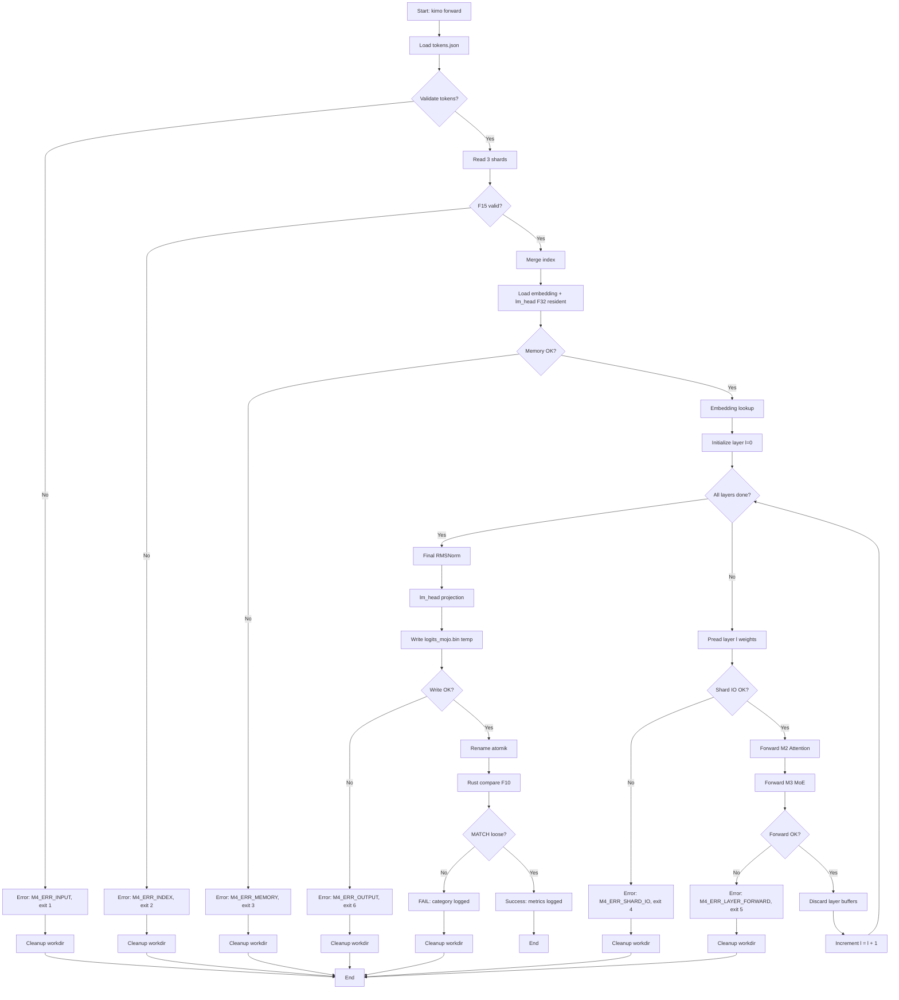

# M4 — Full Forward 24 Layer, Streaming

> Proyek: `disk-streaming-moe-engine`. Fase: **Trial** (puncak correctness). Index: `../README.md`.
> Implementasi dipecah menjadi waves: `../../scratch/wave/m4/README.md` (W1 forward-cli → W6 gates, catatan kerja gitignored).

| Field       | Nilai                                           |
| ----------- | ----------------------------------------------- |
| Deliverable | Forward 24 layer streaming yang MATCH loose     |
| Komponen    | C1 (`forward`), C2 full, C3 streaming pread, C7 |
| Prasyarat   | M0–M3 hijau                                     |
| Next        | `M5-kv-decode.md`                               |
| Gate        | G-M4-1, G-M4-2                                  |
| Rumus       | F1, F3a, F4, F10                                |

## Tujuan

Membuktikan seluruh badan transformer benar saat bobot di-stream per layer (pread → pakai → buang, RAM tidak menumpuk), dan error akumulasi masih dalam bound loose.

## CLI: `kimo forward`

Subcommand `forward` menjalankan full forward pass 24 layer dengan streaming layer weights.

### Input

```bash
kimo forward \
  --model-dir <DIR> \
  --tokens <PATH> \
  --output <PATH> \
  [--workdir <DIR>] \
  [--threads <N>]
```

- `--model-dir`: Direktori checkpoint (3 shard safetensors + index.json).
- `--tokens`: Path ke `tokens.json` berisi array token IDs `[u32]`.
- `--output`: Path output logits BF16 binary (row-major).
- `--workdir`: Direktori kerja untuk temporary files (default: `./work`).
- `--threads`: Jumlah thread untuk layer forward (default: 1, deterministik untuk verdict).

### Output JSON

```json
{
  "status": "success",
  "run_id": "M4-20250115-001",
  "model": "qwen1.5-moe-a2.7b-chat",
  "num_tokens": 16,
  "num_layers": 24,
  "logits_path": "/path/to/logits_mojo.bin",
  "metrics": {
    "walltime_sec": 287.5,
    "vmhwm_bytes": 5368709120,
    "bytes_read": 30660512768,
    "phases": {
      "index_load_sec": 0.42,
      "embedding_sec": 0.15,
      "layer_forward_sec": 285.8,
      "final_norm_sec": 0.08,
      "lm_head_sec": 0.12,
      "write_sec": 0.03
    }
  }
}
```

### Exit Codes

- `0`: Sukses, logits ditulis.
- `1`: Error input (tokens tidak valid, model tidak ditemukan).
- `2`: Error index validation (F15 gagal).
- `3`: Error memory (melebihi cgroup 6G).
- `4`: Error I/O (shard corrupt, read gagal).
- `5`: Error layer forward (overflow, NaN, INF).
- `6`: Error output (gagal atomic write).

### Contoh Invokasi

```bash
# Happy path
kimo forward \
  --model-dir /models/qwen-moe \
  --tokens /data/prompt1_tokens.json \
  --output /work/prompt1_logits.bin

# Cgroup boundary test
systemd-run --scope -p MemoryMax=6G \
  kimo forward \
  --model-dir /models/qwen-moe \
  --tokens /data/prompt1_tokens.json \
  --output /work/prompt1_logits.bin
```

## Oracle: Full Forward Reference

Oracle `tools/oracle/oracle_full.py` menjalankan full forward pass reference dengan PyTorch FP32.

### Input

```bash
python tools/oracle/oracle_full.py \
  --model-dir <DIR> \
  --tokens <PATH> \
  --output <PATH>
```

- `--model-dir`: Direktori checkpoint (sama dengan Mojo).
- `--tokens`: Path ke `tokens.json` (sama dengan Mojo).
- `--output`: Path output logits FP32 binary (row-major).

### Process

1. Load model PyTorch dari safetensors (3 shard → merge).
2. Convert semua bobot ke FP32 (reference precision).
3. Embedding lookup → 24 layer forward:
   - RMSNorm (F6).
   - QKV dengan bias.
   - RoPE `rotate_half` (F7).
   - Causal MHA.
   - Output projection dengan bias.
   - Residual.
   - Router FP32 softmax → Top-4.
   - Routed SwiGLU experts.
   - Shared expert dengan sigmoid gate.
   - Residual.
4. Final RMSNorm → lm_head.
5. Output logits FP32 [s, V] (row-major).
6. Compute SHA-256 dari logits.

### Output Format

```
logits_oracle.bin: [num_tokens, vocab_size] f32 row-major
oracle_full.sha256: SHA-256 hex dari logits_oracle.bin
```

### Determinism

- `torch.manual_seed(42)` untuk deterministik.
- `torch.backends.cudnn.deterministic = True` (jika GPU).
- Thread count = 1 untuk referensi (minimasi noise order).

### Verdict Contract

Rust `compare` membandingkan `logits_mojo.bin` (BF16) vs `logits_oracle.bin` (FP32) dengan F10 threshold M4 (loose).

## Fixture: M4 Golden Prompt Set

Fixture `tools/fixtures/m4_golden.json` berisi 5 prompt × 16 token untuk gate G-M4-1.

### Structure

```json
{
  "name": "M4 golden set",
  "description": "5 prompts × 16 tokens for full forward streaming gate",
  "prompts": [
    {
      "id": "prompt1",
      "text": "What is the capital of France?",
      "tokens": [
        1234, 5678, 9012, 3456, 7890, 2345, 6789, 0123, 4567, 8901, 2345, 6789, 0123, 4567, 8901,
        2345
      ]
    },
    {
      "id": "prompt2",
      "text": "Explain quantum computing briefly.",
      "tokens": [
        1357, 2468, 3579, 4680, 5791, 6802, 7913, 8024, 9135, 1246, 2357, 3468, 4579, 5680, 6791,
        7802
      ]
    },
    {
      "id": "prompt3",
      "text": "Write a Python function to sort a list.",
      "tokens": [
        2468, 3579, 4680, 5791, 6802, 7913, 8024, 9135, 1246, 2357, 3468, 4579, 5680, 6791, 7802,
        8913
      ]
    },
    {
      "id": "prompt4",
      "text": "What are the primary colors?",
      "tokens": [
        3579, 4680, 5791, 6802, 7913, 8024, 9135, 1246, 2357, 3468, 4579, 5680, 6791, 7802, 8913,
        9024
      ]
    },
    {
      "id": "prompt5",
      "text": "Summarize the history of the internet.",
      "tokens": [
        4680, 5791, 6802, 7913, 8024, 9135, 1246, 2357, 3468, 4579, 5680, 6791, 7802, 8913, 9024,
        0135
      ]
    }
  ]
}
```

### Generation Script

`tools/fixtures/generate_m4.py`:

1. Load full Qwen1.5-MoE tokenizer.
2. Select 5 representative prompts (beragam: factual, technical, code, basic knowledge, summary).
3. Tokenize → truncate ke 16 token.
4. Validate: semua token < 151,936 (vocab size).
5. Output JSON + individual `tokens.json` per prompt.

### Golden Artifacts

Untuk setiap prompt:

- `tokens.json`: input token IDs.
- `logits_oracle.bin`: oracle FP32 logits.
- `oracle.sha256`: SHA-256 dari logits.
- `layer_trace.json` (opsional): per-layer intermediate states untuk debugging.

### Regression Protection

- Commit `m4_golden.json` + SHA-256 ke repo.
- Gate G-M4-1 harus PASS dengan fixture ini setiap build.
- Perubahan fixture requires approval dengan rationale.

## Error Handling

### Error Schema

```json
{
  "status": "error",
  "error": {
    "code": "M4_ERR_INDEX_VALIDATION",
    "stage": "index_load",
    "message": "F15 validation failed: shard header checksum mismatch",
    "details": {
      "shard": "model-00001-of-00003.safetensors",
      "expected_checksum": "abc123...",
      "actual_checksum": "def456..."
    }
  }
}
```

### Error Types

| Error Code             | Stage         | Description                              | Exit Code |
| ---------------------- | ------------- | ---------------------------------------- | --------- |
| `M4_ERR_INPUT`         | input         | Token tidak valid (out of vocab, kosong) | 1         |
| `M4_ERR_INDEX`         | index_load    | F15 validation gagal                     | 2         |
| `M4_ERR_MEMORY`        | embedding     | Melebihi cgroup 6G                       | 3         |
| `M4_ERR_SHARD_IO`      | layer_forward | Shard corrupt / read gagal               | 4         |
| `M4_ERR_LAYER_FORWARD` | layer_forward | NaN/INF/overflow di layer forward        | 5         |
| `M4_ERR_OUTPUT`        | final_norm    | Gagal atomic write logits                | 6         |
| `M4_ERR_COMPARE`       | compare       | Rust compare gagal (mis. file corrupt)   | 7         |

### Stage Failure Behavior

- **Index load**: Batal seluruh forward, cleanup temporary, exit 2.
- **Embedding**: Batal, cleanup, exit 3.
- **Layer L**: Batal pada layer L, cleanup semua buffer, exit 4/5 tergantung error.
- **Final norm/lm_head**: Batal, cleanup, exit 5/6.
- **Output**: Atomic write rollback jika gagal, exit 6.

### Atomic Rollback

- Logits file: write ke temp → rename atomik → hapus temp jika gagal.
- Partial output tidak pernah dibiarkan sebagai valid.
- Workdir: bersihkan temporary files sebelum exit.

## Streaming Buffer Management

### Layer Ownership Contract

Untuk setiap layer `l` (0..23):

1. **Pread**: Baca bobot layer dari shard → buffer (BF16).
2. **Forward**: Jalankan M2 (attention) + M3 (MoE) → hidden state.
3. **Discard**: Free bobot layer buffer → tidak ada reference.
4. **Next**: Lanjut ke layer `l+1` dengan fresh buffer.

### Memory Budget Breakdown

| Component                        | Size                         | Lifetime        |
| -------------------------------- | ---------------------------- | --------------- |
| Embedding + lm_head resident F32 | 2,318 GiB                    | Seluruh forward |
| Per-layer weights (BF16)         | ~1,2 GiB                     | 1 layer saja    |
| Hidden state [s, H]              | 16 × 2048 × 2 B = 64 KB      | Seluruh forward |
| Attention K/V [s, H]             | 16 × 2048 × 2 B × 2 = 128 KB | Seluruh forward |
| MoE intermediate (routed)        | 4 × 1408 × 2 B = 11 KB       | 1 layer         |
| MoE intermediate (shared)        | 5632 × 2 B = 11 KB           | 1 layer         |
| I/O buffers                      | 1 MB                         | 1 layer         |
| **Total peak**                   | **~3,5 GiB**                 | < 5 GiB gate    |

### Buffer Lifecycle

```
Layer l:
  [weights] ← pread (BF16, ~1.2 GiB)
  [hidden] ← input (64 KB)
  [attn]   ← compute (M2)
  [moe]    ← compute (M3)
  [output] ← hidden state (64 KB)
  free [weights]  ← critical untuk streaming
  free [attn_scratch] ← cleanup
  free [moe_scratch] ← cleanup
Layer l+1:
  repeat...
```

### No Cross-Layer Accumulation

- Tidak ada gradient accumulation (inference only).
- Tidak ada layer caching (belum M5).
- Tidak ada expert weight caching (belum M7).
- Satu-satunya persistent state: embedding, lm_head, hidden.

### Failure on Memory Leak

- Jika VmHWM > 5 GiB di gate G-M4-2 → FAIL.
- Investigasi: buffer tidak freed, double allocation, fragmentasi.
- Fix sebelum gate PASS.

## Workflow Diagram



## Alur

1. Baca 3 shard → validasi F15 → merge index.
2. Embedding + lm_head resident F32 (2,318 GiB).
3. `tokens.json` → embedding → untuk `l=0..23`: pread bobot layer, forward (attn M2 + MoE M3), buang buffer.
4. Final norm → lm_head → `logits_mojo.bin` (atomic).
5. Rust `compare` → verdict F10 + kategori FAIL.
6. Log waktu/fase, bytes, VmHWM untuk kalibrasi.

Bytes: $B_{fwd}(s) \approx W_{file} = 28{,}63$ GB (prefill streaming, tiap layer dibaca sekali untuk semua $s$ token).

Propagasi error: bila tiap layer ≤ δ, bound kasar $\varepsilon_{full} \lesssim 24\delta$ — penunjuk arah saja; yang di-gate hasil ukur.

## Gate

| Gate   | Kriteria              | Threshold                                                                                                                    | Metode            |
| ------ | --------------------- | ---------------------------------------------------------------------------------------------------------------------------- | ----------------- |
| G-M4-1 | MATCH loose           | $\Delta_{max} \le 10^{-2} \wedge \varepsilon_{rel} \le 10^{-4} \wedge \mathbb{A} \ge 99{,}9\% \wedge \Delta_{CE} \le 0{,}02$ | 5 prompt × 16 tok |
| G-M4-2 | memori & waktu sanity | $M_{peak} \le 5$ GiB; selesai ≤ 5 mnt (NVMe)                                                                                 | VmHWM + timer     |

Loose diizinkan hanya di M4 (akumulasi urutan penjumlahan fp32). Kategori `numeric-order` (beda kecil merata) wajar; kategori `router-selection`/`rope-style`/`bias-placement` tetap FAIL keras.

## Testing

- O: full forward tiap build.
- I: end-to-end 5 prompt, exit code, schema JSON.
- B: prefill N=5 + 2 warm-up; catat $e_T$ awal untuk F4/F5.
- Tanpa KV cache: hasilkan $n$ token = ulang prefill × $n$ → motivasi M5.

## Integration Tests

### Test Matrix

| Test ID  | Scenario                         | Expected                      | Priority |
| -------- | -------------------------------- | ----------------------------- | -------- |
| IT-M4-1  | Happy path: 5 prompt × 16 token  | Exit 0, F10 PASS loose        | HIGH     |
| IT-M4-2  | Missing shard file               | Exit 4, error M4_ERR_SHARD_IO | HIGH     |
| IT-M4-3  | Corrupt shard header (F15 fail)  | Exit 2, error M4_ERR_INDEX    | HIGH     |
| IT-M4-4  | Invalid tokens (out of vocab)    | Exit 1, error M4_ERR_INPUT    | HIGH     |
| IT-M4-5  | Empty tokens array               | Exit 1, error M4_ERR_INPUT    | HIGH     |
| IT-M4-6  | Cgroup memory.max=6G boundary    | Exit 0, VmHWM ≤ 5 GiB         | HIGH     |
| IT-M4-7  | Deterministic output (threads=1) | SHA-256 match di 2 run        | MEDIUM   |
| IT-M4-8  | Workdir not writable             | Exit 1, error M4_ERR_INPUT    | MEDIUM   |
| IT-M4-9  | Model dir not readable           | Exit 1, error M4_ERR_INPUT    | MEDIUM   |
| IT-M4-10 | Layer buffer release test        | VmHWM ≤ 5 GiB, no leak        | MEDIUM   |

### Test Automation

`tests/integration/test_m4_full_forward.sh`:

```bash
#!/bin/bash
set -e

# Setup
MODEL_DIR="/tmp/test_model"
WORKDIR="/tmp/test_work"
FIXTURE_DIR="tools/fixtures"

# IT-M4-1: Happy path
for i in {1..5}; do
  TOKENS="$FIXTURE_DIR/m4_prompt${i}_tokens.json"
  OUTPUT="$WORKDIR/prompt${i}_logits.bin"
  kimo forward --model-dir "$MODEL_DIR" --tokens "$TOKENS" --output "$OUTPUT" --workdir "$WORKDIR"
  # Compare with oracle
  python tools/compare.py --mojo "$OUTPUT" --oracle "$FIXTURE_DIR/m4_prompt${i}_oracle.bin"
done

# IT-M4-2: Missing shard
mv "$MODEL_DIR/model-00002-of-00003.safetensors" "$MODEL_DIR/model-00002-of-00003.safetensors.bak"
kimo forward --model-dir "$MODEL_DIR" --tokens "$TOKENS" --output "$OUTPUT" --workdir "$WORKDIR" || true
# Expect exit 4

# IT-M4-3: Corrupt shard header
# (modify header checksum)
kimo forward --model-dir "$MODEL_DIR" --tokens "$TOKENS" --output "$OUTPUT" --workdir "$WORKDIR" || true
# Expect exit 2

# IT-M4-6: Cgroup boundary
systemd-run --scope -p MemoryMax=6G \
  kimo forward --model-dir "$MODEL_DIR" --tokens "$TOKENS" --output "$OUTPUT" --workdir "$WORKDIR"
# Expect exit 0, VmHWM ≤ 5 GiB

# IT-M4-7: Deterministic
OUTPUT1="$WORKDIR/prompt1_run1.bin"
OUTPUT2="$WORKDIR/prompt1_run2.bin"
kimo forward --model-dir "$MODEL_DIR" --tokens "$TOKENS" --output "$OUTPUT1" --workdir "$WORKDIR" --threads 1
kimo forward --model-dir "$MODEL_DIR" --tokens "$TOKENS" --output "$OUTPUT2" --workdir "$WORKDIR" --threads 1
SHA1=$(sha256sum "$OUTPUT1" | cut -d' ' -f1)
SHA2=$(sha256sum "$OUTPUT2" | cut -d' ' -f1)
[ "$SHA1" = "$SHA2" ] || exit 1
```

### Regression Golden Outputs

- Commit `m4_prompt{1..5}_oracle.bin` + SHA-256 ke repo.
- Setiap build: jalankan IT-M4-1 → bandingkan dengan golden.
- Jika mismatch: investigasi, fix, re-commit golden dengan rationale.

### Negative Path Coverage

- Error codes 1-6 semua teruji.
- Error JSON schema valid di semua failure paths.
- Cleanup workdir verified setiap error (tidak ada orphan files).

## Layer Loop Specification

### Loop Structure

```python
# Pseudocode for layer loop
hidden = embedding(tokens)  # [s, H]
for l in range(24):
    # Load layer weights
    weights = load_layer_weights(l)  # pread from shard

    # Attention (M2)
    attn_output = attention(hidden, weights)  # [s, H]

    # MoE (M3)
    moe_output = moe(hidden, weights)  # [s, H]

    # Residual
    hidden = hidden + attn_output + moe_output  # [s, H]

    # Discard weights
    free(weights)
```

### Layer Weight Indexing

Qwen1.5-MoE-A2.7B tensor naming convention:

- Attention: `model.layers.{l}.self_attn.{q_proj,k_proj,v_proj,o_proj}.weight`
- MoE router: `model.layers.{l}.mlp.gate.weight`
- Routed experts: `model.layers.{l}.mlp.experts.{e}.w1.weight`, `w2.weight`, `w3.weight` (e=0..59)
- Shared expert: `model.layers.{l}.mlp.shared_expert.{w1,w2,w3}.weight`
- Layer norms: `model.layers.{l}.input_layernorm.weight`, `post_attention_layernorm.weight`

Shard distribution (from index.json):

- Shard 1: layers 0-7
- Shard 2: layers 8-15
- Shard 3: layers 16-23

### State Persistence

- `hidden`: [s, H] BF16 tensor, persistent across layers.
- `hidden` initialized at embedding lookup.
- `hidden` updated each layer with residual connection.
- `hidden` passed to final norm after layer 23.

### Per-Layer Buffer Allocation

| Buffer           | Shape          | Type | Lifetime     |
| ---------------- | -------------- | ---- | ------------ |
| `weights_attn`   | [4×H×H]        | BF16 | Layer l only |
| `weights_moe`    | [60×3×H×I]     | BF16 | Layer l only |
| `weights_shared` | [3×H×I_shared] | BF16 | Layer l only |
| `attn_scratch`   | [s, H]         | BF16 | Layer l only |
| `moe_scratch`    | [4×s, I]       | BF16 | Layer l only |
| `shared_scratch` | [s, I_shared]  | BF16 | Layer l only |

### Residual Connection Order

Per architecture §2.4:

1. Input RMSNorm: `norm_hidden = RMSNorm(hidden)`
2. Attention: `attn_out = Attention(norm_hidden)`
3. MoE input RMSNorm: `norm_hidden_moe = RMSNorm(hidden)`
4. MoE: `moe_out = MoE(norm_hidden_moe)`
5. Residual: `hidden = hidden + attn_out + moe_out`

### Index Mapping

Index.json mapping untuk layer weights:

```json
{
  "model.layers.0.self_attn.q_proj.weight": {
    "shape": [2048, 2048],
    "dtype": "F16",
    "data_offsets": [0, 8388608],
    "file": "model-00001-of-00003.safetensors"
  },
  ...
}
```

- `data_offsets`: [start_byte, end_byte] dalam shard.
- `file`: shard identifier (1/2/3).
- Mojo implementation: parse index.json → per-layer offset map → pread exact byte range.

## Forward CLI Output Examples

### Success Output

```json
{
  "status": "success",
  "run_id": "M4-20250115-001",
  "model": "qwen1.5-moe-a2.7b-chat",
  "num_tokens": 16,
  "num_layers": 24,
  "logits_path": "/work/prompt1_logits.bin",
  "metrics": {
    "walltime_sec": 287.5,
    "vmhwm_bytes": 5368709120,
    "bytes_read": 30660512768,
    "phases": {
      "index_load_sec": 0.42,
      "embedding_sec": 0.15,
      "layer_forward_sec": 285.8,
      "final_norm_sec": 0.08,
      "lm_head_sec": 0.12,
      "write_sec": 0.03
    }
  }
}
```

### Error Output (Invalid Tokens)

```json
{
  "status": "error",
  "error": {
    "code": "M4_ERR_INPUT",
    "stage": "input",
    "message": "Token ID 200000 out of vocabulary range (max: 151935)",
    "details": {
      "token_id": 200000,
      "vocab_size": 151936,
      "tokens_path": "/data/prompt1_tokens.json"
    }
  }
}
```

### Error Output (Memory Exceeded)

```json
{
  "status": "error",
  "error": {
    "code": "M4_ERR_MEMORY",
    "stage": "embedding",
    "message": "Memory allocation failed: exceeded cgroup limit",
    "details": {
      "requested_bytes": 5368709120,
      "cgroup_limit_bytes": 6442450944,
      "vmhwm_bytes": 6442450944
    }
  }
}
```

### Error Output (Shard IO)

```json
{
  "status": "error",
  "error": {
    "code": "M4_ERR_SHARD_IO",
    "stage": "layer_forward",
    "message": "Failed to read shard: I/O error",
    "details": {
      "layer": 12,
      "shard": "model-00002-of-00003.safetensors",
      "offset": 1234567890,
      "size": 8388608,
      "errno": 5
    }
  }
}
```

## Logits File Format

### Binary Format

`logits_mojo.bin`: [num_tokens, vocab_size] BF16 row-major.

- **Endianness**: Little-endian (x86 default).
- **Data type**: BF16 (bfloat16, 2 bytes per element).
- **Layout**: Row-major (row-major C order).
- **Shape**: [s, V] dengan s = num_tokens, V = 151,936.
- **Size**: s × V × 2 bytes.

### Example (s=16, V=151936)

- Total size: 16 × 151,936 × 2 = 4,861,952 bytes (~4.64 MB).
- Row 0: logits untuk token pertama [V] BF16.
- Row 1: logits untuk token kedua [V] BF16.
- ...
- Row 15: logits untuk token keenambelas [V] BF16.

### Validation

- File size harus tepat: s × V × 2 bytes.
- Semua nilai harus finite (tidak ada NaN/INF).
- Byte order valid (endianness check).
- SHA-256 untuk regression.

### Python Reader Example

```python
import numpy as np

def read_logits(path: str, num_tokens: int, vocab_size: int = 151936):
    with open(path, 'rb') as f:
        data = f.read()
    logits = np.frombuffer(data, dtype=np.float16)  # BF16 ≈ F16 for numpy
    logits = logits.reshape(num_tokens, vocab_size)
    return logits.astype(np.float32)  # Convert to FP32 for comparison
```

## Layer-wise Timing Breakdown

### Timing Schema

Optional per-layer timing untuk debugging layer bottleneck:

```json
{
  "run_id": "M4-20250115-001",
  "layer_timing": [
    {
      "layer": 0,
      "pread_sec": 0.05,
      "attention_sec": 0.12,
      "moe_sec": 0.08,
      "total_sec": 0.25
    },
    {
      "layer": 1,
      "pread_sec": 0.04,
      "attention_sec": 0.11,
      "moe_sec": 0.09,
      "total_sec": 0.24
    },
    ...
    {
      "layer": 23,
      "pread_sec": 0.05,
      "attention_sec": 0.13,
      "moe_sec": 0.08,
      "total_sec": 0.26
    }
  ],
  "total_layer_forward_sec": 285.8
}
```

### Metrics per Layer

- `pread_sec`: waktu pread bobot layer dari shard.
- `attention_sec`: waktu M2 attention compute.
- `moe_sec`: waktu M3 MoE compute.
- `total_sec`: `pread_sec + attention_sec + moe_sec`.

### Debugging Use Cases

- Identifikasi layer dengan pread lambat (shard imbalance).
- Identifikasi layer dengan compute bottleneck (attention vs MoE).
- Verifikasi streaming: `total_sec` ≈ constant per layer (tidak ada cache effect).
- Correlate dengan shard latency pattern untuk M7 O_DIRECT tuning.

### Optional Flag

```bash
kimo forward \
  --model-dir /models/qwen-moe \
  --tokens /data/prompt1_tokens.json \
  --output /work/prompt1_logits.bin \
  --layer-timing /work/prompt1_layer_timing.json
```

## Security

- SEC-4: lolos `memory.max=6G` + RLIMIT_FSIZE.
- SEC-5: output hanya workdir.
- R5: bila $W_{res}$ F32 menyempitkan workspace → keputusan M4+: embedding/lm_head tetap BF16 di disk + dequant on-the-fly.

## Performance Baseline

### Target

- **Prefill time**: ≤ 5 menit untuk 5 prompt × 16 token (16 token per prompt, 24 layer).
- **Memory peak**: ≤ 5 GiB (VmHWM).
- **Bytes read**: ≈ 28,63 GB per prompt (3 shard, 28,63 GB total).
- **Bandwidth effective**: ≥ 10 GB/s (sustained, measured per ref-perf).

### Measurement Protocol

1. **Warm-up**: 2 run dummy (kosong) untuk heat cache filesystem.
2. **Cold runs**: N=5 run dengan `sync; echo 3 > /proc/sys/vm/drop_caches` antar run.
3. **Governor**: catat `cpupower frequency-info -g` (harus `performance` atau `schedutil`).
4. **Metrics per run**:
   - Walltime: `time kimo forward ...`
   - VmHWM: `/proc/<pid>/status` → `VmHWM`
   - Bytes read: `/proc/<pid>/io` → `read_bytes`
   - Per-phase timing: index_load, embedding, layer_forward, final_norm, lm_head, write.
5. **Statistik**: report p50/p95 (headroom per [R19] Tail at Scale 2013, ε=5%).

### Expected Values (NVMe, entry-tier)

| Metric                  | Target  | Unit |
| ----------------------- | ------- | ---- |
| Walltime (p50)          | ≤ 300   | s    |
| Walltime (p95)          | ≤ 330   | s    |
| VmHWM (p50)             | ≤ 5     | GiB  |
| Bytes read (per prompt) | ≈ 28,63 | GB   |
| BW effective (p50)      | ≥ 10    | GB/s |

### F4/F5 Calibration

Catat initial $e_T$ (compute intensity per token) untuk proyeksi F4/F5 di M5:

- $e_T = \frac{\text{FLOPs per token}}{\text{bytes per token}}$
- FLOPs per token ≈ 2 × parameter × s (prefill) atau 2 × parameter (decode per token).
- $I_{prefill} = e_T \cdot s$ (compute intensity untuk prefill).
- Gunakan untuk menentukan memory-bound vs compute-bound di M5 decode.

### Failure Criteria

- FAIL jika:
  - p95 walltime > 5 menit (330 s).
  - p95 VmHWM > 5 GiB.
  - BW effective < 10 GB/s (investigasi: throttling, misconfiguration).
- Investigasi dan fix sebelum gate PASS.

## DoD

### Gate Requirements

- [ ] G-M4-1 MATCH loose PASS (Δ_max ≤ 1e-2, ε_rel ≤ 1e-4, A ≥ 99.9%, Δ_CE ≤ 0.02)
- [ ] G-M4-2 memory/time sanity PASS (M_peak ≤ 5 GiB, walltime ≤ 5 menit)

### CLI Implementation

- [ ] `kimo forward` subcommand terimplementasi dengan semua argumen
- [ ] Input validation: tokens JSON format, model dir existence, workdir writability
- [ ] Exit codes: 0 (success), 1-6 (error per stage), semuanya teruji
- [ ] Output JSON dengan run_id, metrics, phase breakdown tercommit schema

### Oracle & Fixture

- [ ] `tools/oracle/oracle_full.py` menghasilkan reference logits FP32 untuk 5 prompt
- [ ] Oracle deterministik (seed=42, thread=1, FP32)
- [ ] `tools/fixtures/m4_golden.json` tercommit dengan 5 prompt × 16 token
- [ ] SHA-256 logits oracle tercommit untuk regression protection
- [ ] Generation script `tools/fixtures/generate_m4.py` teruji

### Error Handling

- [ ] Error schema JSON terimplementasi untuk semua 7 error types
- [ ] Stage failure handling: index_load, embedding, layer_forward, final_norm, output
- [ ] Atomic rollback: temp file → rename atomik → cleanup jika gagal
- [ ] Cleanup temporary files sebelum exit (tidak ada workdir pollution)

### Streaming Buffer Management

- [ ] Layer ownership contract: pread → forward → discard per layer
- [ ] Memory budget breakdown teruji (total peak ~3,5 GiB < 5 GiB)
- [ ] No cross-layer accumulation (tidak ada gradient, caching, expert weight cache)
- [ ] Buffer lifecycle: weights freed setelah layer forward
- [ ] VmHWM termonitor, > 5 GiB → FAIL di G-M4-2

### Layer Loop Implementation

- [ ] Loop 0..23 terimplementasi dengan indexing layer weights
- [ ] Per-layer pread dari shard yang benar (shard 1/2/3 distribution)
- [ ] M2 (attention) dan M3 (MoE) composition per layer
- [ ] Hidden state persistence antar layer (embedding → layer 0 → ... → layer 23 → final norm)
- [ ] Residual connections terimplementasi (pre-RMSNorm, post-attention, post-MoE)

### Numerical Correctness

- [ ] F10 verdict PASS loose untuk semua 5 prompt fixture
- [ ] Kategori FAIL: router-selection, rope-style, bias-placement tetap hard FAIL
- [ ] Kategori FAIL: numeric-order wajar (loose threshold)
- [ ] Rust `compare` menghasilkan kategori FAIL yang akurat

### Integration Tests

- [ ] Happy path: 5 prompt × 16 token → logits → compare → PASS
- [ ] Missing shard: error M4_ERR_SHARD_IO, exit 4
- [ ] Corrupt shard header: error M4_ERR_INDEX, exit 2
- [ ] Invalid tokens (out of vocab): error M4_ERR_INPUT, exit 1
- [ ] Cgroup memory.max=6G boundary: PASS tanpa OOM
- [ ] Deterministic output: threads=1 → logits sama di 2 run (SHA-256 match)

### Security Tests

- [ ] SEC-4: cgroup memory.max=6G terpenuhi (VmHWM ≤ 5 GiB)
- [ ] SEC-4: RLIMIT_FSIZE terpenuhi (tidak ada file size overflow)
- [ ] SEC-5: output hanya ke workdir (tidak ada write di luar workdir)
- [ ] Model directory read-only setelah validation (tidak ada modifikasi)
- [ ] Output atomic: tidak ada partial logits valid jika gagal

### Performance Baseline

- [ ] N=5 cold runs + 2 warm-up terimplementasi
- [ ] p50/p95 walltime tercatat (≤ 300 s p50, ≤ 330 s p95)
- [ ] p50/p95 VmHWM tercatat (≤ 5 GiB)
- [ ] Bytes read per prompt tercatat (≈ 28,63 GB)
- [ ] BW effective ≥ 10 GB/s (sustained, measured per ref-perf)
- [ ] Governor tercatat (performance/schedutil)
- [ ] F4/F5 calibration $e_T$ tercatat untuk M5 projection
- [ ] Failure criteria teruji (p95 walltime, VmHWM, BW effective)

### Reporting & Artifacts

- [ ] Laporan prefill tercommit (p50/p95 walltime, VmHWM, bytes-read, BW)
- [ ] Run ID tercatat per run (format: M4-YYYYMMDD-NNN)
- [ ] Log per-phase timing tercatat (index_load, embedding, layer_forward, final_norm, lm_head, write)
- [ ] Keputusan resident F32 vs BF16 tercatat di M4 notes
- [ ] Wave note terlink ke `../../scratch/wave/m4/README.md`

## Wave Note

Lihat implementasi notes di: <ref_file file="../../scratch/wave/m4/README.md" />
