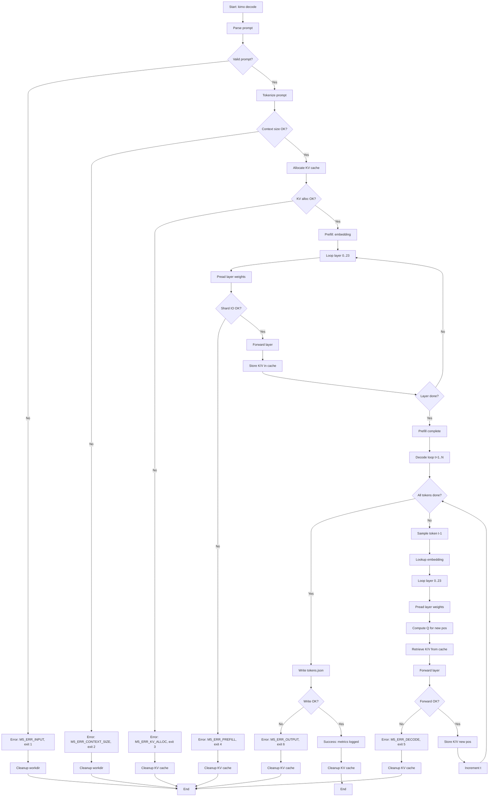

# M5 — KV Cache + Decode Incremental

> Proyek: `disk-streaming-moe-engine`. Fase: **Trial (rekayasa)**. Index: `../README.md`.
> Implementasi dipecah menjadi waves: `../../scratch/wave/m5/README.md` (W1 decode-cli → W6 gates, catatan kerja gitignored).

| Field       | Nilai                                                             |
| ----------- | ----------------------------------------------------------------- |
| Deliverable | Cache K/V incremental per layer + decode yang ekuivalen recompute |
| Komponen    | C4 kv-state, C2 forward/decode, C7 benchmark                      |
| Prasyarat   | M4 hijau                                                          |
| Next        | `M6-quantizer.md`                                                 |
| Gate        | G-M5-1..G-M5-6                                                    |
| Rumus       | F2, F3b, F4, F5, F10, F16                                         |

## Tujuan

Menghilangkan boros ×n tanpa KV cache: tiap token baru memakai K/V lama, hanya hitung Q baru + 1 posisi.

## CLI: `kimo decode`

Subcommand `decode` menjalankan prefill + decode dengan KV cache incremental.

### Input

```bash
kimo decode \
  --model-dir <DIR> \
  --prompt <TEXT> \
  --max-tokens <N> \
  --context-size <S> \
  [--output <PATH>] \
  [--workdir <DIR>] \
  [--threads <N>] \
  [--seed <SEED>]
```

- `--model-dir`: Direktori checkpoint (8 shard safetensors + index.json).
- `--prompt`: Text prompt (akan di-tokenize).
- `--max-tokens`: Jumlah token untuk generate (default: 64).
- `--context-size`: Ukuran konteks maksimal untuk KV cache (default: 2048).
- `--output`: Path output tokens JSON (default: `tokens_generated.json`).
- `--workdir`: Direktori kerja untuk temporary files (default: `./work`).
- `--threads`: Jumlah thread untuk layer forward (default: 1, deterministik untuk verdict).
- `--seed`: Random seed untuk sampling (default: 42, greedy = temperature 0).

### Output JSON

```json
{
  "status": "success",
  "run_id": "M5-20250115-001",
  "model": "qwen1.5-moe-a2.7b-chat",
  "prompt": "What is the capital of France?",
  "prompt_tokens": 8,
  "generated_tokens": 64,
  "context_size": 2048,
  "kv_cache_bytes": 402653184,
  "metrics": {
    "prefill_time_sec": 45.2,
    "decode_time_sec": 62.5,
    "total_time_sec": 107.7,
    "tokens_per_sec": 0.595,
    "vmhwm_bytes": 5368709120,
    "bytes_read_prefill": 30660512768,
    "bytes_read_decode": 264577024
  }
}
```

### Exit Codes

- `0`: Sukses, tokens ditulis.
- `1`: Error input (prompt kosong, max-tokens tidak valid).
- `2`: Error context size (ctx > s_max, memori tidak cukup).
- `3`: Error KV alloc (gagal alokasi KV cache).
- `4`: Error prefill (shard corrupt, read gagal).
- `5`: Error decode (NaN/INF/overflow di layer forward).
- `6`: Error output (gagal atomic write).

### Contoh Invokasi

```bash
# Happy path: generate 64 tokens with 2K context
kimo decode \
  --model-dir /models/qwen-moe \
  --prompt "What is the capital of France?" \
  --max-tokens 64 \
  --context-size 2048

# Greedy mode (temperature 0, seed tetap)
kimo decode \
  --model-dir /models/qwen-moe \
  --prompt "Explain quantum computing" \
  --max-tokens 64 \
  --context-size 2048 \
  --seed 42

# Cgroup boundary test @4K context
systemd-run --scope -p MemoryMax=6G \
  kimo decode \
  --model-dir /models/qwen-moe \
  --prompt "Write a Python function" \
  --max-tokens 64 \
  --context-size 4096
```

## Oracle: KV Decode vs Recompute

Oracle `tools/oracle/oracle_kv_decode.py` menjalankan dua path untuk verifikasi G-M5-1:

1. **KV decode path**: prefill → KV cache → decode incremental
2. **Recompute path**: full recompute untuk setiap token (baseline M4)

### Input

```bash
python tools/oracle/oracle_kv_decode.py \
  --model-dir <DIR> \
  --prompt <TEXT> \
  --max-tokens <N> \
  --context-size <S> \
  --output-kv <PATH> \
  --output-recompute <PATH>
```

- `--model-dir`: Direktori checkpoint (sama dengan Mojo).
- `--prompt`: Text prompt (sama dengan Mojo).
- `--max-tokens`: Jumlah token untuk generate (64 untuk G-M5-1).
- `--context-size`: Ukuran konteks (2048 untuk G-M5-1).
- `--output-kv`: Path output logits KV decode (FP32).
- `--output-recompute`: Path output logits recompute (FP32).

### Process: KV Decode Path

1. Load model PyTorch dari safetensors (8 shard → merge).
2. Convert semua bobot ke FP32.
3. **Prefill**: tokenization → embedding → 24 layer forward → store K/V per layer.
4. **Decode loop** (untuk t = 1..N):
   - Generate token t-1 (sampling/greedy).
   - Lookup embedding untuk token t-1.
   - Per layer: compute Q untuk posisi baru, retrieve K/V dari cache, compute attention, MoE, residual.
   - Store K/V baru untuk posisi t-1.
   - Output logits untuk token t.
5. Collect semua logits decode.

### Process: Recompute Path

1. Load model PyTorch (sama).
2. **Prefill**: tokenization → embedding → 24 layer forward → store K/V per layer.
3. **Decode loop** (untuk t = 1..N):
   - Generate token t-1 (sampling/greedy, sama seed).
   - **Full recompute**: embedding → 24 layer forward (hitung ulang K/V untuk semua posisi).
   - Output logits untuk token t.
4. Collect semua logits recompute.

### Output Format

```
logits_kv_decode.bin: [N, V] f32 row-major (KV decode path)
logits_recompute.bin: [N, V] f32 row-major (recompute path)
oracle_kv_decode.sha256: SHA-256 dari logits_kv_decode.bin
oracle_recompute.sha256: SHA-256 dari logits_recompute.bin
```

### Determinism

- `torch.manual_seed(42)` untuk deterministik.
- `torch.backends.cudnn.deterministic = True` (jika GPU).
- Thread count = 1 untuk referensi.
- Sampling greedy (temperature 0) untuk G-M5-1.

### Verdict Contract

Rust `compare` membandingkan `logits_kv_decode.bin` vs `logits_recompute.bin` dengan F10 threshold M4 (loose). G-M5-1 PASS jika loose threshold terpenuhi.

## Fixture: M5 KV Decode Set

Fixture `tools/fixtures/m5_kv_decode.json` berisi prompt untuk gate G-M5-1 (64 token @ ctx 2K).

### Structure

```json
{
  "name": "M5 KV decode set",
  "description": "Prompt for KV decode vs recompute gate (64 token @ ctx 2K)",
  "prompt": {
    "id": "kv_test_1",
    "text": "The quick brown fox jumps over the lazy dog. Explain this sentence in detail.",
    "expected_tokens": 64,
    "context_size": 2048
  }
}
```

### Generation Script

`tools/fixtures/generate_m5.py`:

1. Load full Qwen1.5-MoE tokenizer.
2. Select representative prompt (beragam: factual, explanatory).
3. Tokenize → verify length ≤ context_size (2048).
4. Validate: semua token < 151,936 (vocab size).
5. Output JSON dengan prompt + expected_tokens + context_size.

### Golden Artifacts

Untuk KV decode gate:

- `tokens_prompt.json`: input prompt token IDs.
- `logits_kv_decode.bin`: oracle KV decode logits (64 token).
- `logits_recompute.bin`: oracle recompute logits (64 token).
- `oracle_kv_decode.sha256`: SHA-256 dari logits_kv_decode.bin.
- `oracle_recompute.sha256`: SHA-256 dari logits_recompute.bin.

### Regression Protection

- Commit `m5_kv_decode.json` + SHA-256 ke repo.
- Gate G-M5-1 harus PASS dengan fixture ini setiap build.
- Perubahan fixture requires approval dengan rationale.

### Context Size Variants

Untuk G-M5-3 (memori @4K ctx), tambahkan variant:

```json
{
  "name": "M5 KV decode set - 4K context",
  "prompt": {
    "id": "kv_test_4k",
    "text": "A very long prompt that tests memory at 4K context size...",
    "expected_tokens": 64,
    "context_size": 4096
  }
}
```

## Error Handling

### Error Schema

```json
{
  "status": "error",
  "error": {
    "code": "M5_ERR_CONTEXT_SIZE",
    "stage": "kv_alloc",
    "message": "Context size 8192 exceeds maximum 4096 (memory constraint)",
    "details": {
      "requested_ctx": 8192,
      "max_ctx": 4096,
      "required_kv_bytes": 805306368,
      "available_bytes": 536870912
    }
  }
}
```

### Error Types

| Error Code            | Stage    | Description                              | Exit Code |
| --------------------- | -------- | ---------------------------------------- | --------- |
| `M5_ERR_INPUT`        | input    | Prompt kosong, max-tokens tidak valid    | 1         |
| `M5_ERR_CONTEXT_SIZE` | kv_alloc | Context size > s_max, memori tidak cukup | 2         |
| `M5_ERR_KV_ALLOC`     | kv_alloc | Gagal alokasi KV cache (OOM)             | 3         |
| `M5_ERR_PREFILL`      | prefill  | Shard corrupt / read gagal               | 4         |
| `M5_ERR_DECODE`       | decode   | NaN/INF/overflow di layer forward        | 5         |
| `M5_ERR_OUTPUT`       | output   | Gagal atomic write tokens                | 6         |

### Stage Failure Behavior

- **Input validation**: Batal seluruh decode, cleanup, exit 1.
- **Context size validation**: Batal, cleanup, exit 2.
- **KV alloc**: Batal, cleanup, exit 3.
- **Prefill**: Batal, cleanup temporary, exit 4.
- **Decode (token t)**: Batal pada token t, cleanup KV cache, exit 5.
- **Output**: Atomic write rollback jika gagal, exit 6.

### Atomic Rollback

- Tokens file: write ke temp → rename atomik → hapus temp jika gagal.
- KV cache: cleanup semua buffer jika decode gagal.
- Partial tokens tidak pernah dibiarkan sebagai valid.

## KV Cache Management

### KV Cache Layout

Per layer `l` (0..23), KV cache menyimpan:

- **K cache**: [s, H_kv, d_h] BF16 → key vectors untuk semua posisi
- **V cache**: [s, H_kv, d_h] BF16 → value vectors untuk semua posisi

Trial MHA:

- $H_{kv} = 16$ (16 heads)
- $d_h = 128$ (head dimension)
- Per posisi: $16 × 128 × 2$ B (K) + $16 × 128 × 2$ B (V) = 8192 B
- Per token: 8192 B = 8 KB
- @2048 ctx: $2048 × 8$ KB = 16 MB per layer
- 24 layer: $24 × 16$ MB = 384 MB total

### Memory Budget Breakdown

| Component                        | Size @2K ctx | Size @4K ctx | Lifetime       |
| -------------------------------- | ------------ | ------------ | -------------- |
| Embedding + lm_head resident F32 | 2,318 GiB    | 2,318 GiB    | Seluruh decode |
| `model.norm.weight` F32          | 8 KiB        | 8 KiB        | Seluruh decode |
| KV cache (K+V, BF16 stored)      | 384 MB       | 768 MB       | Seluruh decode |
| Per-layer weights (BF16)         | ≈1,063 GiB   | ≈1,063 GiB   | 1 layer saja   |
| Dequant scratch (chunked ≤64 MiB, strategi M1) | ≤64 MiB bound | ≤64 MiB bound | 1 layer |
| Hidden state [1, H] F32          | 8 KiB        | 8 KiB        | Seluruh decode |
| Attention scratch F32 (QKV new + scores [h,1,S] + out) | 168 KiB | 296 KiB | 1 layer |
| MoE scratch F32 (router/dispatch/SwiGLU/combine/shared) | 115 KiB | 115 KiB | 1 layer |
| I/O buffers                      | 1 MB         | 1 MB         | 1 layer        |
| **Total peak bound @2K**          | **≈3,82 GiB** | -           | < 5 GiB gate   |
| **Total peak bound @4K**          | -            | **≈4,20 GiB** | < 5 GiB gate  |

### KV Cache Lifecycle

**Prefill Phase**:

1. Tokenize prompt → [s_prompt] token IDs.
2. Embedding lookup → hidden state [s_prompt, H].
3. Loop layer 0..23:
   - Forward layer (attention + MoE).
   - Store K/V untuk semua posisi di KV cache.
4. KV cache size = s_prompt × 8 KB per layer.

**Decode Phase** (untuk t = 1..N):

1. Generate token t-1 (sampling/greedy).
2. Lookup embedding untuk token t-1 → hidden state [1, H].
3. Loop layer 0..23:
   - Compute Q untuk posisi baru (s_prompt + t - 1).
   - Retrieve K/V dari cache (semua posisi 0..s_prompt + t - 1).
   - Compute attention (Q @ K^T @ V).
   - Forward MoE.
   - Store K/V baru untuk posisi s_prompt + t - 1.
4. KV cache size = (s_prompt + t) × 8 KB per layer.

**Cleanup**:

- Decode selesai → free semua KV cache buffers.
- Generate token baru → ulang prefill + decode (tidak ada persistensi antar sesi).

### KV Cache Allocation Strategy

**Static allocation** (M5 trial):

- Pre-allocate KV cache dengan size = context_size × 8 KB per layer.
- Validasi: context_size ≤ s_max (dari config + memory constraint).
- Gagal alloc → error M5_ERR_KV_ALLOC, exit 3.

**Dynamic allocation** (opsional untuk M7+):

- Grow KV cache per token (realloc saat needed).
- Fragmentasi risk → tidak direkomendasikan untuk trial.

### KV Cache Position Tracking

- Position index: 0..(s_prompt + N - 1).
- RoPE position embedding diaplikasikan per position.
- Attention mask: causal (hanya attention ke posisi ≤ current).

### KV Cache Persistence

- M5: KV cache in-memory only, tidak persist ke disk.
- M7+: O_DIRECT + LRU bisa cache KV cache ke disk (opsional).
- Per sesi decode: prefill → decode → cleanup (tidak ada cross-session cache).

## Workflow Diagram



## Rumus

F2: $M_{KV}(s) = 2\cdot L_{att}\cdot H_{kv}\cdot d_h\cdot s\cdot b$.

Trial MHA: $2×24×16×128×2$ B = 196.608 B/token = **0,1875 MiB/token** → @4096 = **0,75 GiB** → konteks praktis ≤ 8K di 8 GB.

F3b: $N_{stream}≈2{,}0668$ B → $B_{tok}^{decode}≈4{,}134$ GB/token (BF16).

F5: $T_{data}=B_{tok}(\rho_B/BW_{RAM}+(1-\rho_B)/BW_{SSD})$, $BW_{eff}=B_{tok}/T_{data}$, dan forecast serial $T_{tok}=T_{data}+T_{comp}+T_{ovh}$. $\rho_C≈\min(1,C_{pc}/W_{stream})$ hanya estimasi kapasitas awal untuk fraksi byte terukur $\rho_B$.

Contoh estimasi (bukan acceptance): $C_{pc}=3$ GB, $W_{stream}=26$ GB → $\rho_C≈0{,}1154$. Jika $\rho_B=\rho_C$, $BW_{RAM}=15$ GB/s, dan $BW_{SSD}=3$ GB/s, maka $BW_{eff}≈3{,}305$ GB/s dan $T_{data}≈1{,}251$ s/token; + placeholder $T_{comp}=0{,}05$ s → ≈1,301 s/token ≈0,77 tok/s. Placeholder wajib diganti ukur.

F4: $I_{decode}≈1$ FLOP/byte (self-canceling) → memory-bound; optimasi = kurangi bytes atau naikkan BW, bukan FLOPs.

## Gate

| Gate   | Kriteria                                         | Threshold                                                                                                               | Metode                                                                       |
| ------ | ------------------------------------------------ | ----------------------------------------------------------------------------------------------------------------------- | ---------------------------------------------------------------------------- |
| G-M5-1 | decode incremental == recompute                  | verdict loose (sama M4)                                                                                                 | 64 token @ ctx 2K                                                            |
| G-M5-2 | prediksi F2 vs ukur                              | $e_{KV} \le 5\%$                                                                                                        | log engine + sampler                                                         |
| G-M5-3 | memori @4K ctx                                   | $M_{peak} \le 5$ GiB                                                                                                    | VmHWM                                                                        |
| G-M5-4 | kalibrasi waktu F5                               | $e_T \le 30\%$                                                                                                          | 30 run (`../03-testing.md` §4.4)                                             |
| G-M5-5 | kurva skala core decode (rasio, device-agnostic) | monotonik ($T(c_2)\le T(c_1)\cdot1{,}05$) + $S_{tok}(c)\ge1$ + $e_{T,core}\le20\%$ + $c^*,r^*,p,\beta$ dilaporkan (F16) | sweep $c\in\{1,2,4,\dots\}\cap[1,C_{max}]$, 10 run/level + 30 run di $c^*$   |
| G-M5-6 | floor bandwidth RAM (gate minimal)               | $BW_{RAM}\ge10$ GB/s single-thread Copy read-equiv                                                                      | STREAM-like (`../03-testing.md` §4.4), median 10 run, governor `performance` |

Kalibrasi: $e_{KV}=|pred-meas|/meas$, $e_T=|T^{pred}-T^{meas}|/T^{meas}$. Gagal kalibrasi → update konstanta ρ/BW, tidak blokir tapi wajib catat. Titik operasi performa = $c^*$ (bukan $C_{max}$); $C_{max}$ terdeteksi saat run, tidak dipatok di spec.

## Testing

- O: KV decode vs recompute.
- B: decode N=30 + 2 warm-up, greedy, seed tetap; CSV + markdown p50/p95 + run-id di `reports/YYYY-MM-DD/`.
- B-core (F16): sweep $c$ kelipatan 2 hingga $C_{max}$ (terdeteksi run-time); tiap level 10 run + 2 warm-up, lalu 30 run di $c^*$; catat $C_{max}, c, r=c/C_{max}$, governor, `OMP_NUM_THREADS=c`; verdict numerik tetap `threads=1` terpisah.
- Sampling RSS VmHWM + poller 100 ms; bytes via `/proc/<pid>/io`.

## Integration Tests

### Test Matrix

| Test ID  | Scenario                                  | Expected                          | Priority |
| -------- | ----------------------------------------- | --------------------------------- | -------- |
| IT-M5-1  | Happy path: 64 token @ ctx 2K             | Exit 0, F10 PASS loose            | HIGH     |
| IT-M5-2  | KV decode vs recompute                    | Exit 0, F10 PASS loose            | HIGH     |
| IT-M5-3  | Context size 4K                           | Exit 0, VmHWM ≤ 5 GiB             | HIGH     |
| IT-M5-4  | Context size > s_max                      | Exit 2, error M5_ERR_CONTEXT_SIZE | HIGH     |
| IT-M5-5  | KV alloc fail (OOM)                       | Exit 3, error M5_ERR_KV_ALLOC     | HIGH     |
| IT-M5-6  | Invalid prompt (kosong)                   | Exit 1, error M5_ERR_INPUT        | HIGH     |
| IT-M5-7  | Cgroup memory.max=6G boundary @4K ctx     | Exit 0, VmHWM ≤ 5 GiB             | HIGH     |
| IT-M5-8  | Deterministic output (threads=1, seed=42) | SHA-256 match di 2 run            | MEDIUM   |
| IT-M5-9  | Max-tokens = 0                            | Exit 1, error M5_ERR_INPUT        | MEDIUM   |
| IT-M5-10 | Prefill shard corrupt                     | Exit 4, error M5_ERR_PREFILL      | MEDIUM   |

### Test Automation

`tests/integration/test_m5_kv_decode.sh`:

```bash
#!/bin/bash
set -e

# Setup
MODEL_DIR="/tmp/test_model"
WORKDIR="/tmp/test_work"
FIXTURE_DIR="tools/fixtures"

# IT-M5-1: Happy path
kimo decode \
  --model-dir "$MODEL_DIR" \
  --prompt "The quick brown fox" \
  --max-tokens 64 \
  --context-size 2048 \
  --workdir "$WORKDIR"
# Expect exit 0

# IT-M5-2: KV decode vs recompute
python tools/oracle/oracle_kv_decode.py \
  --model-dir "$MODEL_DIR" \
  --prompt "The quick brown fox" \
  --max-tokens 64 \
  --context-size 2048 \
  --output-kv "$WORKDIR/logits_kv.bin" \
  --output-recompute "$WORKDIR/logits_recompute.bin"
python tools/compare.py \
  --mojo "$WORKDIR/logits_kv.bin" \
  --oracle "$WORKDIR/logits_recompute.bin"
# Expect F10 PASS loose

# IT-M5-3: Context size 4K
kimo decode \
  --model-dir "$MODEL_DIR" \
  --prompt "A very long prompt..." \
  --max-tokens 64 \
  --context-size 4096 \
  --workdir "$WORKDIR"
# Expect exit 0, VmHWM ≤ 5 GiB

# IT-M5-4: Context size > s_max
kimo decode \
  --model-dir "$MODEL_DIR" \
  --prompt "Test" \
  --max-tokens 64 \
  --context-size 8192 \
  --workdir "$WORKDIR" || true
# Expect exit 2

# IT-M5-7: Cgroup boundary
systemd-run --scope -p MemoryMax=6G \
  kimo decode \
  --model-dir "$MODEL_DIR" \
  --prompt "Test" \
  --max-tokens 64 \
  --context-size 4096 \
  --workdir "$WORKDIR"
# Expect exit 0, VmHWM ≤ 5 GiB

# IT-M5-8: Deterministic
OUTPUT1="$WORKDIR/tokens_run1.json"
OUTPUT2="$WORKDIR/tokens_run2.json"
kimo decode \
  --model-dir "$MODEL_DIR" \
  --prompt "Test" \
  --max-tokens 64 \
  --context-size 2048 \
  --output "$OUTPUT1" \
  --workdir "$WORKDIR" \
  --threads 1 \
  --seed 42
kimo decode \
  --model-dir "$MODEL_DIR" \
  --prompt "Test" \
  --max-tokens 64 \
  --context-size 2048 \
  --output "$OUTPUT2" \
  --workdir "$WORKDIR" \
  --threads 1 \
  --seed 42
SHA1=$(sha256sum "$OUTPUT1" | cut -d' ' -f1)
SHA2=$(sha256sum "$OUTPUT2" | cut -d' ' -f1)
[ "$SHA1" = "$SHA2" ] || exit 1
```

### Regression Golden Outputs

- Commit `m5_kv_decode_logits_kv.bin` + `m5_kv_decode_logits_recompute.bin` + SHA-256 ke repo.
- Setiap build: jalankan IT-M5-2 → bandingkan dengan golden.
- Jika mismatch: investigasi, fix, re-commit golden dengan rationale.

### Negative Path Coverage

- Error codes 1-6 semua teruji.
- Error JSON schema valid di semua failure paths.
- Cleanup workdir + KV cache verified setiap error (tidak ada orphan files/memory leak).

## KV Cache File Format

### In-Memory Layout (M5)

M5 menggunakan KV cache in-memory (tidak persist ke disk). Layout per layer:

```
KV cache layer l:
  K_cache: [s, H_kv, d_h] BF16 row-major
  V_cache: [s, H_kv, d_h] BF16 row-major
```

- **s**: current sequence length (prompt + generated tokens).
- **H_kv**: 16 (number of KV heads, trial MHA).
- **d_h**: 128 (head dimension).
- **Data type**: BF16 (2 bytes per element).
- **Layout**: Row-major (C order).

### Size Calculation

Per layer:

- K: s × 16 × 128 × 2 B = s × 4096 B
- V: s × 16 × 128 × 2 B = s × 4096 B
- Total per layer: s × 8192 B = s × 8 KB

24 layer total: 24 × s × 8 KB = s × 192 KB

@2048 ctx: 2048 × 192 KB = 384 MB
@4096 ctx: 4096 × 192 KB = 768 MB

### Optional Persistence (M7+)

Untuk M7+ (O_DIRECT + LRU), KV cache bisa persist ke disk:

**File format proposal** (TBM, opsional):

```
kv_cache.bin:
  [header 256 bytes]
  [layer 0 K cache]
  [layer 0 V cache]
  [layer 1 K cache]
  [layer 1 V cache]
  ...
  [layer 23 K cache]
  [layer 23 V cache]
```

Header format (JSON + padding to 256 bytes):

```json
{
  "version": 1,
  "model": "qwen1.5-moe-a2.7b-chat",
  "num_layers": 24,
  "num_heads_kv": 16,
  "head_dim": 128,
  "sequence_length": 2048,
  "dtype": "BF16"
}
```

### Validation

- Header JSON valid.
- Sequence length ≤ context_size.
- Total file size = 256 + 24 × 2 × s × 16 × 128 × 2 bytes.
- Semua nilai finite (tidak ada NaN/INF).

## Decode Sampling Specification

### Sampling Modes

**Greedy (temperature = 0)**:

- Select token dengan probabilitas maksimum (argmax).
- Deterministik: seed tidak berpengaruh.
- Digunakan untuk G-M5-1 (verifikasi numerik).

**Temperature sampling (temperature > 0)**:

- Apply temperature ke logits: `logits = logits / temperature`.
- Softmax → sampling multinomial.
- Non-deterministik: seed berpengaruh.

### Greedy Algorithm (M5 default)

```python
# Pseudocode
def greedy_sample(logits, vocab_size):
    # logits: [vocab_size] BF16
    # Find argmax
    token_id = argmax(logits)
    return token_id
```

### Temperature Sampling Algorithm (opsional)

```python
# Pseudocode
def temperature_sample(logits, vocab_size, temperature, seed):
    # logits: [vocab_size] BF16
    # Apply temperature
    logits_scaled = logits / temperature
    # Softmax
    probs = softmax(logits_scaled)
    # Multinomial sampling with seed
    rng = Random(seed)
    token_id = rng.multinomial(probs)
    return token_id
```

### CLI Arguments

- `--seed <SEED>`: Random seed untuk sampling (default: 42).
- `--temperature <TEMP>`: Temperature untuk sampling (default: 0 = greedy).
- `--top-k <K>`: Top-k sampling (opsional, tidak di M5).
- `--top-p <P>`: Nucleus sampling (opsional, tidak di M5).

### Determinism Contract

- Untuk G-M5-1: temperature = 0 (greedy), threads = 1 → deterministik.
- Untuk benchmark: temperature = 0 (greedy), seed tetap → deterministik.
- Untuk generasi bebas: temperature > 0, seed tetap → reproducible.

### Oracle Sampling

Oracle PyTorch menggunakan `torch.multinomial` dengan `generator=torch.Generator().manual_seed(seed)` untuk deterministik.

## Decode CLI Output Examples

### Success Output

```json
{
  "status": "success",
  "run_id": "M5-20250115-001",
  "model": "qwen1.5-moe-a2.7b-chat",
  "prompt": "What is the capital of France?",
  "prompt_tokens": 8,
  "generated_tokens": 64,
  "context_size": 2048,
  "kv_cache_bytes": 402653184,
  "metrics": {
    "prefill_time_sec": 45.2,
    "decode_time_sec": 62.5,
    "total_time_sec": 107.7,
    "tokens_per_sec": 0.595,
    "vmhwm_bytes": 5368709120,
    "bytes_read_prefill": 30660512768,
    "bytes_read_decode": 264577024
  }
}
```

### Error Output (Context Size Exceeded)

```json
{
  "status": "error",
  "error": {
    "code": "M5_ERR_CONTEXT_SIZE",
    "stage": "kv_alloc",
    "message": "Context size 8192 exceeds maximum 4096 (memory constraint)",
    "details": {
      "requested_ctx": 8192,
      "max_ctx": 4096,
      "required_kv_bytes": 805306368,
      "available_bytes": 536870912
    }
  }
}
```

### Error Output (KV Alloc Fail)

```json
{
  "status": "error",
  "error": {
    "code": "M5_ERR_KV_ALLOC",
    "stage": "kv_alloc",
    "message": "Failed to allocate KV cache: out of memory",
    "details": {
      "requested_bytes": 402653184,
      "available_bytes": 268435456,
      "errno": 12
    }
  }
}
```

### Error Output (Invalid Prompt)

```json
{
  "status": "error",
  "error": {
    "code": "M5_ERR_INPUT",
    "stage": "input",
    "message": "Prompt cannot be empty",
    "details": {
      "prompt": ""
    }
  }
}
```

## KV Cache Serialization/Deserialization (M7+)

### Serialization Process

Untuk M7+ (O_DIRECT + LRU), KV cache bisa diserialisasi ke disk:

```python
# Pseudocode
def serialize_kv_cache(kv_cache, path):
    # kv_cache: list of 24 (K, V) tuples
    # Write header
    header = {
        "version": 1,
        "model": "qwen1.5-moe-a2.7b-chat",
        "num_layers": 24,
        "num_heads_kv": 16,
        "head_dim": 128,
        "sequence_length": s,
        "dtype": "BF16"
    }
    write_header_json(path, header, pad_to=256)
    # Write per-layer K/V
    for l in range(24):
        K, V = kv_cache[l]
        write_binary(path, K.tobytes())  # row-major BF16
        write_binary(path, V.tobytes())  # row-major BF16
```

### Deserialization Process

```python
# Pseudocode
def deserialize_kv_cache(path):
    # Read header
    header = read_header_json(path, 256)
    validate_header(header)
    # Read per-layer K/V
    kv_cache = []
    for l in range(24):
        K = read_binary(path, header["sequence_length"] * header["num_heads_kv"] * header["head_dim"] * 2)
        V = read_binary(path, header["sequence_length"] * header["num_heads_kv"] * header["head_dim"] * 2)
        K = K.reshape(header["sequence_length"], header["num_heads_kv"], header["head_dim"])
        V = V.reshape(header["sequence_length"], header["num_heads_kv"], header["head_dim"])
        kv_cache.append((K, V))
    return kv_cache
```

### Validation Checks

- Header JSON valid.
- Model name matches current model.
- num_layers = 24.
- num_heads_kv = 16.
- head_dim = 128.
- dtype = "BF16".
- sequence_length ≤ context_size.
- File size matches expected size.

### Use Cases (M7+)

- **LRU cache**: Evict KV cache to disk when memory pressure.
- **Resume generation**: Load KV cache from disk untuk continue generation.
- **Multi-session**: Share KV cache antar sessions (opsional).

### M5 Note

M5 tidak menggunakan serialisasi KV cache (in-memory only). Spec ini untuk M7+ (O_DIRECT + LRU).

## Per-Token Timing Breakdown

### Timing Schema

Optional per-token timing untuk debugging decode bottleneck:

```json
{
  "run_id": "M5-20250115-001",
  "prefill_time_sec": 45.2,
  "token_timing": [
    {
      "token_id": 42,
      "position": 8,
      "embedding_sec": 0.001,
      "layer_forward_sec": 0.08,
      "sampling_sec": 0.002,
      "total_sec": 0.083
    },
    {
      "token_id": 1567,
      "position": 9,
      "embedding_sec": 0.001,
      "layer_forward_sec": 0.082,
      "sampling_sec": 0.002,
      "total_sec": 0.085
    },
    ...
    {
      "token_id": 89,
      "position": 71,
      "embedding_sec": 0.001,
      "layer_forward_sec": 0.081,
      "sampling_sec": 0.002,
      "total_sec": 0.084
    }
  ],
  "total_decode_time_sec": 62.5
}
```

### Metrics per Token

- `token_id`: generated token ID.
- `position`: sequence position (prompt_tokens + token_index).
- `embedding_sec`: waktu embedding lookup.
- `layer_forward_sec`: waktu 24 layer forward (attention + MoE).
- `sampling_sec`: waktu sampling (softmax + argmax/multinomial).
- `total_sec`: `embedding_sec + layer_forward_sec + sampling_sec`.

### Debugging Use Cases

- Identifikasi token dengan layer forward lambat (bottleneck layer).
- Identifikasi token dengan sampling lambat (softmax bottleneck).
- Verifikasi streaming: `layer_forward_sec` ≈ constant per token (tidak ada cache effect).
- Correlate dengan KV cache hit/miss untuk M7 LRU tuning.

### Optional Flag

```bash
kimo decode \
  --model-dir /models/qwen-moe \
  --prompt "What is the capital of France?" \
  --max-tokens 64 \
  --context-size 2048 \
  --token-timing /work/token_timing.json
```

- O: KV decode vs recompute.
- B: decode N=30 + 2 warm-up, greedy, seed tetap; CSV + markdown p50/p95 + run-id di `reports/YYYY-MM-DD/`.
- B-core (F16): sweep $c$ kelipatan 2 hingga $C_{max}$ (terdeteksi run-time); tiap level 10 run + 2 warm-up, lalu 30 run di $c^*$; catat $C_{max}, c, r=c/C_{max}$, governor, `OMP_NUM_THREADS=c`; verdict numerik tetap `threads=1` terpisah.
- Sampling RSS VmHWM + poller 100 ms; bytes via `/proc/<pid>/io`.

## Security

- SEC-4: KV alloc dari batas config ($L, H_{kv}, s_{max}$), tolak ctx tak masuk akal sebelum alloc.

## DoD

### Gate Requirements

- [ ] G-M5-1 KV decode == recompute PASS loose (Δ_max ≤ 1e-2, ε_rel ≤ 1e-4, A ≥ 99.9%, Δ_CE ≤ 0.02)
- [ ] G-M5-2 F2 prediction error ≤ 5% (e_KV ≤ 5%)
- [ ] G-M5-3 memory @4K ctx ≤ 5 GiB (VmHWM)
- [ ] G-M5-4 F5 calibration error ≤ 30% (e_T ≤ 30%)
- [ ] G-M5-5 core scaling monotonic + S_tok ≥ 1 + e_T,core ≤ 20% + c*, r*, p, β reported
- [ ] G-M5-6 BW_RAM ≥ 10 GB/s (STREAM-like, floor)

### CLI Implementation

- [ ] `kimo decode` subcommand terimplementasi dengan semua argumen
- [ ] Input validation: prompt, max-tokens, context-size, workdir writability
- [ ] Exit codes: 0 (success), 1-6 (error per stage), semuanya teruji
- [ ] Output JSON dengan run_id, metrics, prefill/decode timing tercommit schema

### Oracle & Fixture

- [ ] `tools/oracle/oracle_kv_decode.py` menghasilkan KV decode + recompute logits FP32
- [ ] Oracle deterministik (seed=42, thread=1, FP32, greedy)
- [ ] `tools/fixtures/m5_kv_decode.json` tercommit dengan 64 token @ ctx 2K
- [ ] SHA-256 logits KV decode + recompute tercommit untuk regression protection
- [ ] Generation script `tools/fixtures/generate_m5.py` teruji
- [ ] Context size variant @4K ctx untuk G-M5-3

### Error Handling

- [ ] Error schema JSON terimplementasi untuk semua 6 error types
- [ ] Stage failure handling: input, context_size, kv_alloc, prefill, decode, output
- [ ] Atomic rollback: temp file → rename atomik → cleanup jika gagal
- [ ] KV cache cleanup jika decode gagal (tidak ada memory leak)

### KV Cache Management

- [ ] KV cache layout: [s, H_kv, d_h] BF16 per layer (K + V)
- [ ] Memory budget breakdown teruji (@2K ctx ≈3,82 GiB, @4K ctx ≈4,20 GiB bound)
- [ ] KV cache lifecycle: prefill (store) → decode (retrieve + store) → cleanup
- [ ] Static allocation strategy (pre-allocate @ context_size)
- [ ] Position tracking: 0..(s_prompt + N - 1), RoPE per position, causal mask
- [ ] KV cache in-memory only (M5), tidak persist ke disk

### KV Decode vs Recompute

- [ ] Prefill phase: store K/V per layer
- [ ] Decode phase: compute Q baru, retrieve K/V dari cache, attention, MoE
- [ ] Recompute baseline: full recompute per token (untuk G-M5-1)
- [ ] F10 verdict PASS loose untuk 64 token @ ctx 2K
- [ ] Kategori FAIL: router-selection, rope-style, bias-placement tetap hard FAIL

### Numerical Correctness

- [ ] F10 verdict PASS loose untuk KV decode vs recompute
- [ ] F2 prediction error e_KV ≤ 5% (predicted vs measured KV size)
- [ ] F5 calibration error e_T ≤ 30% (predicted vs measured T_tok)

### Integration Tests

- [ ] Happy path: 64 token @ ctx 2K → KV decode → compare → PASS
- [ ] Context size 4K: KV alloc, VmHWM ≤ 5 GiB
- [ ] Context size > s_max: error M5_ERR_CONTEXT_SIZE, exit 2
- [ ] KV alloc fail: error M5_ERR_KV_ALLOC, exit 3
- [ ] Invalid prompt (kosong): error M5_ERR_INPUT, exit 1
- [ ] Deterministic output: threads=1, seed=42 → logits sama di 2 run (SHA-256 match)

### Performance Baseline

- [ ] N=30 decode runs + 2 warm-up terimplementasi
- [ ] p50/p95 walltime tercatat (prefill + decode)
- [ ] p50/p95 VmHWM tercatat (@2K ctx ≤ 5 GiB, @4K ctx ≤ 5 GiB)
- [ ] Bytes read tercatat (prefill: ~28,63 GB, decode: ~264 MB untuk 64 token)
- [ ] Tokens per second tercatat (tok/s)
- [ ] F5 calibration T_tok vs predicted (e_T ≤ 30%)
- [ ] F2 calibration KV size vs predicted (e_KV ≤ 5%)

### Core Scaling (F16)

- [ ] Sweep core c ∈ {1,2,4,...} ∩ [1, C_max] terimplementasi
- [ ] C_max terdeteksi run-time (tidak dipatok di spec)
- [ ] Tiap level: 10 run + 2 warm-up
- [ ] 30 run di c\* (titik operasi)
- [ ] Monotonik: T(c_2) ≤ T(c_1)·1,05
- [ ] Speedup S_tok(c) ≥ 1
- [ ] e_T,core ≤ 20%
- [ ] c*, r*, p, β dilaporkan (device-agnostic)
- [ ] Governor tercatat (performance/schedutil)
- [ ] OMP_NUM_THREADS=c tercatat

### Bandwidth Floor (G-M5-6)

- [ ] STREAM-like measurement terimplementasi (Copy kernel single-thread)
- [ ] Array ≥ 4× total LLC (atau ≥ 1M elemen)
- [ ] 10 repetisi, ambil median read-equiv GB/s
- [ ] Governor `performance`
- [ ] BW_RAM ≥ 10 GB/s (floor)
- [ ] Bila BW_RAM < floor: device di bawah syarat minimal → gate performa diskalakan ulang via F5

### Security Tests

- [ ] SEC-4: cgroup memory.max=6G terpenuhi (VmHWM ≤ 5 GiB @4K ctx)
- [ ] SEC-4: KV alloc dari batas config (L, H_kv, s_max)
- [ ] SEC-4: Tolak ctx tak masuk akal sebelum alloc
- [ ] SEC-5: output hanya ke workdir (tidak ada write di luar workdir)
- [ ] Model directory read-only setelah validation (tidak ada modifikasi)
- [ ] Output atomic: tidak ada partial tokens valid jika gagal

### Reporting & Artifacts

- [ ] Laporan decode tercommit (p50/p95 walltime, VmHWM, bytes-read, tok/s)
- [ ] Run ID tercatat per run (format: M5-YYYYMMDD-NNN)
- [ ] Log per-phase timing tercatat (prefill, decode)
- [ ] Konstanta F5 ter-update (ρ, BW_eff, T_comp)
- [ ] Kurva F16 ter-commit (c*, r*, p, β, tanpa angka core absolut)
- [ ] BW_RAM terukur ≥ floor tercatat
- [ ] Kalibrasi tercatat bila e_T atau e_KV meleset

## Wave Note

Lihat implementasi notes di: <ref_file file="../../scratch/wave/m5/README.md" />
