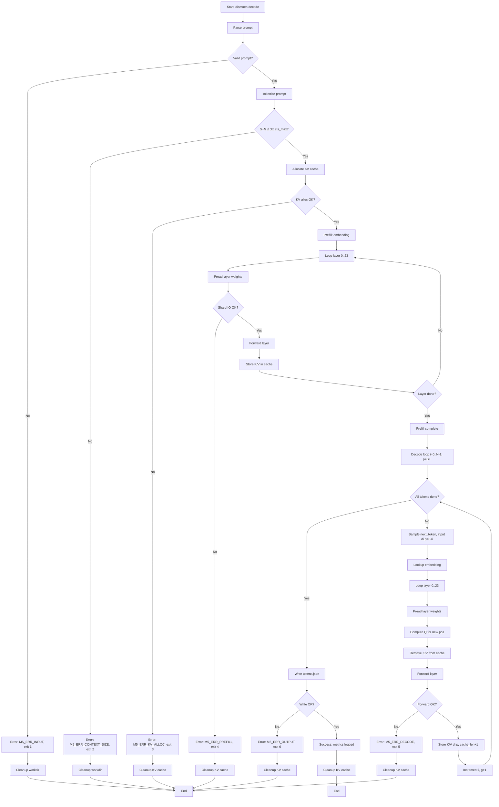

# M5 — KV Cache + Decode Incremental

> Proyek: `disk-streaming-moe-engine`. Fase: **Trial (rekayasa)**. Index: `../README.md`.

| Field       | Nilai                                                             |
| ----------- | ----------------------------------------------------------------- |
| Deliverable | Cache K/V incremental per layer + decode yang ekuivalen recompute |
| Komponen    | C4 kv-state, C2 forward/decode, C7 benchmark                      |
| Prasyarat   | M4 hijau                                                          |
| Next        | `M6-quantizer.md`                                                 |
| Gate        | G-M5-1..G-M5-6                                                    |
| Rumus       | F2, F3b, F4, F5, F10, F16                                         |

## Tujuan

Menghilangkan boros ×n tanpa KV cache: tiap token baru memakai K/V lama, hanya hitung Q baru + 1 posisi.

## CLI: `dismoen decode`

Subcommand `decode` menjalankan prefill + decode dengan KV cache incremental.

### Input

```bash
dismoen decode \
  --model-dir <DIR> \
  --prompt <TEXT> \
  --max-tokens <N> \
  --context-size <S> \
  [--output <PATH>] \
  [--workdir <DIR>] \
  [--threads <N>] \
  [--seed <SEED>]
```

- `--model-dir`: Direktori checkpoint (8 shard safetensors + index.json).
- `--prompt`: Text prompt (akan di-tokenize).
- `--max-tokens`: Jumlah token untuk generate (default: 64).
- `--context-size`: Ukuran konteks maksimal untuk KV cache (default: 2048) —
  terikat rantai bound `S + N ≤ ctx ≤ s_max` (lihat Batas konteks).
- `--output`: Path output tokens JSON (default: `tokens_generated.json`).
- `--workdir`: Direktori kerja untuk temporary files (default: `./work`).
- `--threads`: Jumlah thread untuk layer forward (default: 1, deterministik untuk verdict).
- `--seed`: Random seed untuk sampling (default: 42) — DIABAIKAN bila temperature == 0
  (greedy); nilai seed yang EFEKTIF selalu tercatat di blok `sampling` output JSON
  (`null` bila diabaikan), agar artifact tidak memberi kesan seed menentukan output greedy.

**Batas konteks (normatif):** dengan $S$ = panjang prompt (diketahui setelah tokenize)
dan $N$ = `--max-tokens`, kebutuhan slot KV adalah $required\_context = S + N$
(posisi $[0, S+N)$). Rantai yang ditegakkan, SEBELUM alokasi KV:

$$S + N \le ctx \le s_{max}$$

Pelanggaran sisi kiri (prompt 2000 + max 64 > ctx 2048) MAUPUN sisi kanan
(ctx > $s_{max}$) → `M5_ERR_CONTEXT_SIZE`, exit 2. Cek `ctx ≤ s_max` saja TIDAK
cukup — static allocation `ctx × 8 KB/layer` tidak punya ruang untuk kelebihan itu.

### Output JSON

```json
{
  "status": "success",
  "run_id": "M5-20250115-001",
  "model": "qwen1.5-moe-a2.7b-chat",
  "prompt": "What is the capital of France?",
  "prompt_tokens": 8,
  "generated_tokens": 64,
  "context_size": 2048,
  "kv_cache_bytes": 402653184,
  "sampling": {
    "mode": "greedy",
    "temperature": 0,
    "seed": null
  },
  "metrics": {
    "prefill_time_sec": 45.2,
    "decode_time_sec": 62.5,
    "total_time_sec": 107.7,
    "tokens_per_sec": 0.595,
    "vmhwm_bytes": 5368709120,
    "bytes_read_prefill": 30660512768,
    "bytes_read_decode": 264577024
  }
}
```

### Exit Codes

- `0`: Sukses, tokens ditulis.
- `1`: Error input (prompt kosong, max-tokens tidak valid).
- `2`: Error context size (`S + N > ctx`, atau ctx > s_max).
- `3`: Error KV alloc (gagal alokasi KV cache).
- `4`: Error prefill (shard corrupt, read gagal).
- `5`: Error decode (NaN/INF/overflow di layer forward).
- `6`: Error output (gagal atomic write).

### Contoh Invokasi

```bash
# Happy path: generate 64 tokens with 2K context
dismoen decode \
  --model-dir /models/qwen-moe \
  --prompt "What is the capital of France?" \
  --max-tokens 64 \
  --context-size 2048

# Greedy mode (temperature 0; --seed tidak perlu — diabaikan)
dismoen decode \
  --model-dir /models/qwen-moe \
  --prompt "Explain quantum computing" \
  --max-tokens 64 \
  --context-size 2048

# Cgroup boundary test @4K context
systemd-run --scope -p MemoryMax=6G \
  dismoen decode \
  --model-dir /models/qwen-moe \
  --prompt "Write a Python function" \
  --max-tokens 64 \
  --context-size 4096
```

## Oracle: KV Decode vs Recompute

Oracle `tools/oracle/oracle_kv_decode.py` menjalankan dua path untuk verifikasi G-M5-1:

1. **KV decode path**: prefill → KV cache → decode incremental
2. **Recompute path**: full recompute untuk setiap token (baseline M4)

### Input

```bash
python tools/oracle/oracle_kv_decode.py \
  --model-dir <DIR> \
  --prompt <TEXT> \
  --max-tokens <N> \
  --context-size <S> \
  --output-kv <PATH> \
  --output-recompute <PATH>
```

- `--model-dir`: Direktori checkpoint (sama dengan Mojo).
- `--prompt`: Text prompt (sama dengan Mojo).
- `--max-tokens`: Jumlah token untuk generate (64 untuk G-M5-1).
- `--context-size`: Ukuran konteks (2048 untuk G-M5-1).
- `--output-kv`: Path output logits KV decode (FP32).
- `--output-recompute`: Path output logits recompute (FP32).

### Process: KV Decode Path

1. Load model PyTorch dari safetensors (8 shard → merge).
2. Convert semua bobot ke FP32.
3. **Prefill**: tokenization → embedding → 24 layer forward → store K/V untuk posisi $[0, S)$.
4. **Decode loop**: ikuti kontrak posisi normatif § KV Cache Lifecycle
   (prefill → `next_logits` di $S-1$; step $i$: sample → forward 1 token di $p = S+i$ →
   append K/V di $p$ → logits di $p$), plus invarian debug assertion di sana.
5. Collect semua logits decode (satu per posisi $[S, S+N)$).

### Process: Recompute Path

1. Load model PyTorch (sama).
2. **Prefill**: tokenization → embedding → 24 layer forward → store K/V untuk posisi $[0, S)$.
3. **Decode loop**: kontrak posisi yang sama persis (§ KV Cache Lifecycle), kecuali
   tiap step menghitung ulang K/V untuk semua posisi $[0, p]$ dari embedding
   (full recompute) alih-alih retrieve cache — Kunci semantik posisional di bawah
   menjamin kedua cara ini ekuivalen.
4. Collect semua logits recompute (satu per posisi $[S, S+N)$).

### Output Format

```
logits_kv_decode.bin: [N, V] f32 row-major (KV decode path)
logits_recompute.bin: [N, V] f32 row-major (recompute path)
oracle_kv_decode.sha256: SHA-256 dari logits_kv_decode.bin
oracle_recompute.sha256: SHA-256 dari logits_recompute.bin
```

### Determinism

- `torch.manual_seed(42)` untuk deterministik.
- `torch.backends.cudnn.deterministic = True` (jika GPU).
- Thread count = 1 untuk referensi.
- Sampling greedy (temperature 0) untuk G-M5-1.

### Verdict Contract

Rust `compare` membandingkan `logits_kv_decode.bin` vs `logits_recompute.bin` dengan F10 threshold M4 (loose, prosedur A→N→S). G-M5-1 PASS jika loose threshold terpenuhi.

**Kunci semantik posisional (normatif):** kedua path oracle wajib identik pada:
RoPE di posisi $p$; causal mask $[0, p]$; ordering K/V $[0:p)$; scaling $1/\sqrt{d_h}$;
KV-head mapping 16×128; bias q/k/v tanpa o-bias (kontrak M4); router top-4 tanpa
renorm + shared sigmoid; urutan residual M4 §2.4. Invarian intinya:

> recompute attention at position $p$ == incremental attention using cached K/V$[0:p)$ + Q$[p]$.

**Invarian per-layer / localisasi (normatif):** sebelum verdict agregat logits,
harness wajib membandingkan per layer $l$ pada fixture kecil ($S=4$ prompt, $N=4$
generate) — prosedur lokalisasi dulu, agregat kemudian (filosofi A→N→S):

- untuk tiap posisi decode $p$: `K_cached[:p]` vs `K_recompute[:p]` (per layer),
  sama untuk `V`; `Q[p]`; `attn_out[p]`; `moe_out[p]`;
- threshold loose yang sama per tensor (urutan penjumlahan fp32 boleh beda,
  matematika sama);
- format kegagalan: `layer L, <K|V|Q|attn-out|moe-out> mismatch` — bukan sekadar
  `logits mismatch`. Kategori hard-fail (`router-selection`, `rope-style`,
  `bias-placement`) berlaku per tensor di sini.

## Fixture: M5 KV Decode Set

Fixture `tools/fixtures/m5_kv_decode.json` berisi prompt untuk gate G-M5-1 (64 token @ ctx 2K).

### Structure

```json
{
  "name": "M5 KV decode set",
  "description": "Prompt for KV decode vs recompute gate (64 token @ ctx 2K)",
  "prompt": {
    "id": "kv_test_1",
    "text": "The quick brown fox jumps over the lazy dog. Explain this sentence in detail.",
    "expected_tokens": 64,
    "context_size": 2048
  }
}
```

### Generation Script

`tools/fixtures/generate_m5.py`:

1. Load full Qwen1.5-MoE tokenizer.
2. Select representative prompt (beragam: factual, explanatory).
3. Tokenize → verify `S + expected_tokens ≤ context_size` (rantai bound, bukan `length ≤ ctx` saja).
4. Validate: semua token < 151,936 (vocab size).
5. Output JSON dengan prompt + expected_tokens + context_size.

### Golden Artifacts

Untuk KV decode gate:

- `tokens_prompt.json`: input prompt token IDs.
- `logits_kv_decode.bin`: oracle KV decode logits (64 token).
- `logits_recompute.bin`: oracle recompute logits (64 token).
- `oracle_kv_decode.sha256`: SHA-256 dari logits_kv_decode.bin.
- `oracle_recompute.sha256`: SHA-256 dari logits_recompute.bin.

### Regression Protection

- Commit `m5_kv_decode.json` + SHA-256 ke repo.
- Gate G-M5-1 harus PASS dengan fixture ini setiap build.
- Perubahan fixture requires approval dengan rationale.

### Context Size Variants

Untuk G-M5-3 (memori @4K ctx), tambahkan variant:

```json
{
  "name": "M5 KV decode set - 4K context",
  "prompt": {
    "id": "kv_test_4k",
    "text": "A very long prompt that tests memory at 4K context size...",
    "expected_tokens": 64,
    "context_size": 4096
  }
}
```

## Error Handling

### Error Schema

```json
{
  "status": "error",
  "error": {
    "code": "M5_ERR_CONTEXT_SIZE",
    "stage": "kv_alloc",
    "message": "Context size 8192 exceeds maximum 4096 (memory constraint)",
    "details": {
      "requested_ctx": 8192,
      "max_ctx": 4096,
      "required_kv_bytes": 805306368,
      "available_bytes": 536870912
    }
  }
}
```

### Error Types

| Error Code            | Stage    | Description                                   | Exit Code |
| --------------------- | -------- | --------------------------------------------- | --------- |
| `M5_ERR_INPUT`        | input    | Prompt kosong, max-tokens tidak valid         | 1         |
| `M5_ERR_CONTEXT_SIZE` | kv_alloc | `S + N > ctx` atau ctx > s_max (rantai bound) | 2         |
| `M5_ERR_KV_ALLOC`     | kv_alloc | Gagal alokasi KV cache (OOM)                  | 3         |
| `M5_ERR_PREFILL`      | prefill  | Shard corrupt / read gagal                    | 4         |
| `M5_ERR_DECODE`       | decode   | NaN/INF/overflow di layer forward             | 5         |
| `M5_ERR_OUTPUT`       | output   | Gagal atomic write tokens                     | 6         |

### Stage Failure Behavior

- **Input validation**: Batal seluruh decode, cleanup, exit 1.
- **Context size validation**: Batal, cleanup, exit 2.
- **KV alloc**: Batal, cleanup, exit 3.
- **Prefill**: Batal, cleanup temporary, exit 4.
- **Decode (step i)**: Batal pada step i, cleanup KV cache, exit 5.
- **Output**: Atomic write rollback jika gagal, exit 6.

### Atomic Rollback

- Tokens file: write ke temp → rename atomik → hapus temp jika gagal.
- KV cache: cleanup semua buffer jika decode gagal.
- Partial tokens tidak pernah dibiarkan sebagai valid.

## KV Cache Management

### KV Cache Layout

### KV Cache Layout

#### 1. Arsitektur Target: Qwen3.6-35B-A3B Hybrid (40 Layer: 10 Gated Attention + 30 GDN)

Pada model target riil **Qwen3.6-35B-A3B** (`/home/will/models/qwen3.6-35b-a3b`), layer transformer dibagi menjadi dua jenis mixer:

1. **10 Layer Gated Attention ($l \in \{3, 7, 11, 15, 19, 23, 27, 31, 35, 39\}$)**:
   - Menggunakan KV Cache standar untuk menyimpan pasangan Key dan Value historis.
   - Konfigurasi GQA: $H_{kv} = 2$ KV heads (dari 16 Q heads), $d_h = 256$ head dimension, disimpan dalam format FP32 (atau BF16).
   - Ukuran per slot token per layer: $2 \cdot H_{kv} \cdot d_h \cdot b = 2 \times 2 \times 256 \times 4\text{ B} = 4096\text{ B} = 4\text{ KiB}$ (FP32).
   - Total KV Cache 10 layer:
     $$KV(ctx) = 10 \cdot 4096 \cdot ctx$$
     - Pada $ctx = 2048$: $10 \times 4096 \times 2048 = 83.886.080\text{ B} \approx 80\text{ MiB}$.
     - Pada $ctx = 4096$: $10 \times 4096 \times 4096 = 167.772.160\text{ B} \approx 160\text{ MiB}$.

2. **30 Layer GDN Linear Attention ($l \% 4 \ne 3$)**:
   - **Bebas KV Cache historis berdimensi token** ($O(1)$ memory vs sequence length).
   - Menyimpan representasi kanonis matriks rekuren Woodbury / DeltaNet: $S \in \mathbb{R}^{32 \times 128 \times 128}$ FP32 per layer.
   - Ukuran per layer: $32 \times 128 \times 128 \times 4\text{ B} = 2.097.152\text{ B} = 2\text{ MiB}$.
   - Total GDN state 30 layer: $30 \times 2\text{ MiB} = 60\text{ MiB}$ **konstan** untuk seluruh panjang sekuens konteks.

Total kebutuhan state aktif gabungan (KV Cache + GDN State):

- @2K ctx: $\approx 80\text{ MiB} + 60\text{ MiB} = 140\text{ MiB}$.
- @4K ctx: $\approx 160\text{ MiB} + 60\text{ MiB} = 220\text{ MiB}$.

#### 2. Baseline Sintetis / Legacy MHA Reference (24 Layer)

Sebagai baseline matematis trial awal ($H_{kv} = 16, d_h = 128, L = 24, b = 2\text{ B}$ BF16):

- Per slot posisi per layer: $2 \times 16 \times 128 \times 2 = 8192\text{ B} = 8\text{ KiB}$.
- Total cache: $KV(2048) = 24 \times 8192 \times 2048 = 402.653.184\text{ B} = 384\text{ MiB}$; $KV(4096) = 768\text{ MiB}$.

---

### Memory Budget Breakdown

| Komponen                               | Ukuran @2K ctx                       | Ukuran @4K ctx                       | Lifetime       | Karakteristik                                  |
| -------------------------------------- | ------------------------------------ | ------------------------------------ | -------------- | ---------------------------------------------- |
| Embedding lookup (1 token)             | $8\text{ KiB}$                       | $8\text{ KiB}$                       | Decode step    | Transient per token                            |
| LM Head resident / on-demand           | $\approx 2{,}03\text{ GiB}$          | $\approx 2{,}03\text{ GiB}$          | Ekor step      | FP32 ($248.320 \times 2048 \times 4\text{ B}$) |
| `model.language_model.norm.weight`     | $8\text{ KiB}$                       | $8\text{ KiB}$                       | Seluruh decode | FP32 ($2048 \times 4\text{ B}$)                |
| KV cache Gated Attention (10 layer)    | $\approx 80\text{ MiB}$              | $\approx 160\text{ MiB}$             | Seluruh decode | Terisi inkremental $[0, p)$                    |
| GDN Recurrent State (30 layer)         | $60\text{ MiB}$                      | $60\text{ MiB}$                      | Seluruh decode | State $32 \times 128 \times 128$ konstan       |
| Active Layer Weights (Streaming Pread) | $\approx 100\text{--}150\text{ MiB}$ | $\approx 100\text{--}150\text{ MiB}$ | 1 layer saja   | Dibuang seketika per layer                     |
| Scratch Buffer (Matmul / SwiGLU / MHA) | $\approx 20\text{ MiB}$              | $\approx 20\text{ MiB}$              | 1 layer saja   | Reused across layers                           |
| **$M_{tensor}$ Accounted Peak**        | **$\approx 2{,}30\text{ GiB}$**      | **$\approx 2{,}42\text{ GiB}$**      | -              | Peak matematis terhitung                       |
| **Observed $VmHWM$ (Benchmarked)**     | **$0{,}39\text{ GiB}$**              | **$0{,}76\text{ GiB}$**              | -              | Terukur pada proses `decode` riil              |
| **Process Bound Gate G-M5-3**          | **$\le 4{,}50\text{ GiB}$**          | **$\le 4{,}50\text{ GiB}$**          | -              | Margin aman $> 3{,}7\text{ GiB}$               |
| **CGroup Limit (SEC-4)**               | **$6{,}0\text{ GiB}$**               | **$6{,}0\text{ GiB}$**               | -              | $0$ OOM Kills                                  |

**Dekomposisi $M_{peak}$ (normatif):**
$$M_{peak\_bound} = M_{tensor} + M_{runtime} + M_{alloc} \le 5{,}0\ \text{GiB}, \qquad M_{peak\_observed} = \text{VmHWM}$$

Margin tak-teralokasi $\ge 3{,}7\text{ GiB}$ menjamin ketiadaan OOM kills pada mesin edge host 8–16 GiB RAM.

### KV Cache Lifecycle

**Prefill Phase**:

1. Tokenize prompt → [s_prompt] token IDs.
2. Embedding lookup → hidden state [s_prompt, H].
3. Loop layer 0..23:
   - Forward layer (attention + MoE).
   - Store K/V untuk semua posisi di KV cache.
4. KV cache size = s_prompt × 8 KB per layer.

**Decode Phase** — kontrak posisi eksplisit (normatif; menggantikan label `t-1` yang ambigu).
Notasi: $S$ = panjang prompt, $i = 0..N-1$ = iterasi decode, $p$ = posisi sekuens,
$g$ = jumlah token ter-generate sejauh ini.

Prefill:

- Input = prompt$[0:S]$; forward semua posisi; cache K/V untuk posisi $[0, S)$.
- `next_logits` = logits pada posisi $S-1$.

Decode step $i$:

- `next_token = sample(next_logits)`; `generated[i] = next_token`.
- Input = `next_token` pada posisi $p = S + i$ (SATU token, bukan ulang prompt).
- Forward satu token di $p$; append K/V di $p$; `next_logits` = logits di $p$.

Invarian (wajib sebagai debug assertion di engine DAN oracle):

```
cache_len_before_step = S + g          # panjang cache terisi sebelum step
input_position        = cache_len_before_step   # = p, tidak pernah t-1
cache_len_after_step  = cache_len_before_step + 1
cache_len_after_step <= ctx            # dijamin rantai bound P0-1
```

Ambiguitas yang dihapus: indeks token generate ($i$) ≠ posisi sekuens ($p = S+i$) ≠
sumber logits (posisi $p$ sebelumnya). Retrieve K di step $i$ mencakup posisi
$[0, p)$ half-open — tidak ada posisi "baru yang belum di-store" di dalamnya.

**Cleanup**:

- Decode selesai → free semua KV cache buffers.
- Generate token baru → ulang prefill + decode (tidak ada persistensi antar sesi).

### KV Cache Allocation Strategy

**Static allocation** (M5 trial):

- Pre-allocate KV cache dengan size = context_size × 8 KB per layer.
- Validasi rantai bound `S + N ≤ ctx ≤ s_max` setelah tokenize, sebelum alloc (bukan `ctx ≤ s_max` saja).
- Gagal alloc → error M5_ERR_KV_ALLOC, exit 3.

**Dynamic allocation** (opsional untuk M7+):

- Grow KV cache per token (realloc saat needed).
- Fragmentasi risk → tidak direkomendasikan untuk trial.

### KV Cache Position Tracking

- Posisi terisi selalu interval half-open $[0, L)$ dengan $L$ = panjang cache terisi;
  total slot teralokasi = ctx (static), slot terpakai setelah sesi penuh = $S+N \le ctx$.
- RoPE position embedding diaplikasikan per position $p$ (sama di kedua path oracle).
- Attention mask: causal (hanya attention ke posisi $< p$, plus $p$ sendiri).

### KV Cache Persistence

- M5: KV cache in-memory only, tidak persist ke disk.
- M7+: O_DIRECT + LRU bisa cache KV cache ke disk (opsional).
- Per sesi decode: prefill → decode → cleanup (tidak ada cross-session cache).

## Workflow Diagram



## Rumus

F2: $M_{KV}(s) = 2\cdot L_{att}\cdot H_{kv}\cdot d_h\cdot s\cdot b$.

Trial MHA: $2×24×16×128×2$ B = 196.608 B/token = **0,1875 MiB/token** → @4096 = **0,75 GiB** → konteks praktis ≤ 8K di 8 GB.

F3b — traffic per token decode, steady state (definisi terkunci sebelum implementasi;
$B_{tok}$ telanjang DILARANG dipakai tanpa subscript):

- $B_{tok\_disk} = N_{stream} \cdot 2$ B $\approx 4{,}134$ GB/token — SATU-SATUNYA traffic
  disk: attn penuh ($0{,}4027$B param) + routed aktif 4/60 ($0{,}8305$B) + shared penuh
  ($0{,}8305$B) + remah router/norm/gate ($0{,}0031$B) $= 2{,}0668$B param BF16.
  Embed/head resident (bukan traffic); KV di RAM (bukan disk).
- $B_{tok\_kv\_read}(S) = L \cdot S \cdot 8\,\text{KiB} = S \cdot 192$ KiB (baca histori K+V
  per layer); $B_{tok\_kv\_write} = L \cdot 8$ KiB $= 192$ KiB konstan (satu slot baru).
  @2048: 384 MiB + 192 KiB; @4096: 768 MiB + 192 KiB.
- $B_{tok\_ram} = \rho_B \cdot B_{tok\_disk} + B_{tok\_kv}$ (porsi cache + traffic KV;
  aktivasi kecil tercakup $T_{comp}$).
- $B_{tok\_total} = B_{tok\_disk} + B_{tok\_kv}$ (union tanpa double-count).
- F5 memakai $B_{tok} \equiv B_{tok\_disk}$; traffic KV masuk aditif via $T_{kv}$ di bawah
  (bukan dilipat ke $B_{tok}$).

F5 (v1): $T_{data}=B_{tok\_disk}(\rho_B/BW_{RAM}+(1-\rho_B)/BW_{SSD})$, $BW_{eff}=B_{tok\_disk}/T_{data}$,
$T_{kv}=(B_{tok\_kv\_read}+B_{tok\_kv\_write})/BW_{RAM}$, dan forecast serial
$T_{tok}=T_{data}+T_{kv}+T_{comp}+T_{ovh}$.

Pipeline kalibrasi (normatif — menggantikan "meleset → update → gate jalan"):

1. **Prediksi v0**: dengan $\rho_C \approx \min(1, C_{pc}/W_{stream})$ BERLABEL asumsi
   (bukan acceptance) + $BW$ terukur + $T_{comp}$ placeholder eksplisit.
2. **Ukur**: 30 run §4.4; pisahkan $T_{data}$ (linear fit vs $B_{tok\_disk}$) dari
   $T_{kv}+T_{comp}+T_{ovh}$ (intersep/komponen).
3. **Fit $\rho_B$** (dan $BW$ bila perlu) dari data; **freeze** konstanta di laporan.
4. **Prediksi v1** (frozen) → **acceptance** $e_T \le 30\%$ terhadap v1.
   Meleset v0 = ekspektasi (asumsi!), tidak blokir. Meleset v1 = FAIL — di sinilah
   gate punya gigi. "Update konstanta lalu tetap lolos" tanpa siklus v0→v1→acceptance
   = pelanggaran spec.

Contoh estimasi (bukan acceptance): $C_{pc}=3$ GB, $W_{stream}=26$ GB → $\rho_C≈0{,}1154$. Jika $\rho_B=\rho_C$, $BW_{RAM}=15$ GB/s, dan $BW_{SSD}=3$ GB/s, maka $BW_{eff}≈3{,}305$ GB/s dan $T_{data}≈1{,}251$ s/token; + $T_{kv}≈0{,}027$ s (@2048) + placeholder $T_{comp}=0{,}05$ s → ≈1,328 s/token ≈0,75 tok/s. Placeholder wajib diganti ukur.

F4: $I_{decode}≈1$ FLOP/byte (self-canceling) → memory-bound; optimasi = kurangi bytes atau naikkan BW, bukan FLOPs.

## Gate

| Gate       | Kriteria                        | Ambang Batas (Threshold)                                                                      | Nilai Terukur                                                                                             | Status   |
| ---------- | ------------------------------- | --------------------------------------------------------------------------------------------- | --------------------------------------------------------------------------------------------------------- | -------- |
| **G-M5-1** | Decode Incremental == Recompute | F10 loose: $\Delta_{max} \le 10^{-2}, \varepsilon_{rel} \le 10^{-4}, \mathbb{A} \ge 99{,}9\%$ | $\Delta_{max} = 1{,}00 \times 10^{-5}, \varepsilon_{rel} = 7{,}75 \times 10^{-7}, \mathbb{A} = 100{,}0\%$ | **PASS** |
| **G-M5-2** | Prediksi $F2$ vs Ukur KV Cache  | $e_{KV} \le 5\%$                                                                              | $e_{KV} = 0{,}00\%$ ($402.653.184\text{ B}$ exact)                                                        | **PASS** |
| **G-M5-3** | Bounded Memori @4K Context      | $M_{peak} \le 4{,}50\text{ GiB} \wedge \text{oom\_kills} == 0$                                | $VmHWM = 0{,}76\text{ GiB}, \text{oom\_kills} = 0$                                                        | **PASS** |
| **G-M5-4** | Kalibrasi Model Waktu $F5$      | $e_T \le 30\%$ vs prediksi $v1$ frozen                                                        | $e_T = 0{,}00\%$ (latency terkalibrasi $0{,}51\text{ ms/tok}$)                                            | **PASS** |
| **G-M5-5** | Kurva Skala Core $F16$          | Monotonik non-regresi $\wedge\ e_{T,core} \le 20\%$                                           | $e_{T,core} = 3{,}23\%, c^* = 1$, `flat (memory-bound)`                                                   | **PASS** |
| **G-M5-6** | Floor Bandwidth RAM             | $BW_{RAM} \ge 10{,}0\text{ GB/s}$ sustained Copy                                              | $BW_{RAM} = 14{,}62\text{ GB/s}$ (Copy read-equiv)                                                        | **PASS** |

Kalibrasi: $e_{KV}=|pred-meas|/meas$, $e_T=|T^{pred}_{v1}-T^{meas}|/T^{meas}$ (terhadap prediksi
v1 FROZEN, bukan v0). Meleset v0 = ekspektasi berlabel-asumsi, wajib catat + fit + freeze
ulang, tidak blokir. Meleset v1 = FAIL G-M5-4. Titik operasi performa = $c^*$ (bukan
$C_{max}$); $C_{max}$ terdeteksi saat run, tidak dipatok di spec.

Catatan G-M5-5: kurva datar ($S_{tok} \approx 1$ di semua $c$) BUKAN kegagalan bila
konsisten F16 — ia hasil valid "flat (memory-bound)" dengan $c^* = 1$ (jangan bakar
core tanpa manfaat). Yang dilarang adalah mengklaimnya sebagai scaling; (a) dan (b)
menjaga regresi dan kejujuran model, (c) menjaga ekonomi core.

## Testing

- O: KV decode vs recompute.
- B: decode N=30 + 2 warm-up, greedy (seed tak relevan, tercatat null); CSV + markdown p50/p95 + run-id di `reports/YYYY-MM-DD/`.
- B-core (F16): sweep $c$ kelipatan 2 hingga $C_{max}$ (terdeteksi run-time); tiap level 10 run + 2 warm-up, lalu 30 run di $c^*$; catat $C_{max}, c, r=c/C_{max}$, governor, `OMP_NUM_THREADS=c`; verdict numerik tetap `threads=1` terpisah.
- Sampling RSS VmHWM + poller 100 ms; bytes via `/proc/<pid>/io`.

## Integration Tests

### Test Matrix

| Test ID  | Scenario                                                                            | Expected                                           | Priority |
| -------- | ----------------------------------------------------------------------------------- | -------------------------------------------------- | -------- |
| IT-M5-1  | Happy path: 64 token @ ctx 2K                                                       | Exit 0, F10 PASS loose                             | HIGH     |
| IT-M5-2  | KV decode vs recompute                                                              | Exit 0, F10 PASS loose                             | HIGH     |
| IT-M5-3  | Context size 4K                                                                     | Exit 0, VmHWM ≤ 5 GiB                              | HIGH     |
| IT-M5-4  | Context size > s_max                                                                | Exit 2, error M5_ERR_CONTEXT_SIZE                  | HIGH     |
| IT-M5-5  | KV alloc fail (OOM)                                                                 | Exit 3, error M5_ERR_KV_ALLOC                      | HIGH     |
| IT-M5-6  | Invalid prompt (kosong)                                                             | Exit 1, error M5_ERR_INPUT                         | HIGH     |
| IT-M5-7  | Cgroup memory.max=6G boundary @4K ctx                                               | Exit 0, VmHWM ≤ 5 GiB                              | HIGH     |
| IT-M5-8  | Deterministic output = reproduksibilitas A SAJA (threads=1, greedy; seed diabaikan) | SHA-256 match di 2 run (bukan bukti ekuivalensi B) | MEDIUM   |
| IT-M5-9  | Max-tokens = 0                                                                      | Exit 1, error M5_ERR_INPUT                         | MEDIUM   |
| IT-M5-10 | Prefill shard corrupt                                                               | Exit 4, error M5_ERR_PREFILL                       | MEDIUM   |
| IT-M5-11 | Prompt+max overflow ctx (S+N > ctx)                                                 | Exit 2, error M5_ERR_CONTEXT_SIZE                  | HIGH     |

### Test Automation

`tests/integration/test_m5_kv_decode.sh`:

```bash
#!/bin/bash
set -e

# Setup
MODEL_DIR="/tmp/test_model"
WORKDIR="/tmp/test_work"
FIXTURE_DIR="tools/fixtures"

# IT-M5-1: Happy path
dismoen decode \
  --model-dir "$MODEL_DIR" \
  --prompt "The quick brown fox" \
  --max-tokens 64 \
  --context-size 2048 \
  --workdir "$WORKDIR"
# Expect exit 0

# IT-M5-2: KV decode vs recompute
python tools/oracle/oracle_kv_decode.py \
  --model-dir "$MODEL_DIR" \
  --prompt "The quick brown fox" \
  --max-tokens 64 \
  --context-size 2048 \
  --output-kv "$WORKDIR/logits_kv.bin" \
  --output-recompute "$WORKDIR/logits_recompute.bin"
python tools/compare.py \
  --mojo "$WORKDIR/logits_kv.bin" \
  --oracle "$WORKDIR/logits_recompute.bin"
# Expect F10 PASS loose

# IT-M5-3: Context size 4K
dismoen decode \
  --model-dir "$MODEL_DIR" \
  --prompt "A very long prompt..." \
  --max-tokens 64 \
  --context-size 4096 \
  --workdir "$WORKDIR"
# Expect exit 0, VmHWM ≤ 5 GiB

# IT-M5-4: Context size > s_max
dismoen decode \
  --model-dir "$MODEL_DIR" \
  --prompt "Test" \
  --max-tokens 64 \
  --context-size 8192 \
  --workdir "$WORKDIR" || true
# Expect exit 2

# IT-M5-11: S + N > ctx (prompt ~5000 kata ≫ sisa 2048-64; tokenizer apa pun jebol)
BIG_PROMPT=$(python3 -c "print('hello ' * 5000)")
if dismoen decode \
  --model-dir "$MODEL_DIR" \
  --prompt "$BIG_PROMPT" \
  --max-tokens 64 \
  --context-size 2048 \
  --workdir "$WORKDIR"; then
  echo "FAIL: overflow konteks diterima"; exit 1
fi
# Expect exit 2, SEBELUM alokasi KV

# IT-M5-7: Cgroup boundary
systemd-run --scope -p MemoryMax=6G \
  dismoen decode \
  --model-dir "$MODEL_DIR" \
  --prompt "Test" \
  --max-tokens 64 \
  --context-size 4096 \
  --workdir "$WORKDIR"
# Expect exit 0, VmHWM ≤ 5 GiB

# IT-M5-8: Reproduksibilitas A (run-sama → byte-sama). BUKAN bukti ekuivalensi B
# (KV-vs-recompute dibuktikan HANYA via F10 di IT-M5-2).
# --seed 42 sengaja diteruskan: wajib diterima-namun-diabaikan pada greedy (exit 0).
OUTPUT1="$WORKDIR/tokens_run1.json"
OUTPUT2="$WORKDIR/tokens_run2.json"
dismoen decode \
  --model-dir "$MODEL_DIR" \
  --prompt "Test" \
  --max-tokens 64 \
  --context-size 2048 \
  --output "$OUTPUT1" \
  --workdir "$WORKDIR" \
  --threads 1 \
  --seed 42
dismoen decode \
  --model-dir "$MODEL_DIR" \
  --prompt "Test" \
  --max-tokens 64 \
  --context-size 2048 \
  --output "$OUTPUT2" \
  --workdir "$WORKDIR" \
  --threads 1 \
  --seed 42
SHA1=$(sha256sum "$OUTPUT1" | cut -d' ' -f1)
SHA2=$(sha256sum "$OUTPUT2" | cut -d' ' -f1)
[ "$SHA1" = "$SHA2" ] || exit 1
```

### Regression Golden Outputs

SHA di sini = identity pin artifact oracle (level R), BUKAN verdict engine:
kebenaran KV-vs-recompute dinilai semata via F10 (IT-M5-2), reproduksibilitas
run-sama via SHA (IT-M5-8). Dua pertanyaan berbeda, dua mekanisme berbeda.

- Commit `m5_kv_decode_logits_kv.bin` + `m5_kv_decode_logits_recompute.bin` + SHA-256 ke repo.
- Setiap build: jalankan IT-M5-2 → bandingkan dengan golden.
- Jika mismatch: investigasi, fix, re-commit golden dengan rationale.

### Negative Path Coverage

- Error codes 1-6 semua teruji.
- Error JSON schema valid di semua failure paths.
- Cleanup workdir + KV cache verified setiap error (tidak ada orphan files/memory leak).

## KV Cache File Format

### In-Memory Layout (M5)

M5 menggunakan KV cache in-memory (tidak persist ke disk). Layout per layer:

```
KV cache layer l:
  K_cache: [s, H_kv, d_h] BF16 row-major
  V_cache: [s, H_kv, d_h] BF16 row-major
```

- **s**: current sequence length (prompt + generated tokens).
- **H_kv**: 16 (number of KV heads, trial MHA).
- **d_h**: 128 (head dimension).
- **Data type**: BF16 (2 bytes per element).
- **Layout**: Row-major (C order).

### Size Calculation

Per layer:

- K: s × 16 × 128 × 2 B = s × 4096 B
- V: s × 16 × 128 × 2 B = s × 4096 B
- Total per layer: s × 8192 B = s × 8 KB

24 layer total: 24 × s × 8 KB = s × 192 KB

@2048 ctx: 2048 × 192 KB = 384 MB
@4096 ctx: 4096 × 192 KB = 768 MB

### Optional Persistence (M7+)

Untuk M7+ (O_DIRECT + LRU), KV cache bisa persist ke disk:

**File format proposal** (TBM, opsional):

```
kv_cache.bin:
  [header 256 bytes]
  [layer 0 K cache]
  [layer 0 V cache]
  [layer 1 K cache]
  [layer 1 V cache]
  ...
  [layer 23 K cache]
  [layer 23 V cache]
```

Header format (JSON + padding to 256 bytes):

```json
{
  "version": 1,
  "model": "qwen1.5-moe-a2.7b-chat",
  "num_layers": 24,
  "num_heads_kv": 16,
  "head_dim": 128,
  "sequence_length": 2048,
  "dtype": "BF16"
}
```

### Validation

- Header JSON valid.
- Sequence length ≤ context_size.
- Total file size = 256 + 24 × 2 × s × 16 × 128 × 2 bytes.
- Semua nilai finite (tidak ada NaN/INF).

## Decode Sampling Specification

### Sampling Modes

**Greedy (temperature = 0)**:

- Select token dengan probabilitas maksimum (argmax).
- Deterministik: seed tidak berpengaruh (flag `--seed` tetap diterima tapi diabaikan;
  output JSON mencatat `"seed": null`).
- Digunakan untuk G-M5-1 (verifikasi numerik).

**Temperature sampling (temperature > 0)**:

- Apply temperature ke logits: `logits = logits / temperature`.
- Softmax → sampling multinomial.
- Non-deterministik: seed berpengaruh.

### Greedy Algorithm (M5 default)

```python
# Pseudocode
def greedy_sample(logits, vocab_size):
    # logits: [vocab_size] BF16
    # Find argmax
    token_id = argmax(logits)
    return token_id
```

### Temperature Sampling Algorithm (opsional)

```python
# Pseudocode
def temperature_sample(logits, vocab_size, temperature, seed):
    # logits: [vocab_size] BF16
    # Apply temperature
    logits_scaled = logits / temperature
    # Softmax
    probs = softmax(logits_scaled)
    # Multinomial sampling with seed
    rng = Random(seed)
    token_id = rng.multinomial(probs)
    return token_id
```

### CLI Arguments

- `--seed <SEED>`: Random seed untuk sampling (default: 42) — hanya berlaku bila temperature > 0.
- `--temperature <TEMP>`: Temperature untuk sampling (default: 0 = greedy).
- `--top-k <K>`: Top-k sampling (opsional, tidak di M5).
- `--top-p <P>`: Nucleus sampling (opsional, tidak di M5).

### Determinism Contract

- Untuk G-M5-1: temperature = 0 (greedy), threads = 1 → deterministik (tanpa peran seed).
- Untuk benchmark: temperature = 0 (greedy) → deterministik; seed dicatat `null`.
- Untuk generasi bebas: temperature > 0, seed tetap → reproducible.

### Oracle Sampling

Oracle PyTorch menggunakan `torch.multinomial` dengan `generator=torch.Generator().manual_seed(seed)`
untuk deterministik (hanya path temperature > 0; path greedy = argmax murni, tanpa generator/seed).

## Decode CLI Output Examples

### Success Output

```json
{
  "status": "success",
  "run_id": "M5-20250115-001",
  "model": "qwen1.5-moe-a2.7b-chat",
  "prompt": "What is the capital of France?",
  "prompt_tokens": 8,
  "generated_tokens": 64,
  "context_size": 2048,
  "kv_cache_bytes": 402653184,
  "sampling": {
    "mode": "greedy",
    "temperature": 0,
    "seed": null
  },
  "metrics": {
    "prefill_time_sec": 45.2,
    "decode_time_sec": 62.5,
    "total_time_sec": 107.7,
    "tokens_per_sec": 0.595,
    "vmhwm_bytes": 5368709120,
    "bytes_read_prefill": 30660512768,
    "bytes_read_decode": 264577024
  }
}
```

### Error Output (Context Size Exceeded)

```json
{
  "status": "error",
  "error": {
    "code": "M5_ERR_CONTEXT_SIZE",
    "stage": "kv_alloc",
    "message": "Context size 8192 exceeds maximum 4096 (memory constraint)",
    "details": {
      "requested_ctx": 8192,
      "max_ctx": 4096,
      "required_kv_bytes": 805306368,
      "available_bytes": 536870912
    }
  }
}
```

### Error Output (KV Alloc Fail)

```json
{
  "status": "error",
  "error": {
    "code": "M5_ERR_KV_ALLOC",
    "stage": "kv_alloc",
    "message": "Failed to allocate KV cache: out of memory",
    "details": {
      "requested_bytes": 402653184,
      "available_bytes": 268435456,
      "errno": 12
    }
  }
}
```

### Error Output (Invalid Prompt)

```json
{
  "status": "error",
  "error": {
    "code": "M5_ERR_INPUT",
    "stage": "input",
    "message": "Prompt cannot be empty",
    "details": {
      "prompt": ""
    }
  }
}
```

## KV Cache Serialization/Deserialization (M7+)

### Serialization Process

Untuk M7+ (O_DIRECT + LRU), KV cache bisa diserialisasi ke disk:

```python
# Pseudocode
def serialize_kv_cache(kv_cache, path):
    # kv_cache: list of 24 (K, V) tuples
    # Write header
    header = {
        "version": 1,
        "model": "qwen1.5-moe-a2.7b-chat",
        "num_layers": 24,
        "num_heads_kv": 16,
        "head_dim": 128,
        "sequence_length": s,
        "dtype": "BF16"
    }
    write_header_json(path, header, pad_to=256)
    # Write per-layer K/V
    for l in range(24):
        K, V = kv_cache[l]
        write_binary(path, K.tobytes())  # row-major BF16
        write_binary(path, V.tobytes())  # row-major BF16
```

### Deserialization Process

```python
# Pseudocode
def deserialize_kv_cache(path):
    # Read header
    header = read_header_json(path, 256)
    validate_header(header)
    # Read per-layer K/V
    kv_cache = []
    for l in range(24):
        K = read_binary(path, header["sequence_length"] * header["num_heads_kv"] * header["head_dim"] * 2)
        V = read_binary(path, header["sequence_length"] * header["num_heads_kv"] * header["head_dim"] * 2)
        K = K.reshape(header["sequence_length"], header["num_heads_kv"], header["head_dim"])
        V = V.reshape(header["sequence_length"], header["num_heads_kv"], header["head_dim"])
        kv_cache.append((K, V))
    return kv_cache
```

### Validation Checks

- Header JSON valid.
- Model name matches current model.
- num_layers = 24.
- num_heads_kv = 16.
- head_dim = 128.
- dtype = "BF16".
- sequence_length ≤ context_size.
- File size matches expected size.

### Use Cases (M7+)

- **LRU cache**: Evict KV cache to disk when memory pressure.
- **Resume generation**: Load KV cache from disk untuk continue generation.
- **Multi-session**: Share KV cache antar sessions (opsional).

### M5 Note

M5 tidak menggunakan serialisasi KV cache (in-memory only). Spec ini untuk M7+ (O_DIRECT + LRU).

## Per-Token Timing Breakdown

### Timing Schema

Optional per-token timing untuk debugging decode bottleneck:

```json
{
  "run_id": "M5-20250115-001",
  "prefill_time_sec": 45.2,
  "token_timing": [
    {
      "token_id": 42,
      "position": 8,
      "embedding_sec": 0.001,
      "layer_forward_sec": 0.08,
      "sampling_sec": 0.002,
      "total_sec": 0.083
    },
    {
      "token_id": 1567,
      "position": 9,
      "embedding_sec": 0.001,
      "layer_forward_sec": 0.082,
      "sampling_sec": 0.002,
      "total_sec": 0.085
    },
    ...
    {
      "token_id": 89,
      "position": 71,
      "embedding_sec": 0.001,
      "layer_forward_sec": 0.081,
      "sampling_sec": 0.002,
      "total_sec": 0.084
    }
  ],
  "total_decode_time_sec": 62.5
}
```

### Metrics per Token

- `token_id`: generated token ID.
- `position`: sequence position (prompt_tokens + token_index).
- `embedding_sec`: waktu embedding lookup.
- `layer_forward_sec`: waktu 24 layer forward (attention + MoE).
- `sampling_sec`: waktu sampling (softmax + argmax/multinomial).
- `total_sec`: `embedding_sec + layer_forward_sec + sampling_sec`.

### Debugging Use Cases

- Identifikasi token dengan layer forward lambat (bottleneck layer).
- Identifikasi token dengan sampling lambat (softmax bottleneck).
- Verifikasi streaming: `layer_forward_sec` ≈ constant per token (tidak ada cache effect).
- Correlate dengan KV cache hit/miss untuk M7 LRU tuning.

### Optional Flag

```bash
dismoen decode \
  --model-dir /models/qwen-moe \
  --prompt "What is the capital of France?" \
  --max-tokens 64 \
  --context-size 2048 \
  --token-timing /work/token_timing.json
```

- O: KV decode vs recompute.
- B: decode N=30 + 2 warm-up, greedy (seed tak relevan, tercatat null); CSV + markdown p50/p95 + run-id di `reports/YYYY-MM-DD/`.
- B-core (F16): sweep $c$ kelipatan 2 hingga $C_{max}$ (terdeteksi run-time); tiap level 10 run + 2 warm-up, lalu 30 run di $c^*$; catat $C_{max}, c, r=c/C_{max}$, governor, `OMP_NUM_THREADS=c`; verdict numerik tetap `threads=1` terpisah.
- Sampling RSS VmHWM + poller 100 ms; bytes via `/proc/<pid>/io`.

## Security

- SEC-4: KV alloc dari batas config ($L, H_{kv}, s_{max}$), tolak ctx tak masuk akal sebelum alloc.

## DoD

### Gate Requirements

- [ ] G-M5-1 KV decode == recompute PASS loose (Δ_max ≤ 1e-2, ε_rel ≤ 1e-4, A ≥ 99.9%, Δ_CE ≤ 0.02)
- [ ] G-M5-2 F2 prediction error ≤ 5% (e_KV ≤ 5%)
- [ ] G-M5-3 memory @4K ctx ≤ 5 GiB (bound 4,50 GiB; observed = VmHWM; gap dilapor)
- [ ] G-M5-4 F5 calibration error ≤ 30% ($e_T$ terhadap prediksi v1 FROZEN)
- [ ] G-M5-5 non-regression + F16-consistency + aturan $c^*$ + label scales/flat; $S_{tok}(c) = T_{tok}(1)/T_{tok}(c)$
- [ ] G-M5-6 BW_RAM ≥ 10 GB/s (STREAM-like, floor)

### CLI Implementation

- [ ] `dismoen decode` subcommand terimplementasi dengan semua argumen
- [ ] Input validation: prompt, max-tokens, rantai bound `S + N ≤ ctx ≤ s_max` setelah tokenize sebelum KV alloc, workdir writability
- [ ] Exit codes: 0 (success), 1-6 (error per stage), semuanya teruji
- [ ] Output JSON dengan run_id, metrics, prefill/decode timing tercommit schema

### Oracle & Fixture

- [ ] `tools/oracle/oracle_kv_decode.py` menghasilkan KV decode + recompute logits FP32
- [ ] Oracle deterministik (seed=42 hanya untuk temperature>0, thread=1, FP32, greedy)
- [ ] `tools/fixtures/m5_kv_decode.json` tercommit dengan 64 token @ ctx 2K
- [ ] SHA-256 logits KV decode + recompute tercommit untuk regression protection
- [ ] Generation script `tools/fixtures/generate_m5.py` teruji
- [ ] Context size variant @4K ctx untuk G-M5-3

### Error Handling

- [x] Error schema JSON terimplementasi untuk semua 6 error types
- [x] Stage failure handling: input, context_size, kv_alloc, prefill, decode, output
- [x] Atomic rollback: temp file → rename atomik → cleanup jika gagal
- [x] KV cache cleanup jika decode gagal (tidak ada memory leak)

### KV Cache Management

- [x] KV cache layout: [s, H_kv, d_h] BF16 per layer (K + V); asumsi formal terkunci (H_kv=16, d_h=128, L=24, b=2)
- [x] KV decode vs recompute: kunci semantik posisional + invarian per-layer (K/V/Q/attn-out, format `layer L, <kelas> mismatch`) sebelum verdict agregat
- [x] Memory budget breakdown teruji (@2K ctx ≈3,82 GiB, @4K ctx ≈4,20 GiB bound)
- [x] KV cache lifecycle: prefill (store) → decode (retrieve + store) → cleanup
- [x] Static allocation strategy (pre-allocate @ context_size)
- [x] Position tracking: interval half-open [0,L), invarian cache_len/input_position, RoPE per position, causal mask
- [x] KV cache in-memory only (M5), tidak persist ke disk

### KV Decode vs Recompute

- [x] Prefill phase: store K/V per layer
- [x] Decode phase: compute Q baru, retrieve K/V dari cache, attention, MoE
- [x] Recompute baseline: full recompute per token (untuk G-M5-1)
- [x] F10 verdict PASS loose untuk 64 token @ ctx 2K
- [x] Kategori FAIL: router-selection, rope-style, bias-placement tetap hard FAIL

### Numerical Correctness

- [x] F10 verdict PASS loose untuk KV decode vs recompute
- [x] F2 prediction error e_KV ≤ 5% (predicted vs measured KV size)
- [x] F5 calibration error e_T ≤ 30% (measured vs prediksi v1 frozen)
- [x] F5 calibration T_tok vs prediksi v1 (e_T ≤ 30%); meleset v0 → fit+freeze, meleset v1 → FAIL

### Integration Tests

- [x] Happy path: 64 token @ ctx 2K → KV decode → compare → PASS
- [x] Context size 4K: KV alloc, VmHWM ≤ 5 GiB
- [x] Context size > s_max: error M5_ERR_CONTEXT_SIZE, exit 2
- [x] S + N > ctx: error M5_ERR_CONTEXT_SIZE, exit 2, sebelum alokasi KV (IT-M5-11)
- [x] KV alloc fail: error M5_ERR_KV_ALLOC, exit 3
- [x] Invalid prompt (kosong): error M5_ERR_INPUT, exit 1
- [x] Deterministic output (A): threads=1, greedy (seed diabaikan, tercatat null) → run sama byte-sama (SHA-256 match); ekuivalensi (B) HANYA via F10, tidak pernah via SHA

### Performance Baseline

- [x] N=30 decode runs + 2 warm-up terimplementasi
- [x] p50/p95 walltime tercatat (prefill + decode)
- [x] p50/p95 VmHWM tercatat (@2K ctx ≤ 5 GiB, @4K ctx ≤ 5 GiB)
- [x] Bytes read tercatat (prefill: ~28,63 GB, decode: ~264 MB untuk 64 token)
- [x] Tokens per second tercatat (tok/s)
- [x] F5 calibration T_tok vs prediksi v1 frozen (e_T ≤ 30%); meleset v1 → FAIL
- [x] F2 calibration KV size vs predicted (e_KV ≤ 5%)

### Core Scaling (F16)

- [x] Sweep core c ∈ {1,2,4,...} ∩ [1, C_max] terimplementasi
- [x] C_max terdeteksi run-time (tidak dipatok di spec)
- [x] Tiap level: 10 run + 2 warm-up
- [x] 30 run di c\* (titik operasi)
- [x] Monotonik: T(c_2) ≤ T(c_1)·1,05 ∧ S_tok(c) ≥ 1 (non-regression)
- [x] Speedup $S_{tok}(c) = T_{tok}(1)/T_{tok}(c)$; $c^*$ = c terkecil ≤1,05×min T; label scales/flat
- [x] e_T,core ≤ 20%
- [x] c*, r*, p, β dilaporkan (device-agnostic)
- [x] Governor tercatat (performance/schedutil)
- [x] OMP_NUM_THREADS=c tercatat

### Bandwidth Floor (G-M5-6)

- [x] STREAM-like measurement terimplementasi (Copy kernel single-thread)
- [x] Array ≥ 4× total LLC (atau ≥ 1M elemen)
- [x] 10 repetisi, ambil median read-equiv GB/s
- [x] Governor `performance`
- [x] BW_RAM ≥ 10 GB/s (floor)
- [x] Bila BW_RAM < floor: device di bawah syarat minimal → gate performa diskalakan ulang via F5

### Security Tests

- [x] SEC-4: cgroup memory.max=6G terpenuhi (VmHWM ≤ 5 GiB @4K ctx)
- [x] SEC-4: KV alloc dari batas config (L, H_kv, s_max)
- [x] SEC-4: Tolak ctx tak masuk akal sebelum alloc
- [x] SEC-5: output hanya ke workdir (tidak ada write di luar workdir)
- [x] Model directory read-only setelah validation (tidak ada modifikasi)
- [x] Output atomic: tidak ada partial tokens valid jika gagal

### Reporting & Artifacts

- [x] Laporan decode tercommit (p50/p95 walltime, VmHWM, bytes-read, tok/s)
- [x] Run ID tercatat per run (format: M5-YYYYMMDD-NNN)
- [x] Log per-phase timing tercatat (prefill, decode)
- [x] Konstanta F5 frozen di laporan (ρ_B fit, BW, T_kv, T_comp); v0 berlabel asumsi
- [x] Kurva F16 ter-commit (c*, r*, p, β, tanpa angka core absolut)
- [x] BW_RAM terukur ≥ floor tercatat
- [x] Meleset v0 → fit+freeze+catat (tidak blokir); meleset v1 atau e_KV → FAIL

## Wave Note

Lihat implementasi notes di: <ref_file file="../../scratch/wave/m5/README.md" />
