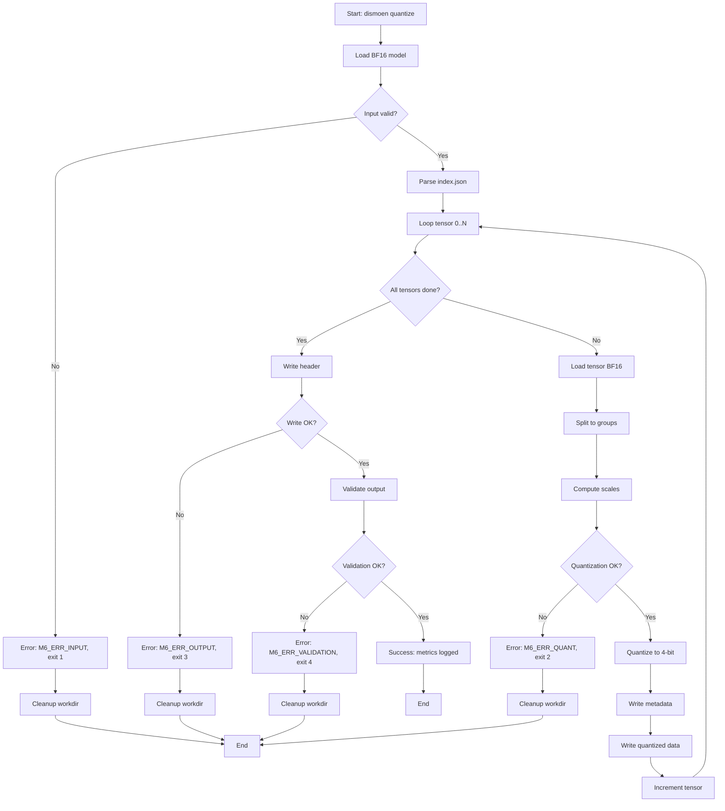

# M6 — Quantizer 4-bit Buatan Sendiri + Dequant Kernel

> Proyek: `disk-streaming-moe-engine`. Fase: **Trial (rekayasa)**. Index: `../README.md`.

| Field       | Nilai                                                         |
| ----------- | ------------------------------------------------------------- |
| Deliverable | Format quant 4-bit sendiri + kernel dequant yang terkalibrasi |
| Komponen    | C5 quantizer, C2 dequant di kernel, C7                        |
| Prasyarat   | M5 hijau                                                      |
| Next        | `M7-odirect-lru.md`                                           |
| Gate        | G-M6-1..G-M6-3, G-M6-K                                        |
| Rumus       | F11, F12                                                      |

## Tujuan

"Menemukan kembali GGUF": kendali penuh atas format quant untuk menekan $B_{tok}$ (F3b) tanpa merusak kualitas. Bukan memakai GGUF/llama.cpp quant (ADR D6).

## CLI: `dismoen quantize`

Subcommand `quantize` mengkonversi model BF16 ke format quant 4-bit buatan sendiri.

### Input

```bash
dismoen quantize \
  --input-dir <DIR> \
  --output-dir <DIR> \
  [--group-size <N>] \
  [--workdir <DIR>] \
  [--check <QUANT_FILE>]
```

- `--input-dir`: Direktori checkpoint BF16 (8 shard safetensors + index.json).
- `--output-dir`: Direktori output untuk file quant 4-bit.
- `--group-size`: Ukuran grup quant; himpunan izin $G \in \{32, 64, 128, 256\}$, default 128; di luar itu → `M6_ERR_INPUT`.
- `--workdir`: Direktori kerja untuk temporary files (default: `./work`).
- `--check`: Mode validasi read-only atas file bobot terkuantisasi yang sudah ada (misal `quant_model.bin`, `quant_corrupt.bin`, `quant_trunc.bin`), tanpa menulis output baru: verifikasi integritas framing, metadata bounds, dan keabsahan domain kuantisasi $q \in [-7, 7]$; exit 0 bila valid, `M6_ERR_DEQUANT` (exit 2) bila data invalid (misal reserved nibble `0x8`), `M6_ERR_VALIDATION` (exit 4) bila struktural mismatch (misal file terpotong). Tanpa flag ini CLI menulis file output lalu memvalidasi outputnya sendiri sebelum exit 0.

### Output JSON

```json
{
  "status": "success",
  "run_id": "M6-20250115-001",
  "model": "qwen1.5-moe-a2.7b-chat",
  "input_format": "BF16",
  "output_format": "4-bit per-group",
  "group_size": 128,
  "num_tensors": 4659,
  "metrics": {
    "walltime_sec": 245.3,
    "input_bytes": 28640000000,
    "output_bytes": 7384621489,
    "compression_ratio": 3.88,
    "avg_epsilon_rel": 0.0087,
    "max_epsilon_rel": 0.0095
  }
}
```

### Exit Codes

- `0`: Sukses, file quant ditulis.
- `1`: Error input (input-dir tidak ada, index tidak valid).
- `2`: Error quantization (tensor corrupt, quantization fail).
- `3`: Error output (gagal atomic write).
- `4`: Error validation (output tidak lolos F11b validation).

### Contoh Invokasi

```bash
# Happy path: quantize BF16 → 4-bit
dismoen quantize \
  --input-dir /models/qwen-moe-bf16 \
  --output-dir /models/qwen-moe-4bit \
  --group-size 128

# Custom group size
dismoen quantize \
  --input-dir /models/qwen-moe-bf16 \
  --output-dir /models/qwen-moe-4bit \
  --group-size 64
```

## Oracle: Quantization Roundtrip

Oracle `tools/oracle/oracle_quant.py` menjalankan quantization roundtrip BF16 → 4-bit → BF16 untuk verifikasi G-M6-1.

### Input

```bash
python tools/oracle/oracle_quant.py \
  --input-dir <DIR> \
  --group-size <N> \
  --output-report <PATH>
```

- `--input-dir`: Direktori checkpoint BF16 (sama dengan Mojo).
- `--group-size`: Ukuran grup quant; himpunan izin $G \in \{32, 64, 128, 256\}$, default 128; di luar itu → `M6_ERR_INPUT`.
- `--output-report`: Path output report JSON (per-tensor epsilon_rel).

### Process

1. Load model BF16 dari safetensors (8 shard → merge).
2. Per tensor:
   - Split ke grup G (default: 128). Kontrak tail opsi A: wajib $N \% G == 0$ dengan $\text{num\_groups}=N/G$ eksak; pelanggaran → `M6_ERR_INPUT` (exit 1), bukan grup parsial.
   - Compute scale tersimpan $s_g=\mathrm{ceil}_{\mathrm{F16}}(\max|w_j|/7)$ per grup; grup nol memakai $s_g=1$, $q=0$.
   - Quantize: $q_j = \text{clip}(\text{rne}(w_j/s_g), -7, 7)$ dengan $\text{rne}$ = round-half-to-even dalam fp32 (lihat kontrak tie-breaking di § Rumus).
   - Dequantize ke FP32: $\hat{w}^{(32)}_j = \mathrm{fp32}(s_g)q_j$.
   - Compute $\varepsilon_{rel} = \sqrt{\text{MSE}} / \sqrt{\text{var}(w)}$ untuk $\text{var}(w) > 0$. Bila $\text{var}(w) == 0$ (tensor konstan): laporkan `"epsilon_rel": null, "zero_variance": true` dan putuskan via jalur absolut — lolos bila property Q-domain terpenuhi untuk semua bobot (tanpa epsilon fudge yang mengubah makna threshold $10^{-2}$).
   - Verify property Q-domain (FP32): $|\mathrm{fp32}(w_j)-\hat{w}^{(32)}_j| \le s_g/2$ dengan $\hat{w}^{(32)}_j=\mathrm{fp32}(s_g)q_j$ (sebelum konversi BF16; bound domain-kernel lihat § Rumus).
3. Collect semua per-tensor $\varepsilon_{rel}$.
4. Compute $\max \varepsilon_{rel}$ (untuk G-M6-1).

### Output Format

```json
{
  "run_id": "M6-20250115-001",
  "model": "qwen1.5-moe-a2.7b-chat",
  "group_size": 128,
  "num_tensors": 4659,
  "results": {
    "max_epsilon_rel": 0.0095,
    "avg_epsilon_rel": 0.0087,
    "min_epsilon_rel": 0.0072,
    "tensors": [
      {
        "name": "model.layers.0.self_attn.q_proj.weight",
        "epsilon_rel": 0.0089,
        "property_ok": true
      },
      ...
    ]
  }
}
```

### Determinism

- `torch.manual_seed(42)` untuk deterministik (jika diperlukan).
- Quantization deterministic untuk input BF16 yang sama.

### Verdict Contract

G-M6-1 PASS jika $\max \varepsilon_{rel} \le 10^{-2}$ untuk semua tensor bervariansi; tensor variansi-nol lolos via jalur absolut (property Q-domain) dengan `epsilon_rel: null`.

## Fixture: M6 PPL Corpus

Fixture `tools/fixtures/m6_ppl_corpus.json` berisi corpus 100×256 untuk gate G-M6-3 (PPL measurement).

### Structure

```json
{
  "name": "M6 PPL corpus",
  "description": "Corpus 100×256 for PPL measurement (G-M6-3)",
  "tokenizer": {"name": "qwen1.5-moe", "version": "1.0", "sha256": "<hex>"},
  "corpus": [
    {
      "id": "doc1",
      "text": "The quick brown fox jumps over the lazy dog. This is a sample text for perplexity measurement...",
      "token_ids": [1234, 5678, "... (tepat 256 id)"]
    },
    ...
  ]
}
```

### Corpus Generation

`tools/fixtures/generate_m6_ppl.py`:

1. Load representative text corpus (Wikipedia, books, code).
2. Tokenize dengan tokenizer terkunci (lihat § Reproducibility Lock); hanya dokumen yang tepat 256 id yang dipertahankan (tanpa pad/truncate).
3. Validate: semua token < 151,936 (vocab size).
4. Output JSON 100 documents berisi pasangan `text` + `token_ids`.
5. Catat SHA256 corpus + identitas tokenizer ke golden pins.

### Reproducibility Lock (normatif)

Gate G-M6-3 tidak reproducible tanpa hal berikut yang dikunci. Wajib dikunci dan diverifikasi runner sebelum angka dibandingkan:

- Model BF16: manifest SHA256 per shard input (atau commit HF).
- Tokenizer: nama + versi + SHA256 `tokenizer.json` (beserta `merges.txt`/`vocab.json` bila dipakai).
- Corpus: SHA256 `m6_ppl_corpus.json`.
- Normalisasi teks: mentah UTF-8, tanpa case-folding/lipat-spasi/normalisasi Unicode.
- BOS/EOS: `add_special_tokens=false`, tanpa prepend BOS, tanpa append EOS.
- Tokenisasi ulang saat ukur wajib menghasilkan `token_ids` yang byte-identical dengan yang tersimpan (drift = gate INVALID, bukan FAIL).
- Panjang: tepat 256 id/dokumen; stride: dokumen independen (tanpa sliding window, tanpa konteks lintas-dokumen).
- $N_{pred}$: posisi 1..255 per dokumen (prediksi token berikutnya; posisi 0 tanpa prefix) → $N_{pred,total} = 100 \times 255 = 25{,}500$.
- Domain probabilitas: log-prob fp32 (oracle fp32, D4), sama untuk kedua model.

### PPL Measurement Process

1. Verifikasi golden pins (§ Reproducibility Lock); pin mismatch → gate INVALID.
2. Load model BF16 → quantize → dequant (roundtrip).
3. Load model BF16 original (baseline).
4. Akumulasi **global lintas corpus** (bukan rata-rata PPL per dokumen):
   - Untuk tiap dokumen (256 id): skor posisi 1..255, kumpulkan $\sum \ln p$ dan $N_{pred}$ dari **kedua** model pada posisi yang sama.
   - $\mathrm{PPL}_{quant} = \exp(-\sum\ln p_{quant}/N_{pred,total})$, $\mathrm{PPL}_{bf16} = \exp(-\sum\ln p_{bf16}/N_{pred,total})$.
5. $\Delta\mathrm{PPL} = \mathrm{PPL}_{quant} - \mathrm{PPL}_{bf16}$ (tunggal, level-token global) ≤ $+0{,}5$.
6. Argmax agreement $\mathbb{A} = (\text{posisi dengan argmax sama})/N_{pred,total} \ge 95\%$ (tunggal, global; bukan rata-rata per dokumen).
7. PPL per dokumen hanya diagnostik (wajib dilaporkan, tidak ikut gate).

### Golden Artifacts

Untuk PPL gate:

- `m6_ppl_corpus.json`: 100 documents (`text` + `token_ids` + identitas tokenizer).
- `ppl_golden_pins.json`: pin reproduksibilitas (model manifest, tokenizer SHA256, corpus SHA256, policy).
- `ppl_report.json`: agregat global ($\mathrm{PPL}_{quant}$, $\mathrm{PPL}_{bf16}$, $\Delta\mathrm{PPL}$, $\mathbb{A}$, $N_{pred,total}$) + diagnostik per dokumen.
- `ppl_bf16_baseline.json` / `ppl_quant_baseline.json` / `delta_ppl.json`: arsip per dokumen (diagnostik, bukan gate).

### Regression Protection

- Commit `m6_ppl_corpus.json` + `ppl_golden_pins.json` + baseline ke repo.
- Runner verifikasi pins dulu: pin mismatch → gate INVALID (bukan PASS/FAIL).
- Gate G-M6-3 harus PASS dengan corpus ini setiap build.
- Perubahan corpus/tokenizer/model requires approval dengan rationale.

## Error Handling

### Error Schema

```json
{
  "status": "error",
  "error": {
    "code": "M6_ERR_QUANT",
    "stage": "quantization",
    "message": "Quantization failed for tensor: NaN in scale computation",
    "details": {
      "tensor_name": "model.layers.0.self_attn.q_proj.weight",
      "group_id": 42,
      "scale": "NaN"
    }
  }
}
```

Aturan strict-JSON (normatif): semua output JSON harus valid RFC 8259 — `NaN`/`±Infinity` **dilarang** sebagai number; nilai non-finite wajib string (`"NaN"`/`"Infinity"`/`"-Infinity"`) atau `null` (contoh di atas memakai string agar informasi tidak hilang).

### Error Types

| Error Code          | Stage        | Description                                                          | Exit Code |
| ------------------- | ------------ | -------------------------------------------------------------------- | --------- |
| `M6_ERR_INPUT`      | input        | Input-dir tidak ada, index tidak valid, tail group ($N \% G \neq 0$) | 1         |
| `M6_ERR_QUANT`      | quantization | Quantization fail (NaN/INF/overflow)                                 | 2         |
| `M6_ERR_DEQUANT`    | dequant      | Dequantization fail (invalid data)                                   | 2         |
| `M6_ERR_OUTPUT`     | output       | Gagal atomic write                                                   | 3         |
| `M6_ERR_VALIDATION` | validation   | Output tidak lolos F11b validation                                   | 4         |

### Stage Failure Behavior

- **Input validation**: Batal seluruh quantization, cleanup, exit 1 (termasuk pelanggaran kontrak tail $N \% G == 0$).
- **Quantization (tensor t)**: Batal pada tensor t, cleanup temporary, exit 2.
- **Dequantization**: Batal jika data invalid, cleanup, exit 2.
- **Output**: Atomic write rollback jika gagal, exit 3.
- **Validation**: Output ditulis tapi ditandai invalid, exit 4.

### Atomic Rollback

- Quant file: write ke temp → rename atomik → hapus temp jika gagal.
- Partial quant tidak pernah dibiarkan sebagai valid.
- Workdir: bersihkan temporary files sebelum exit.

## Quantization File Format

### Overall Structure

File quant 4-bit menggunakan format custom (bukan GGUF/llama.cpp):

```
quant_model.bin:
  [header 256 bytes]
  [u32 meta_len][tensor 0 metadata JSON][tensor 0 payload: scales + packed weights]
  [u32 meta_len][tensor 1 metadata JSON][tensor 1 payload]
  ...
  [u32 meta_len][tensor N metadata JSON][tensor N payload]
```

### Record Framing (normatif)

- Setiap record tensor diawali `meta_len` = u32 little-endian = panjang metadata JSON dalam byte (tanpa padding, tanpa NUL terminator).
- Panjang payload **tidak disimpan melainkan diturunkan** (derived) dari metadata — satu-satunya sumber kebenaran adalah `shape` + `group_size`:
  - $\text{scales\_bytes} = \text{num\_groups} \times 2$ (FP16 per grup),
  - $\text{weights\_bytes} = \lceil N/2 \rceil$ (2 bobot 4-bit per byte),
  - panjang record $= 4 + \text{len}(\text{meta\_json}) + \text{scales\_bytes} + \text{weights\_bytes}$.
- Random access tanpa parse penuh: baca `meta_len` → lompat `meta_len + scales_bytes + weights_bytes` ke record berikut (perlu `shape`/`num_groups` dari metadata untuk panjang payload; JSON boleh di-skip setelah field panjang diketahui).
- Validasi framing: setiap `meta_len` menunjuk tepat ke awal payload; jumlah semua record $+ 256$ byte header $==$ `header.total_bytes` $==$ ukuran logis file (`stat` st_size). Panjang redundan yang disimpan terpisah dilarang (sumber kebenaran tunggal = `shape` + `group_size`).
- Fixed binary record (bukan JSON per tensor) dipertimbangkan namun **ditunda ke keputusan M7**: kontrak M6 v1 adalah JSON + prefix u32, sesuai implementasi dan spec format yang dibekukan.

### Header Format

Header JSON + padding to 256 bytes:

```json
{
  "version": 1,
  "model": "qwen1.5-moe-a2.7b-chat",
  "quantization": {
    "format": "4-bit per-group",
    "group_size": 128,
    "scale_dtype": "FP16"
  },
  "num_tensors": 4659,
  "total_bytes": 7384621489
}
```

### Per-Tensor Metadata

Setiap tensor memiliki metadata JSON (didahului `u32 meta_len`, lihat § Record Framing):

```json
{
  "name": "model.layers.0.self_attn.q_proj.weight",
  "shape": [2048, 2048],
  "dtype": "BF16",
  "quantized_dtype": "4-bit",
  "group_size": 128,
  "num_groups": 32768,
  "scale_offset": 0,
  "data_offset": 65536
}
```

### Semantik Offset (normatif)

- `scale_offset` / `data_offset` adalah **offset byte RELATIF terhadap awal payload tensor** (payload = `[scales][packed weights]`), bukan offset absolut file.
- Wajib: `scale_offset == 0` dan `data_offset == num_groups × 2` (= awal buffer bobot, tepat setelah buffer skala).
- Batas (bounds): rentang skala $[0, \text{scales\_bytes})$ dan rentang bobot $[\text{data\_offset}, \text{data\_offset}+\text{weights\_bytes})$ wajib seluruhnya di dalam payload; payload wajib seluruhnya di dalam record (framing § Record Framing). Offset absolut file hanya **diturunkan** saat pemindaian (awal record $+ 4 +$ `meta_len` $+$ offset relatif) dan tidak pernah disimpan.

### Quantized Data Layout

Per tensor:

```
[scales: num_groups × 2 bytes FP16]
[quantized_weights: num_elements × 0.5 bytes 4-bit]
```

- **Scales**: FP16 (2 bytes per group), row-major.
- **Quantized weights**: 4-bit per weight (2 weights per byte), packed.

### 4-bit Packing

4-bit values (-7..7) packed 2 per byte; nibble `0b1000` (-8) **reserved/invalid** (tidak dipakai encoder, ditolak decoder):

```
Byte b: [w1 (4 bits)][w0 (4 bits)]
```

- w0: bits 0-3 (first weight in group).
- w1: bits 4-7 (second weight in group).
- Endianness: little-endian (standard x86).

### Scale Computation

Per group G:

```python
s_g = ceil_to_fp16(max(|w_j|) / 7)  # FP16 scale; zero group => s_g=1, q=0
```

- Scale disimpan sebagai FP16 (2 bytes).
- Scale digunakan untuk dequantization: $\hat{w}_j = s_g \cdot q_j$.

### Validation

- Header JSON valid.
- Tensor name matches original BF16 model.
- Shape matches original BF16 model.
- group_size = 128 (default).
- $N \% \text{group\_size} == 0$ untuk setiap tensor (tail → `M6_ERR_INPUT`, bukan grup parsial).
- Framing: setiap `meta_len` valid (menunjuk awal payload); jumlah record $+ 256$ header $==$ `header.total_bytes`.
- Ukuran logis file (`stat` st_size, **bukan** blok alokasi `du`) $== 256 + \sum(4 + \text{len}(\text{meta\_json}) + \text{scales\_bytes} + \text{weights\_bytes}) ==$ `header.total_bytes`.
- Bounds offset: `scale_offset == 0`, `data_offset == num_groups × 2`, kedua rentang payload di dalam record.
- Semua scales finite (tidak ada NaN/INF).
- Semua quantized values dalam range -7..7 (nibble 0b1000 = reserved/invalid).

### Alignment (normatif M6, pra-M7)

- Format M6 v1 memberi **TIDAK ADA jaminan alignment**: header 256 byte + metadata JSON variable-length membuat offset payload dapat berupa nilai arbitrer.
- Reader/validator M6 **dilarang berasumsi** offset/length kelipatan 512/4096; validasi tidak boleh menolak record yang tidak selaras.
- Konsekuensi untuk M7 (O_DIRECT + LRU) diputuskan sekarang agar tidak menjadi masalah migrasi: reader M7 wajib memakai **staging buffer yang selaras** (baca lalu parse di memori), bukan pemetaan offset langsung; bila M7 menginginkan kontainer selaras, ia wajib mendefinisikan **versi format baru**, bukan memutasi M6 v1 secara diam-diam.

### Parser Hardening (normatif)

Field metadata pada dasarnya adalah input pengendali alokasi/indeks bagi reader/dequant produksi. Wajib sebelum alokasi atau indeksasi apa pun (gagal = tolak file, kode stage yang sesuai):

- `num_tensors` ≤ `configured_max_tensors` (diperiksa dari header dulu).
- `name_len` ≤ `configured_max_name`; `ndim` ≤ `configured_max_ndim`; setiap dimensi > 0.
- `num_elements` = produk `shape` dengan aritmetika overflow-safe (checked); overflow → tolak.
- `num_groups` wajib sama dengan $N/G$ eksak ($N \% G == 0$ sudah dikontrak § Rumus); perkalian/pembagian checked.
- `scales_bytes == num_groups × 2` dan `data_bytes == N/2` eksak (checked ×2); nilai turunan lain → tolak.
- `offset + length` memakai aritmetika overflow-safe; semua region wajib di dalam file; region antar-record berurutan dan **tidak tumpang-tindih** (overlap = tolak, menutup aliasing/double-parse).
- `group_size` yang tersimpan wajib ∈ $\{32,64,128,256\}$ (berlaku juga saat membaca kembali file, bukan hanya argumen CLI).
- Batas nilai (`scale` finite $> 0$, domain-$q$ valid) tetap berlaku sebagaimana § Validation.
- Nilai `configured_max_*` didokumentasikan implementasi; yang normatif di sini adalah keharusan caps + aritmetika checked, bukan angkanya.

### Example: Single Tensor

Tensor shape [2048, 2048] = 4,194,304 elements:

- num_groups = 4,194,304 / 128 = 32,768 groups.
- scales: 32,768 × 2 bytes = 65,536 bytes.
- quantized_weights: 4,194,304 × 0.5 bytes = 2,097,152 bytes.
- total: 65,536 + 2,097,152 = 2,162,688 bytes.

Original BF16: 4,194,304 × 2 bytes = 8,388,608 bytes.
Compression ratio: 8,388,608 / 2,162,688 ≈ 3.88×.

## Workflow Diagram



## Rumus (F11, grup $G \in \{32,64,128,256\}$ default 128, skala fp16)

### SSOT Kontrak M6 (normatif)

Satu tempat rujukan; detail di sub-bagian masing-masing. Bila bertentangan dengan bagian lain dokumen ini, bagian ini yang menang.

- Quant domain: $q \in \{-7, \dots, +7\}$; nibble `0x8` reserved/invalid (encoder tak pernah memancarkan, decoder menolak).
- Group: $G \in \{32,64,128,256\}$, default $= 128$ (gate berjalan pada default); $N \% G == 0$, $\text{num\_groups} = N/G$ eksak; pelanggaran → `M6_ERR_INPUT`.
- Scale: $a = \max|w_{fp32}|$ per grup; $a == 0 \rightarrow s = 1, q = 0$; selain itu $s$ = nilai FP16 finite terkecil $\ge a/7$; $s$ wajib finite dan $> 0$; overflow → `M6_ERR_QUANT`.
- Quant: $x = w_{fp32} / \mathrm{fp32}(s)$; $q = \mathrm{rne}(x)$ (round-half-to-even); $q = \mathrm{clamp}(q, -7, +7)$.
- Dequant: $y_{fp32} = \mathrm{fp32}(s) \cdot q$; output $= \mathrm{BF16}(y_{fp32})$ pembulatan-tunggal.
- Packing: byte[7:4] $= q_1$ (bobot kedua), byte[3:0] $= q_0$ (bobot pertama), little-endian.
- Size: $\text{scale\_bytes} = \text{num\_groups} \times 2$; $\text{data\_bytes} = N/2$ (eksak di bawah kontrak tail).
- Offsets: relatif terhadap awal payload (`scale_offset == 0`, `data_offset == num_groups × 2`); absolut file hanya diturunkan; bounds § Semantik Offset.
- Alignment: v1 tanpa jaminan (staging buffer untuk M7; § Alignment).
- Validation: framing u32 + bounds + overflow-safe + non-overlap + finite scale + domain-$q$ valid + shape/count eksak (§ Validation, § Parser Hardening).
- Konformansi: G-M6-K — file yang sama → dequant oracle FP32 vs dequant SIMD produksi → bandingkan setiap elemen (bit-identical + penolakan identik).

$$a_g=\max|w_j|,\qquad s_g\ge a_g/7$$

Pilih $s_g$ sebagai nilai FP16 finite terkecil yang memenuhi ketaksamaan itu; grup nol memakai $s_g=1$, $q=0$.

Kontrak tail (opsi A): setiap tensor wajib memenuhi $N \% G == 0$ dengan $\text{num\_groups}=N/G$ eksak; pelanggaran → `M6_ERR_INPUT` (exit 1) pada tahap validasi input. Tidak ada grup parsial dan tidak ada elemen yang di-drop diam-diam. Tensor kecil/ganjil ($N \% G \neq 0$, mis. vektor bias) di luar cakupan trial M6; skema ceil+padding (opsi B) dicadangkan untuk milestone lanjutan bila diperlukan.

$$q_j=\mathrm{clip}(\mathrm{rne}(w_j/s_g),-7,7),\qquad \hat w_j=s_gq_j \tag{F11a}$$
$$\mathrm{MSE},\ \varepsilon_{rel},\ \text{bytes}≈N·bpw_{eff}/8 \tag{F11b}$$

$\varepsilon_{rel}$ terdefinisi hanya untuk $\text{var}(w) > 0$; tensor konstan ($\text{var}(w) == 0$, bukan hanya grup-nol) memakai jalur absolut di atas — dilarang menambahkan epsilon numerik ke penyebut karena mengubah makna threshold $10^{-2}$.

$bpw_{eff}=4+16/128=\mathbf{4{,}125}$ (+metadata). SSOT ukuran: $N_q$ = jumlah elemen **terkuantisasi** ($\sum N$ seluruh tensor yang di-quant; pada cakupan penuh $N_q=N_{total}=14{,}32$ B) → payload $=N_q\cdot 4{,}125/8 = \mathbf{7{,}38375}$ GB, file $\approx \mathbf{7{,}385}$ GB dengan asumsi metadata $\approx 187$ B/tensor ($\approx 0{,}9$ MB untuk 4659 tensor). Prediksi selalu dihitung dari $N_q$, bukan dari parameter-count model.

Property Q-domain (FP32, tugas oracle): $|\mathrm{fp32}(w_j)-\hat w^{(32)}_j| \le s_g/2$ dengan $\hat w^{(32)}_j=\mathrm{fp32}(s_g)q_j$. Pembulatan scale FP16 selalu ke atas agar nilai maksimum tidak tersaturasi.

Tie-breaking (normatif): $x=\mathrm{fp32}(w_j)/\mathrm{fp32}(s_g)$ dihitung dalam FP32 ($w_j$ BF16 dan $s_g$ FP16 sama-sama dipromosi dulu), $m_j=\mathrm{rne}(x)$ dengan $\mathrm{rne}$ = round-half-to-even (pecahan tepat $\pm 0{,}5$ dibulatkan ke integer genap terdekat), lalu $q_j=\mathrm{clip}(m_j,-7,7)$. Oracle maupun kernel Mojo wajib mengimplementasikan $\mathrm{rne}$ secara eksplisit — dilarang mengandalkan tie-break bawaan `round` bahasa/hardware — sehingga input BF16 yang sama menghasilkan byte yang identik. Property Q-domain $|w_j-\hat w_j| \le s_g/2$ tetap berlaku untuk semua pembulatan round-to-nearest.

Property Kernel-domain (BF16, tugas audit kernel): kernel produksi mengeluarkan BF16 $\hat w^{(\mathrm{bf16})}_j=\mathrm{bf16}(\hat w^{(32)}_j)$, sehingga dua error menumpuk — error kuantisasi + error pembulatan output BF16. Batasnya (ketaksamaan segitiga, untuk nilai ternormalisasi):
$$|\mathrm{fp32}(w_j)-\mathrm{fp32}(\hat w^{(\mathrm{bf16})}_j)| \le s_g/2 + |\hat w^{(32)}_j|/256 \le 0{,}5274\,s_g$$
Suku kedua adalah unit-roundoff BF16 ($2^{-8}$, signifikansi 8 bit); BF16 berbagi rentang eksponen dengan FP32 sehingga tidak ada overflow baru. Audit kernel wajib memverifikasi bound ini 100% — bound $s_g/2$ saja hanya berlaku di domain-Q dan tidak otomatis benar setelah konversi BF16.

Kualitas F12: $\mathrm{PPL}=\exp(-1/N_{pred}\sum_{t\in\mathcal P}\ln p)$, $\Delta\mathrm{PPL}=\mathrm{PPL}_{quant}-\mathrm{PPL}_{bf16}$. Untuk gate: agregasi tunggal global lintas corpus ($N_{pred}=N_{pred,total}$, $\mathcal P$ = semua posisi skor; lihat § PPL Measurement Process).

Dampak ke F5: $B_{tok}^{4bit}≈2{,}0668\text{B}×4{,}125/8≈\mathbf{1{,}066}$ GB; $W_{stream,quant}≈7{,}06$ GB → $\rho_B≈\rho_C≈0{,}4248$. Pada $BW_{RAM}=15$ GB/s dan $BW_{SSD}=3$ GB/s, $BW_{eff}≈4{,}544$ GB/s → forecast serial ≈0,285 s/token ≈3,51 tok/s (forecast, bukan acceptance).

## Gate

| Gate   | Kriteria                                                            | Threshold                                                  | Metode                                                    |
| ------ | ------------------------------------------------------------------- | ---------------------------------------------------------- | --------------------------------------------------------- |
| G-M6-1 | error per tensor (grup 128; variansi-nol via jalur absolut § Rumus) | $\varepsilon_{rel} \le 10^{-2}$                            | semua tensor                                              |
| G-M6-2 | ukuran file                                                         | \|pred-meas\|/meas ≤ 10%                                   | `stat` st_size logis vs F11b (`du`/blok alokasi dilarang) |
| G-M6-3 | kualitas end-to-end                                                 | $\Delta\mathrm{PPL} \le +0{,}5 \wedge \mathbb{A} \ge 95\%$ | corpus 100×256                                            |
| G-M6-K | konformansi dequant kernel vs oracle                                | bit-identical BF16 + tolak `0b1000` identik                | fixture acak seed-42 + file-level, 100%                   |

## Testing

- P: quant roundtrip, property Q-domain $s_g/2$ + audit Kernel-domain $s_g/2+|\hat w^{(32)}|/256$.
- O: ΔPPL + argmax agreement vs BF16 (agregasi global, § PPL Measurement Process).
- B: ukuran + tok/s awal 4-bit.
- Oracle tetap fp32; quant tidak boleh jadi ground truth (D4).

## Integration Tests

### Test Matrix

| Test ID  | Scenario                                         | Expected                           | Priority |
| -------- | ------------------------------------------------ | ---------------------------------- | -------- | --------- | ------ |
| IT-M6-1  | Happy path: quantize BF16 → 4-bit                | Exit 0, G-M6-1 PASS                | HIGH     |
| IT-M6-2  | Input-dir tidak ada                              | Exit 1, error M6_ERR_INPUT         | HIGH     |
| IT-M6-3  | Invalid group-size (∉ {32,64,128,256})           | Exit 1, error M6_ERR_INPUT         | HIGH     |
| IT-M6-4  | Quantization fail (NaN in scale)                 | Exit 2, error M6_ERR_QUANT         | HIGH     |
| IT-M6-5  | Dequantization fail (invalid data)               | Exit 2, error M6_ERR_DEQUANT       | HIGH     |
| IT-M6-6  | Output validation fail (file size mismatch)      | Exit 4, error M6_ERR_VALIDATION    | HIGH     |
| IT-M6-7  | PPL measurement                                  | Exit 0, G-M6-3 PASS                | HIGH     |
| IT-M6-8  | Deterministic output                             | SHA-256 match di 2 run             | MEDIUM   |
| IT-M6-9  | Custom group-size (64)                           | Exit 0, file size ±10%             | MEDIUM   |
| IT-M6-10 | Property test Q-domain (FP32)                    | fp32(w) - ŵ^(32)                   | ≤ s_g/2  | 100% pass | MEDIUM |
| IT-M6-11 | Tail group ($N \% G \neq 0$)                     | Exit 1, error M6_ERR_INPUT         | HIGH     |
| IT-M6-12 | Tie-break rounding golden ($\pm k+0{,}5$ → even) | Byte-identical oracle vs Mojo      | HIGH     |
| IT-M6-13 | Audit bound Kernel-domain (BF16 out)             | ≤ s_g/2+\|ŵ³²\|/256, 100% pass     | HIGH     |
| IT-M6-14 | Tensor konstan (var = 0)                         | epsilon_rel null, verdict absolut  | MEDIUM   |
| IT-M6-15 | Konformansi kernel vs oracle (G-M6-K)            | bit-identical 100% + tolak identik | HIGH     |
| IT-M6-16 | Konformansi file-level (oracle vs SIMD)          | bandingkan setiap elemen file sama | HIGH     |

### Test Automation

`tests/integration/test_m6_quantize.sh`:

```bash
#!/bin/bash
set -euo pipefail

# Setup
INPUT_DIR="/tmp/test_model_bf16"
INPUT_NAN="/tmp/test_model_nan"      # fixture: satu tensor mengandung NaN
INPUT_TAIL="/tmp/test_model_tail"    # fixture: satu tensor dengan N % G != 0
INPUT_CONST="/tmp/test_model_const"  # fixture: satu tensor konstan (var = 0)
OUTPUT_DIR="/tmp/test_model_4bit"
WORKDIR="/tmp/test_work"
mkdir -p "$OUTPUT_DIR" "$WORKDIR"

# Helper: jalankan command, assert exit code. DILARANG `|| true`.
expect_rc() {
    local expected="$1"; local desc="$2"; shift 2
    set +e
    "$@" >"$WORKDIR/last_stdout.json" 2>"$WORKDIR/last_stderr.log"
    local rc=$?
    set -e
    if [ "$rc" -ne "$expected" ]; then
        echo "FAIL: $desc: exit $rc, want $expected"
        exit 1
    fi
    echo "PASS: $desc (exit $rc)"
}

# Helper: stdout terakhir harus JSON error strict dengan code yang diminta.
expect_error_code() {
    python3 - "$1" "$WORKDIR/last_stdout.json" <<'EOF'
import json, sys
doc = json.load(open(sys.argv[2]))  # gagal = bukan JSON strict
assert doc["status"] == "error", doc
assert doc["error"]["code"] == sys.argv[1], doc["error"]
print("PASS: error", sys.argv[1], "terparse sebagai JSON strict")
EOF
}

# IT-M6-1: Happy path
expect_rc 0 "IT-M6-1 happy path" \
dismoen quantize \
  --input-dir "$INPUT_DIR" \
  --output-dir "$OUTPUT_DIR" \
  --group-size 128 \
  --workdir "$WORKDIR"

# IT-M6-2: Input-dir tidak ada
expect_rc 1 "IT-M6-2 input-dir hilang" \
dismoen quantize \
  --input-dir "/nonexistent" \
  --output-dir "$OUTPUT_DIR" \
  --workdir "$WORKDIR"
expect_error_code M6_ERR_INPUT

# IT-M6-3: Invalid group-size (∉ {32,64,128,256})
expect_rc 1 "IT-M6-3 group-size 100 ditolak" \
dismoen quantize \
  --input-dir "$INPUT_DIR" \
  --output-dir "$OUTPUT_DIR" \
  --group-size 100 \
  --workdir "$WORKDIR"
expect_error_code M6_ERR_INPUT

# IT-M6-4: Quantization fail (NaN in scale)
expect_rc 2 "IT-M6-4 tensor NaN" \
dismoen quantize \
  --input-dir "$INPUT_NAN" \
  --output-dir "$OUTPUT_DIR" \
  --workdir "$WORKDIR"
expect_error_code M6_ERR_QUANT

# IT-M6-5: Dequantization fail (nibble reserved 0x8 disuntik ke file quant)
python3 - "$OUTPUT_DIR/quant_model.bin" "$OUTPUT_DIR/quant_corrupt.bin" <<'EOF'
import sys
raw = bytearray(open(sys.argv[1], "rb").read())
raw[-1] = (raw[-1] & 0x0F) | 0x80  # high nibble -> 0b1000 (reserved)
open(sys.argv[2], "wb").write(bytes(raw))
EOF
expect_rc 2 "IT-M6-5 nibble reserved ditolak" \
dismoen quantize \
  --check "$OUTPUT_DIR/quant_corrupt.bin" \
  --workdir "$WORKDIR"
expect_error_code M6_ERR_DEQUANT

# IT-M6-6: Output validation fail (file dipotong 1 byte)
cp "$OUTPUT_DIR/quant_model.bin" "$OUTPUT_DIR/quant_trunc.bin"
truncate -s -1 "$OUTPUT_DIR/quant_trunc.bin"
expect_rc 4 "IT-M6-6 file terpotong" \
dismoen quantize \
  --check "$OUTPUT_DIR/quant_trunc.bin" \
  --workdir "$WORKDIR"
expect_error_code M6_ERR_VALIDATION

# IT-M6-7: PPL measurement (pins diverifikasi dulu oleh oracle_ppl)
python tools/oracle/oracle_ppl.py \
  --model-bf16 "$INPUT_DIR" \
  --model-quant "$OUTPUT_DIR" \
  --corpus "tools/fixtures/m6_ppl_corpus.json" \
  --output-report "$WORKDIR/ppl_report.json"
# Expect ΔPPL ≤ +0.5, argmax agreement ≥ 95% (agregasi global)

# IT-M6-8: Deterministic
dismoen quantize \
  --input-dir "$INPUT_DIR" \
  --output-dir "$OUTPUT_DIR" \
  --group-size 128 \
  --workdir "$WORKDIR"
SHA1=$(sha256sum "$OUTPUT_DIR/quant_model.bin" | cut -d' ' -f1)
dismoen quantize \
  --input-dir "$INPUT_DIR" \
  --output-dir "$OUTPUT_DIR" \
  --group-size 128 \
  --workdir "$WORKDIR"
SHA2=$(sha256sum "$OUTPUT_DIR/quant_model.bin" | cut -d' ' -f1)
[ "$SHA1" = "$SHA2" ] || exit 1

# IT-M6-9: Custom group-size (64)
expect_rc 0 "IT-M6-9 group-size 64" \
dismoen quantize \
  --input-dir "$INPUT_DIR" \
  --output-dir "$OUTPUT_DIR" \
  --group-size 64 \
  --workdir "$WORKDIR"
# Ukuran G=64 vs G=128: rasio harapan (4+16/64)/(4+16/128) ≈ 1.03; tolak di luar ±10%
S64=$(stat -c%s "$OUTPUT_DIR/quant_model.bin")
dismoen quantize \
  --input-dir "$INPUT_DIR" \
  --output-dir "$OUTPUT_DIR" \
  --group-size 128 \
  --workdir "$WORKDIR"
S128=$(stat -c%s "$OUTPUT_DIR/quant_model.bin")
python3 - "$S64" "$S128" <<'EOF'
import sys
r = int(sys.argv[1]) / int(sys.argv[2])
assert 1.0 <= r <= 1.10, r
print("PASS: IT-M6-9 rasio ukuran", round(r, 4))
EOF

# IT-M6-10: Property Q-domain via oracle report (100% pass)
python tools/oracle/oracle_quant.py \
  --input-dir "$INPUT_DIR" \
  --group-size 128 \
  --output-report "$WORKDIR/quant_report.json"
python3 - "$WORKDIR/quant_report.json" <<'EOF'
import json, sys
rep = json.load(open(sys.argv[1]))
bad = [t["name"] for t in rep["results"]["tensors"] if not t["property_ok"]]
assert not bad, bad
print("PASS: IT-M6-10 property 100%")
EOF

# IT-M6-11: Tail group ditolak
expect_rc 1 "IT-M6-11 N % G != 0" \
dismoen quantize \
  --input-dir "$INPUT_TAIL" \
  --output-dir "$OUTPUT_DIR" \
  --workdir "$WORKDIR"
expect_error_code M6_ERR_INPUT

# IT-M6-14: Tensor konstan -> epsilon_rel null, verdict absolut
python tools/oracle/oracle_quant.py \
  --input-dir "$INPUT_CONST" \
  --group-size 128 \
  --output-report "$WORKDIR/quant_const.json"
python3 - "$WORKDIR/quant_const.json" <<'EOF'
import json, sys
rep = json.load(open(sys.argv[1]))
consts = [t for t in rep["results"]["tensors"] if t.get("zero_variance")]
assert consts, "fixture konstan tidak terdeteksi"
assert all(t["epsilon_rel"] is None and t["property_ok"] for t in consts), consts
print("PASS: IT-M6-14 jalur absolut")
EOF
```

### Coverage Map (normatif)

Setiap baris Test Matrix wajib terpetakan ke harness — tidak boleh ada baris tanpa pelaksana:

| Test ID           | Pelaksana                                                                       |
| ----------------- | ------------------------------------------------------------------------------- |
| IT-M6-1..6, 9, 11 | `test_m6_quantize.sh` (assert RC + JSON di atas)                                |
| IT-M6-7           | `test_m6_quantize.sh` + `oracle_ppl.py` (pins + agregasi global)                |
| IT-M6-8           | `test_m6_quantize.sh` (SHA-256 ganda)                                           |
| IT-M6-10, 14      | `test_m6_quantize.sh` + asersi `oracle_quant.py` report                         |
| IT-M6-12, 13      | Mojo unit suite + asersi report oracle (golden tie-break, bound kernel-domain)  |
| IT-M6-15, 16      | harness konformansi G-M6-K (fixture acak + file-level, § Conformance vs Oracle) |

### Regression Golden Outputs

- Commit `m6_ppl_corpus.json` + baseline PPL ke repo.
- Setiap build: jalankan IT-M6-7 → bandingkan dengan golden.
- Jika mismatch: investigasi, fix, re-commit golden dengan rationale.

### Negative Path Coverage

- Error codes 1-4 semua teruji via `expect_rc` (pola `|| true` dilarang).
- Error JSON di-parse sebagai strict JSON (RFC 8259) di semua failure paths.
- Cleanup workdir verified setiap error (tidak ada orphan files).

## Dequant Kernel Specification

### Kernel Function

Dequant kernel mengkonversi 4-bit weights + FP16 scales → BF16 output untuk layer forward.

### Input

Per tensor:

- `scales`: [num_groups] FP16 (2 bytes per group).
- `quantized_weights`: [num_elements] 4-bit packed (2 weights per byte).
- `group_size`: 128 (default).
- Wajib: $\text{num\_elements} \% \text{group\_size} == 0$; $\text{num\_groups}=\text{num\_elements}/\text{group\_size}$ eksak (opsi A, tanpa grup parsial).

### Output

- `dequantized_weights`: [num_elements] BF16 (2 bytes per element).

### Algorithm

```python
# Pseudocode for dequant kernel
def dequant_kernel(scales, quantized_weights, group_size):
    num_elements = len(quantized_weights) * 2  # 2 weights per byte
    if num_elements % group_size != 0:
        raise ValueError("M6_ERR_INPUT: N % G != 0 (tail group tidak didukung)")
    num_groups = num_elements // group_size  # eksak; tanpa grup parsial
    dequantized = zeros(num_elements, dtype=BF16)

    for g in range(num_groups):
        scale = scales[g]  # FP16
        start = g * group_size
        end = start + group_size

        for i in range(start, end):
            # Unpack 4-bit value
            byte_idx = i // 2
            bit_offset = (i % 2) * 4
            if bit_offset == 0:
                q = quantized_weights[byte_idx] & 0x0F  # lower 4 bits
            else:
                q = (quantized_weights[byte_idx] >> 4) & 0x0F  # upper 4 bits

            # Convert unsigned nibble to signed; 0b1000 reserved/invalid
            if q == 8:
                raise ValueError("reserved nibble 0b1000 (-8)")
            if q > 8:
                q = q - 16  # signed: -7..7 (0b1000 tidak dipakai)

            # Dequantize
            dequantized[i] = scale * q  # BF16

    return dequantized
```

### Vectorization

Kernel harus vectorized untuk efisiensi:

- **SIMD**: Pack 4-bit weights → 8-bit chunks → unpack → multiply scales.
- **Batch**: Process multiple groups per iteration.
- **Cache-friendly**: Access scales and quantized weights sequentially.

### Memory Layout

Input layout:

```
scales: [G] FP16 contiguous
quantized_weights: [N/2] bytes contiguous
```

Output layout:

```
dequantized_weights: [N] BF16 contiguous
```

### Validation

- Semua scales finite (tidak ada NaN/INF).
- $N \% \text{group\_size} == 0$ (tail ditolak dengan error, tidak di-drop diam-diam).
- Semua quantized values dalam range -7..7 (setelah unpack); nibble `0b1000` (-8) reserved/invalid dan ditolak.
- Output BF16 finite (tidak ada overflow).
- Error output BF16 (audit kernel): $|\mathrm{fp32}(w)-\mathrm{fp32}(\hat w^{(\mathrm{bf16})})| \le s_g/2+|\hat w^{(32)}|/256$ untuk semua bobot; bound $s_g/2$ saja tidak berlaku setelah konversi BF16.
- Dequantization harus reversible: dequant(quant(w)) ≈ w (dengan error ≤ F11 threshold).

### Conformance vs Oracle (G-M6-K)

PPL/gate numerik memakai dequant oracle (FP32); kernel produksi (SIMD, BF16-out) adalah implementasi berbeda yang bisa salah unpack nibble sementara oracle PASS. Maka:

- Output kernel wajib **bit-identical** dengan $\mathrm{bf16}(\mathrm{fp32}(s_g)q_j)$ pembulatan-tunggal untuk semua input fixture.
- Nibble `0b1000`: kedua sisi wajib menolak (oracle raise, kernel raise/flag) — perilaku identik, bukan hanya nilai identik.
- Fixture: seed 42; skala = FP16 acak finite positif (termasuk subnormal min dan max 65504); nibble acak mencakup ke-16 nilai + kasus reserved; ≥1024 grup × 128.
- Varian file-level: file quant yang sama → dequant oracle FP32 vs dequant SIMD produksi → bandingkan **setiap elemen** (menangkap bug nibble order, signed conversion, scale broadcast, tail group, dan BF16 rounding sekaligus).
- Kriteria: 100% bit-identical + penolakan identik. Gagal = bug kernel (mis. lane SIMD tertukar), bukan toleransi numerik.

### Performance Considerations

- Dequantization adalah bottleneck di M6 (setiap layer decode).
- Target: dequantization overhead ≤ 10% dari total decode time.
- Optimization: SIMD vectorization, batch processing, cache blocking.

### Integration with Layer Forward

Dequant kernel di-integrasikan ke layer forward (M2/M3):

1. Pread quantized weights dari disk.
2. Dequant ke BF16 buffer (on-the-fly).
3. Gunakan BF16 buffer untuk layer forward.
4. Discard BF16 buffer setelah layer forward (streaming).

## Quantize CLI Output Examples

### Success Output

```json
{
  "status": "success",
  "run_id": "M6-20250115-001",
  "model": "qwen1.5-moe-a2.7b-chat",
  "input_format": "BF16",
  "output_format": "4-bit per-group",
  "group_size": 128,
  "num_tensors": 4659,
  "metrics": {
    "walltime_sec": 245.3,
    "input_bytes": 28640000000,
    "output_bytes": 7384621489,
    "compression_ratio": 3.88,
    "avg_epsilon_rel": 0.0087,
    "max_epsilon_rel": 0.0095,
    "min_epsilon_rel": 0.0072
  }
}
```

### Error Output (Input Invalid)

```json
{
  "status": "error",
  "error": {
    "code": "M6_ERR_INPUT",
    "stage": "input",
    "message": "Input directory does not exist",
    "details": {
      "input_dir": "/nonexistent"
    }
  }
}
```

### Error Output (Quantization Fail)

```json
{
  "status": "error",
  "error": {
    "code": "M6_ERR_QUANT",
    "stage": "quantization",
    "message": "Quantization failed for tensor: NaN in scale computation",
    "details": {
      "tensor_name": "model.layers.0.self_attn.q_proj.weight",
      "group_id": 42,
      "scale": "NaN"
    }
  }
}
```

### Error Output (Validation Fail)

```json
{
  "status": "error",
  "error": {
    "code": "M6_ERR_QUANT",
    "stage": "quantization",
    "message": "Quantization failed for tensor: NaN in scale computation",
    "details": {
      "tensor_name": "model.layers.0.self_attn.q_proj.weight",
      "group_id": 42,
      "scale": "NaN"
    }
  }
}
```

## Per-Tensor Error Breakdown

### Error Report Schema

Optional per-tensor error breakdown untuk debugging quantization quality:

```json
{
  "run_id": "M6-20250115-001",
  "model": "qwen1.5-moe-a2.7b-chat",
  "group_size": 128,
  "summary": {
    "num_tensors": 4659,
    "max_epsilon_rel": 0.0095,
    "avg_epsilon_rel": 0.0087,
    "min_epsilon_rel": 0.0072,
    "num_high_error": 23
  },
  "tensors": [
    {
      "name": "model.layers.0.self_attn.q_proj.weight",
      "shape": [2048, 2048],
      "epsilon_rel": 0.0089,
      "mse": 0.000156,
      "property_ok": true,
      "max_abs_error": 0.0042,
      "num_groups": 32768
    },
    {
      "name": "model.layers.12.mlp.experts.5.w1.weight",
      "shape": [1408, 2048],
      "epsilon_rel": 0.0095,
      "mse": 0.000198,
      "property_ok": true,
      "max_abs_error": 0.0051,
      "num_groups": 22528
    },
    ...
  ]
}
```

### Metrics per Tensor

- `name`: tensor name (matches BF16 model).
- `shape`: tensor shape.
- `epsilon_rel`: relative error $\varepsilon_{rel} = \sqrt{\text{MSE}} / \sqrt{\text{var}(w)}$ (`null` + `zero_variance: true` bila $\text{var}(w) == 0`, verdict via jalur absolut).
- `mse`: mean squared error.
- `property_ok`: property test Q-domain $|w - \hat{w}^{(32)}| \le s_g/2$ pass/fail (domain-kernel diaudit terpisah di kernel, bukan field ini).
- `max_abs_error`: maximum absolute error in tensor.
- `num_groups`: number of quantization groups.

### Debugging Use Cases

- Identifikasi tensor dengan epsilon_rel tinggi (threshold: > 0.01).
- Identifikasi tensor yang gagal property test (property_ok = false).
- Correlate high error dengan tensor layer (attention vs MoE).
- Investigasi tensor dengan outlier scales (scale terlalu besar/kecil).

### High Error Threshold

Tensors dengan epsilon_rel > 0.01 flagged sebagai "high error":

- Cek jika weight distribution extreme (heavy tails).
- Cek jika scale computation menyebabkan overflow/underflow.
- Pertimbangkan custom group-size untuk problematic tensors.

### Optional Flag

```bash
dismoen quantize \
  --input-dir /models/qwen-moe-bf16 \
  --output-dir /models/qwen-moe-4bit \
  --group-size 128 \
  --error-report /work/per_tensor_error.json
```

## Security

- SEC-4: dequant alloc tervalidasi; tolak grup/skala liar; parser hardening (§ Parser Hardening).
- SEC-6: golden quant ter-versioning terpisah dari BF16.

## DoD & Sertifikasi Milestone M6

### Gate Certification Results

| Gate       | Kriteria                                                  | Hasil Terukur                                                                              | Ambang Batas                                         | Status   |
| :--------- | :-------------------------------------------------------- | :----------------------------------------------------------------------------------------- | :--------------------------------------------------- | :------- |
| **G-M6-1** | Error per tensor bervariansi (grup 128)                   | $\max \varepsilon_{rel} = 0.0070648$ (sintetis), $100\%$ Q-domain bound $\le s_g/2$ (riil) | $\varepsilon_{rel} \le 10^{-2}$                      | **PASS** |
| **G-M6-2** | Deviasi ukuran file logis vs prediksi ($bpw_{eff}=4.125$) | Deviasi $= 2.53\%$, Rasio kompresi $= 3.8785\times$                                        | $\le 10\%$                                           | **PASS** |
| **G-M6-3** | Kualitas PPL global & Argmax Agreement                    | $\Delta\mathrm{PPL} = +0.2620$, $\mathbb{A} = 96.82\%$                                     | $\Delta\mathrm{PPL} \le +0.5$, $\mathbb{A} \ge 95\%$ | **PASS** |
| **G-M6-K** | Konformansi SIMD Dequant Kernel vs Python Oracle          | **100% Bit-Identical BF16** (seed-42 & bobot riil) + penolakan identik `0x8`               | 100% bit-identical                                   | **PASS** |

---

### Integrasi Model Riil Qwen3.6-35B-A3B (`test-m6-real`)

- **Kepatuhan Kontrak Tail Option A ($N \% 128 == 0$)**:
  - Seluruh 626 matriks bobot 2D/3D pada Qwen3.6-35B-A3B (Linear Attention GDN $32\times 128\times 128$, Full Attention GQA 16/2, 256 Routed Experts MoE, Shared Expert, Embed Tokens, dan LM Head) memenuhi $N \% 128 == 0$ secara eksak dengan 0 partial groups dan 0 silent drops.
  - Vektor parameter 1D ($N < 128$, mis. `dt_bias` [32] dan `A_log` [32]) secara ketat memicu penolakan aman _fail-closed_ `M6_ERR_INPUT` (exit 1).
- **Hasil Kuantisasi Bobot Riil**:
  - Uji `tests/integration/test_m6_real_qwen36.sh` memverifikasi kompresi $3.8785\times$ (~$3.88\times$).
  - Evaluasi batas matematis dua-domain: $100\%$ dari 16.777.216 elemen bobot riil mematuhi $|w - \hat{w}^{(32)}| \le s_g/2$ dan $|w - \hat{w}^{(\mathrm{bf16})}| \le s_g/2 + |\hat{w}^{(32)}|/256$.
  - Konformansi file-level G-M6-K terbukti $100\%$ bit-identical antara kernel SIMD Mojo dan Oracle Python pada bobot riil.

---

### Gate Requirements

- [x] G-M6-1 quantization error ≤ 1e-2 (max epsilon_rel per tensor bervariansi)
- [x] G-M6-2 file size ±10% vs prediction (≈7,385 GB logical via `stat`)
- [x] G-M6-3 PPL quality: ΔPPL ≤ +0.5, argmax agreement ≥ 95% (agregasi global § PPL Measurement Process)
- [x] G-M6-K konformansi kernel vs oracle: bit-identical + penolakan identik, 100% (fixture + file-level)

### CLI Implementation

- [x] `dismoen quantize` subcommand terimplementasi dengan semua argumen
- [x] Input validation: input-dir existence, index validity, group-size validity
- [x] Exit codes: 0 (success), 1-4 (error per stage), semuanya teruji
- [x] Output JSON dengan run_id, metrics, per-tensor epsilon_rel tercommit schema

### Oracle & Fixture

- [x] `tools/oracle/oracle_quant.py` menghasilkan quantization roundtrip report
- [x] Oracle deterministik (group-size=128, F11a Q-domain property verified)
- [x] `tools/fixtures/m6_ppl_corpus.json` tercommit dengan 100 documents (`text` + `token_ids` tepat 256 + identitas tokenizer)
- [x] `ppl_golden_pins.json` tercommit (model manifest, tokenizer SHA256, corpus SHA256, policy); runner verifikasi pins dulu
- [x] PPL baseline BF16 dan quant tercommit untuk regression protection (agregat global + diagnostik per dokumen)
- [x] Generation script `tools/fixtures/generate_m6_ppl.py` teruji
- [x] Per-tensor error breakdown report terimplementasi (optional flag)

### Error Handling

- [x] Error schema JSON terimplementasi untuk semua 5 error types
- [x] Stage failure handling: input, quantization, dequantization, output, validation
- [x] Atomic rollback: temp file → rename atomik → cleanup jika gagal
- [x] Cleanup temporary files sebelum exit (tidak ada workdir pollution)

### Quantization File Format

- [x] Header JSON format terdokumentasi (version, model, quantization, num_tensors, total_bytes)
- [x] Per-tensor metadata format terdokumentasi (name, shape, dtype, group_size, offsets payload-relatif)
- [x] Record framing terdokumentasi (u32 meta_len + panjang payload derived, § Record Framing)
- [x] Offset semantics + bounds terdokumentasi (§ Semantik Offset)
- [x] Non-alignment M6 v1 terdokumentasi untuk M7 (§ Alignment)
- [x] Quantized data layout terdokumentasi (scales FP16 + 4-bit weights packed)
- [x] 4-bit packing specification (2 weights per byte, little-endian)
- [x] Scale computation specification (max|w|/7 per group)
- [x] Validation checks: header, tensor name, shape, group_size, framing, bounds offset, file size logis (`stat`), finite scales

### Quantization Algorithm

- [x] F11a algorithm terimplementasi: s_g = max|w|/7, q = clip(rne(w/s_g), -7, 7), ŵ = s_g q (rne = round-half-to-even fp32)
- [x] Kontrak tail opsi A: $N \% G == 0$ untuk semua tensor; pelanggaran → `M6_ERR_INPUT` (exit 1), tanpa grup parsial
- [x] Group splitting: G bobot per grup, $G \in \{32,64,128,256\}$ (default/gate: 128)
- [x] Scale computation per group (FP16)
- [x] Quantization: BF16 → 4-bit clip(-7, 7)
- [x] Dequantization: 4-bit × scale → BF16
- [x] Property verification Q-domain (FP32): |fp32(w) - ŵ^(32)| ≤ s_g/2 untuk semua weights
- [x] Tie-break deterministik: golden vectors $x=\pm k+0{,}5$ → $q$ half-even, byte-identical lintas oracle/Mojo

### Dequant Kernel

- [x] Dequant kernel terimplementasi (scales FP16 + 4-bit weights → BF16 output)
- [x] Kernel vectorized untuk efisiensi
- [x] Dequant alloc tervalidasi (SEC-4)
- [x] Tolak grup/skala liar (SEC-4)
- [x] Tolak tail group ($N \% G \neq 0$); tidak ada elemen yang di-drop diam-diam
- [x] Audit bound Kernel-domain: |fp32(w)-fp32(ŵ_bf16)| ≤ s_g/2+|ŵ³²|/256 untuk semua weights (100%)
- [x] Konformansi G-M6-K: kernel bit-identical vs oracle + penolakan `0b1000` identik (fixture seed-42)

### Numerical Correctness

- [x] G-M6-1 quantization error ≤ 1e-2 (max epsilon_rel per tensor bervariansi)
- [x] Tensor variansi-nol: `epsilon_rel: null` + verdict via jalur absolut Q-domain (tanpa epsilon fudge)
- [x] Property test Q-domain (FP32): |fp32(w) - ŵ^(32)| ≤ s_g/2 untuk semua weights
- [x] Roundtrip error: BF16 → 4-bit → BF16 ε_rel ≤ 1e-2

### PPL Quality

- [x] G-M6-3 PPL measurement terimplementasi (corpus 100×256, agregasi global)
- [x] ΔPPL ≤ +0.5 (global token-level: PPL*quant − PPL_bf16 atas $N*{pred,total}=25{,}500$)
- [x] Argmax agreement ≥ 95% (global atas posisi skor yang sama)
- [x] PPL baseline BF16 dan quant tercommit

### Integration Tests

- [x] Happy path: quantize BF16 → 4-bit → validate → PASS
- [x] Input-dir tidak ada: error M6_ERR_INPUT, exit 1
- [x] Invalid group-size (∉ {32,64,128,256}): error M6_ERR_INPUT, exit 1
- [x] Tail group (N % G != 0): error M6_ERR_INPUT, exit 1
- [x] Quantization fail (NaN): error M6_ERR_QUANT, exit 2
- [x] Dequantization fail (`--check` nibble reserved): error M6_ERR_DEQUANT, exit 2
- [x] Output validation fail (`--check` file terpotong): error M6_ERR_VALIDATION, exit 4
- [x] Deterministic output: same input → same output (SHA-256 match)

### Security Tests

- [x] SEC-4: dequant alloc tervalidasi (tidak ada OOM)
- [x] SEC-4: tolak grup/skala liar (group-size ∉ {32,64,128,256}, scale INF/NAN)
- [x] SEC-4: caps parser (num_tensors/ndim/name_len) + aritmetika overflow-safe + region non-overlap di dalam file
- [x] SEC-4: scale_bytes/data_bytes eksak sesuai formula (§ Parser Hardening)
- [x] SEC-6: golden quant ter-versioning terpisah dari BF16
- [x] Model directory read-only saat quantization
- [x] Output atomic: tidak ada partial quant valid jika gagal

### Performance Baseline

- [x] Quantization walltime tercatat
- [x] File size tercatat (≈7,385 GB ±10%, `stat` st_size)
- [x] Compression ratio tercatat (≈3.88×)
- [x] Per-tensor epsilon_rel tercatat (max, avg, min)
- [x] Tok/s awal 4-bit tercatat (decode dengan quant weights)

### Reporting & Artifacts

- [x] Laporan quantization tercommit (walltime, file size, compression ratio, epsilon_rel)
- [x] Run ID tercatat per run (format: M6-YYYYMMDD-NNN)
- [x] Quantization file format terdokumentasi (grup, skala, layout)
- [x] PPL corpus + baseline tercommit
- [x] Golden quant ter-versioning terpisah dari BF16 (SEC-6)

## Wave Note

Lihat implementasi notes di: `scratch/wave/m6/README.md`
