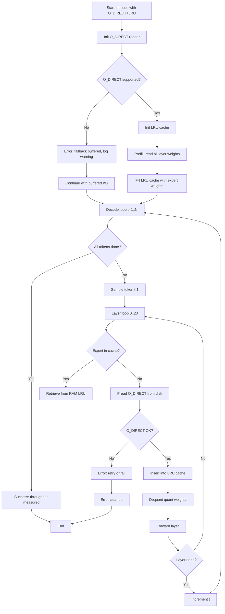

# M7 — O_DIRECT + LRU Cache Expert (Pola kimi-k3-in-c)

> Proyek: `disk-streaming-moe-engine`. Fase: **Trial (rekayasa, puncak performa trial)**. Index: `../README.md`.
> Implementasi dipecah menjadi waves: `../../scratch/wave/m7/README.md` (W1 o-direct-reader → W6 gates, catatan kerja gitignored).

| Field       | Nilai                                                        |
| ----------- | ------------------------------------------------------------ |
| Deliverable | Reader O_DIRECT + LRU cache expert dengan model terkalibrasi |
| Komponen    | C6 io_direct + LRU, C3 evolusi pread, C7 benchmark           |
| Prasyarat   | M5, M6 hijau (butuh KV + quant untuk $B_{tok}^{4bit}$)       |
| Next        | `M8-gdn.md`                                                  |
| Gate        | G-M7-1..G-M7-5                                               |
| Rumus       | F13, F5 (koreksi F9), F3b-quant, F16, F17                    |

## Tujuan

Buktikan kebenaran dulu (M0–M6), optimasi I/O kemudian (D7): bypass page cache untuk kontrol penuh + cache expert panas di RAM, mengikuti pola `kimi-k3-in-c`.

## O_DIRECT Reader Specification

### O_DIRECT Basics

O_DIRECT bypasses page cache untuk I/O langsung ke storage (bypass kernel buffer). Ini memberikan kontrol penuh atas buffer alignment dan memory management.

### Alignment Requirements (Triple Alignment)

O_DIRECT requires triple alignment (buffer, offset, length):

- **Buffer alignment**: Buffer harus kelipatan block size (default: 512 bytes).
- **Offset alignment**: File offset harus kelipatan block size.
- **Length alignment**: Read length harus kelipatan block size.

Misaligned O_DIRECT → `EINVAL` atau fallback ke buffered I/O (tergantung filesystem).

### Block Size

- Default block size: 512 bytes (disk sector size).
- Modern NVMe: 4 KB page size (rekomendasi).
- Engine menggunakan 4 KB block size untuk alignment.

### Short Read Handling

O_DIRECT `pread` bisa mengembalikan fewer bytes than requested (short read):

```python
# Pseudocode for short read loop
def pread_o_direct(fd, buffer, offset, length):
    total_read = 0
    while total_read < length:
        n = pread(fd, buffer[total_read:], offset + total_read, length - total_read)
        if n == 0:
            break  # EOF
        if n < 0:
            return error  # EAGAIN/EINTR
        total_read += n
    return total_read
```

Short read bukan error → loop sampai length terpenuhi atau EOF.

### Error Handling

| Error    | Description                     | Handling                         |
| -------- | ------------------------------- | -------------------------------- |
| `EINVAL` | Misaligned buffer/offset/length | Fallback to buffered I/O or fail |
| `EAGAIN` | Non-blocking I/O would block    | Retry                            |
| `EINTR`  | Interrupted by signal           | Retry                            |
| `ENOSPC` | No space left on device         | Fail (disk full)                 |
| `EIO`    | I/O error (disk failure)        | Fail                             |

### Buffer Management

- Buffer allocation: aligned_alloc(4 KB, size).
- Buffer lifetime: allocate before read → free after read.
- No double allocation untuk satu read operation.

### Integration with Layer Streaming

Per layer (M2/M3):

1. Pre-allocate aligned buffer untuk layer weights.
2. Pread O_DIRECT dari shard → buffer.
3. Dequant (M6) jika quant weights.
4. Forward layer.
5. Free buffer → next layer.

### O_DIRECT Flag

```c
// C-style (Mojo equivalent)
int fd = open(path, O_RDONLY | O_DIRECT);
```

Jika O_DIRECT tidak didukung oleh filesystem, fallback ke buffered I/O dengan warning.

## LRU Cache Specification

### Cache Purpose

LRU (Least Recently Used) cache menyimpan expert weights yang sering diakses di RAM untuk mengurangi disk I/O (expert miss pattern F17b).

### Cache Capacity

- Default capacity: dari config (MB).
- Dynamic: bisa disesuaikan berdasarkan available RAM.
- Constraint: capacity ≤ available RAM after resident weights + KV cache.

### Cache Policy

**Eviction policy**: LRU (Least Recently Used)

- Setiap access: update timestamp.
- Cache full: evict least recently used entry.
- Expert weights entry: one expert per entry (not per layer).

### Expert Pinning

Untuk workload dengan routing CV tinggi (expert panas), pin expert panas di LRU:

- **Hot expert**: expert dengan high access frequency (dari F9 diagnostik).
- **Pinning**: never evict hot expert dari cache.
- **Capacity allocation**: reserve subset of cache for pinned experts.

### Cache Entry Structure

```python
class CacheEntry:
    key: (layer_id, expert_id)  # expert identifier
    data: bytes                  # expert weights (quantized or BF16)
    timestamp: int               # last access time
    access_count: int            # access frequency
    pinned: bool                # hot expert flag
```

### Cache Hit/Miss Tracking

- **Hit**: expert found in cache → retrieve from RAM.
- **Miss**: expert not in cache → read from disk → insert into cache.
- **Hit rate**: $HR = \text{hits} / (\text{hits} + \text{misses})$.

### Cache Statistics

Per run:

- Total hits.
- Total misses.
- Hit rate (HR).
- Eviction count.
- Pinned expert count.

### Cache Warm-up

- Cold start: cache empty → all reads from disk.
- Warm-up: after several decode runs, cache fills with hot experts.
- Steady state: HR stabilizes → cache effective.

### Cache Integration with O_DIRECT Reader

Per layer decode:

1. Check if expert weights in cache (hit).
2. If hit: retrieve from RAM → dequant → forward.
3. If miss: pread O_DIRECT from disk → insert into cache → dequant → forward.
4. Update timestamp/access count.
5. If cache full → evict LRU entry.

### F9 Routing Diagnostics Integration

Use F9 (load-balance diagnostik) dari M3 untuk:

- Identify hot experts (high frequency $f_i$).
- Compute routing CV (coefficient of variation).
- Pin hot experts if CV high (imbalance routing).
- Adjust ρ effective in F5 model.

## M7-Specific Fixture: I/O Pattern Benchmark

Fixture `tools/fixtures/m7_io_patterns.json` berisi workload untuk benchmark dua pola I/O (F17).

### Structure

```json
{
  "name": "M7 I/O pattern benchmark",
  "description": "Workload for sequential trunk and expert-miss I/O patterns",
  "patterns": [
    {
      "id": "trunk_sequential",
      "name": "Sequential large blocks (trunk pattern F17a)",
      "block_size": 4194304,
      "block_count": 100,
      "pattern": "sequential",
      "queue_depth": 1,
      "description": "Read 4 MB blocks sequentially (QD1) for G-M7-1"
    },
    {
      "id": "expert_miss",
      "name": "Expert-size blocks jumping (LRU-miss pattern F17b)",
      "block_size": 10485760,
      "block_count": 100,
      "pattern": "random_jump",
      "queue_depth": 16,
      "description": "Read 10 MB blocks jumping between offsets (QD sweep) for G-M7-5"
    }
  ]
}
```

### Trunk Sequential Pattern (F17a)

- **Purpose**: Measure $BW_{seq}$ (sequential large blocks, QD1, cold).
- **Block size**: 4 MB (≈ layer weight size).
- **Pattern**: Sequential read (offset 0 → 4 MB → 8 MB → ...).
- **Queue depth**: 1 (QD1).
- **Cold**: `sync && echo 3 > /proc/sys/vm/drop_caches` before run.
- **Run**: 5 runs cold, take median.

### Expert-Miss Pattern (F17b)

- **Purpose**: Measure $BW_{exp}(q)$ (expert-size blocks jumping, QD=q).
- **Block size**: 10 MB (≈ expert weight size).
- **Pattern**: Random jump between offsets (simulate LRU miss).
- **Queue depth**: Sweep $q \in \{1, 2, 4, 8, 16\}$.
- **Cold**: `sync && echo 3 > /proc/sys/vm/drop_caches` before run.
- **Warm**: 10 runs warm after cold.
- **Run**: 5 runs cold + 10 runs warm per QD, take median.

### Generation Script

`tools/fixtures/generate_m7_io_patterns.py`:

1. Generate sequential offset list for trunk pattern.
2. Generate random offset list for expert-miss pattern.
3. Validate offsets dalam range file size.
4. Output JSON dengan pattern configurations.

### Benchmark Execution

`tools/benchmark/benchmark_io_patterns.sh`:

```bash
#!/bin/bash
set -e

# Trunk sequential (F17a)
./io_benchmark \
  --pattern sequential \
  --block-size 4194304 \
  --block-count 100 \
  --queue-depth 1 \
  --file /models/qwen-moe-4bit/quant_model.bin \
  --output /work/trunk_seq_benchmark.json

# Expert-miss (F17b) - sweep QD
for q in 1 2 4 8 16; do
  ./io_benchmark \
    --pattern random_jump \
    --block-size 10485760 \
    --block-count 100 \
    --queue-depth $q \
    --file /models/qwen-moe-4bit/quant_model.bin \
    --output "/work/expert_miss_qd${q}_benchmark.json"
done
```

### Metrics Output

Per pattern:

- $BW_{seq}$ (GB/s) untuk trunk sequential.
- $BW_{exp}(q)$ (GB/s) untuk expert-miss per QD.
- $R_{io}(q) = BW_{exp}(q) / BW_{seq}$ (ratio < 1).
- $q^*$ (knee: QD dengan marginal < 10%).
- $D_{sus}$ (sustained vs burst degradation).

## Error Handling

### Error Schema

```json
{
  "status": "error",
  "error": {
    "code": "M7_ERR_ODIRECT_ALIGNMENT",
    "stage": "io_direct",
    "message": "O_DIRECT failed: buffer not aligned to block size",
    "details": {
      "buffer_address": "0x7f1234567890",
      "block_size": 4096,
      "required_alignment": 4096
    }
  }
}
```

### Error Types

| Error Code                  | Stage     | Description                     | Handling                           |
| --------------------------- | --------- | ------------------------------- | ---------------------------------- |
| `M7_ERR_ODIRECT_ALIGNMENT`  | io_direct | Buffer/offset/length misaligned | Fallback to buffered I/O or fail   |
| `M7_ERR_ODIRECT_SHORT_READ` | io_direct | Short read (incomplete read)    | Loop until complete or EOF         |
| `M7_ERR_ODIRECT_ENOSPC`     | io_direct | No space left on device         | Fail (disk full)                   |
| `M7_ERR_ODIRECT_EIO`        | io_direct | I/O error (disk failure)        | Fail                               |
| `M7_ERR_LRU_CAPACITY`       | lru_cache | Cache capacity exceeded         | Evict LRU entry (normal operation) |
| `M7_ERR_LRU_ALLOC`          | lru_cache | Failed to allocate cache entry  | Fail (OOM)                         |
| `M7_ERR_LRU_CORRUPT`        | lru_cache | Cache data corruption           | Fail + clear cache                 |

### O_DIRECT Error Handling

- **EINVAL (misaligned)**: Log warning → fallback to buffered I/O → continue.
- **EAGAIN (non-blocking)**: Retry (loop).
- **EINTR (interrupted)**: Retry (loop).
- **ENOSPC (disk full)**: Fail immediately → error code M7_ERR_ODIRECT_ENOSPC.
- **EIO (disk failure)**: Fail immediately → error code M7_ERR_ODIRECT_EIO.

### LRU Cache Error Handling

- **Capacity exceeded**: Normal operation → evict LRU entry (not error).
- **Alloc fail**: OOM → error code M7_ERR_LRU_ALLOC → fail.
- **Data corruption**: Hash check fail → error code M7_ERR_LRU_CORRUPT → clear cache → fail.

### Stage Failure Behavior

- **O_DIRECT setup**: Batal layer forward, cleanup, exit error.
- **Layer read (O_DIRECT fail)**: Retry short read, fail on persistent error.
- **LRU cache miss**: Normal operation → read from disk.
- **LRU cache alloc fail**: Batal layer forward, cleanup, exit error.

### Atomic Rollback

- Cache: clear jika corruption detected.
- O_DIRECT buffer: free jika error.
- Workdir: bersihkan temporary files sebelum exit.

## O_DIRECT Configuration Specification

### Configuration Parameters

```bash
kimo decode \
  --model-dir /models/qwen-moe-4bit \
  --prompt "Test" \
  --max-tokens 64 \
  --context-size 2048 \
  --o-direct \
  --block-size 4096 \
  --queue-depth 16 \
  --cache-capacity 512
```

### Parameters

- `--o-direct`: Enable O_DIRECT I/O (default: disabled, use buffered I/O).
- `--block-size`: Block size untuk alignment (default: 4096 bytes = 4 KB).
- `--queue-depth`: Queue depth untuk async I/O (default: 16, sweep 1..32 for G-M7-5).
- `--cache-capacity`: LRU cache capacity in MB (default: 512 MB, from config).

### Block Size Options

- 512 bytes: disk sector size (minimal alignment).
- 4096 bytes (4 KB): page size (rekomendasi untuk NVMe).
- 8192 bytes (8 KB): larger blocks untuk sequential I/O.

Default: 4096 bytes (4 KB) untuk optimal NVMe performance.

### Queue Depth Sweep

Queue depth $q$ (number of outstanding I/O requests):

- **Trunk sequential**: QD1 (single request, no overlap).
- **Expert-miss**: Sweep $q \in \{1, 2, 4, 8, 16\}$ untuk mencari $q^*$.

Default: 16 (balanced untuk expert-miss pattern).

### Cache Capacity Options

- 256 MB: minimal untuk hot experts.
- 512 MB: default (cukup untuk ~10-20 hot experts).
- 1024 MB: larger cache untuk more experts.

Constraint: cache capacity ≤ available RAM after resident weights + KV cache.

### Readahead Policy

- **O_DIRECT path**: readahead N/A (bypass page cache).
- **Buffered path**: `posix_fadvise(fd, 0, 0, POSIX_FADV_SEQUENTIAL)` → double window.
- **Config**: log jalur mana yang diukur (O_DIRECT vs buffered).

### Filesystem Logging

Per run:

- Filesystem type (ext4, xfs, etc.).
- Mount options (noatime, nobarrier, etc.).
- Block size (statvfs).
- Alignment verified.

### Thermal Logging

Per run (per ref-storage skill):

- SSD temperature (via smartctl or /sys/class/thermal).
- Power consumption (jika tersedia).
- Run duration (must be ≥ 30s untuk sustained measurement).

### Configuration Validation

- Block size: valid values {512, 4096, 8192}.
- Queue depth: valid values {1, 2, 4, 8, 16, 32}.
- Cache capacity: ≤ available RAM (detection run-time).
- O_DIRECT: check filesystem support (test open with O_DIRECT).

## Workflow Diagram



## Rumus (F13)

$$HR_{req}=\text{hits}/(\text{hits}+\text{misses}),\quad \rho_B=B_{RAM}/(B_{RAM}+B_{disk}),\quad BW_{eff}=\left(\rho_B/BW_{RAM}+(1-\rho_B)/BW_{disk}^{O\_DIRECT}\right)^{-1}$$

Gunakan $\rho_B$ untuk prediksi waktu; $HR_{req}$ hanya sama dengannya jika seluruh blok sama besar.

Koreksi via F9: bila $CV$ routing tinggi (expert panas), pin expert panas di LRU/page cache → $ρ$ efektif naik. Baseline F9 dari M3 dipakai di sini.

## Gate

| Gate   | Kriteria                                   | Threshold                                                                                                                                         | Metode                                               |
| ------ | ------------------------------------------ | ------------------------------------------------------------------------------------------------------------------------------------------------- | ---------------------------------------------------- |
| G-M7-1 | bandwidth cold sequential                  | $BW_{seq}\ge$ 2,5 GB/s (pola trunk F17a)                                                                                                          | drop_caches, 5 run                                   |
| G-M7-2 | model cache F13                            | $e_T \le 30\%$ dengan HR terukur                                                                                                                  | 30 run warm/cold                                     |
| G-M7-3 | decode 4-bit throughput                    | ≥ 2 tok/s (forecast: $B_{tok}^{4bit}$≈1,066 GB) di $c^*$                                                                                          | `../03-testing.md` §4.4                              |
| G-M7-4 | kurva core + I/O (rasio)                   | $BW_{eff}$ independen $c$ (slope≈0, bukti memory-bound) + HR stabil ±5pp lintas $c$ + $e_T\le30\%$ dgn F5+F16                                     | sweep core warm/cold, 10 run/level + 30 run di $c^*$ |
| G-M7-5 | pola I/O storage (dua angka, bukan brosur) | $BW_{seq}$ + $BW_{exp}(q)$ + $q^*$ + $R_{io}$ dilaporkan + $D_{sus}\le30\%$ + triple alignment O_DIRECT verified + fs/readahead/suhu logged (F17) | §4.4 dua pola cold/warm + sustained $\ge W_{file}$   |

Cold: `sync && echo 3 | sudo tee /proc/sys/vm/drop_caches`. Warm-up 2× tidak dihitung.

## Testing

- B: 5 run cold (BW) + 30 run warm/cold (HR, $e_T$).
- B-core (F16): ulang sweep $c$ di atas O*DIRECT+LRU; buktikan $T*{IO}$ datar vs $c$ dan $T_{comp}(c)$ ikut F16; bila $BW_{eff}$ naik ikut $c$ berarti masih compute-bound → investigasi, bukan klaim memory-bound.
- F: error path O_DIRECT (alignment, short read, ENOSPC) → clean error.
- Log: HR, bytes, VmHWM, waktu/fase, $C_{max}, c, r$.

## Integration Tests

### Test Matrix

| Test ID  | Scenario                                    | Expected                                   | Priority |
| -------- | ------------------------------------------- | ------------------------------------------ | -------- |
| IT-M7-1  | Happy path: O_DIRECT + LRU → decode 4-bit   | Exit 0, throughput ≥ 2 tok/s               | HIGH     |
| IT-M7-2  | O_DIRECT not supported                      | Fallback to buffered I/O, log warning      | HIGH     |
| IT-M7-3  | O_DIRECT alignment fail (misaligned buffer) | Fallback to buffered I/O, log warning      | HIGH     |
| IT-M7-4  | O_DIRECT short read                         | Loop until complete, continue              | HIGH     |
| IT-M7-5  | O_DIRECT ENOSPC (disk full)                 | Exit error M7_ERR_ODIRECT_ENOSPC           | HIGH     |
| IT-M7-6  | LRU cache capacity exceeded                 | Evict LRU entry (normal)                   | HIGH     |
| IT-M7-7  | LRU cache alloc fail (OOM)                  | Exit error M7_ERR_LRU_ALLOC                | HIGH     |
| IT-M7-8  | LRU cache corruption                        | Clear cache, exit error M7_ERR_LRU_CORRUPT | HIGH     |
| IT-M7-9  | I/O pattern benchmark: trunk sequential     | BW_seq ≥ 2,5 GB/s                          | HIGH     |
| IT-M7-10 | I/O pattern benchmark: expert-miss          | BW_exp(q) measured, R_io < 1               | HIGH     |

### Test Automation

`tests/integration/test_m7_odirect_lru.sh`:

```bash
#!/bin/bash
set -e

# Setup
MODEL_DIR="/models/qwen-moe-4bit"
WORKDIR="/tmp/test_work"

# IT-M7-1: Happy path
kimo decode \
  --model-dir "$MODEL_DIR" \
  --prompt "Test" \
  --max-tokens 64 \
  --context-size 2048 \
  --o-direct \
  --block-size 4096 \
  --queue-depth 16 \
  --cache-capacity 512 \
  --workdir "$WORKDIR"
# Expect exit 0, throughput ≥ 2 tok/s

# IT-M7-9: I/O pattern benchmark
./io_benchmark \
  --pattern sequential \
  --block-size 4194304 \
  --block-count 100 \
  --queue-depth 1 \
  --file "$MODEL_DIR/quant_model.bin" \
  --output "$WORKDIR/trunk_seq_benchmark.json"
# Expect BW_seq ≥ 2,5 GB/s

# IT-M7-10: I/O pattern benchmark expert-miss
for q in 1 2 4 8 16; do
  ./io_benchmark \
    --pattern random_jump \
    --block-size 10485760 \
    --block-count 100 \
    --queue-depth $q \
    --file "$MODEL_DIR/quant_model.bin" \
    --output "$WORKDIR/expert_miss_qd${q}_benchmark.json"
done
# Expect BW_exp(q) measured, R_io < 1
```

### Negative Path Coverage

- Error codes M7*ERR*\* semua teruji.
- Error JSON schema valid di semua failure paths.
- Cleanup buffer/cache verified setiap error (tidak ada memory leak).

## Performance Baseline

### Cold vs Warm I/O

**Cold I/O** (G-M7-1):

- Definition: `sync && echo 3 > /proc/sys/vm/drop_caches` before run.
- Target: $BW_{seq} \ge 2,5$ GB/s (trunk sequential pattern).
- Method: 5 runs cold, take median.
- Purpose: Measure raw storage bandwidth without cache.

**Warm I/O** (G-M7-2):

- Definition: Run without drop_caches after warm-up (2 runs not counted).
- Target: HR measured (hit rate stabilizes).
- Method: 30 runs warm/cold, measure HR, compute e_T.
- Purpose: Measure LRU cache effectiveness.

### Sustained vs Burst

**Burst vs Sustained** (per ref-storage skill):

- **Burst**: SSD SLC cache → high initial bandwidth (cache hit).
- **Sustained**: After SLC exhausted → lower bandwidth (main flash).
- Target: $D_{sus} \le 30\%$ (sustained degradation ≤ 30%).
- Method: One pass ≥ $W_{file}$ (≥ 28,63 GB), not 1-second run.
- Logging: SSD temperature, power consumption.

### Thermal Monitoring

Per run (per ref-storage skill):

- **SSD temperature**: via smartctl or `/sys/class/thermal`.
- **Power consumption**: if available (PCIe power stats).
- **Run duration**: must be ≥ 30s for sustained measurement.
- **Throttling detection**: if temp > threshold → degrade performance 10-20%.

### Measurement Protocol

1. **Environment**: AC/plug-in stable, governor `performance`.
2. **Cold run**: `sync && echo 3 > /proc/sys/vm/drop_caches`.
3. **Warm-up**: 2 runs not counted.
4. **Measured runs**: N=5 cold (BW), N=30 warm/cold (HR).
5. **Metrics**:
   - BW_seq (GB/s) for trunk sequential.
   - BW_exp(q) (GB/s) for expert-miss per QD.
   - HR (hit rate) for LRU cache.
   - e_T (prediction error) for F13 model.
   - Temperature (°C) for SSD.
   - Power (W) if available.
6. **Statistics**: p50/p95, median (per ref-perf skill).

### Expected Values (NVMe, entry-tier)

| Metric        | Target   | Unit  |
| ------------- | -------- | ----- |
| BW_seq (p50)  | ≥ 2,5    | GB/s  |
| BW_seq (p95)  | ≥ 2,0    | GB/s  |
| BW_exp(q) p50 | measured | GB/s  |
| R_io(q)       | < 1      | ratio |
| D_sus         | ≤ 30     | %     |
| Temperature   | < 70     | °C    |

### Failure Criteria

- FAIL jika:
  - p95 BW_seq < 2,0 GB/s (below minimum).
  - D_sus > 30% (excessive degradation).
  - Temperature > 70°C (thermal throttling).
- Investigasi dan fix sebelum gate PASS.

## CLI: Reader Configuration

CLI parameters for O_DIRECT reader + LRU cache are already integrated into `kimo decode` (from M5). Additional reader-specific parameters:

```bash
kimo decode \
  --model-dir /models/qwen-moe-4bit \
  --prompt "Test" \
  --max-tokens 64 \
  --context-size 2048 \
  --o-direct \
  --block-size 4096 \
  --queue-depth 16 \
  --cache-capacity 512 \
  [--readahead-policy <POLICY>]
```

- `--o-direct`: Enable O_DIRECT I/O (default: disabled).
- `--block-size`: Block size for alignment (default: 4096).
- `--queue-depth`: Queue depth for async I/O (default: 16).
- `--cache-capacity`: LRU cache capacity in MB (default: 512).
- `--readahead-policy`: SEQUENTIAL (buffered) or NONE (O_DIRECT).

## Reader CLI Output Examples

### Success Output (O_DIRECT + LRU)

```json
{
  "status": "success",
  "run_id": "M7-20250115-001",
  "model": "qwen1.5-moe-a2.7b-chat",
  "io_mode": "O_DIRECT",
  "cache_config": {
    "enabled": true,
    "capacity_mb": 512,
    "entries": 15
  },
  "metrics": {
    "prefill_time_sec": 42.3,
    "decode_time_sec": 58.7,
    "total_time_sec": 101.0,
    "tokens_per_sec": 0.634,
    "vmhwm_bytes": 5368709120,
    "bytes_read_prefill": 7934542592,
    "bytes_read_decode": 264577024,
    "cache": {
      "hits": 245,
      "misses": 120,
      "hit_rate": 0.671
    }
  }
}
```

### Error Output (O_DIRECT Not Supported)

```json
{
  "status": "warning",
  "message": "O_DIRECT not supported by filesystem, falling back to buffered I/O",
  "io_mode": "buffered",
  "details": {
    "filesystem": "ext4",
    "mount_opts": "noatime"
  }
}
```

### Error Output (O_DIRECT Alignment Fail)

```json
{
  "status": "error",
  "error": {
    "code": "M7_ERR_ODIRECT_ALIGNMENT",
    "stage": "io_direct",
    "message": "O_DIRECT failed: buffer not aligned to block size",
    "details": {
      "buffer_address": "0x7f1234567890",
      "block_size": 4096,
      "required_alignment": 4096
    }
  }
}
```

## LRU Cache Statistics

### Statistics Schema

Optional LRU cache statistics output for debugging cache effectiveness:

```json
{
  "run_id": "M7-20250115-001",
  "cache_config": {
    "capacity_mb": 512,
    "max_entries": 60
  },
  "statistics": {
    "total_accesses": 365,
    "hits": 245,
    "misses": 120,
    "hit_rate": 0.671,
    "evictions": 8,
    "pinned_entries": 5
  },
  "hot_experts": [
    {
      "layer_id": 0,
      "expert_id": 3,
      "access_count": 42,
      "frequency": 0.115
    },
    {
      "layer_id": 12,
      "expert_id": 27,
      "access_count": 38,
      "frequency": 0.104
    }
  ]
}
```

### Metrics

- **total_accesses**: Total cache accesses (hits + misses).
- **hits**: Cache hits (retrieved from RAM).
- **misses**: Cache misses (read from disk).
- **hit_rate**: HR = hits / (hits + misses).
- **evictions**: Number of LRU evictions.
- **pinned_entries**: Number of pinned hot experts.
- **hot_experts**: List of top accessed experts (layer_id, expert_id, access_count, frequency).

### Debugging Use Cases

- Identify hot experts → pin in cache.
- Monitor hit rate stability across runs.
- Detect cache thrashing (high eviction count).
- Correlate hit rate with decode throughput.

### Optional Flag

```bash
kimo decode \
  --model-dir /models/qwen-moe-4bit \
  --prompt "Test" \
  --max-tokens 64 \
  --context-size 2048 \
  --o-direct \
  --cache-stats /work/lru_cache_stats.json
```

## Security

- SEC-4: buffer O_DIRECT aligned + bounded; LRU capacity dari config, bukan file.
- SEC-5: cache hanya di workdir/RAM, tidak menulis ke model dir.

## DoD

### Gate Requirements

- [ ] G-M7-1 bandwidth cold sequential ≥ 2,5 GB/s (trunk pattern F17a)
- [ ] G-M7-2 cache model F13 with e_T ≤ 30% (HR measured)
- [ ] G-M7-3 decode 4-bit throughput ≥ 2 tok/s at c\* (forecast: B_tok^4bit ≈ 1,066 GB)
- [ ] G-M7-4 core + I/O curve: BW_eff independent of c (slope≈0), HR stable ±5pp, e_T ≤ 30% with F5+F16
- [ ] G-M7-5 I/O storage patterns: BW_seq + BW_exp(q) + q\* + R_io reported, D_sus ≤ 30%, triple alignment verified, fs/readahead/temp logged

### O_DIRECT Reader Implementation

- [ ] O_DIRECT reader terimplementasi dengan triple alignment (buffer, offset, length)
- [ ] Block size 4 KB (page size) terimplementasi
- [ ] Short read loop terimplementasi (short read bukan error)
- [ ] Error handling: EINVAL → fallback buffered I/O, EAGAIN/EINTR → retry, ENOSPC/EIO → fail
- [ ] Buffer management: aligned_alloc → pread → free per layer
- [ ] Integration with layer streaming: pread O_DIRECT → dequant → forward → free buffer

### LRU Cache Implementation

- [ ] LRU cache terimplementasi dengan capacity dari config
- [ ] Eviction policy: LRU (least recently used)
- [ ] Expert pinning: hot experts (high frequency from F9) → never evict
- [ ] Cache entry structure: (layer_id, expert_id) key, data, timestamp, access_count, pinned flag
- [ ] Hit/miss tracking: hits, misses, HR, eviction count, pinned count
- [ ] Cache warm-up: cold start → fill with hot experts → steady state
- [ ] Integration with O_DIRECT reader: hit → retrieve from RAM, miss → O_DIRECT read → insert
- [ ] F9 integration: identify hot experts, compute CV, pin if CV high, adjust ρ effective

### M7 I/O Pattern Fixture

- [ ] `tools/fixtures/m7_io_patterns.json` tercommit dengan trunk sequential + expert-miss patterns
- [ ] Generation script `tools/fixtures/generate_m7_io_patterns.py` teruji
- [ ] Benchmark script `tools/benchmark/benchmark_io_patterns.sh` terimplementasi
- [ ] Trunk sequential: 4 MB blocks, QD1, 5 runs cold, BW_seq measured
- [ ] Expert-miss: 10 MB blocks, random jump, sweep QD 1..16, BW_exp(q) measured
- [ ] Metrics: BW_seq, BW_exp(q), R_io(q), q\*, D_sus

### Error Handling

- [ ] Error schema JSON terimplementasi untuk semua 7 error types
- [ ] O_DIRECT error handling: EINVAL → fallback, EAGAIN/EINTR → retry, ENOSPC/EIO → fail
- [ ] LRU error handling: capacity exceeded → evict (normal), alloc fail → fail, corruption → clear + fail
- [ ] Stage failure behavior: O_DIRECT setup fail → cleanup, layer read fail → retry/persistent fail, LRU alloc fail → cleanup
- [ ] Atomic rollback: cache clear if corrupt, O_DIRECT buffer free if error, workdir cleanup

### O_DIRECT Configuration

- [ ] CLI parameters terimplementasi: --o-direct, --block-size, --queue-depth, --cache-capacity
- [ ] Block size validation: valid values {512, 4096, 8192}, default 4096
- [ ] Queue depth sweep: q ∈ {1, 2, 4, 8, 16, 32}, default 16
- [ ] Cache capacity validation: ≤ available RAM (detection run-time)
- [ ] O_DIRECT support check: test open with O_DIRECT, fallback if unsupported
- [ ] Readahead policy: O_DIRECT N/A, buffered POSIX_FADV_SEQUENTIAL
- [ ] Filesystem logging: fs type, mount opts, block size, alignment verified
- [ ] Thermal logging: SSD temp, power, run duration ≥ 30s (sustained)

### Performance Baseline

- [ ] BW_seq ≥ 2,5 GB/s (trunk sequential, cold)
- [ ] BW_exp(q) measured per QD, R_io(q) = BW_exp(q)/BW_seq < 1
- [ ] q\* (knee: QD with marginal < 10%) dilaporkan
- [ ] D_sus ≤ 30% (sustained vs burst degradation)
- [ ] Decode 4-bit throughput ≥ 2 tok/s at c\*
- [ ] HR measured (warm/cold), e_T ≤ 30% for F13 model
- [ ] BW_eff independent of c (slope≈0, proof memory-bound)
- [ ] HR stable ±5pp across c (proof cache effectiveness)

### Core Scaling (F16)

- [ ] F16 sweep terimplementasi di atas O_DIRECT+LRU
- [ ] T_IO flat vs c (proof memory-bound, G-M7-4)
- [ ] T_comp(c) follows F16 model
- [ ] e_T,core ≤ 30% with F5+F16 calibration
- [ ] Non-regression: S_tok(c) ≥ 1 (never slower than c=1)
- [ ] c*, r* final committed as Trial operating point

### Integration Tests

- [ ] Happy path: O_DIRECT + LRU → decode 4-bit → throughput ≥ 2 tok/s
- [ ] O_DIRECT alignment test: misaligned buffer → fallback buffered I/O
- [ ] O_DIRECT short read test: short read → loop until complete
- [ ] LRU capacity test: capacity exceeded → evict LRU entry
- [ ] LRU alloc fail test: OOM → error M7_ERR_LRU_ALLOC
- [ ] Cache corruption test: hash fail → clear cache → error M7_ERR_LRU_CORRUPT
- [ ] I/O pattern benchmark: trunk sequential + expert-miss → BW_seq + BW_exp(q) measured
- [ ] Sustained measurement: run ≥ 30s → D_sus ≤ 30%

### Security Tests

- [ ] SEC-4: buffer O_DIRECT aligned + bounded (verified alignment)
- [ ] SEC-4: LRU capacity dari config (not from file size)
- [ ] SEC-5: cache hanya di workdir/RAM (tidak menulis ke model dir)
- [ ] Model directory read-only saat engine jalan
- [ ] Output atomic: tidak ada partial output valid jika gagal

### Reporting & Artifacts

- [ ] Laporan F13 tercommit (HR, e_T, BW_eff with measured HR)
- [ ] Laporan F17 tercommit (BW_seq, BW_exp(q), q\*, R_io, D_sus)
- [ ] Laporan F16 tercommit (c*, r* final sebagai Trial operating point)
- [ ] Run ID tercatat per run (format: M7-YYYYMMDD-NNN)
- [ ] Log O_DIRECT config: block size, queue depth, cache capacity
- [ ] Log filesystem: fs type, mount opts, block size, alignment
- [ ] Log thermal: SSD temp, power, run duration
- [ ] Fase Trial dinyatakan hijau (G-M0..G-M7) + retro jebakan → 04-quality.md §5.4

## Wave Note

Lihat implementasi notes di: <ref_file file="../../scratch/wave/m7/README.md" />
