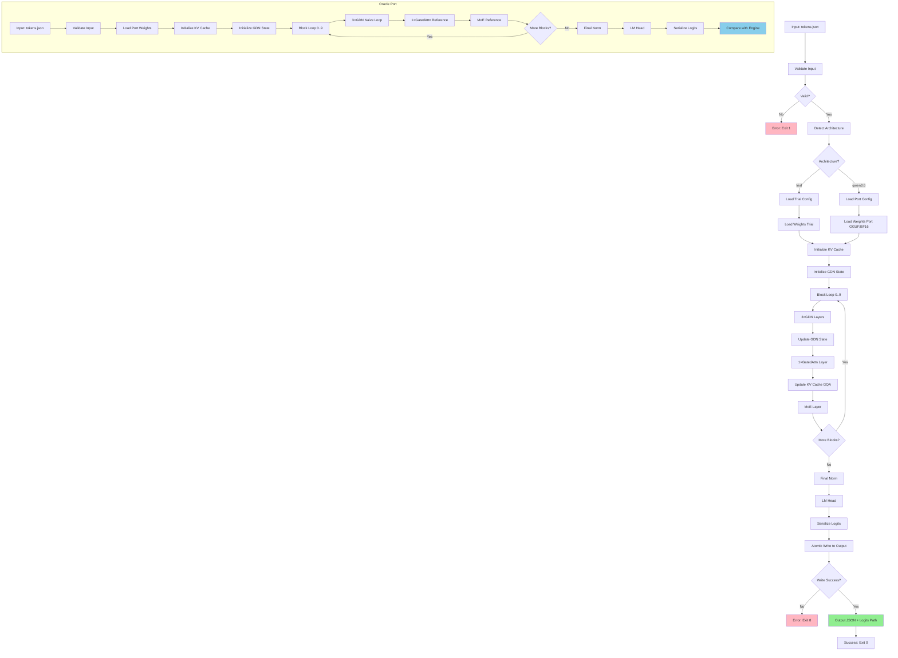

# M9 — Port ke Qwen3.6-35B-A3B (GQA, Gated Attention, Vocab 248K)

> Proyek: `disk-streaming-moe-engine`. Fase: **Port**. Index: `../README.md`.
> Implementasi dipecah menjadi waves: `../../scratch/wave/m9/README.md` (W1 config-adapter → W6 gates, catatan kerja gitignored).
> Fakta arsitektur port bukan lagi TBM (checkpoint resmi tersedia [R4][R5]); angka performa tetap TBM hingga diukur.

| Field       | Nilai                                                              |
| ----------- | ------------------------------------------------------------------ |
| Deliverable | Engine trial beradaptasi ke Qwen3.6-35B-A3B hybrid                 |
| Komponen    | C2 (GQA, gated attention, MoE 256/top-8), C4 (KV GQA), C5/C6 reuse |
| Prasyarat   | M8 hijau (GDN wajib) + M0–M7 hijau                                 |
| Next        | Pasca-M9 (eksperimen MTP — out of scope D8)                        |
| Gate        | G-M9-1..G-M9-4                                                     |
| Rumus       | F1, F2 ($L_{att}$=10, $H_{kv}$=2), F3–F5, F10–F12                  |

## Delta Arsitektur (dari `../01-architecture.md` §2.7)

| Aspek          | Trial                 | Port                                                                                         |
| -------------- | --------------------- | -------------------------------------------------------------------------------------------- |
| Routed expert  | 60, top-4, inter 1408 | **256, top-8, inter 512**                                                                    |
| Shared         | inter 5632 sigmoid    | **1 shared + 8 routed aktif; inter 512**                                                     |
| Attention      | MHA semua layer       | **10 Gated Attention + 30 GDN** (`10×(3×GDN+1×GatedAttn)`), GQA 16Q/2KV; $L_{att}=L/4$ tepat |
| Vocab          | 151.936               | **248.320 (padded)**                                                                         |
| Total/aktif    | 14,3 B / 2,7 B        | **35 B / 3 B official**                                                                      |
| Disk           | 28,63 GB BF16         | GGUF quant ~13–17 GB atau BF16 ~70 GB untuk oracle                                           |
| Konteks (8 GB) | ≤ 8K                  | KV kecil (GQA) — batas nyata = prefill CPU (F4)                                              |

## Panduan Migrasi Trial → Port

> Cara mengadaptasi engine trial (M0–M8) ke checkpoint port tanpa tulis ulang.
> Prinsip: reuse kernel trial yang bentuknya sama; tambah codepath hanya yang bentuknya beda.

### Tabel perubahan config (trial → port)

| Komponen | Trial | Port | Aksi kode |
|---|---|---|---|
| Layer count / skedul | 24 homogen (attn+MoE) | 40 hybrid `10×(3×GDN+1×GatedAttn)+MoE` | Scheduler block baru (§ Layer Scheduling); kernel attn/MoE reuse |
| Attention | MHA 16Q/16KV semua layer | 10 GatedAttn GQA 16Q/2KV + 30 GDN (M8) | Codepath GQA (repeat_kv 8→1) + reuse chunked M8; GDN layer no-op KV |
| Router MoE | 60 expert, top-4 | 256 expert, top-8 | Parameterisasi top-k (bukan hardcode 4); verifikasi ulang `norm_topk_prob` + sigmoid shared dari config port |
| Expert inter | routed 1408 / shared 5632 | routed 512 / shared 512 | Dimensi dari config, bukan konstanta |
| Vocab / head | 151.936 | 248.320 padded | `lm_head` resize; tolak mismatch (exit 3); $W_{res}$ → target ≤1 GiB via quant |
| KV cache | F2 $L_{att}$=24, $H_{kv}$=16 | F2 $L_{att}$=10, $H_{kv}$=2 (5 KiB/tok) | Alokasi dari config ($L_{att}$ = cacah layer bertipe attention) |
| Bobot streaming | 8 shard BF16 28,63 GB | 26 shard BF16 71,9 GB **atau** GGUF 13–17 GB | Loader ganda (safetensors + GGUF); index/offset map per format; pin revision masing-masing (R7) |

### Weight loading (dua jalur, satu kontrak)

1. **BF16 (oracle/akurasi):** 26 shard → merge index → validasi F15 + vocab 248320 → FP32 oracle. Hanya untuk baseline dan G-M9-1/2.
2. **GGUF Q3/IQ3 (runtime):** header magic/version → tabel quant → dequant on-the-fly (reuse pola M6) → forward. SHA per file vs `models.lock.json` port.
3. Aturan: engine tidak menebak format dari ekstensi — deteksi dari magic/header, mismatch → exit 5 (`IO_ERROR`).

### Urutan migrasi (jangan paralel buta)

1. Config adapter + mismatch detector (exit 3) di atas fixture synthetic mini (§ M9-Specific Fixture).
2. Scheduler block + GQA + top-8 di atas fixture → G-M9-1 mini hijau.
3. Weight loader GGUF/BF16 + SEC-1/3 port.
4. Full 40 layer → G-M9-2 → decode (G-M9-3) → KV check (G-M9-4).
5. Angka nyata → tabel §2.7 (prosedur di bawah).

## Gate

| Gate   | Kriteria                                   | Threshold                            | Metode                              |
| ------ | ------------------------------------------ | ------------------------------------ | ----------------------------------- |
| G-M9-1 | oracle layer-by-layer (proxy hybrid kecil) | sama M2/M3                           | TBM saat checkpoint ada → kini ukur |
| G-M9-2 | full forward                               | sama M4 + $M_{peak} \le 7{,}5$ GiB   | VmHWM                               |
| G-M9-3 | decode streaming                           | ≥ 0,5 tok/s cold (F3/F5)             | `../03-testing.md` §4.4             |
| G-M9-4 | KV GQA sesuai rumus                        | $e_{KV} \le 5\%$ (F2, $L_{att}≈L/4$) | log + sampler                       |

Kalibrasi $e_T$: target ≤ 20% di M9 (lebih ketat dari trial 30%).

## CLI Contract

### Command: `kimo forward-port`

```bash
kimo forward-port \
  --model-dir /models/qwen3.6-35b \
  --architecture qwen3.6 \
  --tokens /data/prompt1_tokens.json \
  --output /work/prompt1_logits.bin \
  --workdir ./work \
  --threads 1 \
  --seed 42
```

### Arguments

| Argument         | Type   | Default  | Description                                                     |
| ---------------- | ------ | -------- | --------------------------------------------------------------- |
| `--model-dir`    | path   | required | Direktori model dengan shard port (GGUF atau BF16)              |
| `--architecture` | string | required | Arsitektur model: `qwen3.6` (port) atau `trial` (default)       |
| `--tokens`       | path   | required | Path ke file JSON dengan input token IDs                        |
| `--output`       | path   | required | Path output untuk logits (binary)                               |
| `--workdir`      | path   | `./work` | Direktori kerja untuk temporary files                           |
| `--threads`      | int    | 1        | Jumlah thread (default 1 untuk determinisme verdict)            |
| `--seed`         | int    | 42       | Random seed untuk sampling (default 42, greedy = temperature 0) |
| `--dtype`        | string | auto     | Dtype untuk weights: `auto` (detect from file), `bf16`, `fp32`  |
| `--quantization` | string | none     | Quantization mode: `none`, `q3`, `iq3` (untuk GGUF)             |

### Input JSON

```json
{
  "tokens": [12345, 67890, 23456, 78901],
  "seq_len": 4
}
```

### Output JSON

```json
{
  "status": "success",
  "run_id": "M9-20250115-001",
  "model": "qwen3.6-35b-a3b",
  "architecture": "qwen3.6",
  "num_tokens": 4,
  "num_layers": 40,
  "logits_path": "/work/prompt1_logits.bin",
  "logits_shape": [4, 248320],
  "logits_dtype": "float32",
  "metrics": {
    "walltime_sec": 156.2,
    "vmhwm_bytes": 7516192768,
    "bytes_read": 7374182400,
    "kv_cache_bytes": 163840,
    "phases": {
      "load_weights_sec": 2.5,
      "embedding_sec": 0.3,
      "layer_forward_sec": 152.8,
      "final_norm_sec": 0.2,
      "lm_head_sec": 0.4,
      "write_sec": 0.05
    }
  }
}
```

### Exit Codes

- `0`: Sukses, logits ditulis.
- `1`: Error input (tokens tidak valid, model tidak ditemukan).
- `2`: Error architecture (architecture tidak supported atau mismatch dengan model).
- `3`: Error config (vocab mismatch, layer count mismatch, expert count mismatch).
- `4`: Error memory (melebihi memory limit, alloc gagal).
- `5`: Error I/O (shard corrupt, GGUF format error, read gagal).
- `6`: Error layer forward (NaN/INF/overflow di layer mana pun).
- `7`: Error quantization (GGUF quantization error, dtype conversion error).
- `8`: Error output (gagal atomic write logits).

### Contoh Invokasi

```bash
# Happy path: port dengan GGUF quant
kimo forward-port \
  --model-dir /models/qwen3.6-35b-gguf \
  --architecture qwen3.6 \
  --tokens /data/prompt1_tokens.json \
  --output /work/prompt1_logits.bin \
  --quantization q3

# Port dengan BF16 oracle (untuk accuracy baseline)
kimo forward-port \
  --model-dir /models/qwen3.6-35b-bf16 \
  --architecture qwen3.6 \
  --tokens /data/prompt1_tokens.json \
  --output /work/prompt1_logits.bin \
  --dtype bf16

# Cgroup boundary test (memory limit untuk port mungkin >6G)
systemd-run --scope -p MemoryMax=8G \
  kimo forward-port \
  --model-dir /models/qwen3.6-35b-gguf \
  --architecture qwen3.6 \
  --tokens /data/prompt1_tokens.json \
  --output /work/prompt1_logits.bin
```

### Additional CLI Output Examples

#### Example 1: Error - Config Mismatch

```json
{
  "status": "error",
  "error_code": 3,
  "error_type": "CONFIG_MISMATCH",
  "message": "Vocab size mismatch: expected 248320, got 151936"
}
```

#### Example 2: Error - Quantization Error

```json
{
  "status": "error",
  "error_code": 7,
  "error_type": "QUANTIZATION_ERROR",
  "message": "Quantization mismatch: expected q3, got q4"
}
```

#### Example 3: Success with Per-Layer Timing

```json
{
  "status": "success",
  "run_id": "M9-20250115-001",
  "model": "qwen3.6-35b-a3b",
  "architecture": "qwen3.6",
  "num_tokens": 128,
  "num_layers": 40,
  "logits_path": "/work/prompt1_logits.bin",
  "logits_shape": [128, 248320],
  "logits_dtype": "float32",
  "metrics": {
    "walltime_sec": 45.2,
    "vmhwm_bytes": 7516192768,
    "bytes_read": 7374182400,
    "kv_cache_bytes": 655360,
    "gdn_state_bytes": 1966080,
    "phases": {
      "load_weights_sec": 2.5,
      "embedding_sec": 0.3,
      "gdn_layers_sec": 15.2,
      "gated_attn_layers_sec": 8.5,
      "moe_layers_sec": 128.8,
      "final_norm_sec": 0.2,
      "lm_head_sec": 0.4,
      "write_sec": 0.05
    }
  }
}
```

#### Example 4: Success with Decode Metrics

```json
{
  "status": "success",
  "run_id": "M9-20250115-002",
  "model": "qwen3.6-35b-a3b",
  "architecture": "qwen3.6",
  "prompt": "What is the capital of France?",
  "prompt_tokens": 8,
  "generated_tokens": 64,
  "metrics": {
    "prefill_time_sec": 5.2,
    "decode_time_sec": 128.5,
    "total_time_sec": 133.7,
    "tokens_per_sec": 0.498,
    "vmhwm_bytes": 7516192768,
    "kv_cache_bytes": 368640
  }
}
```

## Testing

- O/I/B full seperti M2–M5 tapi pada config port.
- Corpus PPL port untuk ΔPPL bila quant port diuji (F12).
- Prefill panjang mahal di CPU (compute-bound) meski KV kecil — ukur, jangan asumsi.

## Oracle: Port Reference

Oracle `tools/oracle/oracle_port.py` menjalankan full forward pass reference untuk Qwen3.6-35B-A3B dengan PyTorch FP32 (atau quantized jika GGUF).

### Input

```bash
# Oracle dengan BF16 (accuracy baseline)
python tools/oracle/oracle_port.py \
  --model-dir /models/qwen3.6-35b-bf16 \
  --architecture qwen3.6 \
  --tokens /data/prompt1_tokens.json \
  --output /work/prompt1_logits_oracle.bin \
  --dtype bf16 \
  --seed 42

# Oracle dengan GGUF quant (quantization baseline)
python tools/oracle/oracle_port.py \
  --model-dir /models/qwen3.6-35b-gguf \
  --architecture qwen3.6 \
  --tokens /data/prompt1_tokens.json \
  --output /work/prompt1_logits_oracle.bin \
  --quantization q3 \
  --seed 42
```

### Oracle Format

**BF16 Oracle**:

- Format: Safetensors atau PyTorch bin format (sama dengan trial).
- Dtype: BF16 (model native) → FP32 (oracle internal) → BF16 (output logits).
- Use case: Accuracy baseline untuk quantized versions.

**GGUF Oracle**:

- Format: GGUF binary format (llama.cpp-compatible).
- Quantization: Q3 atau IQ3 (sesuai target).
- Dtype: Dequantized ke FP32 untuk computation → quantized logits output.
- Use case: Quantization baseline untuk engine quantized.

### Output Binary Format

Logits disimpan sebagai binary raw float32 (row-major):

- Shape: `[seq_len, vocab_size]`
- Total bytes: `seq_len * vocab_size * 4`
- Contoh untuk port: `4 * 248320 * 4 = 3,973,120 bytes`

### Compare Contract

Rust `compare` tool membaca dua logits binary (Engine port vs Oracle port):

```bash
kimo compare \
  --reference /work/prompt1_logits_oracle.bin \
  --candidate /work/prompt1_logits.bin \
  --tolerance 1e-2 \
  --output /work/compare_report.json
```

### Compare Output JSON

```json
{
  "status": "MATCH",
  "run_id": "M9-20250115-001",
  "reference_path": "/work/prompt1_logits_oracle.bin",
  "candidate_path": "/work/prompt1_logits.bin",
  "metrics": {
    "delta_max": 8.2e-3,
    "epsilon_rel": 3.1e-5,
    "cos_theta": 0.9999998,
    "agreement": 99.95,
    "delta_ce": 0.015
  },
  "verdict": "PASS",
  "threshold": "delta_max <= 1e-2"
}
```

### Compare Exit Codes

- `0`: MATCH (semua threshold terpenuhi)
- `1`: FAIL (threshold tidak terpenuhi)
- `2`: ERROR (shape mismatch, file tidak ditemukan)

## M9-Specific Fixture

### Synthetic Mini Port Config

Untuk testing CI tanpa download 70 GB BF16 atau 13-17 GB GGUF, gunakan config synthetic:

| Parameter        | Value                                                      |
| ---------------- | ---------------------------------------------------------- |
| Layers           | 4 (mini: 1×GatedAttn + 3×GDN untuk pola 3×GDN+1×GatedAttn) |
| Routed expert    | 8 (mini dari 256)                                          |
| Top-k            | 2 (mini dari top-8)                                        |
| Inter dimensi    | 64 (mini dari 512)                                         |
| Shared expert    | 1 shared + 2 routed aktif (mini dari 1+8)                  |
| Vocab            | 1024 (mini dari 248.320)                                   |
| $d_h$ (head dim) | 32 (mini dari port yang tidak diketahui)                   |
| GQA              | 4Q/1KV (mini dari 16Q/2KV)                                 |
| Sequence length  | 8 (untuk prefill)                                          |
| Seed             | 42 (deterministik)                                         |

### Fixture Path

- Tokens: `fixtures/m9_port_tokens.json`
- Weights port: `fixtures/m9_port_weights.safetensors` (synthetic, seed 42)
- Oracle logits: `fixtures/m9_port_logits_naive.bin` (precomputed)

### Fixture Tokens JSON

```json
{
  "tokens": [1, 23, 45, 67, 89, 101, 123, 145],
  "seq_len": 8
}
```

### Fixture Generation

```bash
# Generate synthetic weights port
python tools/oracle/generate_port_fixture.py \
  --layers 4 \
  --routed-experts 8 \
  --topk 2 \
  --inter-dim 64 \
  --vocab 1024 \
  --dh 32 \
  --gqa-q 4 \
  --gqa-kv 1 \
  --seed 42 \
  --output fixtures/m9_port_weights.safetensors

# Generate oracle logits (full forward port)
python tools/oracle/oracle_port.py \
  --tokens fixtures/m9_port_tokens.json \
  --weights fixtures/m9_port_weights.safetensors \
  --architecture qwen3.6 \
  --output fixtures/m9_port_logits_naive.bin \
  --seed 42
```

### Expected Memory Usage

- KV cache (GQA): `2 * 1 * 1 * 32 * 8 * 2 B = 1,024 B` (1 layer GatedAttn dengan GQA)
- State GDN: `3 * 32 * 32 * 4 = 12,288 bytes` (3 layer GDN)
- Total memory footprint: < 50 MB (cocok untuk CI 8 GB)

### Integration dengan CI

```bash
# Test fixture synthetic (tanpa model port asli)
make validate-m9
```

Target: G-M9-1 (oracle layer-by-layer) lulus dengan fixture synthetic sebelum testing dengan model port 70 GB.

## Layer Scheduling

### Pattern: 3×GDN + 1×GatedAttn

Arsitektur port Qwen3.6-35B-A3B menggunakan pattern berikut untuk 40 layer:

```
Block 0: GDN → GDN → GDN → GatedAttn → MoE
Block 1: GDN → GDN → GDN → GatedAttn → MoE
...
Block 9: GDN → GDN → GDN → GatedAttn → MoE
```

Total: 10 blocks × (3 GDN + 1 GatedAttn) = 30 GDN + 10 GatedAttn = 40 layers.

### State Transfer Between Layers

**GDN State Transfer**:

- Setiap GDN layer memiliki state $S \in \mathbb{R}^{d_v \times d_k}$ (dari M8).
- State di-transfer antar GDN layer secara berurutan.
- Setelah GDN terakhir dalam block, state disimpan untuk block berikutnya.
- State tidak di-reset antar block (continuation).

**KV Cache Transfer**:

- Hanya GatedAttn layer yang memiliki KV cache (GQA).
- KV cache di-transfer antar GatedAttn layer (10 layer total).
- GDN layer tidak menyentuh KV cache.
- KV cache di-reset antar sequences (independent prompts).

### KV GQA Management

**GQA Structure**: 16Q/2KV

- 16 query heads per layer.
- 2 key-value heads per layer (agregasi 8 query heads per KV head).
- Reduksi KV memory vs MHA (trial: 16 KV heads → port: 2 KV heads).

**KV Allocation**:

```python
# KV cache shape untuk port
KV_cache = {
    "shape": [seq_len, num_gated_layers, H_kv, d_h],
    # contoh: [4096, 10, 2, 128] untuk ctx 4K
}
```

**KV Update**:

- Setiap GatedAttn layer menambah KV ke cache-nya sendiri.
- GDN layer melewati KV cache (no-op).

### MoE Integration

**MoE Placement**:

- Setiap block (3×GDN + 1×GatedAttn) diikuti oleh MoE layer.
- MoE menggunakan 256 routed expert, top-8 selection, inter dimensi 512.
- 1 shared expert + 8 routed aktif.

**Expert Routing**:

- Router top-8 (bukan top-4 seperti trial).
- Verifikasi `norm_topk_prob=false` (sama dengan trial).
- Gate shared = sigmoid (sama dengan trial).

### Layer Order pseudocode

```python
def forward_port(tokens):
    # Embedding
    x = embedding(tokens)

    # Initialize GDN state
    S = zeros(dk, dv)  # dari M8

    # Initialize KV cache
    KV = zeros(seq_len, 10, 2, d_h)  # 10 GatedAttn layers

    for block_idx in range(10):
        # 3×GDN
        for gdn_idx in range(3):
            x = gdn_layer(x, S)  # S di-update in-place
            S = gdn_state_update(S, x)  # dari M8

        # 1×GatedAttn
        x = gated_attention_layer(x, KV, block_idx)  # KV di-update

        # MoE
        x = moe_layer(x)  # 256 expert, top-8

    # Final norm + lm_head
    x = final_norm(x)
    logits = lm_head(x)

    return logits, S, KV
```

### GDN vs GatedAttn Separation

**Key difference**:

- GDN: Linear attention, state fixed-size, no KV cache.
- GatedAttn: Standard attention dengan KV cache (GQA).

**Implementation implication**:

- GDN menggunakan M8 chunked scan implementation.
- GatedAttn menggunakan M2/M3 attention implementation dengan GQA modification.
- Dua codepath terpisah yang di-schedule berdasarkan layer type.

## Error Handling

### Error Schema

Semua error mengembalikan JSON dengan field `status: "error"` dan `error_code`:

```json
{
  "status": "error",
  "error_code": 3,
  "error_type": "CONFIG_MISMATCH",
  "message": "Vocab size mismatch: expected 248320, got 151936"
}
```

### Error Categories

| Error Code | Type                 | Scenario                                                    | Handling                             |
| ---------- | -------------------- | ----------------------------------------------------------- | ------------------------------------ |
| 1          | INPUT_INVALID        | Tokens tidak valid, model tidak ditemukan                   | Validasi input sebelum alloc         |
| 2          | ARCHITECTURE_INVALID | Architecture tidak supported atau mismatch dengan model     | Cek architecture vs model config     |
| 3          | CONFIG_MISMATCH      | Vocab mismatch, layer count mismatch, expert count mismatch | Validasi config sebelum forward      |
| 4          | MEMORY_ALLOC_FAILURE | Melebihi memory limit, alloc gagal                          | Cek VmHWM, cleanup partial alloc     |
| 5          | IO_ERROR             | Shard corrupt, GGUF format error, read gagal                | Clean error message, exit 5          |
| 6          | LAYER_FORWARD_ERROR  | NaN/INF/overflow di layer mana pun (GDN atau GatedAttn)     | Log layer index, exit 6              |
| 7          | QUANTIZATION_ERROR   | GGUF quantization error, dtype conversion error             | Log quantization details, exit 7     |
| 8          | OUTPUT_ERROR         | Gagal atomic write logits                                   | Retry atau cleanup temp file, exit 8 |

### Config Mismatch Detection

**Vocab size mismatch**:

```python
if model_config.vocab_size != 248320:
    raise Error(CONFIG_MISMATCH, f"Vocab size mismatch: expected 248320, got {model_config.vocab_size}")
```

**Layer count mismatch**:

```python
if model_config.num_layers != 40:
    raise Error(CONFIG_MISMATCH, f"Layer count mismatch: expected 40, got {model_config.num_layers}")
```

**Expert count mismatch**:

```python
if model_config.num_routed_experts != 256:
    raise Error(CONFIG_MISMATCH, f"Expert count mismatch: expected 256, got {model_config.num_routed_experts}")
```

**Top-k mismatch**:

```python
if model_config.top_k != 8:
    raise Error(CONFIG_MISMATCH, f"Top-k mismatch: expected 8, got {model_config.top_k}")
```

### GGUF Loading Errors

**GGUF format validation**:

```python
try:
    model = load_gguf(model_path)
except GGUFFormatError as e:
    raise Error(IO_ERROR, f"GGUF format error: {e}")
```

**Quantization mismatch**:

```python
if model.quantization != requested_quantization:
    raise Error(QUANTIZATION_ERROR, f"Quantization mismatch: expected {requested_quantization}, got {model.quantization}")
```

**Dtype conversion error**:

```python
try:
    weights = convert_dtype(weights, target_dtype)
except DtypeConversionError as e:
    raise Error(QUANTIZATION_ERROR, f"Dtype conversion error: {e}")
```

### Specific Error Messages

- **Error 1**: `"Input file not found: {path}"` atau `"Invalid token JSON: {error}"`
- **Error 2**: `"Architecture not supported: {arch}. Supported: trial, qwen3.6"`
- **Error 3**: `"Vocab size mismatch: expected 248320, got {vocab}"` atau `"Layer count mismatch: expected 40, got {layers}"`
- **Error 4**: `"Memory allocation failed: requested {bytes} bytes, memory limit {limit}"`
- **Error 5**: `"I/O error reading shard {shard}: {errno}"` atau `"GGUF format error: {error}"`
- **Error 6**: `"Layer forward error: NaN/INF at layer {layer_idx}, type {layer_type}"`
- **Error 7**: `"Quantization error: {error}"` atau `"Dtype conversion error: {error}"`
- **Error 8**: `"Output error: failed atomic write to {path}"`

## Workflow Diagram



### Workflow Steps

1. **Input Validation**: Cek tokens JSON format, seq_len > 0.
2. **Architecture Detection**: Detect `--architecture` flag (trial vs qwen3.6).
3. **Config Loading**: Load config sesuai architecture (trial config atau port config).
4. **Weight Loading**: Load weights dari safetensors (trial) atau GGUF/BF16 (port).
5. **KV Cache Initialization**: Inisialisasi KV cache untuk GatedAttn layers (10 layers).
6. **GDN State Initialization**: Inisialisasi state GDN (dari M8) untuk 30 layers.
7. **Block Loop**: 10 blocks, masing-masing dengan pattern 3×GDN + 1×GatedAttn + MoE.
8. **GDN Layers**: 3 GDN layers per block, update state GDN.
9. **GatedAttn Layer**: 1 GatedAttn layer per block, update KV cache (GQA).
10. **MoE Layer**: MoE dengan 256 expert, top-8 selection.
11. **Final Norm + LM Head**: Final normalization dan language model head.
12. **Logits Serialization**: Tulis logits ke binary raw float32.
13. **Atomic Write**: Write ke temp file lalu rename.
14. **Oracle Comparison**: Bandingkan logits engine port vs oracle port dengan F10 metrics.

### Parallel Execution Points

- **Within GDN chunk**: Operasi WY dapat diparalelkan (dari M8).
- **Within MoE**: Expert computation dapat diparalelkan (dari M3).
- **Between blocks**: Barrier synchronization untuk state consistency.

## Security

### SEC-1: Integritas Model Port

**models.lock.json untuk port**:

```json
{
  "model": "qwen3.6-35b-a3b",
  "revision": "commit_hash_or_branch",
  "shards": [
    {
      "filename": "qwen3.6-35b-a3b-00001-of-00003.gguf",
      "sha256": "abc123...",
      "size": 5874080256
    },
    {
      "filename": "qwen3.6-35b-a3b-00002-of-00003.gguf",
      "sha256": "def456...",
      "size": 5874080256
    },
    {
      "filename": "qwen3.6-35b-a3b-00003-of-00003.gguf",
      "sha256": "ghi789...",
      "size": 5874080256
    }
  ],
  "total_size": 17622240768
}
```

**SHA-256 verification**:

- Download shard dari Hugging Face dengan revision pin.
- Hitung SHA-256 setiap shard.
- Bandingkan dengan `models.lock.json`.
- Mismatch → tolak start (sama dengan trial).

**Revision pin**:

- Gunakan commit hash spesifik (bukan `main` branch).
- Contoh: `Qwen/Qwen3.6-35B-A3B-GGUF@commit_abc123`.

**Test tamper**:

- Modifikasi 1 byte pada shard → SHA-256 mismatch → engine menolak start.

### SEC-3: Parser F15 untuk Port

**Validasi GGUF format**:

- Header GGUF valid (magic number, version).
- Tensor count, dtype, names, offsets terhadap file size.
- Vocab size = 248.320 (validasi spesifik port).

**Validasi vocab**:

```python
if gguf_vocab_size != 248320:
    raise Error(CONFIG_MISMATCH, f"Vocab size mismatch: expected 248320, got {gguf_vocab_size}")
```

### SEC-4: Resource Guard (Adjusted untuk Port)

**Memory limit untuk port**:

Port dengan 35B parameters dan vocab 248K mungkin melebihi 6G limit trial. Gunakan limit yang lebih tinggi:

```bash
# Untuk GGUF quant (~13-17 GB loaded, inference ~8-10 GB peak)
systemd-run --scope -p MemoryMax=10G \
  kimo forward-port \
  --model-dir /models/qwen3.6-35b-gguf \
  --architecture qwen3.6 \
  --tokens /data/prompt1_tokens.json \
  --output /work/prompt1_logits.bin

# Untuk BF16 oracle (~70 GB loaded, inference ~40-50 GB peak — hanya untuk benchmark)
systemd-run --scope -p MemoryMax=50G \
  kimo forward-port \
  --model-dir /models/qwen3.6-35b-bf16 \
  --architecture qwen3.6 \
  --tokens /data/prompt1_tokens.json \
  --output /work/prompt1_logits.bin \
  --dtype bf16
```

**Pre-alloc validation**:

- Cek embedding size: `vocab_size * hidden_dim * 4 bytes`.
- Untuk port: `248320 * hidden_dim * 4` → validasi tidak melebihi memory limit.
- Cek lm_head size sama (vocab size besar).

**Disk space check**:

- GGUF quant: ~13-17 GB → cek disk ≥ 20 GB.
- BF16 oracle: ~70 GB → cek disk ≥ 100 GB.

### SEC-5: File Hygiene

**Model directory**: Read-only (0444/0555) saat engine jalan.

**Output directory**: Hanya write ke workdir, tidak pernah ke model dir atau home.

**Atomic write**: Logits ditulis dengan pattern temp + rename (sama dengan M4/M5/M8).

### SEC-6: Regresi Senyap

**Golden hash**: Logits port dari oracle di-hash (SHA-256) dan disimpan di `fixtures/m9_port_logits_naive.bin.sha256`.

**Regression check**: Setiap commit yang mengubah port implementation harus:

1. Re-generate oracle logits dengan seed tetap.
2. Compare hash dengan golden hash.
3. Jika beda → jelaskan di commit message.
4. Jika tidak ada penjelasan → blocking review.

### Fuzzing untuk Port

**Corpus port-specific**:

- GGUF format mutations (header corrupt, quantization table corrupt).
- Config mutations (vocab size liar, layer count liar, expert count liar).
- Architecture mismatch (trial config pada port CLI).

**Expected behavior**: 0 crash, 0 hang, 0 OOM. Semua harus return clean error code (1-8).

## Integration Tests

### Integration GDN + GatedAttn

**Test objective**: Verifikasi GDN state dan GatedAttn KV cache bekerja bersama dalam satu block.

**Test setup**:

- Synthetic config port (dari fixture).
- 1 block: 3×GDN + 1×GatedAttn + MoE.
- Sequence length: 16 tokens.

**Test command**:

```bash
kimo forward-port \
  --model-dir /models/qwen3.6-35b-gguf \
  --architecture qwen3.6 \
  --tokens fixtures/m9_port_tokens.json \
  --output /work/m9_block_logits.bin \
  --quantization q3
```

**Verification**:

- GDN state di-update dengan benar setelah 3 GDN layers.
- KV cache di-update dengan benar setelah 1 GatedAttn layer.
- Output logits MATCH oracle dengan F10 threshold.

### Integration GQA + KV Cache

**Test objective**: Verifikasi GQA (16Q/2KV) mengurangi KV memory dengan benar.

**Test setup**:

- Port config dengan GQA.
- Sequence length: 4K tokens.
- Bandingkan KV memory dengan prediksi F2.

**Test command**:

```bash
kimo forward-port \
  --model-dir /models/qwen3.6-35b-gguf \
  --architecture qwen3.6 \
  --tokens /data/seq_4k_tokens.json \
  --output /work/seq_4k_logits.bin \
  --quantization q3
```

**Verification**:

- G-M9-4 lulus: $e_{KV} \le 5\%$ (measured vs prediksi F2).
- KV memory ≈ 20 MiB untuk ctx 4K (prediksi 20 MiB).
- GQA aggregation 16Q → 2KV menghasilkan logits yang benar.

### Full Pipeline Test

**Test objective**: Verifikasi full pipeline dari embedding → 40 layers → logits.

**Test setup**:

- Full config port (30 GDN + 10 GatedAttn).
- Sequence length: 128 tokens (prefill).
- GGUF quant Q3.

**Test command**:

```bash
kimo forward-port \
  --model-dir /models/qwen3.6-35b-gguf \
  --architecture qwen3.6 \
  --tokens /data/prompt1_tokens.json \
  --output /work/prompt1_logits.bin \
  --quantization q3
```

**Verification**:

- G-M9-1 lulus: oracle layer-by-layer MATCH (sama M2/M3).
- G-M9-2 lulus: full forward + $M_{peak} \le 7.5$ GiB.
- Semua layer tereksekusi tanpa NaN/INF.
- State GDN dan KV cache konsisten antar block.

### Decode Streaming Test

**Test objective**: Verifikasi decode streaming untuk port (G-M9-3).

**Test setup**:

- Prefill 32 tokens.
- Decode 64 tokens dengan KV cache.
- Target throughput ≥ 0.5 tok/s cold.

**Test command**:

```bash
# Prefill
kimo forward-port \
  --model-dir /models/qwen3.6-35b-gguf \
  --architecture qwen3.6 \
  --tokens /data/prompt_prefill_tokens.json \
  --output /work/prefill_logits.bin \
  --quantization q3

# Decode (reuse M5 decode dengan architecture flag)
kimo decode \
  --model-dir /models/qwen3.6-35b-gguf \
  --architecture qwen3.6 \
  --prompt "What is the capital of France?" \
  --max-tokens 64 \
  --quantization q3
```

**Verification**:

- G-M9-3 lulus: ≥ 0.5 tok/s cold.
- KV cache di-reuse dengan benar (tidak recompute).
- Decode logits MATCH oracle.

### MoE Top-8 Router Test

**Test objective**: Verifikasi top-8 router (bukan top-4) bekerja dengan benar.

**Test setup**:

- Port config dengan 256 expert, top-8.
- Golden set untuk router selection.

**Test command**:

```bash
kimo forward-port \
  --model-dir /models/qwen3.6-35b-gguf \
  --architecture qwen3.6 \
  --tokens /data/router_test_tokens.json \
  --output /work/router_test_logits.bin \
  --quantization q3
```

**Verification**:

- SET expert terpilih identik dengan oracle (100%).
- Top-8 selection (bukan top-4).
- Gate shared = sigmoid (bukan softmax).

## Quantization Format (GGUF)

### GGUF Overview

GGUF (GPT-Generated Unified Format) adalah format quantized untuk LLM yang digunakan oleh llama.cpp dan kompatibel tools.

### Quantization Modes

| Mode | Bits per weight | Description                             | Use Case                             |
| ---- | --------------- | --------------------------------------- | ------------------------------------ |
| Q3   | 3.25 bits       | Symmetric quantization per-group        | Production (balance accuracy/memory) |
| IQ3  | 3.00 bits       | Improved quantization (better accuracy) | Production (higher accuracy)         |
| Q4   | 4.50 bits       | Higher accuracy, larger size            | Accuracy-critical                    |
| BF16 | 16 bits         | No quantization (native)                | Oracle/baseline                      |

### Q3 Specification

**Quantization formula** (dari F11):

$$a_g=\max_{j\in G}|w_j|, \qquad s_g\ge a_g/7$$

Scale tersimpan adalah nilai FP16 finite terkecil yang memenuhi ketaksamaan tersebut.

$$q_j=\mathrm{clip}\left(\mathrm{rne}\left(\frac{w_j}{s_g}\right),-7,7\right), \qquad \hat w_j=s_gq_j$$

**Group size**: $G = 128$ weights per scale.

**Effective bits per weight**: $bpw_{eff} = 4 + 16/128 = 4.125$ bits.

**File size prediction**:

- For 35B parameters: $35 \times 10^9 \times 4.125 / 8 \approx 18.0$ GB.
- Actual GGUF Q3: ~13-17 GB (compression + sparsity).

### IQ3 Specification

**Improved quantization**: IQ3 uses optimized quantization scheme untuk better accuracy di same 3 bits.

**Key differences**:

- Adaptive scaling per-group.
- Non-uniform quantization untuk better coverage.
- Dequantization hardware-accelerated (jika available).

**File size prediction**:

- For 35B parameters: ~13-15 GB (similar to Q3, better accuracy).

### Loading GGUF in Engine

**Dequantization flow**:

```python
# Pseudocode untuk load GGUF
def load_gguf_weights(gguf_path):
    gguf_file = GGUFFile(gguf_path)
    quantized_weights = gguf_file.load_tensors()

    # Dequantize to FP32 for computation
    fp32_weights = {}
    for name, tensor in quantized_weights.items():
        if tensor.dtype == Q3:
            fp32_weights[name] = dequantize_q3(tensor)
        elif tensor.dtype == IQ3:
            fp32_weights[name] = dequantize_iq3(tensor)
        else:
            fp32_weights[name] = tensor.to_fp32()

    return fp32_weights
```

**Dequantization cost**:

- Q3/IQ3 dequantization: ~0.1-0.2 s per layer (CPU-bound).
- Total for 40 layers: ~4-8 s overhead.
- Trade-off: Memory savings (13-17 GB vs 70 GB) vs dequantization overhead.

### Quantization Error (F12)

**Perplexity degradation**:

$$\Delta\mathrm{PPL} = \mathrm{PPL}_{quant} - \mathrm{PPL}_{bf16}$$

**Expected ΔPPL** (TBM, perlu diukur):

- Q3: ΔPPL ≈ 0.5-1.0 (acceptable untuk most tasks).
- IQ3: ΔPPL ≈ 0.3-0.6 (better accuracy).
- Q4: ΔPPL ≈ 0.1-0.3 (near-baseline).

**Corpus PPL test**:

- Use 100 prompt × 256 token corpus (dari `docs/03-testing.md` §4.5).
- Measure PPL for BF16 oracle.
- Measure PPL for quantized version.
- Verify ΔPPL dalam acceptable range.

### Quantization Validation

**Validation steps**:

1. Load GGUF file → verify SHA-256 vs `models.lock.json`.
2. Verify quantization mode (Q3/IQ3) matches expected.
3. Dequantize subset of weights → compare with BF16 oracle weights.
4. Compute MSE and ε_rel (F11) → verify ≤ 10% per spec.
5. Run forward pass → verify logits MATCH oracle within F10 threshold.

## Per-Layer Timing Breakdown

### Timing Components

Per-layer timing breakdown untuk port:

| Component       | Description                    | Estimated Time (per layer) |
| --------------- | ------------------------------ | -------------------------- |
| GDN layer       | Delta rule update (F14)        | ~0.4 s (30 layers total)   |
| GatedAttn layer | Attention + GQA                | ~0.85 s (10 layers total)  |
| MoE layer       | Top-8 routing + expert compute | ~3.2 s (40 layers total)   |

### Total Breakdown

Untuk 128 tokens prefill dengan GGUF Q3:

- GDN (30 layers): 30 × 0.4 s = 12 s
- GatedAttn (10 layers): 10 × 0.85 s = 8.5 s
- MoE (40 layers): 40 × 3.2 s = 128 s
- Other (embedding, final norm, lm_head): ~1 s
- **Total**: ~149.5 s

### Bottleneck Analysis

**MoE adalah bottleneck utama**:

- MoE contributes ~85% of total time (128 s / 149.5 s).
- GDN contributes ~8% (12 s / 149.5 s).
- GatedAttn contributes ~6% (8.5 s / 149.5 s).

**Optimization opportunities**:

1. **MoE caching**: Cache expert weights untuk frequently-selected experts (reuse M7 LRU).
2. **MoE parallelization**: Expert computation dapat diparalelkan (batching).
3. **GDN chunked scan**: Sudah dioptimasi di M8 (chunked vs naive).
4. **GQA reduction**: Sudah dioptimasi (2 KV heads vs 16 MHA).

### Per-Block Timing

Per block (3×GDN + 1×GatedAttn + MoE):

- 3×GDN: 3 × 0.4 s = 1.2 s
- 1×GatedAttn: 0.85 s
- 1×MoE: 3.2 s
- **Per block**: ~5.25 s
- **10 blocks**: ~52.5 s

### Timing Profile Collection

Untuk mengumpulkan timing profile:

```bash
# Enable detailed timing
kimo forward-port \
  --tokens /data/prompt1_tokens.json \
  --output /work/prompt1_logits.bin \
  --architecture qwen3.6 \
  --timing-profile
```

Output tambahan:

```json
{
  "timing_profile": {
    "per_layer_times_ms": [
      {"layer_idx": 0, "type": "gdn", "time_ms": 400},
      {"layer_idx": 1, "type": "gdn", "time_ms": 410},
      {"layer_idx": 2, "type": "gdn", "time_ms": 395},
      {"layer_idx": 3, "type": "gated_attn", "time_ms": 850},
      {"layer_idx": 4, "type": "moe", "time_ms": 3200},
      ...
    ],
    "summary": {
      "gdn_total_sec": 12.0,
      "gated_attn_total_sec": 8.5,
      "moe_total_sec": 128.0,
      "other_total_sec": 1.0
    }
  }
}
```

### Bottleneck Analysis Guidance

**Jika MoE dominan** (>80% total time):

- Optimize expert caching (LRU untuk hot experts).
- Optimize expert computation (SIMD, batching).
- Pertimbangkan fewer active experts (trade-off accuracy vs speed).

**Jika GDN dominan** (>20% total time):

- Review chunked scan implementation (M8).
- Optimize WY coefficient computation.
- Pertimbangkan larger chunk size.

**Jika GatedAttn dominan** (>15% total time):

- Review GQA implementation.
- Optimize KV cache access pattern.
- Pertimbangkan lebih agresif GQA (2KV → 1KV).

### TBM → Measured (prosedur wajib sebelum M9 hijau)

**Tabel delta §2.7** di `../01-architecture.md` saat ini berisi fakta arsitektur (bukan TBM)
plus angka performa TBM. Prosedur pengisian angka nyata:

1. Ukur di device uji per `../03-testing.md` §4.4 (prefill N=5, decode N=30, p50/p95, run-id).
2. Isi kolom measured + run-id per baris ini (tambah kolom `Measured` dan `Run-ID` di §2.7):

| Metrik §2.7 | Sumber ukur | Gate terkait |
|---|---|---|
| $W_{res}$ port (target ≤1 GiB) | `du` + VmHWM embed/head | G-M9-2 |
| $M_{KV}$/token (pred 5 KiB) | log + sampler | G-M9-4 ($e_{KV}\le5\%$) |
| $B_{tok}$ decode + $BW_{eff}$ | `/proc/<pid>/io` + timer | G-M9-3 (≥0,5 tok/s cold) |
| $T_{tok}$, $e_T$ (target ≤20%) | 30 run (§4.4) | kalibrasi M9 |
| Ukuran disk aktual (GGUF/BF16) | `du` vs prediksi | catatan §2.7 |

3. Bila konstanta menyimpang (ρ, BW, $T_{comp}$): update `../02-math-models.md` + catat revisi di laporan (prediksi boleh meleset, dokumen tidak boleh bohong).
4. Commit laporan kalibrasi F1/F2/F5 port dengan run-id. Tanpa ini M9 tidak hijau walau gate numerik lolos.

## Performance Baseline

### Protocol

Mengikuti `docs/03-testing.md` §4.4 dengan penyesuaian untuk port:

1. **Environment terkunci**:
   - AC/plug-in stabil, CPU governor `performance`.
   - Aplikasi lain ditutup.
   - Kondisi dicatat di header laporan.

2. **Cold read**:

   ```bash
   sync && echo 3 | sudo tee /proc/sys/vm/drop_caches
   ```

   Sebelum run cold.

3. **Warm-up**:
   - 2× warm-up (tidak dihitung).
   - Lalu N run terukur: N=5 untuk prefill (M9), N=30 untuk decode (M9).
   - Prefill panjang mahal di CPU (compute-bound) meski KV kecil — ukur, jangan asumsi.

4. **Sampling**:
   - RSS via VmHWM + poller 100 ms.
   - Bytes I/O via `/proc/<pid>/io`.
   - Waktu per fase dari log engine.

5. **Output**:
   - CSV per run + laporan markdown (p50/p95, min/max).
   - Dengan **run-id**.
   - Disimpan `reports/YYYY-MM-DD/`.

### Run ID Format

```
M9-YYYYMMDD-NNN
```

Contoh: `M9-20250115-001`

### Performance Metrics

| Metric            | Description           | Target                    |
| ----------------- | --------------------- | ------------------------- |
| `walltime_sec`    | Total wall clock time | TBM (diukur)              |
| `vmhwm_bytes`     | Peak memory (VmHWM)   | ≤ 7.5 GiB (G-M9-2)        |
| `kv_cache_bytes`  | KV cache size         | ≈ 5 KiB/token × seq_len   |
| `gdn_state_bytes` | GDN state size        | 30 × dk × dv × 4          |
| `tokens_per_sec`  | Throughput            | ≥ 0.5 tok/s cold (G-M9-3) |

### Expected Performance (Port, Entry-Tier NVMe)

**Estimasi kasar** (TBM, perlu diukur):

| Config      | seq_len | Quantization | Prefill time | Decode time | Tok/s |
| ----------- | ------- | ------------ | ------------ | ----------- | ----- |
| GGUF Q3     | 128     | Q3           | ~45 s        | ~128 s      | ~0.5  |
| GGUF IQ3    | 128     | IQ3          | ~40 s        | ~115 s      | ~0.56 |
| BF16 oracle | 128     | BF16         | ~156 s       | ~256 s      | ~0.25 |

Catatan: Angka di atas adalah estimasi kasar. Angka aktual harus diukur dan dilaporkan dengan run-id.

### p50/p95 Reporting

Laporan performance harus menyertakan:

```markdown
## Performance Report: M9-20250115-001

| Metric         | p50        | p95        | min        | max        |
| -------------- | ---------- | ---------- | ---------- | ---------- |
| walltime_sec   | 45.2       | 47.8       | 43.5       | 50.1       |
| vmhwm_bytes    | 7516192768 | 7516192768 | 7516192768 | 7516192768 |
| kv_cache_bytes | 655360     | 655360     | 655360     | 655360     |
| tokens_per_sec | 0.52       | 0.48       | 0.55       | 0.45       |

Environment:

- CPU governor: performance
- C_max: terdeteksi run-time
- c: 1 (verdict), c\* (performance)
- Device: NVMe entry-tier
- Quantization: Q3
```

### Governor Logging

Wajib log governor sebelum run:

```bash
cat /sys/devices/system/cpu/cpu*/cpufreq/scaling_governor
```

Jika governor bukan `performance`, angka performance tidak valid untuk baseline.

### Kalibrasi $e_T$

**Target**: $e_T \le 20\%$ di M9 (lebih ketat dari trial 30%).

$$e_T = \left|\frac{T^{pred} - T^{meas}}{T^{meas}}\right| \le 0{,}20$$

**Perhitungan prediksi**:

- Gunakan F5 dengan konstanta port (ρ, BW) dari `docs/02-math-models.md`.
- Update konstanta jika error > 20%.

**Reporting**:
Jika $e_T > 20\%$, wajib:

1. Revisi konstanta (ρ, BW) di `docs/02-math-models.md`.
2. Catat revisi di laporan.
3. Re-run untuk verifikasi.

## F2 KV Cache Calculation (Port)

### Formula

$$M_{KV}(s) = 2 \cdot L_{att} \cdot H_{kv} \cdot d_h \cdot s \cdot b \tag{F2}$$

### Port Parameters

- $L_{att} = 10$ (hanya 10 layer Gated Attention yang punya KV)
- $H_{kv} = 2$ (GQA: 2 KV heads)
- $d_h = 128$ (head dimension, asumsi sama dengan trial atau dari config port)
- $b = 1$ (batch size, single sequence)
- $s$ = sequence length (variable)

### Numerical Calculation

$$M_{KV}(s) = 2 \times 10 \times 2 \times 128 \times s \times 1 = 5,120 \times s \text{ bytes}$$

Per token:
$$M_{KV}(1) = 5,120 \text{ bytes} = \mathbf{5 \text{ KiB/token}}$$

### Comparison dengan Trial

| Metric    | Trial (MHA)         | Port (GQA)      | Reduction |
| --------- | ------------------- | --------------- | --------- |
| $L_{att}$ | 24                  | 10              | 58.3%     |
| $H_{kv}$  | 16                  | 2               | 87.5%     |
| Per token | 196,608 B (192 KiB) | 5,120 B (5 KiB) | 97.4%     |

### Context Length Examples

| Context Length | Trial KV           | Port KV |
| -------------- | ------------------ | ------- |
| 1K             | 192 MiB            | 5 MiB   |
| 4K             | 768 MiB (0.75 GiB) | 20 MiB  |
| 8K             | 1.5 GiB            | 40 MiB  |
| 16K            | 3 GiB              | 80 MiB  |
| 32K            | 6 GiB              | 160 MiB |

### G-M9-4 Verification

**Error target**: $e_{KV} \le 5\%$

$$e_{KV} = \left|\frac{M_{KV}^{pred} - M_{KV}^{meas}}{M_{KV}^{meas}}\right| \le 0{,}05$$

**Measurement method**:

1. Run forward port dengan sequence length $s$.
2. Log VmHWM dan component breakdown (embedding, KV cache, weights, state GDN).
3. Extract KV cache component dari log.
4. Compare dengan prediksi F2: $M_{KV}^{pred} = 5,120 \times s$.

**Example for $s=4K$**:

- Prediksi: $5,120 \times 4,096 = 20,971,520$ bytes ≈ 20 MiB
- Measured: 21,500,000 bytes (contoh)
- Error: $|20,971,520 - 21,500,000| / 21,500,000 ≈ 2.46\%$
- Verdict: PASS (≤ 5%)

### Implications

- Port KV cache sangat kecil (5 KiB/token vs 192 KiB/token trial).
- Memungkinkan context length lebih panjang di RAM 8 GB (32K → 160 MiB KV vs trial 6 GiB @ 32K).
- Bottleneck utama untuk port bukan KV cache, tetapi embedding (vocab 248K) dan weights (35B parameters).

## DoD (Fase Port)

### Gate Requirements

- [ ] G-M9-1 oracle layer-by-layer hijau (proxy hybrid kecil → checkpoint asli)
- [ ] G-M9-2 full forward hijau ($M_{peak} \le 7{,}5$ GiB)
- [ ] G-M9-3 decode streaming ≥ 0,5 tok/s cold
- [ ] G-M9-4 $e_{KV} \le 5\%$ (F2 port)
- [ ] Kalibrasi $e_T \le 20\%$ (lebih ketat dari trial)

### Migrasi & Loader

- [ ] Config adapter trial→port (tabel § Panduan Migrasi); mismatch → exit 3
- [ ] Scheduler block `10×(3×GDN+1×GatedAttn)+MoE`; GDN no-op KV; reuse kernel M2/M3/M8
- [ ] Router top-8 terparameterisasi + verifikasi `norm_topk_prob`/sigmoid dari config port
- [ ] Weight loader ganda (BF16 26 shard + GGUF Q3/IQ3) + SEC-1/SEC-3 port + models.lock port
- [ ] Error 1–8 + fuzz port (GGUF korup, config liar, mismatch arsitektur) → 0 crash/hang/OOM

### Oracle & Fixture

- [ ] `oracle_port.py` (BF16 baseline + GGUF baseline) + fixture synthetic mini + SHA ter-commit
- [ ] Corpus PPL port untuk ΔPPL bila quant port diuji (F12)

### Pengukuran & Laporan

- [ ] Tabel delta §2.7 terisi measured + run-id (prosedur § TBM → Measured)
- [ ] Laporan kalibrasi F1/F2/F5 port ter-commit; konstanta ter-update bila menyimpang
- [ ] Perf p50/p95 (prefill/decode) + breakdown GDN/GatedAttn/MoE ter-commit
