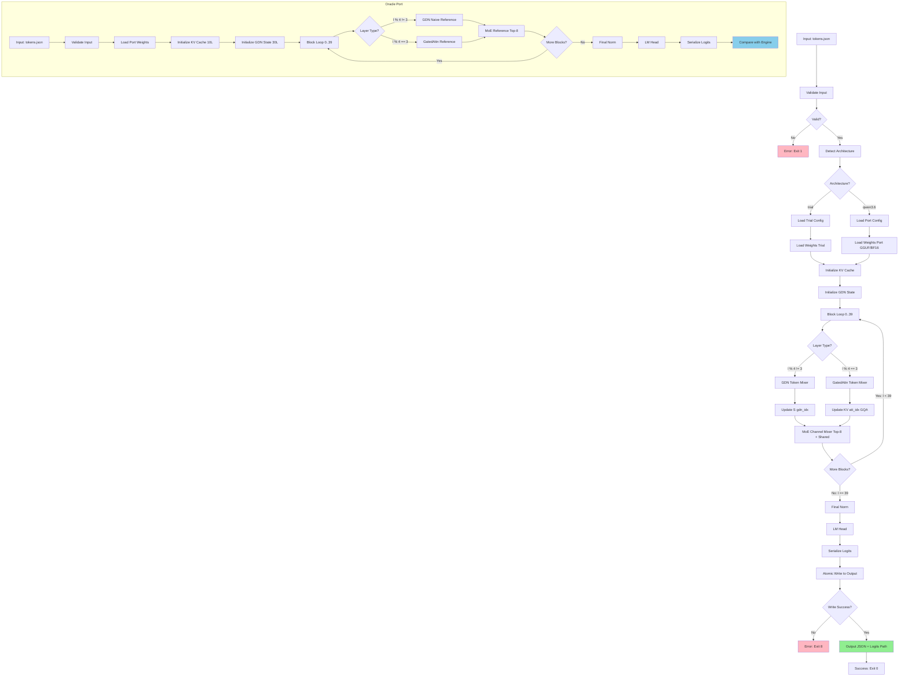

# M9 — Port ke Qwen3.6-35B-A3B (GQA, Gated Attention, Vocab 248K)

> Proyek: `disk-streaming-moe-engine`. Fase: **Port**. Index: `../README.md`.
> Implementasi dipecah menjadi waves: `../../scratch/wave/m9/README.md` (W1 config-adapter → W6 gates, catatan kerja gitignored).
> Fakta arsitektur port bukan lagi TBM (checkpoint resmi tersedia [R4][R5]); angka performa tetap TBM hingga diukur.

| Field       | Nilai                                                              |
| ----------- | ------------------------------------------------------------------ |
| Deliverable | Engine trial beradaptasi ke Qwen3.6-35B-A3B hybrid                 |
| Komponen    | C2 (GQA, gated attention, MoE 256/top-8), C4 (KV GQA), C5/C6 reuse |
| Prasyarat   | M8 hijau (GDN wajib) + M0–M7 hijau                                 |
| Next        | Pasca-M9 (eksperimen MTP — out of scope D8)                        |
| Gate        | G-M9-1..G-M9-4                                                     |
| Rumus       | F1-Port, F2 ($L_{att}$=10, $H_{kv}$=2), F3–F5, F10, F11-GGUF, F12  |

## Delta Arsitektur (dari `../01-architecture.md` §2.7)

| Aspek          | Trial                 | Port                                                                                         |
| -------------- | --------------------- | -------------------------------------------------------------------------------------------- |
| Routed expert  | 60, top-4, inter 1408 | **256, top-8, inter 512**                                                                    |
| Shared         | inter 5632 sigmoid    | **1 shared + 8 routed aktif; inter 512**                                                     |
| Attention      | MHA semua layer       | **10 Gated Attention + 30 GDN** (`10×(3×GDN+1×GatedAttn)`), GQA 16Q/2KV; $L_{att}=L/4$ tepat |
| Vocab          | 151.936               | **248.320 (padded)**                                                                         |
| Total/aktif    | 14,3 B / 2,7 B        | **35 B / 3 B official**                                                                      |
| Disk           | 28,63 GB BF16         | GGUF quant ~13–17 GB atau BF16 ~70 GB untuk oracle                                           |
| Konteks (8 GB) | ≤ 8K                  | KV kecil (GQA) — batas nyata = prefill CPU (F4)                                              |

## Panduan Migrasi Trial → Port

> Cara mengadaptasi engine trial (M0–M8) ke checkpoint port tanpa tulis ulang.
> Prinsip: reuse kernel trial yang bentuknya sama; tambah codepath hanya yang bentuknya beda.

### Tabel perubahan config (trial → port)

| Komponen             | Trial                        | Port                                                          | Aksi kode                                                                                                    |
| -------------------- | ---------------------------- | ------------------------------------------------------------- | ------------------------------------------------------------------------------------------------------------ |
| Layer count / skedul | 24 homogen (attn+MoE)        | 40 hybrid `10×(3×GDN+1×GatedAttn)+MoE`                        | Scheduler block baru (§ Layer Scheduling); kernel attn/MoE reuse                                             |
| Attention            | MHA 16Q/16KV semua layer     | 10 GatedAttn GQA 16Q/2KV + 30 GDN (M8)                        | Codepath GQA (repeat_kv 8→1) + reuse chunked M8; GDN layer no-op KV                                          |
| Router MoE           | 60 expert, top-4             | 256 expert, top-8                                             | Parameterisasi top-k (bukan hardcode 4); verifikasi ulang `norm_topk_prob` + sigmoid shared dari config port |
| Expert inter         | routed 1408 / shared 5632    | routed 512 / shared 512                                       | Dimensi dari config, bukan konstanta                                                                         |
| Vocab / head         | 151.936                      | 248.320 padded                                                | `lm_head` resize; tolak mismatch (exit 3); $W_{res}$ → target ≤1 GiB via quant                               |
| KV cache             | F2 $L_{att}$=24, $H_{kv}$=16 | F2 $L_{att}$=10, $H_{kv}$=2, BF16 (10 KiB/tok = 10.240 B/tok) | Alokasi dari config ($L_{att}$ = cacah layer bertipe attention)                                              |
| Bobot streaming      | 8 shard BF16 28,63 GB        | 26 shard BF16 71,9 GB **atau** GGUF 13–17 GB                  | Loader ganda (safetensors + GGUF); index/offset map per format; pin revision masing-masing (R7)              |

### Weight loading (dua jalur, satu kontrak)

1. **BF16 (oracle/akurasi):** 26 shard → merge index → validasi F15 + vocab 248320 → FP32 oracle. Hanya untuk baseline dan G-M9-1/2.
2. **GGUF Q3_K/IQ3 (runtime):** header magic/version → tabel tensor index/offset locator → dequant on-the-fly via decoder blok GGUF (reuse abstraksi `QuantTensorReader`, bukan format/encoding M6) → forward. SHA per file vs `models.lock.json` port.
3. Aturan: engine tidak menebak format dari ekstensi — deteksi dari magic/header, mismatch → exit 5 (`IO_ERROR`).

### Urutan migrasi (jangan paralel buta)

1. Config adapter + mismatch detector (exit 3) di atas fixture synthetic mini (§ M9-Specific Fixture).
2. Scheduler block + GQA + top-8 di atas fixture → G-M9-1 mini hijau.
3. Weight loader GGUF/BF16 + SEC-1/3 port.
4. Full 40 layer → G-M9-2 → decode (G-M9-3) → KV check (G-M9-4).
5. Angka nyata → tabel §2.7 (prosedur di bawah).

## Gate

| Gate   | Kriteria                                   | Threshold                                                                  | Metode                              |
| ------ | ------------------------------------------ | -------------------------------------------------------------------------- | ----------------------------------- |
| G-M9-1 | oracle layer-by-layer (proxy hybrid kecil) | sama M2/M3                                                                 | TBM saat checkpoint ada → kini ukur |
| G-M9-2 | full forward                               | sama M4 + $M_{peak} \le 7{,}5$ GiB                                         | VmHWM                               |
| G-M9-3 | decode streaming                           | ≥ 0,5 tok/s cold (F3/F5) $\wedge$ KV reuse valid (`recompute_tokens == 0`) | `../03-testing.md` §4.4             |
| G-M9-4 | KV GQA sesuai rumus                        | $e_{KV} \le 5\%$ (F2, $L_{att}≈L/4$)                                       | log + sampler                       |

Kalibrasi $e_T$: target ≤ 20% di M9 (lebih ketat dari trial 30%).

## CLI Contract

### Command: `kimo forward-port`

```bash
kimo forward-port \
  --model-dir /models/qwen3.6-35b \
  --architecture qwen3.6 \
  --tokens /data/prompt1_tokens.json \
  --output /work/prompt1_logits.bin \
  --save-session /work/prompt1.session \
  --workdir ./work \
  --threads 1 \
  --quantization q3
```

### Arguments (`kimo forward-port`)

| Argument           | Type   | Default  | Description                                                                                           |
| ------------------ | ------ | -------- | ----------------------------------------------------------------------------------------------------- |
| `--model-dir`      | path   | required | Direktori model dengan shard port (GGUF atau BF16)                                                    |
| `--architecture`   | string | required | Arsitektur model: `qwen3.6` (port 40-layer) atau `trial` (24-layer). Wajib eksplisit (tanpa default). |
| `--tokens`         | path   | required | Path ke file JSON dengan input token IDs                                                              |
| `--output`         | path   | required | Path output untuk logits (binary raw little-endian FP32)                                              |
| `--save-session`   | path   | optional | Path output menyimpan session state biner (`KMSS v1`: KV cache 10L + 30 GDN states + token history)   |
| `--save-kv-cache`  | path   | optional | Path output modular menyimpan HANYA KV cache Gated Attention ($[2, s, 10, H_{kv}, d_h]$)              |
| `--save-gdn-state` | path   | optional | Path output modular menyimpan HANYA GDN recurrent states ($[30, 128, 128]$ GDNS v1)                   |
| `--load-session`   | path   | optional | Path input session state untuk melanjutkan prefill dari checkpoint sebelumnya                         |
| `--dump-layers`    | path   | optional | Direktori output untuk dump intermediate activation checkpoints per-layer (Gate G-M9-1)               |
| `--workdir`        | path   | `./work` | Direktori kerja untuk temporary files                                                                 |
| `--threads`        | int    | 1        | Jumlah thread (default 1 untuk determinisme verdict)                                                  |
| `--dtype`          | string | auto     | Dtype untuk weights: `auto` (detect from file), `bf16`, `fp32`                                        |
| `--quantization`   | string | none     | Quantization mode: `none`, `q3`, `iq3` (untuk GGUF)                                                   |

### Input JSON

```json
{
  "tokens": [12345, 67890, 23456, 78901],
  "seq_len": 4
}
```

### Output JSON

```json
{
  "status": "success",
  "run_id": "M9-20250115-001",
  "model": "qwen3.6-35b-a3b",
  "architecture": "qwen3.6",
  "num_tokens": 4,
  "num_layers": 40,
  "logits_path": "/work/prompt1_logits.bin",
  "logits_shape": [4, 248320],
  "logits_dtype": "float32",
  "metrics": {
    "walltime_sec": 156.2,
    "vmhwm_bytes": 7516192768,
    "bytes_read": 7374182400,
    "kv_cache": {
      "kv_payload_bytes": 20480,
      "kv_allocated_bytes": 65536,
      "kv_capacity_tokens": 128
    },
    "gdn_state_bytes": 1966080,
    "phases": {
      "load_weights_sec": 2.5,
      "embedding_sec": 0.3,
      "layer_forward_sec": 152.8,
      "final_norm_sec": 0.2,
      "lm_head_sec": 0.4,
      "write_sec": 0.05
    }
  }
}
```

### Exit Codes

- `0`: Sukses, logits ditulis.
- `1`: Error input (tokens tidak valid, model tidak ditemukan).
- `2`: Error architecture (architecture tidak supported atau mismatch dengan model).
- `3`: Error config (vocab mismatch, layer count mismatch, expert count mismatch).
- `4`: Error memory (melebihi memory limit, alloc gagal).
- `5`: Error I/O (shard corrupt, GGUF format error, read gagal).
- `6`: Error layer forward (NaN/INF/overflow di layer mana pun).
- `7`: Error quantization (GGUF quantization error, dtype conversion error).
- `8`: Error output (gagal atomic write logits).

### Command: `kimo decode` (Streaming Port Decode & KV Reuse)

Subcommand `decode` menjalankan autoregressive token decoding dengan me-reuse KV cache (10 layer Gated Attention) dan state rekuren GDN (30 layer) dari sesi prefill sebelumnya tanpa recomputing.

```bash
# Decode melanjutkan dari session prefill
kimo decode \
  --model-dir /models/qwen3.6-35b-gguf \
  --architecture qwen3.6 \
  --session /work/prompt1.session \
  --max-tokens 64 \
  --output /work/decode_tokens.json \
  --workdir ./work \
  --threads 1 \
  --quantization q3
```

#### Arguments (`kimo decode`)

| Argument           | Type   | Default    | Description                                                                            |
| ------------------ | ------ | ---------- | -------------------------------------------------------------------------------------- |
| `--model-dir`      | path   | required   | Direktori model dengan shard port (GGUF atau BF16)                                     |
| `--architecture`   | string | required   | Arsitektur model: `qwen3.6` (port) atau `trial`                                        |
| `--session`        | path   | optional\* | Path ke file session prefill (`KMSS v1`). Wajib jika melanjutkan dari prefill terpisah |
| `--kv-cache-input` | path   | optional   | Path ke file KV cache input jika menggunakan mode modular terpisah                     |
| `--state-input`    | path   | optional   | Path ke file GDN state input (GDNS v1) jika menggunakan mode modular                   |
| `--prompt`         | string | optional   | Prompt text jika prefill dan decode dijalankan inline dalam satu proses                |
| `--tokens`         | path   | optional   | Path JSON token IDs jika prefill dijalankan inline                                     |
| `--max-tokens`     | int    | 64         | Jumlah token baru yang digenerate                                                      |
| `--output`         | path   | required   | Path output JSON untuk hasil decoding dan audit metrics                                |
| `--workdir`        | path   | `./work`   | Direktori kerja                                                                        |
| `--threads`        | int    | 1          | Jumlah thread                                                                          |
| `--temperature`    | float  | 0.0        | Sampling temperature (0.0 = greedy)                                                    |
| `--seed`           | int    | 42         | Random seed sampling (hanya efektif bila temperature > 0)                              |
| `--quantization`   | string | none       | Quantization mode: `none`, `q3`, `iq3`                                                 |

#### Output JSON (`kimo decode`)

Wajib menyertakan blok audit `kv_reuse` untuk verifikasi integritas Gate G-M9-3:

```json
{
  "status": "success",
  "run_id": "M9-20250115-002",
  "model": "qwen3.6-35b-a3b",
  "architecture": "qwen3.6",
  "generated_tokens": 64,
  "output_tokens_path": "/work/decode_tokens.json",
  "tokens": [1234, 5678, 9012],
  "metrics": {
    "walltime_sec": 122.4,
    "tokens_per_sec": 0.523,
    "vmhwm_bytes": 4120000000,
    "kv_reuse": {
      "session_loaded": true,
      "session_path": "/work/prompt1.session",
      "kv_tokens_before": 32,
      "kv_tokens_after": 96,
      "recompute_tokens": 0,
      "gdn_state_reused": true
    }
  }
}
```

### Format Biner Session State: KMSS v1 (Mandatory State Continuation)

Untuk menjamin kelanjutan autoregressive state tanpa kehilangan informasi dan tanpa pembacaan ulang bobot:

1. **Header 128-byte (Natural 8-Byte Alignment)**:
   - `magic[4]`: ASCII `{'K', 'M', 'S', 'S'}` (`0x4B, 0x4D, 0x53, 0x53`).
   - `version`: `uint32_t = 1`.
   - `architecture_id`: `uint32_t = 2` (`ARCH_QWEN36_HYBRID_35B`).
   - `manifest_hash[32]`: SHA-256 digest dari `models.lock.json` untuk mencegah pemuatan session silang model.
   - `seq_len`: `uint32_t` (jumlah token prefill yang tersimpan dalam KV cache).
   - `vocab_size`: `uint32_t = 248320`.
   - `kv_layers`: `uint32_t = 10` (cacah layer full attention).
   - `kv_heads`: `uint32_t = 2` (GQA KV heads).
   - `head_dim`: `uint32_t = 128`.
   - `kv_dtype`: `uint32_t = 2` (BF16, 2 byte) atau `1` (FP32, 4 byte).
   - `gdn_layers`: `uint32_t = 30`.
   - `gdn_dv`: `uint32_t = 128`.
   - `gdn_dk`: `uint32_t = 128`.
   - `gdn_dtype`: `uint32_t = 1` (FP32, 4 byte).
   - `kv_bytes`: `uint64_t = 2 * seq_len * 10 * 2 * 128 * b_KV`.
   - `gdn_bytes`: `uint64_t = 30 * 128 * 128 * 4 = 1,966,080`.
   - `token_bytes`: `uint64_t = seq_len * 4`.
   - `reserved[24]`: Zero padding to 128 bytes.

2. **Payload Kontinu**:
   - `KV Cache`: Tensor kanonis $[2, s, 10, H_{kv}, d_h]$ (dim 0: index 0 = Key, index 1 = Value).
   - `GDN States`: Tensor 3D $[30, d_v, d_k]$ FP32 (kanonis GDNS v1).
   - `Token IDs`: Array uint32 berukuran $s$ elemen sebagai verifikasi integritas prefix sekuens.

3. **Trailing SHA-256 Checksum**:
   32-byte digest di akhir file dihitung secara inkremental:
   $$\text{digest} = \text{SHA-256}(\text{header}[0..128] \mathbin{\Vert} \text{payload}[0..\text{total\_payload\_bytes}])$$

### Contoh Invokasi

```bash
# Happy path: port dengan GGUF quant
kimo forward-port \
  --model-dir /models/qwen3.6-35b-gguf \
  --architecture qwen3.6 \
  --tokens /data/prompt1_tokens.json \
  --output /work/prompt1_logits.bin \
  --quantization q3

# Port dengan BF16 oracle (untuk accuracy baseline)
kimo forward-port \
  --model-dir /models/qwen3.6-35b-bf16 \
  --architecture qwen3.6 \
  --tokens /data/prompt1_tokens.json \
  --output /work/prompt1_logits.bin \
  --dtype bf16

# Cgroup boundary test (enforce Gate G-M9-2: MemoryMax=7.5G)
systemd-run --scope -p MemoryMax=7.5G \
  kimo forward-port \
  --model-dir /models/qwen3.6-35b-gguf \
  --architecture qwen3.6 \
  --tokens /data/prompt1_tokens.json \
  --output /work/prompt1_logits.bin
```

### Additional CLI Output Examples

#### Example 1: Error - Config Mismatch

```json
{
  "status": "error",
  "error_code": 3,
  "error_type": "CONFIG_MISMATCH",
  "message": "Vocab size mismatch: expected 248320, got 151936"
}
```

#### Example 2: Error - Quantization Error

```json
{
  "status": "error",
  "error_code": 7,
  "error_type": "QUANTIZATION_ERROR",
  "message": "Quantization mismatch: expected q3, got q4"
}
```

#### Example 3: Success with Per-Layer Timing

```json
{
  "status": "success",
  "run_id": "M9-20250115-001",
  "model": "qwen3.6-35b-a3b",
  "architecture": "qwen3.6",
  "num_tokens": 128,
  "num_layers": 40,
  "logits_path": "/work/prompt1_logits.bin",
  "logits_shape": [128, 248320],
  "logits_dtype": "float32",
  "metrics": {
    "walltime_sec": 45.2,
    "vmhwm_bytes": 7516192768,
    "bytes_read": 7374182400,
    "kv_cache": {
      "kv_payload_bytes": 655360,
      "kv_allocated_bytes": 1048576,
      "kv_capacity_tokens": 256
    },
    "gdn_state_bytes": 1966080,
    "phases": {
      "load_weights_sec": 2.5,
      "embedding_sec": 0.3,
      "gdn_layers_sec": 15.2,
      "gated_attn_layers_sec": 8.5,
      "moe_layers_sec": 128.8,
      "final_norm_sec": 0.2,
      "lm_head_sec": 0.4,
      "write_sec": 0.05
    }
  }
}
```

#### Example 4: Success with Decode Metrics

```json
{
  "status": "success",
  "run_id": "M9-20250115-002",
  "model": "qwen3.6-35b-a3b",
  "architecture": "qwen3.6",
  "prompt": "What is the capital of France?",
  "prompt_tokens": 8,
  "generated_tokens": 64,
  "metrics": {
    "prefill_time_sec": 5.2,
    "decode_time_sec": 128.5,
    "total_time_sec": 133.7,
    "tokens_per_sec": 0.498,
    "vmhwm_bytes": 7516192768,
    "kv_cache_bytes": 368640
  }
}
```

## Testing

- O/I/B full seperti M2–M5 tapi pada config port.
- Corpus PPL port untuk ΔPPL bila quant port diuji (F12).
- Prefill panjang mahal di CPU (compute-bound) meski KV kecil — ukur, jangan asumsi.

## Oracle: Port Reference

Oracle `tools/oracle/oracle_port.py` menjalankan full forward pass reference untuk Qwen3.6-35B-A3B dengan PyTorch FP32 (atau quantized jika GGUF).

### Input

```bash
# Oracle dengan BF16 (accuracy baseline)
python tools/oracle/oracle_port.py \
  --model-dir /models/qwen3.6-35b-bf16 \
  --architecture qwen3.6 \
  --tokens /data/prompt1_tokens.json \
  --output /work/prompt1_logits_oracle.bin \
  --dtype bf16 \
  --seed 42

# Oracle dengan GGUF quant (quantization baseline)
python tools/oracle/oracle_port.py \
  --model-dir /models/qwen3.6-35b-gguf \
  --architecture qwen3.6 \
  --tokens /data/prompt1_tokens.json \
  --output /work/prompt1_logits_oracle.bin \
  --quantization q3 \
  --seed 42
```

### Oracle Format

**BF16 Oracle**:

- Format: Safetensors atau PyTorch bin format.
- Dtype: BF16 (model native weights) → FP32 (oracle internal accum) → **FP32 (output logits)**.
- Use case: Accuracy baseline untuk unquantized / quantized models.

**GGUF Oracle**:

- Format: GGUF binary format (llama.cpp-compatible).
- Quantization: Q3 atau IQ3 (sesuai target).
- Dtype: GGUF block dequant ke FP32 → FP32 computation → **FP32 (output logits)**.
- Use case: Quantization baseline untuk engine streaming quantized.

### Output Binary Format

Logits **SELALU** disimpan sebagai raw little-endian IEEE-754 `float32` (FP32), baik pada Engine port maupun Oracle:

- Dtype: `float32` (4 bytes per elemen).
- Shape: `[seq_len, vocab_size]` (row-major).
- Total bytes: `seq_len * vocab_size * 4`.
- Contoh untuk port: `4 * 248320 * 4 = 3,973,120 bytes` (untuk 4 token); `128 * 248320 * 4 = 127,139,840 bytes` (untuk 128 token).
- Standardisasi FP32 biner ini menjamin `kimo compare` mengevaluasi metrik F10 ($\Delta_{\max}, \epsilon_{rel}, \cos \theta$) secara deterministik tanpa distorsi konversi dtype.

### Compare Contract

Rust `compare` tool membaca dua logits binary (Engine port vs Oracle port):

```bash
kimo compare \
  --reference /work/prompt1_logits_oracle.bin \
  --candidate /work/prompt1_logits.bin \
  --tolerance 1e-2 \
  --output /work/compare_report.json
```

### Compare Output JSON

```json
{
  "status": "MATCH",
  "run_id": "M9-20250115-001",
  "reference_path": "/work/prompt1_logits_oracle.bin",
  "candidate_path": "/work/prompt1_logits.bin",
  "metrics": {
    "delta_max": 8.2e-3,
    "epsilon_rel": 3.1e-5,
    "cos_theta": 0.9999998,
    "agreement": 99.95,
    "delta_ce": 0.015
  },
  "verdict": "PASS",
  "threshold": "delta_max <= 1e-2"
}
```

### Compare Exit Codes

- `0`: MATCH (semua threshold terpenuhi)
- `1`: FAIL (threshold tidak terpenuhi)
- `2`: ERROR (shape mismatch, file tidak ditemukan)

## M9-Specific Fixture

### Synthetic Mini Port Config

Untuk testing CI tanpa download 70 GB BF16 atau 13-17 GB GGUF, gunakan config synthetic:

| Parameter        | Value                                                      |
| ---------------- | ---------------------------------------------------------- |
| Layers           | 4 (mini: 1×GatedAttn + 3×GDN untuk pola 3×GDN+1×GatedAttn) |
| Routed expert    | 8 (mini dari 256)                                          |
| Top-k            | 2 (mini dari top-8)                                        |
| Inter dimensi    | 64 (mini dari 512)                                         |
| Shared expert    | 1 shared + 2 routed aktif (mini dari 1+8)                  |
| Vocab            | 1024 (mini dari 248.320)                                   |
| $d_h$ (head dim) | 32 (mini dari port yang tidak diketahui)                   |
| GQA              | 4Q/1KV (mini dari 16Q/2KV)                                 |
| Sequence length  | 8 (untuk prefill)                                          |
| Seed             | 42 (deterministik)                                         |

### Fixture Path

- Tokens: `fixtures/m9_port_tokens.json`
- Weights port: `fixtures/m9_port_weights.safetensors` (synthetic, seed 42)
- Oracle logits: `fixtures/m9_port_logits_naive.bin` (precomputed)

### Fixture Tokens JSON

```json
{
  "tokens": [1, 23, 45, 67, 89, 101, 123, 145],
  "seq_len": 8
}
```

### Fixture Generation

```bash
# Generate synthetic weights port
python tools/oracle/generate_port_fixture.py \
  --layers 4 \
  --routed-experts 8 \
  --topk 2 \
  --inter-dim 64 \
  --vocab 1024 \
  --dh 32 \
  --gqa-q 4 \
  --gqa-kv 1 \
  --seed 42 \
  --output fixtures/m9_port_weights.safetensors

# Generate oracle logits (full forward port)
python tools/oracle/oracle_port.py \
  --tokens fixtures/m9_port_tokens.json \
  --weights fixtures/m9_port_weights.safetensors \
  --architecture qwen3.6 \
  --output fixtures/m9_port_logits_naive.bin \
  --seed 42
```

### Expected Memory Usage

- KV cache (GQA): `2 * 1 * 1 * 32 * 8 * 2 B = 1,024 B` (1 layer GatedAttn dengan GQA)
- State GDN: `3 * 32 * 32 * 4 = 12,288 bytes` (3 layer GDN)
- Total memory footprint: < 50 MB (cocok untuk CI 8 GB)

### Integration dengan CI

```bash
# Test fixture synthetic (tanpa model port asli)
make validate-m9
```

Target: G-M9-1 (oracle layer-by-layer) lulus dengan fixture synthetic sebelum testing dengan model port 70 GB.

## Layer Scheduling

### Pattern: 40 Transformer Blocks (10 Siklus Makro × [3×(GDN+MoE) + 1×(GatedAttn+MoE)])

Arsitektur port Qwen3.6-35B-A3B ([R4]) mendefinisikan **40 Transformer Blocks** kanonis (`num_hidden_layers = 40`, diindeks `layers.0` s.d. `layers.39` pada safetensors/GGUF).

Setiap transformer block $\ell \in [0, 39]$ memiliki 2 sublayer residual standar:

1. **Sublayer 1: Token Mixer** (dijadwalkan dalam pola perulangan 4-block):
   - Jika $\ell \pmod 4 \in \{0, 1, 2\}$: **Gated DeltaNet (GDN)** (linear attention tanpa KV cache).
   - Jika $\ell \pmod 4 == 3$: **Gated Attention (GatedAttn)** (GQA 16Q/2KV dengan KV cache).
2. **Sublayer 2: Channel Mixer (MoE MLP)**:
   - Hadir pada **SETIAP** transformer block $\ell \in [0, 39]$ (total **40 MoE layers**, BUKAN 10 layer terpisah!).
   - Setiap MoE sublayer memiliki 256 routed experts (top-8 aktif) + 1 shared expert terisolasi (gate sigmoid).

Struktur eksekusi per siklus makro $c \in [0, 9]$ ($4 \text{ blocks} \times 10 = 40 \text{ blocks}$):

```
Siklus Makro c ∈ [0, 9] (4 blocks = Block 4c + 0 s.d. 4c + 3):
  Block 4c + 0: InputNorm → GDN Mixer (S[3c + 0]) → Add → PostNorm → MoE (top-8) → Add
  Block 4c + 1: InputNorm → GDN Mixer (S[3c + 1]) → Add → PostNorm → MoE (top-8) → Add
  Block 4c + 2: InputNorm → GDN Mixer (S[3c + 2]) → Add → PostNorm → MoE (top-8) → Add
  Block 4c + 3: InputNorm → GatedAttn Mixer (KV[:,:,c]) → Add → PostNorm → MoE (top-8) → Add
```

**Total Komponen Eksekusi**:

- **40 Transformer Blocks** (`layers.0` .. `layers.39`).
- **40 Token Mixers**: 30 GDN layers ($10 \times 3$) + 10 Gated Attention layers ($10 \times 1$).
- **40 Channel Mixers**: 40 MoE layers ($10 \times 4$).
- Tidak ada phantom "layer 41..50" ataupun GDN block yang kehilangan MoE.

### Independent Layer State Management & Activation Flow (Bukan Shared State)

Dalam arsitektur hybrid transformer, wajib dibedakan secara fundamental antara **aliran kedalaman (_depth flow_)** dan **aliran sekuens/waktu (_temporal/sequence flow_)**:

1. **Aliran Kedalaman (Depth / Activation Flow)**:
   - Aktivasi representasi tersembunyi $x \in \mathbb{R}^{N \times d_{\text{model}}}$ mengalir maju menembus seluruh 40 block:
     $$\text{Embedding} \to \text{Block}_0 \to \text{Block}_1 \to \dots \to \text{Block}_{39} \to \text{FinalNorm} \to \text{LM\_Head}$$
   - Setiap sub-layer menerima $x_{\text{in}}$, menambahkan transformasi residual $x_{\text{out}} = x_{\text{in}} + \text{SubLayer}(\text{RMSNorm}(x_{\text{in}}))$.

2. **Aliran Sekuens / State Internal (Independent Per-Layer Memory)**:
   - **GDN State Invariant (30 State Independen)**: Terdapat 30 token mixer GDN independen pada block $\ell$ di mana $\ell \pmod 4 \ne 3$. Setiap mixer GDN memiliki recurrent state eksklusif sendiri $S[gdn\_idx] \in \mathbb{R}^{d_v \times d_k}$ ($gdn\_idx \in [0, 29]$).
   - **Bukan Shared State**: State $S$ **TIDAK PERNAH ditransfer antar-layer GDN yang berbeda**. Mixer GDN pada block berikutnya TIDAK mengambil atau menimpa state dari mixer GDN sebelumnya.
   - Tensor state GDN utuh adalah 3D tensor berukuran kanonis:
     $$S \in \mathbb{R}^{30 \times d_v \times d_k}$$
     dengan total footprint: $M_{\text{state}} = 30 \times d_v \times d_k \times 4\text{ bytes} = 1.966.080\text{ bytes}$ (1,97 MB FP32 untuk $d_v=d_k=128$).
   - **KV Cache Invariant (10 Cache Independen dengan Dimensi K/V)**: Terdapat 10 token mixer Gated Attention pada block $\ell$ di mana $\ell \pmod 4 == 3$. Setiap layer attention $att\_idx = \lfloor \ell/4 \rfloor \in [0, 9]$ memiliki KV cache sendiri yang menyimpan tensor Key dan Value: $\text{KV}[:, :, att\_idx] \in \mathbb{R}^{2 \times N \times H_{\text{kv}} \times d_h}$ ($H_{\text{kv}}=2, d_h=128$, dengan dimensi terdepan berukuran 2 untuk membedakan Key pada indeks 0 dan Value pada indeks 1). Layer GDN tidak membaca maupun menulis KV cache (no-op).

### Multi-Layer State Lifecycle & Indexing

Untuk transformer block $\ell \in [0, 39]$:

- Jika $\ell \pmod 4 \in \{0, 1, 2\}$:
  Indeks recurrent state GDN unik dihitung via:
  $$gdn\_idx = 3 \cdot \lfloor \ell / 4 \rfloor + (\ell \pmod 4) \in [0, 29]$$
- Jika $\ell \pmod 4 == 3$:
  Indeks KV cache attention unik dihitung via:
  $$att\_idx = \lfloor \ell / 4 \rfloor \in [0, 9]$$
- MoE channel mixer selalu berada pada block $\ell$ dan mengakses parameter MoE block tersebut (`layers.<l>.moe`).

Lifecycle state terdefinisi sebagai:

1. **Sequence Start (Cold / New Prompt)**:
   - Inisialisasi seluruh 30 state GDN ke nol: $S[gdn\_idx] = \mathbf{0} \in \mathbb{R}^{d_v \times d_k}$ untuk seluruh $gdn\_idx \in [0, 29]$ (shape `[30, dv, dk]`).
   - Inisialisasi KV cache 10 layer ke nol dengan dimensi eksplisit untuk Key dan Value: shape `[2, seq_len, 10, H_kv, d_h]`.
2. **Prefill / Chunked Forward Step**:
   - Untuk setiap transformer block $\ell \in [0, 39]$:
     - **Sublayer 1 (Token Mixer)**:
       - Normalisasi input: $h_1 = \text{RMSNorm}(x; \gamma_{in}^{[\ell]})$.
       - Jika $\ell \pmod 4 \in \{0, 1, 2\}$:
         - $gdn\_idx = 3 \lfloor \ell / 4 \rfloor + (\ell \pmod 4)$.
         - Layer $\ell$ memproses $h_1$ dan memperbarui state eksklusif miliknya $S[gdn\_idx]$ menggunakan kernel chunked WY scan M8:
           $$y, S[gdn\_idx] \leftarrow \text{ChunkedScan}(h_1, S[gdn\_idx]; W_{gdn}^{[\ell]})$$
       - Jika $\ell \pmod 4 == 3$:
         - $att\_idx = \lfloor \ell / 4 \rfloor$.
         - Layer $\ell$ memproses $h_1$ dan meng-append pasangan $(K_{att\_idx}, V_{att\_idx})$ ke slot $\text{KV}[:, :, att\_idx]$.
       - Residual update: $x \leftarrow x + y$.
     - **Sublayer 2 (Channel Mixer / MoE)**:
       - Normalisasi post-attention: $h_2 = \text{RMSNorm}(x; \gamma_{post}^{[\ell]})$.
       - Layer $\ell$ memproses $h_2$ melalui 256 routed experts (top-8) + 1 shared expert: $z = \text{MoE}(h_2; W_{moe}^{[\ell]})$.
       - Residual update: $x \leftarrow x + z$.
3. **Continuation / Autoregressive Decode Step**:
   - Seluruh state 30 layer GDN $S[0..29]$ dan 10 layer KV cache $\text{KV}[:, :, 0..9]$ **dipertahankan (_preserved_)**.
   - Saat token baru $t+1$ masuk, setiap block $\ell$ meng-update state miliknya sendiri:
     - Jika GDN: $S_{t+1}[gdn\_idx] = \gamma_{t+1}^{[\ell]} S_t[gdn\_idx](I - \beta_{t+1}^{[\ell]} k_{t+1}^{[\ell]} {k_{t+1}^{[\ell]}}^\top) + \beta_{t+1}^{[\ell]} v_{t+1}^{[\ell]} {k_{t+1}^{[\ell]}}^\top$.
     - Jika GatedAttn: append $K_{t+1}, V_{t+1}$ ke $\text{KV}[:, t+1, att\_idx]$.
     - MoE di-evaluasi untuk token tunggal tersebut (top-8 routed experts + shared expert).
   - Format biner serialisasi session state KMSS v1 (`[2, s, 10, H_kv, d_h]` + `[30, dv, dk]`) menyimpan seluruh context ini secara terpadu.

### KV GQA Management

**GQA Structure**: 16Q/2KV

- 16 query heads per layer.
- 2 key-value heads per layer (agregasi 8 query heads per KV head).
- Reduksi KV memory vs MHA (trial: 16 KV heads → port: 2 KV heads).

**KV Allocation & Data Layout**:

Multiplier 2 pada rumus F2 ($M_{KV} = 2 L_{att} H_{kv} d_h s b_{KV}$) berasal dari pasangan tensor **Key ($K$)** dan **Value ($V$)**. Representasi memori fisik wajib menyediakan dimensi eksplisit untuk $K$ dan $V$:

```python
# KV cache shape fisik kanonis untuk port (10 GatedAttn layers, dimensi K dan V eksplisit)
KV_cache = {
    # 5D Packed Tensor: [2 (K/V), seq_len, L_att, H_kv, d_h]
    # Indeks 0 = Key, Indeks 1 = Value
    "shape": [2, seq_len, 10, H_kv, d_h],
    # contoh: [2, 4096, 10, 2, 128] untuk ctx 4K
    # Total elemen: 2 * 4096 * 10 * 2 * 128 = 20.971.520 elemen
    # Total bytes (BF16, 2B): 41.943.040 bytes (~40 MiB)
}

# Representasi ekuivalen (Dual 4D Tensors):
# K_cache: [seq_len, 10, H_kv, d_h]
# V_cache: [seq_len, 10, H_kv, d_h]
```

**KV Update**:

- Setiap GatedAttn layer menambah pasangan Key dan Value ke cache layer miliknya (`KV[0, :, att_idx]` untuk Key, `KV[1, :, att_idx]` untuk Value, atau irisan `KV[:, :, att_idx]`, di mana $att\_idx = \lfloor \ell / 4 \rfloor \in [0, 9]$).
- GDN layer melewati KV cache (no-op).

### MoE Integration

**MoE Placement**:

- Hadir pada **SELURUH 40 transformer blocks** sebagai Sublayer 2 (Channel Mixer) setelah residual token mixer:
  $$x \leftarrow x + \text{MoE}(\text{RMSNorm}(x; \gamma_{post}^{[\ell]}); W_{moe}^{[\ell]})$$
- Setiap MoE sublayer menggunakan 256 routed experts, top-8 selection, inter dimensi 512.
- 1 shared expert + 8 routed aktif per block (total 40 MoE channel mixers).

**Expert Routing**:

- Router top-8 (bukan top-4 seperti trial).
- Verifikasi `norm_topk_prob=false` (sama dengan trial).
- Gate shared = sigmoid (sama dengan trial).

### Layer Order pseudocode

```python
def forward_port(tokens, S_prev=None, KV_prev=None):
    """
    Forward pass 40-block hybrid Qwen3.6 port (40 Transformer Blocks).
    Setiap block memiliki:
      - Sublayer 1 (Token Mixer): GDN (jika l % 4 != 3) atau GatedAttn (jika l % 4 == 3)
      - Sublayer 2 (Channel Mixer): MoE MLP (top-8 routed + 1 shared expert) pada semua 40 block

    Args:
        tokens: Tensor[seq_len] input token IDs
        S_prev: Optional Tensor[30, dv, dk] state GDN dari prompt sebelumnya (continuation)
        KV_prev: Optional Tensor[2, prev_len, 10, H_kv, d_h] KV cache sebelumnya (dim 0: 0=K, 1=V)
    Returns:
        logits: Tensor[seq_len, vocab_size]
        S: Tensor[30, dv, dk] recurrent state per-layer GDN
        KV: Tensor[2, total_len, 10, H_kv, d_h] KV cache per-layer attention
    """
    seq_len = len(tokens)

    # 1. Embedding
    x = embedding(tokens)

    # 2. State Lifecycle: Inisialisasi atau Continuation
    # GDN: 30 recurrent states independen, shape [30, dv, dk]
    if S_prev is not None:
        S = copy(S_prev)  # Continuation: preserve state 30 layer
    else:
        S = zeros(30, dv, dk)  # Sequence start: zero-init semua 30 layer

    # KV cache: 10 attention layers, shape [2, seq_len, 10, H_kv, d_h] (dim 0: 0=K, 1=V)
    if KV_prev is not None:
        KV = concat_kv_time(KV_prev, zeros(2, seq_len, 10, H_kv, d_h), dim=1)
    else:
        KV = zeros(2, seq_len, 10, H_kv, d_h)

    # 3. 40 Transformer Blocks (num_hidden_layers = 40)
    for layer_idx in range(40):
        # --- Sublayer 1: Token Mixer ---
        norm_x = input_layernorm(x, layer_idx=layer_idx)

        if (layer_idx % 4) != 3:
            # Gated DeltaNet (GDN): 30 layers total
            gdn_idx = 3 * (layer_idx // 4) + (layer_idx % 4)
            # GDN membaca & meng-update state eksklusif miliknya: S[gdn_idx]
            # Kernel chunked scan WY (M8) mengeksekusi recurrence per-layer
            mixer_out, S[gdn_idx] = gdn_layer_forward(
                x=norm_x,
                layer_state=S[gdn_idx],
                layer_idx=layer_idx,
                gdn_idx=gdn_idx
            )
        else:
            # Gated Attention (GQA 16Q/2KV): 10 layers total
            att_idx = layer_idx // 4
            # KV[:, :, att_idx] berukuran [2, seq_len, H_kv, d_h] (memuat K dan V)
            mixer_out, KV[:, :, att_idx] = gated_attention_layer_forward(
                x=norm_x,
                layer_kv=KV[:, :, att_idx],  # [0]=K, [1]=V
                layer_idx=layer_idx,
                att_idx=att_idx
            )

        # Residual add setelah Token Mixer
        x = x + mixer_out

        # --- Sublayer 2: Channel Mixer (MoE MLP) ---
        # Hadir di SETIAP transformer block (total 40 MoE layers)
        norm_x2 = post_attention_layernorm(x, layer_idx=layer_idx)
        moe_out = moe_layer_forward(x=norm_x2, layer_idx=layer_idx)
        x = x + moe_out

    # 4. Final RMSNorm + LM Head
    x = final_norm(x)
    logits = lm_head(x)

    return logits, S, KV
```

### Gated Attention (GQA 16Q/2KV) Exact Computation Graph & Mathematical Contract

Berbeda dari trial (MHA homogen 16Q/16KV tanpa gate), Gated Attention pada port Qwen3.6-35B-A3B ([R4]) mengintegrasikan arsitektur **Gated Attention** (NeurIPS 2025) dengan **Grouped Query Attention (GQA 16Q/2KV)**.

#### 1. Parameter & Dimensi Layer Attention

Untuk setiap transformer block $\ell \in [0, 39]$ di mana $\ell \pmod 4 == 3$ ($10$ layer total; indeks attention slot $att\_idx = \lfloor \ell/4 \rfloor \in [0, 9]$):

- Hidden dimension: $d = 2048$
- Query heads: $H_q = 16$
- Key/Value heads: $H_{kv} = 2$ (rasio GQA: $G = H_q / H_{kv} = 8$ query heads per 1 KV head)
- Head dimension: $d_h = d / H_q = 2048 / 16 = 128$ (dihitung dinamis dari config port)
- RoPE base frequency: $\theta = 1{,}000{,}000.0$ (native context length 262.144)
- Normalization epsilon: $\epsilon = 10^{-6}$

#### 2. Bobot Parameter (Safetensors / GGUF Tensor Keys)

- `layers.<l>.input_layernorm.weight`: $[d]$
- `layers.<l>.self_attn.q_proj.weight`: $[H_q \cdot d_h, d] = [2048, 2048]$ (dan `q_proj.bias`: $[2048]$)
- `layers.<l>.self_attn.k_proj.weight`: $[H_{kv} \cdot d_h, d] = [256, 2048]$ (dan `k_proj.bias`: $[256]$)
- `layers.<l>.self_attn.v_proj.weight`: $[H_{kv} \cdot d_h, d] = [256, 2048]$ (dan `v_proj.bias`: $[256]$)
- `layers.<l>.self_attn.gate_proj.weight`: $[H_q \cdot d_h, d] = [2048, 2048]$ (dan `gate_proj.bias`: $[2048]$)
- `layers.<l>.self_attn.o_proj.weight`: $[d, H_q \cdot d_h] = [2048, 2048]$ (dan `o_proj.bias`: $[2048]$)

#### 3. Grafik Komputasi Rinci (Exact Computation Graph)

Untuk input representasi aktivasi $x \in \mathbb{R}^{s \times d}$ pada posisi sekuens mulai dari $\text{pos\_offset}$:

1. **Input Normalization (RMSNorm)**:
   $$x_{\text{norm}} = \text{RMSNorm}(x, \gamma_{in}^{[\ell]}, \epsilon) = \frac{x}{\sqrt{\frac{1}{d}\sum_{k=1}^d x_k^2 + \epsilon}} \odot \gamma_{in}^{[\ell]}$$

2. **Proyeksi Linear 4-Cabang (Q, K, V, Gate)**:
   $$Q = x_{\text{norm}} W_q^T + b_q \in \mathbb{R}^{s \times 2048}$$
   $$K = x_{\text{norm}} W_k^T + b_k \in \mathbb{R}^{s \times 256}$$
   $$V = x_{\text{norm}} W_v^T + b_v \in \mathbb{R}^{s \times 256}$$
   $$\text{Gate} = \sigma(x_{\text{norm}} W_{\text{gate}}^T + b_{\text{gate}}) \in \mathbb{R}^{s \times 2048}$$
   di mana $\sigma(z) = \frac{1}{1 + e^{-z}}$ (Sigmoid element-wise).

3. **Rotary Position Embedding (RoPE F7)**:
   RoPE diterapkan secara independen per-head pada $Q$ ($16$ heads $\times 128$) dan $K$ ($2$ heads $\times 128$):
   $$Q_{\text{rot}} = \text{apply\_rope}(Q, s, H_q=16, d_h=128, \text{pos\_offset}, \theta)$$
   $$K_{\text{rot}} = \text{apply\_rope}(K, s, H_{kv}=2, d_h=128, \text{pos\_offset}, \theta)$$
   dengan formulasi rotasi separuh dimensi:
   $$\text{rotate\_half}(u) = [-u[..., 64:], u[..., :64]]$$
   $$\text{rot}(u, m) = u \odot \cos(m\Theta) + \text{rotate\_half}(u) \odot \sin(m\Theta)$$

4. **Update Physical 5D KV Cache**:
   Tulis $K_{\text{rot}}$ dan $V$ ke slot fisik $att\_idx = \lfloor \ell/4 \rfloor$:
   $$\text{KV}[0, \text{pos\_offset}:\text{pos\_offset}+s, att\_idx, :, :] = K_{\text{rot}}$$
   $$\text{KV}[1, \text{pos\_offset}:\text{pos\_offset}+s, att\_idx, :, :] = V$$
   Ekstrak seluruh sekuens masa lalu hingga total panjang $T = \text{pos\_offset} + s$:
   $$K_{\text{past}} = \text{KV}[0, 0:T, att\_idx, :, :] \in \mathbb{R}^{T \times 2 \times 128}$$
   $$V_{\text{past}} = \text{KV}[1, 0:T, att\_idx, :, :] \in \mathbb{R}^{T \times 2 \times 128}$$

5. **GQA Expansion (`repeat_kv` 8 $\to$ 1)**:
   Setiap head KV $k \in \{0, 1\}$ direplikasi 8 kali untuk melayani query head $q \in [8k, 8k+7]$:
   $$K_{\text{rep}} = \text{repeat\_interleave}(K_{\text{past}}, \text{repeats}=8, \text{dim}=1) \in \mathbb{R}^{T \times 16 \times 128}$$
   $$V_{\text{rep}} = \text{repeat\_interleave}(V_{\text{past}}, \text{repeats}=8, \text{dim}=1) \in \mathbb{R}^{T \times 16 \times 128}$$

6. **Scaled Dot-Product Attention & Causal Masking**:
   Reshape $Q_{\text{rot}}$ ke $[16, s, 128]$ dan $K_{\text{rep}}$ ke $[16, T, 128]$:
   $$\text{Scores} = \frac{Q_{\text{rot}} K_{\text{rep}}^T}{\sqrt{d_h}} \in \mathbb{R}^{16 \times s \times T}$$
   Terapkan matriks masker autoregresif segitiga $M \in \mathbb{R}^{s \times T}$ di mana $M_{i, j} = 0$ jika $(\text{pos\_offset} + i) \ge j$ dan $-\infty$ sebaliknya:
   $$P = \text{softmax}(\text{Scores} + M, \text{dim}=-1)$$
   (Softmax dihitung secara stabil numerik: $\exp(z - \max z) / \sum \exp(z - \max z)$).
   $$\text{Attn} = P V_{\text{rep}} \in \mathbb{R}^{16 \times s \times 128} \to \text{permute ke } [s, 16, 128] \to \text{flatten ke } \mathbb{R}^{s \times 2048}$$

7. **Head/Element-wise Sigmoid Gating**:
   Aplikasi filter non-linear gate untuk menekan noise dan attention sinks:
   $$\text{Attn}_{\text{gated}} = \text{Attn} \odot \text{Gate} \in \mathbb{R}^{s \times 2048}$$

8. **Output Projection & Residual Add**:
   $$y = \text{Attn}_{\text{gated}} W_o^T + b_o \in \mathbb{R}^{s \times 2048}$$
   $$x_{\text{out}} = x + y$$

### GDN State Lifecycle: Pemisahan Mutlak Sumbu Waktu vs Sumbu Kedalaman

Untuk mencegah ambiguitas matematis pada state recurrent GDN:

1. **Sumbu Kedalaman (Layers — Isolasi Mutlak)**:
   - Terdapat tepat 30 mixer GDN independen pada block $\ell$ di mana $\ell \pmod 4 \ne 3$.
   - Masing-masing mixer memiliki recurrent state eksklusif $S[gdn\_idx] \in \mathbb{R}^{d_v \times d_k}$ ($gdn\_idx = 3 \lfloor \ell/4 \rfloor + (\ell \pmod 4) \in [0, 29]$).
   - **State $S[gdn\_idx]$ TIDAK PERNAH ditransfer atau dibagikan ke layer GDN lain** ($S[0]$ hanya diproses oleh GDN Block 0, $S[1]$ hanya oleh GDN Block 1, dst.).

2. **Sumbu Waktu (Temporal / Tokens — Persistensi Sekuens)**:
   - **State $S[gdn\_idx]$ DIPERSISTENSIKAN MENEMBUS SEKUEN TOKEN**:
     - Prefill chunked WY (F14): Chunk $c+1$ dimulai dengan state akhir chunk $c$ pada layer yang sama.
     - Decode per-token:
       $$S_{t+1}[gdn\_idx] = \gamma_{t+1}^{[\ell]} S_t[gdn\_idx](I - \beta_{t+1}^{[\ell]} k_{t+1}^{[\ell]} {k_{t+1}^{[\ell]}}^\top) + \beta_{t+1}^{[\ell]} v_{t+1}^{[\ell]} {k_{t+1}^{[\ell]}}^\top$$
   - **Lifecycle Kontrak**:
     - **Prompt Baru Independen**: Reset seluruh 30 state ke nol: $S[0..29] = \mathbf{0}$.
     - **Continuation (Prefill $\to$ Decode atau Multi-turn)**: Preserve seluruh 30 state $S[0..29]$ dan seluruh 10 slot KV cache tanpa komputasi ulang token prompt (`recompute_tokens == 0`).

### G-M9-1 Layer-by-Layer Intermediate Verification Contract

Untuk mencegah kegagalan _opaque_ (logits akhir mismatch tanpa diketahui lokasi awal deviasi), Gate G-M9-1 memandatkan fasilitas inspeksi layer-by-layer bertahap pada fixture sintetis via flag `--dump-layers <dir>`:

1. **Intermediate Artifacts Dump Format**:
   Engine dan Oracle menyimpan tensor aktivasi biner FP32 little-endian pada setiap titik batas:
   - `00_embedding.bin`: $[s, d]$
   - Untuk setiap block $\ell \in [0, 39]$:
     - `block_{l}_01_input.bin`: $[s, d]$ input awal block $\ell$.
     - `block_{l}_02_mixer_norm.bin`: $[s, d]$ input RMSNorm.
     - `block_{l}_03_mixer_out.bin`: $[s, d]$ output Token Mixer (GDN atau GatedAttn sebelum residual).
     - `block_{l}_04_post_mixer.bin`: $[s, d]$ setelah residual Token Mixer ($x + \text{mixer\_out}$).
     - `block_{l}_05_post_norm.bin`: $[s, d]$ output `post_attention_layernorm`.
     - `block_{l}_06_router_logits.bin`: $[s, 256]$ logits router FP32.
     - `block_{l}_07_topk_indices.bin`: $[s, 8]$ uint32 indices top-8 expert terpilih.
     - `block_{l}_08_moe_out.bin`: $[s, d]$ output Channel Mixer MoE (routed + shared sebelum residual).
     - `block_{l}_09_block_out.bin`: $[s, d]$ output akhir block $\ell$ ($x + \text{moe\_out}$).
     - Internal state snapshots:
       - GDN ($\ell \pmod 4 \ne 3$): `block_{l}_gdn_state.bin`: $[d_v, d_k]$ state paska-update.
       - GatedAttn ($\ell \pmod 4 == 3$): `block_{l}_kv_cache.bin`: $[2, s, H_{kv}, d_h]$ slot KV paska-append.
   - `98_final_norm.bin`: $[s, d]$ output final RMSNorm.
   - `99_logits.bin`: $[s, V]$ logits sebelum softmax/argmax.

2. **Per-Stage Tolerance Thresholds (F10)**:
   - Linear projections & norms: $\Delta_{\max} \le 10^{-4}, \epsilon_{rel} \le 10^{-5}$
   - Token Mixers (GDN & GatedAttn): $\Delta_{\max} \le 10^{-3}, \epsilon_{rel} \le 10^{-4}$
   - MoE Sublayer: $\Delta_{\max} \le 10^{-3}, \epsilon_{rel} \le 10^{-4}$
   - Cumulative Block Output: $\Delta_{\max} \le 5 \cdot 10^{-3}$
   - Final Logits: $\Delta_{\max} \le 10^{-2}, \epsilon_{rel} \le 10^{-4}, \cos \theta \ge 0.9999$

3. **Fault Localization**:
   Jika evaluasi logits akhir gagal, engine membandingkan file tahap demi tahap secara sekuensial dari `00_embedding.bin` s.d. `99_logits.bin` dan langsung melaporkan stage pertama yang melanggar threshold sebagai _point-of-divergence_.

## Error Handling

### Error Schema

Semua error mengembalikan JSON dengan field `status: "error"` dan `error_code`:

```json
{
  "status": "error",
  "error_code": 3,
  "error_type": "CONFIG_MISMATCH",
  "message": "Vocab size mismatch: expected 248320, got 151936"
}
```

### Error Categories

| Error Code | Type                 | Scenario                                                    | Handling                             |
| ---------- | -------------------- | ----------------------------------------------------------- | ------------------------------------ |
| 1          | INPUT_INVALID        | Tokens tidak valid, model tidak ditemukan                   | Validasi input sebelum alloc         |
| 2          | ARCHITECTURE_INVALID | Architecture tidak supported atau mismatch dengan model     | Cek architecture vs model config     |
| 3          | CONFIG_MISMATCH      | Vocab mismatch, layer count mismatch, expert count mismatch | Validasi config sebelum forward      |
| 4          | MEMORY_ALLOC_FAILURE | Melebihi memory limit, alloc gagal                          | Cek VmHWM, cleanup partial alloc     |
| 5          | IO_ERROR             | Shard corrupt, GGUF format error, read gagal                | Clean error message, exit 5          |
| 6          | LAYER_FORWARD_ERROR  | NaN/INF/overflow di layer mana pun (GDN atau GatedAttn)     | Log layer index, exit 6              |
| 7          | QUANTIZATION_ERROR   | GGUF quantization error, dtype conversion error             | Log quantization details, exit 7     |
| 8          | OUTPUT_ERROR         | Gagal atomic write logits                                   | Retry atau cleanup temp file, exit 8 |

### Config Mismatch Detection

**Vocab size mismatch**:

```python
if model_config.vocab_size != 248320:
    raise Error(CONFIG_MISMATCH, f"Vocab size mismatch: expected 248320, got {model_config.vocab_size}")
```

**Layer count mismatch**:

```python
if model_config.num_layers != 40:
    raise Error(CONFIG_MISMATCH, f"Layer count mismatch: expected 40, got {model_config.num_layers}")
```

**Expert count mismatch**:

```python
if model_config.num_routed_experts != 256:
    raise Error(CONFIG_MISMATCH, f"Expert count mismatch: expected 256, got {model_config.num_routed_experts}")
```

**Top-k mismatch**:

```python
if model_config.top_k != 8:
    raise Error(CONFIG_MISMATCH, f"Top-k mismatch: expected 8, got {model_config.top_k}")
```

### GGUF Header & Index Validation Errors

**GGUF format and index validation**:

```python
try:
    # HANYA parse header dan metadata index tensor, tidak pernah load seluruh tensor ke RAM
    gguf_index = parse_gguf_header_and_index(model_path)
except GGUFFormatError as e:
    raise Error(IO_ERROR, f"GGUF format error: {e}")
```

**Quantization mismatch**:

```python
if gguf_index.quantization != requested_quantization:
    raise Error(QUANTIZATION_ERROR, f"Quantization mismatch: expected {requested_quantization}, got {gguf_index.quantization}")
```

**Dtype conversion error**:

```python
try:
    weights = convert_dtype(weights, target_dtype)
except DtypeConversionError as e:
    raise Error(QUANTIZATION_ERROR, f"Dtype conversion error: {e}")
```

### Specific Error Messages

- **Error 1**: `"Input file not found: {path}"` atau `"Invalid token JSON: {error}"`
- **Error 2**: `"Architecture not supported: {arch}. Supported: trial, qwen3.6"`
- **Error 3**: `"Vocab size mismatch: expected 248320, got {vocab}"` atau `"Layer count mismatch: expected 40, got {layers}"`
- **Error 4**: `"Memory allocation failed: requested {bytes} bytes, memory limit {limit}"`
- **Error 5**: `"I/O error reading shard {shard}: {errno}"` atau `"GGUF format error: {error}"`
- **Error 6**: `"Layer forward error: NaN/INF at layer {layer_idx}, type {layer_type}"`
- **Error 7**: `"Quantization error: {error}"` atau `"Dtype conversion error: {error}"`
- **Error 8**: `"Output error: failed atomic write to {path}"`

## Workflow Diagram



### Workflow Steps

1. **Input Validation**: Cek tokens JSON format, seq_len > 0.
2. **Architecture Detection**: Detect `--architecture` flag (trial vs qwen3.6).
3. **Config Loading**: Load config sesuai architecture (trial config atau port config).
4. **Weight Loading**: Load weights dari safetensors (trial) atau GGUF/BF16 (port).
5. **KV Cache Initialization**: Inisialisasi KV cache untuk 10 GatedAttn layers: shape `[2, seq_len, 10, H_kv, d_h]`.
6. **GDN State Initialization**: Inisialisasi state GDN (dari M8) untuk 30 layers: shape `[30, dv, dk]`.
7. **Block Loop (40 Transformer Blocks)**: Loop $\ell \in [0, 39]$ mengeksekusi 40 block transformer berurutan.
8. **Token Mixer (Sublayer 1)**:
   - Jika $\ell \pmod 4 \ne 3$: GDN mixer, update recurrent state $S[gdn\_idx]$ ($gdn\_idx = 3 \lfloor \ell/4 \rfloor + (\ell \pmod 4)$).
   - Jika $\ell \pmod 4 == 3$: GatedAttn mixer (GQA 16Q/2KV), update slot $\text{KV}[:, :, att\_idx]$ ($att\_idx = \lfloor \ell/4 \rfloor$).
9. **MoE Channel Mixer (Sublayer 2)**: Dieksekusi pada **setiap** block $\ell \in [0, 39]$ (total 40 MoE layers) dengan 256 routed experts (top-8 aktif) + 1 shared expert.
10. **Residual Connections**: Diterapkan setelah masing-masing Sublayer 1 (Token Mixer) dan Sublayer 2 (Channel Mixer).
11. **Final Norm + LM Head**: Final normalization dan language model head.
12. **Logits Serialization**: Tulis logits ke binary raw float32.
13. **Atomic Write**: Write ke temp file lalu rename.
14. **Oracle Comparison**: Bandingkan logits engine port vs oracle port dengan F10 metrics.

### Parallel Execution Points

- **Within GDN chunk**: Operasi WY dapat diparalelkan (dari M8).
- **Within MoE**: Expert computation dapat diparalelkan (dari M3).
- **Between blocks**: Barrier synchronization untuk state consistency.

## Security

### SEC-1: Integritas Model Port

**models.lock.json untuk port**:

```json
{
  "model": "qwen3.6-35b-a3b",
  "revision": "commit_hash_or_branch",
  "shards": [
    {
      "filename": "qwen3.6-35b-a3b-00001-of-00003.gguf",
      "sha256": "abc123...",
      "size": 5874080256
    },
    {
      "filename": "qwen3.6-35b-a3b-00002-of-00003.gguf",
      "sha256": "def456...",
      "size": 5874080256
    },
    {
      "filename": "qwen3.6-35b-a3b-00003-of-00003.gguf",
      "sha256": "ghi789...",
      "size": 5874080256
    }
  ],
  "total_size": 17622240768
}
```

**SHA-256 verification**:

- Download shard dari Hugging Face dengan revision pin.
- Hitung SHA-256 setiap shard.
- Bandingkan dengan `models.lock.json`.
- Mismatch → tolak start (sama dengan trial).

**Revision pin**:

- Gunakan commit hash spesifik (bukan `main` branch).
- Contoh: `Qwen/Qwen3.6-35B-A3B-GGUF@commit_abc123`.

**Test tamper**:

- Modifikasi 1 byte pada shard → SHA-256 mismatch → engine menolak start.

### SEC-3: Parser F15 untuk Port

**Validasi GGUF format**:

- Header GGUF valid (magic number, version).
- Tensor count, dtype, names, offsets terhadap file size.
- Vocab size = 248.320 (validasi spesifik port).

**Validasi vocab**:

```python
if gguf_vocab_size != 248320:
    raise Error(CONFIG_MISMATCH, f"Vocab size mismatch: expected 248320, got {gguf_vocab_size}")
```

### SEC-4: Resource Guard (Bottom-Up Memory Budget untuk Port M9)

**Eliminasi Kontradiksi 8–10 GB vs Gate 7,5 GiB**:
Asumsi lama yang menyatakan _"GGUF quant (~13-17 GB loaded, inference ~8-10 GB peak)"_ dengan `MemoryMax=10G` dibatalkan secara arsitektural.

1. Engine ini adalah **disk-streaming engine**, bukan in-memory runtime (llama.cpp). Seluruh file GGUF 13–17 GB **DILARANG KERAS** dimuat ke RAM sekaligus (P0-3).
2. Host target berkapasitas 8 GiB RAM. Ekspektasi 8–10 GB peak akan seketika memicu kernel OOM-killer atau swap thrashing.
3. Gate G-M9-2 mengunci batas keras $M_{peak} \le 7{,}5\text{ GiB}$.

Oleh karena itu, anggaran memori M9 dihitung **bottom-up** dari komponen riil streaming inferensi (Formula F1-Port):

$$M_{peak}^{M9} = W_{res} + M_{cache} + M_{expert} + M_{KV} + M_{GDN} + M_{scratch} + M_{ws\_runtime} \le M_{gate} = 7{,}5\text{ GiB}$$

**Rincian Anggaran Bottom-Up (Port Qwen3.6-35B-A3B)**:

| Komponen                             | Penjelasan & Formulasi Fisik                                                                                                                                                                                                          | Alokasi Nominal                 | Batas Keras (Cap)                                |
| ------------------------------------ | ------------------------------------------------------------------------------------------------------------------------------------------------------------------------------------------------------------------------------------- | ------------------------------- | ------------------------------------------------ |
| $W_{res}$ (Resident Weights)         | Embedding + `lm_head` resident dalam representasi terkuantisasi (Q4_K/Q8_0; $V=248.320, d=2048 \implies \sim 250\text{--}500\text{ MB/tensor}$)                                                                                       | $\approx 0{,}50\text{ GiB}$     | $\le 1{,}00\text{ GiB}$                          |
| $M_{cache}$ (Bounded LRU Experts)    | Cache terikat (pola M7) untuk bobot terkompresi Q3_K expert panas ($\sim 1{,}35\text{ MB/expert}$; 512 s/d 1024 expert)                                                                                                               | $\approx 1{,}00\text{ GiB}$     | $\le 2{,}00\text{ GiB}$                          |
| $M_{expert}$ (Active Expert Buffers) | 9 expert aktif (8 routed + 1 shared) didekuantisasi ke FP32 ($9 \times 3 \times 512 \times 2048 \times 4\text{ B} \approx 113{,}2\text{ MB}$)                                                                                         | $\approx 0{,}11\text{ GiB}$     | $\le 0{,}15\text{ GiB}$                          |
| $M_{KV}(s)$ (GQA KV Cache)           | Formula F2: $2 \cdot L_{att} \cdot H_{kv} \cdot d_h \cdot s \cdot b_{KV} = 2 \times 10 \times 2 \times 128 \times s \times 2\text{ B} \approx 10\text{ KiB/tok}$ (@4096 ctx $\approx 40\text{ MB}$; @32K ctx $\approx 320\text{ MB}$) | $\approx 0{,}04\text{ GiB}$     | $\le 0{,}50\text{ GiB}$                          |
| $M_{GDN}$ (Recurrent States)         | 30 recurrent states kanonikal independen $S[\ell] \in \mathbb{R}^{128 \times 128}$ FP32 ($30 \times 128 \times 128 \times 4\text{ B} = 1{,}875\text{ MiB}$)                                                                           | $\approx 0{,}002\text{ GiB}$    | $\le 0{,}005\text{ GiB}$ (konstan $O(1)$)        |
| $M_{scratch} + M_{io}$               | Aligned O_DIRECT pread buffer ($\le 32\text{ MB}$) + scratchpad dequant tensor layer ($\le 128\text{--}224\text{ MB}$)                                                                                                                | $\approx 0{,}16\text{ GiB}$     | $\le 0{,}25\text{ GiB}$                          |
| $M_{ws\_runtime}$                    | Aktivasi token ($s \times d \times 4\text{ B} \approx 32\text{ MB}$), GGUF index/tensor locator ($<1\text{ MB}$), thread stacks & runtime pools                                                                                       | $\approx 0{,}30\text{ GiB}$     | $\le 0{,}50\text{ GiB}$                          |
| **Total Peak Terukur ($M_{peak}$)**  | **Jumlah seluruh komponen streaming saat runtime**                                                                                                                                                                                    | **$\approx 2{,}11\text{ GiB}$** | **$\le 4{,}41\text{ GiB} \ll 7{,}5\text{ GiB}$** |

**Margin Keamanan di Mesin 8 GiB RAM**:

- Nominal streaming: $H_{mem} = (8{,}0 - 2{,}11) / 8{,}0 \ge 73{,}6\%$ free RAM untuk OS.
- Skenario terburuk (cache penuh $\le 2{,}0\text{ GiB}$ + konteks 32K $\le 0{,}32\text{ GiB}$): $M_{peak} \approx 4{,}23\text{ GiB} \implies H_{mem} \ge 47{,}1\%$.
- Di bawah batas gate $7{,}5\text{ GiB}$, margin OS terjamin $\ge 0{,}5\text{ GiB}$ (anti-OOM).

**Enforcement Boundary**:

```bash
# GGUF streaming runtime (Batas Keras Cgroup Gate G-M9-2)
systemd-run --scope -p MemoryMax=7.5G \
  kimo forward-port \
  --model-dir /models/qwen3.6-35b-gguf \
  --architecture qwen3.6 \
  --tokens /data/prompt1_tokens.json \
  --output /work/prompt1_logits.bin \
  --quantization q3

# Catatan Oracle BF16 Baseline:
# Verifikasi oracle FP32 unstreamed (tools/oracle/oracle_port.py) memerlukan mesin workstation/server
# dengan RAM besar (~70 GB model, MemoryMax=50G). Namun, engine kimo forward-port pada runtime
# selalu menggunakan streaming layer-by-layer dan diisolasi di bawah MemoryMax=7.5G.
```

**Pre-alloc validation**:

- Validasi alokasi resident weights via checked arithmetic: `checked_mul(vocab_size, hidden_dim * bytes_per_weight) <= 1 GiB`.
- Validasi alokasi KV cache sebelum start: `checked_mul(2 * L_att * H_kv * d_h * seq_len, b_KV) <= 500 MiB`.
- Validasi scratchpad dequant: `checked_mul(max_tensor_elems, 4) <= 256 MiB`.
- Jika total pre-alloc melebihi $M_{gate} = 7{,}5\text{ GiB}$, engine langsung menolak start dengan exit code 4 (`OUT_OF_MEMORY`) sebelum membaca bobot layer.

**Disk space check**:

- GGUF quant file: ~13–17 GB → cek disk free space ≥ 20 GB.
- BF16 oracle shard (26 shard): ~71,9 GB → cek disk free space ≥ 100 GB.

### SEC-5: File Hygiene

**Model directory**: Read-only (0444/0555) saat engine jalan.

**Output directory**: Hanya write ke workdir, tidak pernah ke model dir atau home.

**Atomic write**: Logits ditulis dengan pattern temp + rename (sama dengan M4/M5/M8).

### SEC-6: Regresi Senyap

**Golden hash**: Logits port dari oracle di-hash (SHA-256) dan disimpan di `fixtures/m9_port_logits_naive.bin.sha256`.

**Regression check**: Setiap commit yang mengubah port implementation harus:

1. Re-generate oracle logits dengan seed tetap.
2. Compare hash dengan golden hash.
3. Jika beda → jelaskan di commit message.
4. Jika tidak ada penjelasan → blocking review.

### Fuzzing untuk Port

**Corpus port-specific**:

- GGUF format mutations (header corrupt, quantization table corrupt).
- Config mutations (vocab size liar, layer count liar, expert count liar).
- Architecture mismatch (trial config pada port CLI).

**Expected behavior**: 0 crash, 0 hang, 0 OOM. Semua harus return clean error code (1-8).

## Integration Tests

### Integration GDN + GatedAttn

**Test objective**: Verifikasi GDN state dan GatedAttn KV cache bekerja bersama dalam satu block.

**Test setup**:

- Synthetic config port (dari fixture).
- 1 block: 3×GDN + 1×GatedAttn + MoE.
- Sequence length: 16 tokens.

**Test command**:

```bash
kimo forward-port \
  --model-dir fixtures/m9_synthetic_port \
  --architecture qwen3.6 \
  --tokens fixtures/m9_port_tokens.json \
  --output /work/m9_block_logits.bin \
  --quantization q3
```

**Verification**:

- GDN state di-update dengan benar setelah 3 GDN layers.
- KV cache di-update dengan benar setelah 1 GatedAttn layer.
- Output logits MATCH oracle dengan F10 threshold:
  ```bash
  kimo compare fixtures/m9_port_logits_naive.bin /work/m9_block_logits.bin --gate G-M9-1
  ```

### Integration GQA + KV Cache

**Test objective**: Verifikasi GQA (16Q/2KV) mengurangi KV memory dengan benar.

**Test setup**:

- Port config dengan GQA.
- Sequence length: 4K tokens.
- Bandingkan KV memory dengan prediksi F2.

**Test command**:

```bash
kimo forward-port \
  --model-dir /models/qwen3.6-35b-gguf \
  --architecture qwen3.6 \
  --tokens /data/seq_4k_tokens.json \
  --output /work/seq_4k_logits.bin \
  --quantization q3
```

**Verification**:

- G-M9-4 lulus: $e_{KV} \le 5\%$ (measured vs prediksi F2).
- KV memory ≈ 40 MiB untuk ctx 4K (prediksi 40 MiB dengan BF16 $b_{KV}=2\text{ B}$, $2 \times 10 \times 2 \times 128 \times 4.096 \times 2\text{ B} = 41.943.040\text{ B}$).
- GQA aggregation 16Q → 2KV menghasilkan logits yang benar.

### Full Pipeline Test

**Test objective**: Verifikasi full pipeline dari embedding → 40 layers → logits.

**Test setup**:

- Full config port (30 GDN + 10 GatedAttn).
- Sequence length: 128 tokens (prefill).
- GGUF quant Q3.

**Test command**:

```bash
kimo forward-port \
  --model-dir /models/qwen3.6-35b-gguf \
  --architecture qwen3.6 \
  --tokens /data/prompt1_tokens.json \
  --output /work/prompt1_logits.bin \
  --quantization q3
```

**Verification**:

- G-M9-1 lulus: oracle layer-by-layer MATCH (sama M2/M3).
- G-M9-2 lulus: full forward + $M_{peak} \le 7.5$ GiB.
- Semua layer tereksekusi tanpa NaN/INF.
- State GDN dan KV cache konsisten antar block.

### Decode Streaming Test (KV & GDN State Reuse Verification)

**Test objective**: Verifikasi decode streaming untuk port (G-M9-3) dengan membuktikan bahwa KV cache (10 layer Gated Attention) dan recurrent state GDN (30 layer) benar-benar di-reuse secara incremental tanpa mengulang komputasi token prompt (`recompute_tokens == 0`).

**Test setup**:

- Input sekuens prefill: 32 tokens (`/data/prompt_prefill_tokens.json`).
- Dekode lanjutan: 64 tokens baru (`max-tokens = 64`).
- Total sekuens akhir: $32 + 64 = 96$ tokens.
- Target throughput decode: $\ge 0{,}5\text{ tok/s}$ cold (F3/F5).

**Test command**:

```bash
# 1. Prefill 32 tokens dan simpan state/session lengkap (KV cache + GDN states + token IDs)
kimo forward-port \
  --model-dir /models/qwen3.6-35b-gguf \
  --architecture qwen3.6 \
  --tokens /data/prompt_prefill_tokens.json \
  --output /work/prefill_logits.bin \
  --save-session /work/prefill.session \
  --quantization q3

# 2. Decode 64 tokens melanjutkan dari session prefill (KV reuse tanpa recompute)
kimo decode \
  --model-dir /models/qwen3.6-35b-gguf \
  --architecture qwen3.6 \
  --session /work/prefill.session \
  --max-tokens 64 \
  --output /work/decode_output.json \
  --quantization q3
```

**Verification & Acceptance Criteria (Gate G-M9-3)**:

1. **Session Integrity**: File `/work/prefill.session` terbuat secara atomik, memiliki header `KMSS v1` valid (128 byte), checksum SHA-256 cocok, dan ukuran berkas tepat:
   $$\text{file\_size} = 128 + (2 \times 32 \times 10 \times 2 \times 128 \times b_{KV}) + 1.966.080 + (32 \times 4) + 32\text{ bytes}$$
2. **Audit Metrik KV Reuse (`/work/decode_output.json`)**:
   - `kv_reuse.session_loaded == true`
   - `kv_reuse.kv_tokens_before == 32` (panjang token prefill)
   - `kv_reuse.kv_tokens_after == 96` ($32 + 64$)
   - `kv_reuse.recompute_tokens == 0` (**WAJIB KERAS**: jika > 0, Gate G-M9-3 **FAIL**)
   - `kv_reuse.gdn_state_reused == true`
3. **Throughput Gate**: `tokens_per_sec >= 0.5` pada kondisi cold storage read.
4. **Ekivalensi Numerik**: Token-token yang dihasilkan match dengan output oracle `oracle_port_decode.py`.

### MoE Top-8 Router Test

**Test objective**: Verifikasi top-8 router (bukan top-4) bekerja dengan benar, deterministik, dan sesuai kebijakan kuantisasi.

#### 1. Deterministic Tie-Breaking Policy

Dalam komputasi probabilitas router $p \in \mathbb{R}^{256}$, implementasi float yang setara secara matematis dapat menghasilkan skor identik atau pergeseran urutan reduksi numerik. Untuk menjamin reproduksibilitas absolut lintas kompilator dan platform, engine memandatkan **deterministic tie-breaking rule**:

$$\text{rank}(i) > \text{rank}(j) \iff (p_i > p_j) \lor (p_i == p_j \land i < j)$$

Jika dua expert memiliki nilai probabilitas routing yang identik hingga bit terakhir, expert dengan indeks numerik lebih kecil ($i < j$) **selalu diprioritaskan menang**.

#### 2. Pemisahan Jalur Verifikasi: BF16 vs Q3

Verifikasi router dibagi secara tegas menjadi dua jalur independen:

**Track 1: BF16 Ground-Truth Verification (Struktur Aljabar Bersih)**:

```bash
# Engine BF16 vs Oracle BF16
kimo forward-port \
  --model-dir /models/qwen3.6-35b-bf16 \
  --architecture qwen3.6 \
  --tokens /data/router_test_tokens.json \
  --output /work/router_bf16_logits.bin \
  --dtype bf16
```

- **Kriteria Penerimaan**:
  - **100% Identik**: Himpunan indeks Top-8 expert terpilih untuk setiap token **WAJIB 100% PERSIS SAMA** antara Engine BF16 dan Oracle BF16 di bawah kebijakan tie-breaking.
  - Top-8 selection (bukan top-4).
  - Gate shared expert = sigmoid $\sigma(x W_{gate\_sh})$ (bukan softmax).

**Track 2: Q3 Quantized Router Robustness (Statistical Agreement)**:

```bash
# Engine Q3 vs Oracle BF16
kimo forward-port \
  --model-dir /models/qwen3.6-35b-gguf \
  --architecture qwen3.6 \
  --tokens /data/router_test_tokens.json \
  --output /work/router_q3_logits.bin \
  --quantization q3
```

- **Kriteria Penerimaan**:
  - Kuantisasi bobot router ($W_r$) dapat menimbulkan perturbasi minor pada expert di batas pemotongan (_borderline rank 8 vs 9_). Menuntut kecocokan 100% pada bobot terkuantisasi adalah cacat metodologi pengujian.
  - **Top-8 Jaccard Set Similarity**: Mean Jaccard index $\ge \mathbf{95\%}$ menembus seluruh token uji:
    $$J(O_t, C_t) = \frac{|O_t \cap C_t|}{|O_t \cup C_t|} \ge 0{,}95$$
  - **Top-1 Expert Agreement**: Argmax expert peringkat pertama $\ge \mathbf{99\%}$ identik.
  - **Router Logits RMSE**: $\le 10^{-2}$ terhadap logits FP32 oracle.

## Quantization Format: Pemisahan Tegas M6 vs M9 GGUF

Format kuantisasi pada milestone M9 **berbeda secara fundamental** dari format kuantisasi custom 4-bit pada milestone M6:

- **M6 (Custom 4-Bit Format)**: Dirancang sebagai testbed custom kuantisasi internal (`quant_model.bin`, ADR D6), menggunakan header 256-byte JSON, grup $G=128$, skala FP16, dan integer simetris $[-7, 7]$ dengan $bpw_{eff} = 4{,}125$.
- **M9 (Standard GGUF v3 Container)**: Menggunakan kontainer biner resmi GGUF v3 (`.gguf`), tipe tensor GGML standar (`GGML_TYPE_Q3_K` dan `GGML_TYPE_IQ3_S`), super-blok 256 elemen, dan decoder blok resmi.

Kontrak rekayasa sistem **DILARANG KERAS** mencampuradukkan encoding biner atau rumus kuantisasi M6 ke dalam spesifikasi M9. Yang di-reuse antara M6 dan M9 hanyalah **abstraksi pola arsitektural** (`QuantTensorReader`), bukan representasi bit atau formula matematikanya.

### Perbandingan Format Kuantisasi (M6 vs M9)

| Parameter                        | M6 Custom 4-Bit Format                                                                                         | M9 GGUF Quantization (`Q3_K` / `IQ3`)                                                                                           |
| -------------------------------- | -------------------------------------------------------------------------------------------------------------- | ------------------------------------------------------------------------------------------------------------------------------- |
| **Format Kontainer**             | `quant_model.bin` (Custom header 256B JSON)                                                                    | GGUF v3 Container (`.gguf`, magic `0x46554747`)                                                                                 |
| **Tipe Tensor GGML**             | N/A (Internal engine custom format)                                                                            | `GGML_TYPE_Q3_K` / `GGML_TYPE_IQ3_S`                                                                                            |
| **Ukuran Blok ($G$)**            | Sub-grup $G = 128$ bobot per skala FP16                                                                        | Super-blok 256 bobot (`QK_K = 256`)                                                                                             |
| **Encoding Bobot**               | 4-bit signed simetris $[-7, 7]$ (nibble `0b1000` reserved)                                                     | 3-bit packed quants + 6-bit sub-block scales + FP16 super-scale                                                                 |
| **Bitrate Asimtutik**            | $bpw_{eff} = 4 + 16/128 = \mathbf{4{,}125}$ bpw                                                                | $bpw_{eff} = \mathbf{3{,}5625}$ bpw (`Q3_K`) / $\mathbf{3{,}4375}$ bpw (`IQ3_S`) / $\mathbf{3{,}0625}$ bpw (`IQ3_XXS`)          |
| **Formula Rekonstruksi**         | $\hat{w}_j = s_g \cdot q_j$ (F11a)                                                                             | $\hat{w}_j = d \cdot \text{scale}_s \cdot (q_j - 4)$ (GGUF block decoder)                                                       |
| **Decoder Implementasi**         | M6 custom SIMD unpacker nibble                                                                                 | GGUF block decoder (`dequantize_row_q3_k`, `dequantize_row_iq3`)                                                                |
| **Model Target & Ukuran Berkas** | Model Trial 14.3B: $14{,}32\text{B} \times 4{,}125 / 8 \approx \mathbf{7{,}385\text{ GB}}$ (`quant_model.bin`) | Model Port 35B: Analitik per-blok tensor GGML via F11b-GGUF ($\approx 13{,}5\text{--}16{,}8\text{ GB}$ sesuai mix `Q3_K_S/M/L`) |

### Abstraksi yang Di-Reuse: `QuantTensorReader`

Yang sah di-reuse dari M6 pada M9 **hanyalah abstraksi interface streaming**:

1. **Pola Streaming On-Demand**: Buka berkas via `O_DIRECT`, baca hanya byte range tensor/expert aktif ke buffer ter-align, lalu dequant ke reusable scratchpad.
2. **Memory Management**: Reusable aligned scratchpad pool (64-byte aligned untuk SIMD AVX2/AVX-512) tanpa alokasi dinamis per-token di heap.
3. **Integrasi Storage**: Penjadwalan I/O terintegrasi dengan M7 LRU cache.

Encoding biner, format header, dan algoritma decoding bit M6 **TIDAK DIGUNAKAN** pada jalur GGUF M9.

### Spesifikasi GGUF Q3_K (`GGML_TYPE_Q3_K`)

Format Q3_K adalah skema 3-bit k-quants standar GGUF:

- **Ukuran Super-Blok**: 256 bobot per blok (`QK_K = 256`).
- **Layout Struktur `block_q3_K` (114 Byte per 256 Bobot)**:
  - `hmask[32]`: 32 bytes bitmask (1 bit per bobot untuk bit tertinggi dari quant 3-bit).
  - `qs[64]`: 64 bytes memuat 2-bit quants rendah (4 elemen per byte $\times 64 = 256$ elemen).
  - `scales[16]`: 16 bytes memuat 6-bit sub-block scales untuk 16 sub-blok (masing-masing 16 bobot).
  - `d`: FP16 super-block scale (2 bytes).
- **Effective Bits per Weight**:
  $$bpw_{eff} = \frac{114 \times 8}{256} = 3{,}5625\text{ bits per weight}$$
  Formula ukuran blok fisik GGML $114\text{ byte} / 256\text{ bobot}$ adalah **SSOT bitrate** untuk `Q3_K` ($3{,}5625\text{ bpw}$). Nilai $3{,}4375\text{ bpw}$ adalah milik skema `IQ3_S` ($110\text{ byte} / 256\text{ bobot}$), bukan `Q3_K`.

### Prediksi Ukuran Berkas GGUF Analitik (Formula F11b-GGUF)

Estimasi lama yang mengalikan parameter 35B dengan bitrate M6 ($35\text{B} \times 4{,}125 / 8 \approx 18{,}0\text{ GB}$) **dinyatakan tidak valid dan dihapus total** karena skema M6 tidak pernah diimplementasikan untuk arsitektur 35B. Demikian pula perkalian naif satu konstanta global $35\text{B} \times 3{,}4375 / 8 = 15{,}0\text{ GB}$ mengabaikan fakta bahwa GGUF resmi menggunakan campuran (mix) tipe kuantisasi antar-lapisan.

Ukuran berkas fisik GGUF dihitung secara eksak berbasis struktur blok tensor GGML nyata:
$$\text{Size}_{\text{GGUF}}^{\text{expected}} = S_{\text{header}} + S_{\text{metadata\_kv}} + S_{\text{tensor\_info\_dir}} + \sum_{T \in \text{Tensors}} \text{align32}\left( \left\lceil \frac{N_T}{\text{QK}_K(\text{type}_T)} \right\rceil \times \text{sizeof}(\text{block\_type}_T) \right)$$

Spesifikasi ukuran blok GGML:

- `Q3_K`: $\text{QK}_K = 256$, ukuran blok = $114\text{ byte}$ ($3{,}5625\text{ bpw}$)
- `Q4_K`: $\text{QK}_K = 256$, ukuran blok = $144\text{ byte}$ ($4{,}5000\text{ bpw}$)
- `Q5_K`: $\text{QK}_K = 256$, ukuran blok = $176\text{ byte}$ ($5{,}5000\text{ bpw}$)
- `Q6_K`: $\text{QK}_K = 256$, ukuran blok = $210\text{ byte}$ ($6{,}5625\text{ bpw}$)
- `Q8_0`: $\text{QK}_K = 32$, ukuran blok = $34\text{ byte}$ ($8{,}5000\text{ bpw}$)
- `IQ3_S`: $\text{QK}_K = 256$, ukuran blok = $110\text{ byte}$ ($3{,}4375\text{ bpw}$)
- `IQ3_XXS`: $\text{QK}_K = 256$, ukuran blok = $98\text{ byte}$ ($3{,}0625\text{ bpw}$)
- `BF16`: $\text{QK}_K = 1$, ukuran blok = $2\text{ byte}$ ($16\text{ bpw}$)
- `FP32`: $\text{QK}_K = 1$, ukuran blok = $4\text{ byte}$ ($32\text{ bpw}$)

**Penjelasan Dispersi Ukuran Berkas 13–17 GB**:
Rentang ukuran berkas GGUF resmi 13–17 GB dijelaskan secara analitis oleh perbedaan kebijakan mix kuantisasi:

1. `Q3_K_S` (MoE Q3_K, Attention Q3_K, Embedding Q3_K): $\approx \mathbf{13{,}5\text{ GB}}$.
2. `Q3_K_M` (Standard: MoE Q3_K, Attention Q4_K, Shared Expert Q4_K, Embedding Q4_K): $\approx \mathbf{15{,}2\text{ GB}}$.
3. `Q3_K_L` (Heavy: MoE Q3_K, Attention Q5_K, Shared Expert Q5_K, Embedding Q8_0): $\approx \mathbf{16{,}8\text{ GB}}$.
4. `IQ3_XXS` / `IQ3_S` (Importance matrix vector quant): $\approx \mathbf{13{,}5\text{--}14{,}8\text{ GB}}$.

**Kontrak Gate Ukuran Berkas GGUF**:
Gate verifikasi integritas berkas memeriksa **actual file bytes** (`stat(path).st_size`) secara mutlak terhadap `Size_GGUF_expected` yang diturunkan dari tabel deskriptor blok tensor GGUF aktual:
$$\Delta_{\text{size}} = |\text{stat}(path).st\_size - \text{Size}_{\text{GGUF}}^{\text{expected}}| \equiv 0\text{ byte} \quad (\text{exact byte-match})$$
Jika $\Delta_{\text{size}} \ne 0$, engine wajib menolak berkas dengan exit code 1 (`M9_ERR_INPUT`) dan error:
`"GGUF_FILE_CORRUPT: actual size <st_size> != expected size <expected_size> (diff: <diff> bytes)"`.

### Spesifikasi GGUF IQ3 (`GGML_TYPE_IQ3_S` / `IQ3_XXS`)

Format IQ3 adalah skema kuantisasi berbasis Importance Matrix (vektor kuantisasi non-uniform):

- **Ukuran Super-Blok**: 256 bobot per blok.
- **Karakteristik**:
  - Menggunakan codebook non-uniform untuk meminimalkan error kuantisasi terbobot aktivasi token.
  - Sub-scale adaptif per sub-vektor.
- **Effective Bits per Weight**:
  - `IQ3_XXS`: $\approx 3{,}06$ bpw
  - `IQ3_S`: $\approx 3{,}44$ bpw
- **Ukuran Berkas Model 35B Sesuai F11b-GGUF**: $\approx 13{,}5\text{--}14{,}8\text{ GB}$.

### Loading GGUF in Engine (On-Demand Disk Streaming + LRU)

**Larangan Load Full Tensors ke RAM**:
Membaca seluruh tensor file GGUF ($13\text{--}17\text{ GB}$) ke RAM atau men-dequant seluruh model 35B sekaligus ke FP32 ($35\text{B} \times 4\text{ B} \approx 140\text{ GB}$) **DILARANG KERAS**. Pendekatan tersebut menghancurkan arsitektur disk-streaming M0–M7 dan seketika memicu kernel OOM-killer pada limit cgroup $7{,}5\text{ GiB}$ (Gate G-M9-2).

**Arsitektur On-Demand Streaming**:

1. **Header & Index Parsing**: Engine HANYA mem-parsing header metadata GGUF dan tabel tensor index ke RAM saat inisialisasi (~ratusan KiB). Seluruh payload bobot tetap berada di disk.
2. **Tensor / Expert Locator**: Setiap tensor dipetakan ke offset file dan panjang byte ter-align (`O_DIRECT`).
3. **MoE Sparse Streaming**:
   $$\text{Router Gate} \to \text{Top-8 Selected Experts} \to \text{M7 Cache Lookup} \to \text{Pread Only Selected Expert} \to \text{Dequant} \to \text{Compute}$$
   248 expert yang tidak terpilih pada token tersebut **tidak pernah disentuh atau dibaca dari disk**.
4. **Dequantization Scratch Buffer**: Dequantization on-the-fly dilakukan HANYA untuk tensor/expert yang sedang dieksekusi langsung ke dalam _reusable scratchpad buffer_, yang segera di-reuse antar-layer atau di-cache di RAM LRU jika sering aktif.

**Dequantization flow**:

```python
# Pseudocode untuk on-demand GGUF streaming loader
class GGUFStreamingLoader:
    def __init__(self, gguf_path: str, alignment: int = 4096):
        # Buka file dengan O_DIRECT untuk bypass OS page cache
        self.fd = os.open(gguf_path, os.O_RDONLY | getattr(os, "O_DIRECT", 0))
        self.alignment = alignment

        # 1. HANYA parse header dan metadata index tensor (footprint RAM < 1 MB)
        # TIDAK PERNAH membaca tensor payload ke RAM di sini
        self.index = self._parse_gguf_index()

        # 2. Reusable scratch buffers ter-align (O(1) memory bound)
        self.raw_read_buffer = allocate_aligned(MAX_EXPERT_RAW_BYTES, alignment)
        self.dequant_scratch = allocate_aligned(MAX_EXPERT_FP32_BYTES, 64)

    def _parse_gguf_index(self) -> dict[str, TensorLocator]:
        # Membaca header magic 'GGUF', version, tensor_count, kv_metadata
        # Memetakan: tensor_name -> TensorLocator(offset, byte_length, shape, dtype, quant_type)
        ...

    def stream_tensor(self, name: str) -> MemoryView:
        """Streaming membaca SATU tensor spesifik dari disk via O_DIRECT dan dequant ke scratch."""
        loc = self.index[name]
        # Pread O_DIRECT HANYA pada rentang byte tensor yang dibutuhkan
        pread_o_direct(self.fd, self.raw_read_buffer, loc.offset, loc.length, self.alignment)

        # Dequantize on-the-fly ke reusable scratchpad (tanpa akumulasi memori di heap)
        if loc.quant_type == Q3:
            dequantize_q3_inplace(self.raw_read_buffer[:loc.length], self.dequant_scratch)
        elif loc.quant_type == IQ3:
            dequantize_iq3_inplace(self.raw_read_buffer[:loc.length], self.dequant_scratch)
        else:
            copy_to_scratch(self.raw_read_buffer[:loc.length], self.dequant_scratch)

        return self.dequant_scratch[:loc.element_count]

    def forward_moe_streaming(self, x: Tensor, layer_idx: int, router_weights, lru_cache: M7LRUCache) -> Tensor:
        """Eksekusi MoE dengan selective streaming: HANYA membaca 8 dari 256 expert."""
        # 1. Routing: pilih top-8 expert
        selected_experts, routing_weights = route_topk(x, router_weights, k=8)

        output = zeros_like(x)
        # 2. Shared expert (selalu dihitung, di-cache jika memungkinkan)
        shared_w = lru_cache.get_or_load(
            f"layers.{layer_idx}.moe.shared",
            loader_fn=lambda: self.stream_tensor(f"layers.{layer_idx}.moe.shared")
        )
        output += compute_expert(x, shared_w)

        # 3. Stream HANYA 8 expert yang terpilih (248 expert lainnya TIDAK DIBACA DARI DISK)
        for expert_id in selected_experts:
            expert_key = f"layers.{layer_idx}.moe.expert.{expert_id}"

            if lru_cache.contains(expert_key):
                expert_w = lru_cache.get(expert_key)  # RAM hit
            else:
                # Cache miss: baca eksklusif dari disk via offset locator GGUF
                expert_w = lru_cache.insert(
                    expert_key,
                    data=self.stream_tensor(expert_key)
                )

            output += routing_weights[expert_id] * compute_expert(x, expert_w)

        return output
```

**Dequantization cost**:

- On-demand Q3/IQ3 dequantization: ~0.1-0.2 s per tensor/layer saat cache miss (CPU SIMD).
- Untuk token decode streaming: Hanya 8 expert terpilih per block yang di-dequant (bukan 256). Jika hit rate LRU $\ge 40\%$, hanya ~4-5 expert per block yang perlu dibaca dan di-dequant.
- Trade-off: Memory footprint terkendali ketat ($M_{peak} \le 7{,}5\text{ GiB}$) dengan throughput decode streaming terjamin.

### Quantization Error (F12)

**Perplexity degradation**:

$$\Delta\mathrm{PPL} = \mathrm{PPL}_{quant} - \mathrm{PPL}_{bf16}$$

**Expected ΔPPL** (TBM, perlu diukur):

- Q3: ΔPPL ≈ 0.5-1.0 (acceptable untuk most tasks).
- IQ3: ΔPPL ≈ 0.3-0.6 (better accuracy).
- Q4: ΔPPL ≈ 0.1-0.3 (near-baseline).

**Corpus PPL test**:

- Use 100 prompt × 256 token corpus (dari `docs/03-testing.md` §4.5).
- Measure PPL for BF16 oracle.
- Measure PPL for quantized version.
- Verify ΔPPL dalam acceptable range.

### Quantization Validation Contract: Format-Specific Reference & Multi-Level Thresholds (F11-GGUF)

#### 1. Eliminasi Bug Warisan M6 (Pemisahan Format & Scope)

Dokumen sebelumnya memuat instruksi yang cacat secara teoritis:
`4. Compute MSE and ε_rel (F11) → verify ≤ 10% per spec.`
Klausa ini mengandung tiga kekeliruan fatal yang dieliminasi secara tuntas:

1. **Pencampuran Metrik Ukuran Berkas vs Galat Bobot**: Angka toleransi $10\%$ pada M6 sesungguhnya merupakan batas gate G-M6-2 untuk **ukuran berkas fisik terukur vs prediksi analitik** ($|\text{pred} - \text{meas}|/\text{meas} \le 10\%$). Menjadikan angka $10\%$ ini sebagai threshold galat relatif kuantisasi tensor $\varepsilon_{rel}$ menghasilkan pelonggaran sebesar $10\times$ lipat dibanding standar M6 ($\max \varepsilon_{rel} \le 10^{-2} = 1\%$), yang menghancurkan jaminan konvergensi dan fidelitas model.
2. **Ketiadaan Definisi Scope**: Nilai "$\le 10\%$" sebelumnya tidak pernah mendefinisikan batas granulasi: apakah per-tensor, per-block, atau global agregat se-model.
3. **Pencampuran Formula F11**: Formula F11 di M6 adalah kuantisasi custom 4-bit per-group ($\hat{w} = s_g \cdot q_j$). Memakai formula F11 untuk GGUF Q3/IQ3 adalah tidak sah karena GGUF menggunakan super-block 256 elemen dengan sub-scale 6-bit dan bitmask non-linier. Karena kuantisasi 3-bit secara teoritis memiliki batas distorsi yang lebih tinggi (8 level kuantisasi vs 15 level pada M6), threshold M6 dilarang diwariskan begitu saja tanpa pembedaan format.

#### 2. Dua Pilar Referensi Validasi (Two-Tier Reference Architecture)

Validasi kuantisasi pada port M9 memisahkan secara tegas antara **kebenaran implementasi decoder** dan **fidelitas aproksimasi bobot**:

1. **Tier 1 — Bit-Exact Decoder Reference (Uji Implementasi Kernel Mojo)**:
   - **Tujuan**: Memastikan dequantizer Mojo pada engine mengimplementasikan dekompresi bit GGUF secara benar tanpa cacat logika/endianness/shift.
   - **Referensi Ground Truth**: Referensi resmi GGML C (`ggml-quants.c`: fungsi `dequantize_row_q3_K`, `dequantize_row_q4_K`, `dequantize_row_q8_0`, dsb.).
   - **Metode**: Feed blok biner GGUF identik ke kernel Mojo dan referensi GGML C, bandingkan hasil FP32 dequantized:
     $$\Delta_{\max}(\hat{W}_{\text{mojo}}, \hat{W}_{\text{ggml\_ref}}) \le 10^{-7} \quad (\text{exact up to IEEE-754 FP32 rounding})$$
   - Pelanggaran $\Delta_{\max} > 10^{-7}$ menandakan bug unpacking biner di kernel Mojo.

2. **Tier 2 — Quantization Distortion Reference (Fidelitas Kompresi vs Safetensors BF16)**:
   - **Tujuan**: Mengukur deviasi representasi bobot terkuantisasi dalam berkas `.gguf` terhadap bobot unquantized asli $W_{\text{orig}}$ pada checkpoint resmi Safetensors BF16 (`models.lock.json`).
   - **Referensi Ground Truth**: Checkpoint resmi Safetensors unquantized (BF16 / FP32).
   - **Metode**: Didefinisikan pada tiga tingkatan hierarki independen: **Per-Tensor**, **Per-Block**, dan **Global Model-Wide**.

#### 3. Definisi Hierarki Galat Kuantisasi (Formula F11-GGUF)

1. **Tingkat 1: Per-Tensor ($\varepsilon_{rel}(T)$)**:
   Untuk setiap matriks bobot 2D individual $T \in \mathbb{R}^{d_1 \times d_2}$ dengan $N_T = d_1 \cdot d_2$ bobot:
   $$\text{MSE}(T) = \frac{1}{N_T}\sum_{j=1}^{N_T} (W_{\text{orig}, j}^{(T)} - \hat{W}_j^{(T)})^2$$
   $$\text{RMS}(W_{\text{orig}}^{(T)}) = \sqrt{\frac{1}{N_T}\sum_{j=1}^{N_T} (W_{\text{orig}, j}^{(T)})^2}$$

   $$
   \varepsilon_{rel}(T) = \begin{cases}
   \frac{\sqrt{\text{MSE}(T)}}{\text{RMS}(W_{\text{orig}}^{(T)})}, & \text{bila } \text{RMS}(W_{\text{orig}}^{(T)}) > 0 \\
   \text{null}, & \text{bila } \text{RMS}(W_{\text{orig}}^{(T)}) = 0 \text{ (tensor konstan)}
   \end{cases}
   $$

   _Catatan_: Bila $\text{RMS} = 0$, tensor divalidasi lewat verifikasi kesamaan nilai konstanta secara absolut, melaporkan `{"epsilon_rel": null, "zero_variance": true}`, tanpa toleransi fudge.

2. **Tingkat 2: Per-Block ($\varepsilon_{rel}^{\text{block}}(\ell)$)**:
   Untuk setiap transformer block $\ell \in [0, 39]$, dihitung atas gabungan seluruh tensor terkuantisasi $\mathcal{T}_\ell$ pada block tersebut:
   $$\varepsilon_{rel}^{\text{block}}(\ell) = \frac{\sqrt{\sum_{T \in \mathcal{T}_\ell} \sum_{j=1}^{N_T} (W_{\text{orig}, j}^{(T)} - \hat{W}_j^{(T)})^2}}{\sqrt{\sum_{T \in \mathcal{T}_\ell} \sum_{j=1}^{N_T} (W_{\text{orig}, j}^{(T)})^2}}$$

3. **Tingkat 3: Global Model-Wide ($\varepsilon_{rel}^{\text{global}}$)**:
   Akar kuadrat rata-rata galat relatif agregat di seluruh parameter terkuantisasi model $\mathcal{T}_{\text{model}}$:
   $$\varepsilon_{rel}^{\text{global}} = \frac{\sqrt{\sum_{T \in \mathcal{T}_{\text{model}}} N_T \cdot \text{MSE}(T)}}{\sqrt{\sum_{T \in \mathcal{T}_{\text{model}}} \sum_{j=1}^{N_T} (W_{\text{orig}, j}^{(T)})^2}}$$

#### 4. Matriks Ambang Batas Format-Specific & Role-Specific

Karena trade-off laju-distorsi ($R(D)$) berbeda untuk setiap format kuantisasi dan sensitivitas lapisan model berbeda secara fungsional, threshold diatur secara spesifik:

| Peran Bobot / Komponen              | Format GGUF           | Referensi Bit-Exact ($\Delta_{\max}$) | Per-Tensor Max ($\max_T \varepsilon_{rel}$) | Per-Tensor Mean ($\overline{\varepsilon_{rel}}$) | Per-Block Max ($\max_\ell \varepsilon_{rel}^{\text{block}}$) | Global Model ($\varepsilon_{rel}^{\text{global}}$) |
| ----------------------------------- | --------------------- | ------------------------------------- | ------------------------------------------- | ------------------------------------------------ | ------------------------------------------------------------ | -------------------------------------------------- |
| **Norms, Biases, RoPE**             | FP32 / BF16 (Unquant) | Safetensors FP32 ($0$)                | $\le 10^{-7}$                               | $\le 10^{-7}$                                    | $\le 10^{-7}$                                                | $\le 10^{-7}$                                      |
| **Router Gating (`gate.weight`)**   | Q8_0 / BF16           | GGML `dequantize_row_q8_0`            | $\le 0{,}008$ ($0{,}8\%$)                   | $\le 0{,}005$ ($0{,}5\%$)                        | $\le 0{,}005$ ($0{,}5\%$)                                    | $\le 0{,}005$ ($0{,}5\%$)                          |
| **Token Mixers (GDN / GatedAttn)**  | Q4_K_M                | GGML `dequantize_row_q4_K`            | $\le 0{,}045$ ($4{,}5\%$)                   | $\le 0{,}030$ ($3{,}0\%$)                        | $\le 0{,}028$ ($2{,}8\%$)                                    | $\le 0{,}025$ ($2{,}5\%$)                          |
| **Shared Expert MLP**               | Q4_K_M                | GGML `dequantize_row_q4_K`            | $\le 0{,}045$ ($4{,}5\%$)                   | $\le 0{,}030$ ($3{,}0\%$)                        | $\le 0{,}028$ ($2{,}8\%$)                                    | $\le 0{,}025$ ($2{,}5\%$)                          |
| **Routed MoE Experts (256 exp)**    | **Q3_K_M**            | GGML `dequantize_row_q3_K`            | $\le \mathbf{0{,}090}$ ($9{,}0\%$)          | $\le \mathbf{0{,}065}$ ($6{,}5\%$)               | $\le \mathbf{0{,}065}$ ($6{,}5\%$)                           | $\le \mathbf{0{,}060}$ ($6{,}0\%$)                 |
| **Routed MoE Experts (Alternatif)** | **IQ3_S / IQ3_XXS**   | GGML `dequantize_row_iq3_s`           | $\le \mathbf{0{,}080}$ ($8{,}0\%$)          | $\le \mathbf{0{,}055}$ ($5{,}5\%$)               | $\le \mathbf{0{,}055}$ ($5{,}5\%$)                           | $\le \mathbf{0{,}050}$ ($5{,}0\%$)                 |
| **LM Head Output**                  | Q4_K_M / Q6_K         | GGML dequantizer                      | $\le 0{,}035$ ($3{,}5\%$)                   | $\le 0{,}020$ ($2{,}0\%$)                        | $\le 0{,}020$ ($2{,}0\%$)                                    | $\le 0{,}020$ ($2{,}0\%$)                          |

#### 5. Prosedur Validasi & Format Laporan JSON

Prosedur validasi kuantisasi dijalankan oleh skrip verifikasi offline (`tools/quant/verify_gguf_quant.py` atau subcommand `kimo-tools verify-quant`):

1. **Integritas Berkas**:
   - Memverifikasi checksum SHA-256 berkas `.gguf` terhadap `models.lock.json` (SEC-1).
   - Memeriksa header metadata GGUF (arsitektur `qwen3.6`, dimensi layer, tipe kuantisasi per tensor).
2. **Uji Decoder Bit-Exactness (Tier 1)**:
   - Ambil sampel 1024 super-blok acak dari setiap tipe kuantisasi (`Q3_K`, `Q4_K`, `Q8_0`).
   - Dekuantisasi via kernel Mojo engine dan bandingkan langsung terhadap keluaran reference GGML C. Seluruh blok wajib memenuhi $\Delta_{\max} \le 10^{-7}$.
3. **Uji Distorsi Kuantisasi (Tier 2)**:
   - Lakukan sweep seluruh matriks bobot yang terkuantisasi, bandingkan terhadap Safetensors BF16 unquantized.
   - Hitung $\varepsilon_{rel}(T)$ untuk semua tensor, $\varepsilon_{rel}^{\text{block}}(\ell)$ untuk $\ell \in [0, 39]$, dan $\varepsilon_{rel}^{\text{global}}$.
   - Pastikan seluruh metrik berada di bawah ambang batas tabel §4.
4. **Ekspor Hasil ke Laporan Standar (`/work/quant_validation_report.json`)**:
   ```json
   {
     "run_id": "M9-QUANT-VAL-001",
     "format": "GGUF_v3_Q3_K_M",
     "manifest_hash": "a1b2c3...",
     "decoder_bit_exact": {
       "tested_blocks": 1024,
       "delta_max_vs_ggml_ref": 0.0,
       "verdict": "PASS"
     },
     "metrics": {
       "global_epsilon_rel": 0.0582,
       "global_threshold": 0.06,
       "max_per_block_epsilon_rel": 0.0614,
       "block_threshold": 0.065,
       "max_tensor_epsilon_rel": 0.0841,
       "max_tensor_threshold": 0.09,
       "mean_tensor_epsilon_rel": 0.0628,
       "worst_tensor": "layers.17.moe.experts.142.down_proj.weight"
     },
     "verdict": "PASS"
   }
   ```

## Per-Layer Timing Breakdown

### Timing Components

Per-layer timing breakdown untuk port:

| Component       | Description                    | Estimated Time (per layer) |
| --------------- | ------------------------------ | -------------------------- |
| GDN layer       | Delta rule update (F14)        | ~0.4 s (30 layers total)   |
| GatedAttn layer | Attention + GQA                | ~0.85 s (10 layers total)  |
| MoE layer       | Top-8 routing + expert compute | ~3.2 s (40 layers total)   |

### Total Breakdown

Untuk 128 tokens prefill dengan GGUF Q3:

- GDN (30 layers): 30 × 0.4 s = 12 s
- GatedAttn (10 layers): 10 × 0.85 s = 8.5 s
- MoE (40 layers): 40 × 3.2 s = 128 s
- Other (embedding, final norm, lm_head): ~1 s
- **Total**: ~149.5 s

### Bottleneck Analysis

**MoE adalah bottleneck utama**:

- MoE contributes ~85% of total time (128 s / 149.5 s).
- GDN contributes ~8% (12 s / 149.5 s).
- GatedAttn contributes ~6% (8.5 s / 149.5 s).

**Optimization opportunities**:

1. **MoE caching**: Cache expert weights untuk frequently-selected experts (reuse M7 LRU).
2. **MoE parallelization**: Expert computation dapat diparalelkan (batching).
3. **GDN chunked scan**: Sudah dioptimasi di M8 (chunked vs naive).
4. **GQA reduction**: Sudah dioptimasi (2 KV heads vs 16 MHA).

### Per-Block Timing

Setiap transformer block $\ell \in [0, 39]$ memiliki 1 Token Mixer dan 1 MoE Channel Mixer:

- **GDN Block** (30 blocks total, saat $\ell \pmod 4 \ne 3$):
  - Token Mixer (GDN): ~0.4 s
  - Channel Mixer (MoE): ~3.2 s
  - **Subtotal per GDN block**: ~3.6 s
- **GatedAttn Block** (10 blocks total, saat $\ell \pmod 4 == 3$):
  - Token Mixer (GatedAttn): ~0.85 s
  - Channel Mixer (MoE): ~3.2 s
  - **Subtotal per GatedAttn block**: ~4.05 s
- **Per Siklus Makro (4 Blocks)** ($3 \times \text{GDN Block} + 1 \times \text{GatedAttn Block}$):
  $$3 \times 3.6\text{ s} + 1 \times 4.05\text{ s} = 10.8\text{ s} + 4.05\text{ s} = 14.85\text{ s}$$
- **10 Siklus Makro (40 Transformer Blocks)**:
  $$10 \times 14.85\text{ s} = 148.5\text{ s} \quad (\approx 149.5\text{ s total dengan overhead})$$

### Timing Profile Collection

Untuk mengumpulkan timing profile:

```bash
# Enable detailed timing
kimo forward-port \
  --tokens /data/prompt1_tokens.json \
  --output /work/prompt1_logits.bin \
  --architecture qwen3.6 \
  --timing-profile
```

Output tambahan berstruktur per-block ($\ell \in [0, 39]$):

```json
{
  "timing_profile": {
    "per_block_times_ms": [
      {"block_idx": 0, "mixer_type": "gdn", "mixer_ms": 400, "moe_ms": 3200, "total_ms": 3600},
      {"block_idx": 1, "mixer_type": "gdn", "mixer_ms": 410, "moe_ms": 3190, "total_ms": 3600},
      {"block_idx": 2, "mixer_type": "gdn", "mixer_ms": 395, "moe_ms": 3210, "total_ms": 3605},
      {"block_idx": 3, "mixer_type": "gated_attn", "mixer_ms": 850, "moe_ms": 3200, "total_ms": 4050},
      ...
    ],
    "summary": {
      "gdn_total_sec": 12.0,
      "gated_attn_total_sec": 8.5,
      "moe_total_sec": 128.0,
      "other_total_sec": 1.0,
      "total_walltime_sec": 149.5
    }
  }
}
```

### Bottleneck Analysis Guidance

**Jika MoE dominan** (>80% total time):

- Optimize expert caching (LRU untuk hot experts).
- Optimize expert computation (SIMD, batching).
- Pertimbangkan fewer active experts (trade-off accuracy vs speed).

**Jika GDN dominan** (>20% total time):

- Review chunked scan implementation (M8).
- Optimize WY coefficient computation.
- Pertimbangkan larger chunk size.

**Jika GatedAttn dominan** (>15% total time):

- Review GQA implementation.
- Optimize KV cache access pattern.
- Pertimbangkan lebih agresif GQA (2KV → 1KV).

### TBM → Measured (prosedur wajib sebelum M9 hijau)

**Tabel delta §2.7** di `../01-architecture.md` saat ini berisi fakta arsitektur (bukan TBM)
plus angka performa TBM. Prosedur pengisian angka nyata:

1. Ukur di device uji per `../03-testing.md` §4.4 (prefill N=5, decode N=30, p50/p95, run-id).
2. Isi kolom measured + run-id per baris ini (tambah kolom `Measured` dan `Run-ID` di §2.7):

| Metrik §2.7                             | Sumber ukur              | Gate terkait             |
| --------------------------------------- | ------------------------ | ------------------------ |
| $W_{res}$ port (target ≤1 GiB)          | `du` + VmHWM embed/head  | G-M9-2                   |
| $M_{KV}$/token (pred 10 KiB = 10.240 B) | log + sampler            | G-M9-4 ($e_{KV}\le5\%$)  |
| $B_{tok}$ decode + $BW_{eff}$           | `/proc/<pid>/io` + timer | G-M9-3 (≥0,5 tok/s cold) |
| $T_{tok}$, $e_T$ (target ≤20%)          | 30 run (§4.4)            | kalibrasi M9             |
| Ukuran disk aktual (GGUF/BF16)          | `du` vs prediksi         | catatan §2.7             |

3. Bila konstanta menyimpang (ρ, BW, $T_{comp}$): update `../02-math-models.md` + catat revisi di laporan (prediksi boleh meleset, dokumen tidak boleh bohong).
4. Commit laporan kalibrasi F1/F2/F5 port dengan run-id. Tanpa ini M9 tidak hijau walau gate numerik lolos.

## Performance Baseline

### Protocol

Mengikuti `docs/03-testing.md` §4.4 dengan penyesuaian untuk port:

1. **Environment terkunci**:
   - AC/plug-in stabil, CPU governor `performance`.
   - Aplikasi lain ditutup.
   - Kondisi dicatat di header laporan.

2. **Cold read**:

   ```bash
   sync && echo 3 | sudo tee /proc/sys/vm/drop_caches
   ```

   Sebelum run cold.

3. **Warm-up**:
   - 2× warm-up (tidak dihitung).
   - Lalu N run terukur: N=5 untuk prefill (M9), N=30 untuk decode (M9).
   - Prefill panjang mahal di CPU (compute-bound) meski KV kecil — ukur, jangan asumsi.

4. **Sampling**:
   - RSS via VmHWM + poller 100 ms.
   - Bytes I/O via `/proc/<pid>/io`.
   - Waktu per fase dari log engine.

5. **Output**:
   - CSV per run + laporan markdown (p50/p95, min/max).
   - Dengan **run-id**.
   - Disimpan `reports/YYYY-MM-DD/`.

### Run ID Format

```
M9-YYYYMMDD-NNN
```

Contoh: `M9-20250115-001`

### Performance Metrics

| Metric             | Description             | Target                                          |
| ------------------ | ----------------------- | ----------------------------------------------- |
| `walltime_sec`     | Total wall clock time   | TBM (diukur)                                    |
| `vmhwm_bytes`      | Peak memory (VmHWM)     | ≤ 7.5 GiB (G-M9-2)                              |
| `kv_cache_bytes`   | KV cache size           | = 10.240 B/token × seq_len (10 KiB/token, BF16) |
| `gdn_state_bytes`  | GDN state size          | 30 × dv × dk × 4                                |
| `tokens_per_sec`   | Throughput              | ≥ 0.5 tok/s cold (G-M9-3)                       |
| `kv_tokens_before` | Token KV sebelum decode | = seq_len prefill (G-M9-3)                      |
| `kv_tokens_after`  | Token KV sesudah decode | = kv_before + generated                         |
| `recompute_tokens` | Recomputed tokens       | == 0 (wajib keras G-M9-3)                       |

### Expected Performance (Port, Entry-Tier NVMe)

**Estimasi kasar** (TBM, perlu diukur):

| Config      | seq_len | Quantization | Prefill time | Decode time | Tok/s |
| ----------- | ------- | ------------ | ------------ | ----------- | ----- |
| GGUF Q3     | 128     | Q3           | ~45 s        | ~128 s      | ~0.5  |
| GGUF IQ3    | 128     | IQ3          | ~40 s        | ~115 s      | ~0.56 |
| BF16 oracle | 128     | BF16         | ~156 s       | ~256 s      | ~0.25 |

Catatan: Angka di atas adalah estimasi kasar. Angka aktual harus diukur dan dilaporkan dengan run-id.

### p50/p95 Reporting

Laporan performance harus menyertakan:

```markdown
## Performance Report: M9-20250115-001

| Metric         | p50        | p95        | min        | max        |
| -------------- | ---------- | ---------- | ---------- | ---------- |
| walltime_sec   | 45.2       | 47.8       | 43.5       | 50.1       |
| vmhwm_bytes    | 7516192768 | 7516192768 | 7516192768 | 7516192768 |
| kv_cache_bytes | 655360     | 655360     | 655360     | 655360     |
| tokens_per_sec | 0.52       | 0.48       | 0.55       | 0.45       |

Environment:

- CPU governor: performance
- C_max: terdeteksi run-time
- c: 1 (verdict), c\* (performance)
- Device: NVMe entry-tier
- Quantization: Q3
```

### Governor Logging

Wajib log governor sebelum run:

```bash
cat /sys/devices/system/cpu/cpu*/cpufreq/scaling_governor
```

Jika governor bukan `performance`, angka performance tidak valid untuk baseline.

### Kalibrasi $e_T$

**Target**: $e_T \le 20\%$ di M9 (lebih ketat dari trial 30%).

$$e_T = \left|\frac{T^{pred} - T^{meas}}{T^{meas}}\right| \le 0{,}20$$

**Perhitungan prediksi**:

- Gunakan F5 dengan konstanta port (ρ, BW) dari `docs/02-math-models.md`.
- Update konstanta jika error > 20%.

**Reporting**:
Jika $e_T > 20\%$, wajib:

1. Revisi konstanta (ρ, BW) di `docs/02-math-models.md`.
2. Catat revisi di laporan.
3. Re-run untuk verifikasi.

## F2 KV Cache Calculation (Port)

### Formula

$$M_{KV}(s) = 2 \cdot L_{att} \cdot H_{kv} \cdot d_h(\text{config}) \cdot s \cdot b_{KV} \tag{F2}$$

### Port Parameters

- **Faktor 2**: Merepresentasikan sepasang tensor **Key ($K$)** dan **Value ($V$)**. Faktor ini wajib hidup di data layout fisik: `[2, s, L_{att}, H_{kv}, d_h]` atau dual tensor `(K, V)`.
- $L_{att} = 10$ (hanya 10 layer Gated Attention yang memiliki KV cache).
- $H_{kv} = 2$ (GQA: 2 KV heads).
- $d_h(\text{config}) = \frac{\text{hidden\_size}}{\text{num\_attention\_heads}} = \frac{2048}{16} = 128$ (dihitung dinamis dari config port, terverifikasi dari checkpoint model card [R4] dan Qwen2MoeConfig [R2]).
- $s$ = sequence length (variabel token aktif).
- $b_{KV} = 2\text{ B}$ (BF16, SSOT runtime; sesuai dengan format sesi `KMSS v1` `kv_dtype = 2`).

### Numerical Calculation

Jumlah elemen:
$$N_{elem}(s) = 2 \times 10 \times 2 \times 128 \times s = 5,120 \times s \text{ elemen}$$

Untuk konfigurasi referensi $(L_{att}=10, H_{kv}=2, d_h=128, b_{KV}=2\text{ B})$:
$$M_{KV}(s) = 5,120 \times s \times 2\text{ B} = 10,240 \times s \text{ bytes} \implies M_{KV}(1) = \mathbf{10,240 \text{ bytes}} = \mathbf{10 \text{ KiB/token}}$$

### Comparison dengan Trial

| Metric    | Trial (MHA, BF16)   | Port (GQA, BF16)  | Reduction |
| --------- | ------------------- | ----------------- | --------- |
| $L_{att}$ | 24                  | 10                | 58.3%     |
| $H_{kv}$  | 16                  | 2                 | 87.5%     |
| Per token | 196,608 B (192 KiB) | 10,240 B (10 KiB) | 94.8%     |

### Context Length Examples

| Context Length | Trial KV (BF16)    | Port KV (BF16) |
| -------------- | ------------------ | -------------- |
| 1K             | 192 MiB            | 10 MiB         |
| 4K             | 768 MiB (0.75 GiB) | 40 MiB         |
| 8K             | 1.5 GiB            | 80 MiB         |
| 16K            | 3 GiB              | 160 MiB        |
| 32K            | 6 GiB              | 320 MiB        |
| 64K            | 12 GiB             | 640 MiB        |

### G-M9-4 Verification

**Error target**: $e_{KV} \le 5\%$

$$e_{KV} = \left|\frac{M_{KV}^{pred} - M_{KV}^{payload}}{M_{KV}^{payload}}\right| \le 0{,}05$$

**Measurement method (Payload Accounting, Bukan VmHWM)**:

Mengambil ukuran KV cache dari agregasi memori proses (VmHWM / RSS) adalah metodologi pengukuran yang rapuh karena tercampur dengan heap fragmentation, metadata page table, dan buffer I/O lainnya. Engine memandatkan inspeksi langsung terhadap akuntansi subsistem KV cache internal yang diekspos melalui output JSON:

```json
"kv_cache": {
  "kv_payload_bytes": 41943040,
  "kv_allocated_bytes": 44040192,
  "kv_capacity_tokens": 4096,
  "num_attention_layers": 10,
  "num_kv_heads": 2,
  "head_dim": 128,
  "bytes_per_elem": 2
}
```

1. Run forward port dengan sequence length $s$.
2. Baca `metrics.kv_cache.kv_payload_bytes` langsung dari JSON output engine ($M_{KV}^{payload}$).
3. Hitung prediksi teoritis $M_{KV}^{pred} = 2 \cdot L_{att} \cdot H_{kv} \cdot d_h(\text{config}) \cdot s \cdot b_{KV}$ dengan $b_{KV} = 2$.
4. Evaluasi deviasi persentase $e_{KV}$.
5. Telemetri overhead allocator $R_{\text{alloc}} = \text{kv\_allocated\_bytes} / \text{kv\_payload\_bytes}$ dicatat untuk observability fragmentasi memori, tetapi **tidak mendiskualifikasi** formula matematis F2.

**Example for $s=4K$ ($b_{KV}=2\text{ B}$)**:

- Prediksi F2: $2 \times 10 \times 2 \times 128 \times 4.096 \times 2 = 41,943,040$ bytes (~40 MiB).
- Measured Payload: $41,943,040$ bytes.
- Error: $|41,943,040 - 41,943,040| / 41,943,040 = 0.00\% \le 5\%$.
- Verdict: **PASS**.

### Implications

- Port KV cache sangat hemat (10 KiB/token vs 192 KiB/token trial, reduksi 94.8%).
- Memungkinkan context length lebih panjang di RAM 8 GB (32K → 320 MiB KV vs trial 6 GiB @ 32K).
- Bottleneck utama untuk port bukan KV cache, tetapi embedding (vocab 248K) dan weights (35B parameters).

## DoD (Fase Port)

### Gate Requirements

- [ ] G-M9-1 oracle layer-by-layer hijau (proxy hybrid kecil → checkpoint asli)
- [ ] G-M9-2 full forward hijau ($M_{peak} \le 7{,}5$ GiB)
- [ ] G-M9-3 decode streaming ≥ 0,5 tok/s cold + KV reuse valid (`recompute_tokens == 0`, `kv_tokens_after == kv_before + N`, `gdn_state_reused == true`)
- [ ] G-M9-4 $e_{KV} \le 5\%$ (F2 port)
- [ ] Kalibrasi $e_T \le 20\%$ (lebih ketat dari trial)

### Migrasi & Loader

- [x] Config adapter trial→port (tabel § Panduan Migrasi); mismatch → exit 3
- [x] Scheduler block `10×(3×GDN+1×GatedAttn)+MoE`; GDN no-op KV; reuse kernel M2/M3/M8
- [x] Router top-8 terparameterisasi + verifikasi `norm_topk_prob`/sigmoid dari config port
- [x] Weight loader ganda (BF16 26 shard + GGUF Q3/IQ3) + SEC-1/SEC-3 port + models.lock port
- [x] Error 1–8 + fuzz port (GGUF korup, config liar, mismatch arsitektur) → 0 crash/hang/OOM

### Oracle & Fixture

- [x] `oracle_port.py` (BF16 baseline + GGUF baseline) + fixture synthetic mini + SHA ter-commit
- [x] Validasi kuantisasi spesifik format (F11-GGUF): decoder bit-exactness terhadap GGML ref ($\Delta_{\max} \le 10^{-7}$) + ambang distorsi multi-level vs BF16 Safetensors (per-tensor, per-block, global; Q3_K global $\le 6{,}0\%$, max tensor $\le 9{,}0\%$)
- [x] Corpus PPL port untuk ΔPPL bila quant port diuji (F12)

### Pengukuran & Laporan

- [x] Tabel delta §2.7 terisi measured + run-id (prosedur § TBM → Measured)
- [x] Laporan kalibrasi F1/F2/F5 port ter-commit; konstanta ter-update bila menyimpang
- [x] Perf p50/p95 (prefill/decode) + breakdown GDN/GatedAttn/MoE ter-commit
